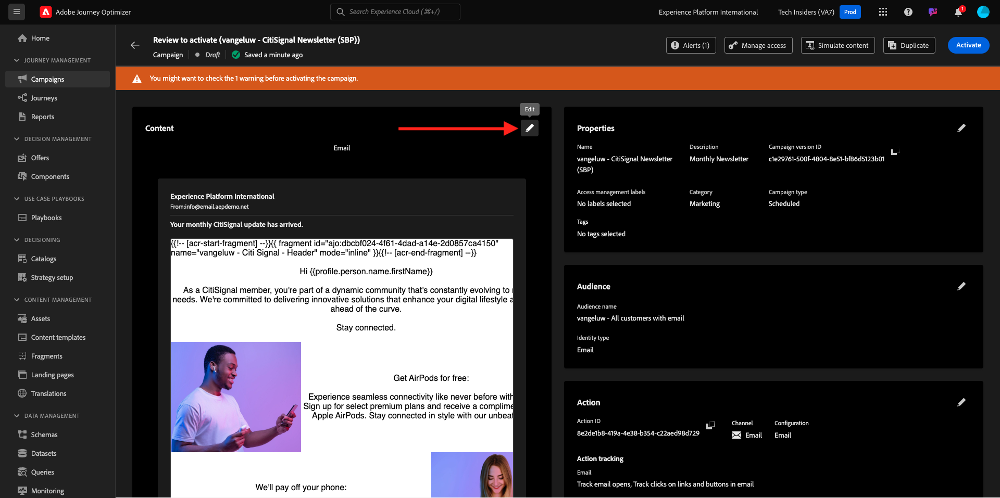

# 3.4.3 Använda personalisering i ett e-postmeddelande

Logga in på Adobe Experience Cloud på [Adobe Experience Cloud](https://experience.adobe.com). Klicka på **Adobe Journey Optimizer**.

Du omdirigeras till vyn **Hem** i Journey Optimizer. Innan du fortsätter måste du välja en **sandlåda**. Sandlådan som ska markeras har namnet ``--aepTenantId--``. Du kan göra detta genom att klicka på texten **[!UICONTROL Production Prod]** i den blå raden ovanför skärmen.

## 3.4.3.1 Segmentbaserad personalisering

I den här övningen kommer du att förbättra ditt nyhetsbrev via e-post med en personlig text baserad på segmentmedlemskap.

Gå till **Resor**. Hitta den nyhetsbrevsresa du har skapat i föregående övning. Sök efter `--aepUserLdap-- - Newsletter`. Klicka på resan för att öppna den.

Då ser du det här. Klicka på **Duplicera**.

Klicka på **Duplicera**.

Välj åtgärden **E-post** och klicka på **Redigera innehåll**.

Klicka på **E-posta Designer**.

Då ser du det här.

Öppna **Innehållskomponenter** och dra en **Text** -komponent nedanför det aktuella nyhetsbrevet.

Markera hela standardtexten och ta bort den. Klicka sedan på knappen **Lägg till anpassning** i verktygsfältet.

Då ser du det här:

Klicka på **Segmentmedlemskap** på den vänstra menyn.

>[!NOTE]
>
>Om du inte hittar ditt segment i den här listan kan du bläddra nedåt och hitta instruktioner om hur du hämtar segmentets ID manuellt.

Markera segmentet `Luma - Women's Category Interest` och klicka på ikonen **+** som ska se ut så här:

Sedan lämnar du den första raden som den är och ersätter rad 2 och 3 med den här koden:

``
    Psssst... a private sale in the women category will launch soon, we will keep you posted

    Thanks for taking the time to read our newsletter. Here is a 10% promo code to use on the website: READER10

``

Då får du den här:

Klicka på **Validera** för att kontrollera att koden är korrekt. Klicka på **Spara**.

Du kan nu spara det här meddelandet genom att klicka på knappen **Spara** i det övre högra hörnet. Klicka sedan på **Simulera innehåll**.

Välj en av profilerna som du skapade som en del av den här självstudiekursen och klicka på **Förhandsgranska**. Resultatet av konfigurationen visas då.

Då ser du det här. Klicka sedan på **Stäng**.

Gå tillbaka till meddelandekontrollpanelen genom att klicka på **pilen** intill ämnesraden i det övre vänstra hörnet.

Klicka på pilen i det övre vänstra hörnet för att gå tillbaka till din resa.

Klicka på **OK** för att stänga e-poståtgärden.

Ändra ditt **schema** till **En gång** och definiera ett **datum/tid**. Klicka på **OK**.

>[!NOTE]
>
>Datum och tid för sändning av meddelande måste vara inom mer än en timme.

Klicka på knappen **Publish** på resan.

Klicka på **Publish** igen i popup-fönstret.

Din grundläggande nyhetsbrevsresa är nu publicerad. E-postmeddelandet med nyhetsbrevet skickas baserat på ditt schema och din resa avbryts så snart som det senaste e-postmeddelandet har skickats.

Du har gjort klart den här övningen.

Nästa steg: [3.4.4 Konfigurera och använd push-meddelanden för iOS](./ex4.md)

[Gå tillbaka till modul 3.4](./journeyoptimizer.md)

[Gå tillbaka till Alla moduler](../../../overview.md)
