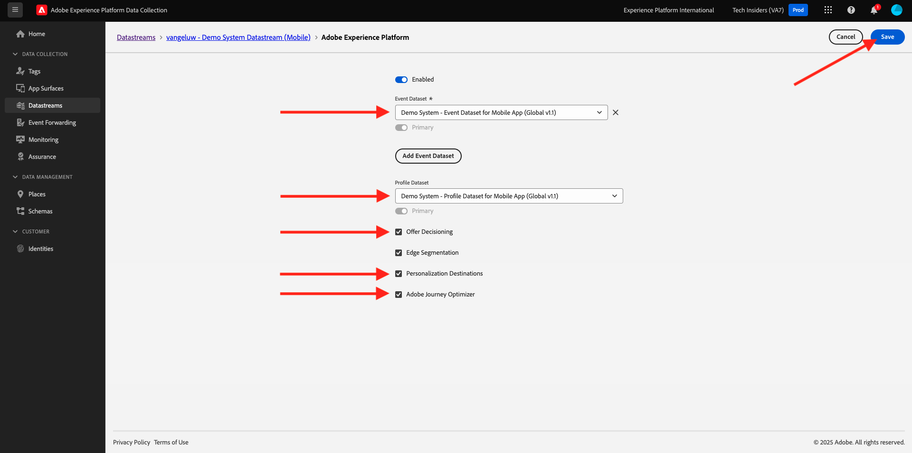
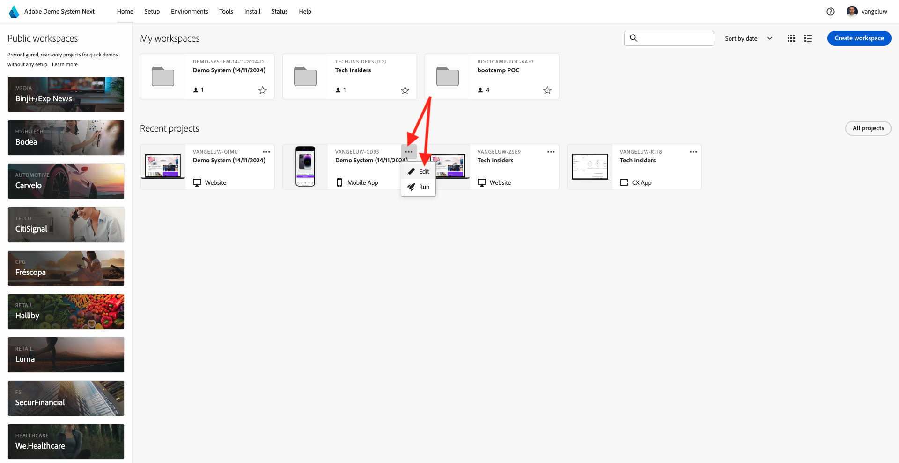
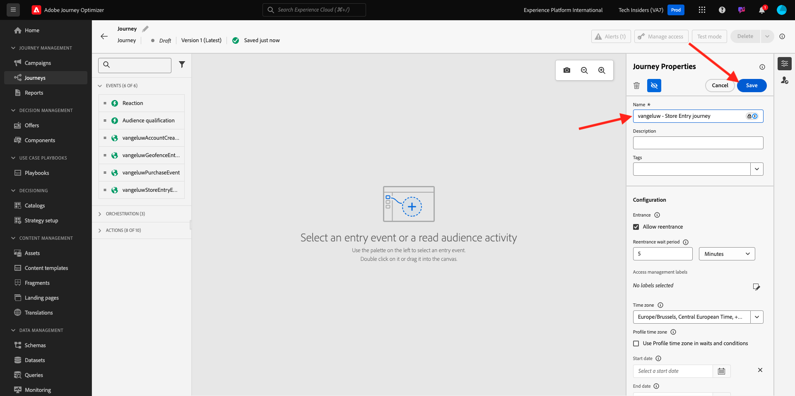

# 3.4.4 Konfigurera och använda push-meddelanden för iOS

Om du vill använda push-meddelanden med Adobe Journey Optimizer finns det ett antal inställningar att kontrollera och känna till.

Här följer alla inställningar som ska verifieras:

- Datauppsättningar och scheman i Adobe Experience Platform
- Datastream för mobiler
- Datainsamlingsegenskap för mobil
- Appyta för push-certifikat
- Testa din push-konfiguration med AEP Assurance

Vi granskar dem en i taget.

Logga in på Adobe Journey Optimizer på [Adobe Experience Cloud](https://experience.adobe.com). Klicka på **Journey Optimizer**.

Du omdirigeras till vyn **Hem** i Journey Optimizer. Kontrollera först att du använder rätt sandlåda. Sandlådan som ska användas kallas `--aepSandboxName--`. Du kommer sedan att vara i vyn **Hem** i din sandlåda `--aepSandboxName--`.

## 3.4.4.1 Push datasets

Adobe Journey Optimizer använder datauppsättningar för att lagra saker som push-tokens från mobila enheter eller interaktioner med push-meddelanden (till exempel meddelande som skickas, meddelande som öppnas) i en datauppsättning i Adobe Journey Optimizer.

Du kan hitta de här datauppsättningarna genom att gå till **[!UICONTROL Datasets]** på menyn till vänster på skärmen. Om du vill visa systemdatauppsättningar klickar du på filterikonen.

Aktivera alternativet **Visa systemdatauppsättningar** och sök efter **AJO**. Du kommer då att se de datauppsättningar som används för push-meddelanden.

## 3.4.4.2 Datastream för mobiler

Gå till [https://experience.adobe.com/#/data-collection/](https://experience.adobe.com/#/data-collection/).

Gå till **[!UICONTROL Datastream]** på den vänstra menyn och sök efter det datastream som du skapade i [Exercise 0.2](./../../../modules/gettingstarted/gettingstarted/ex2.md), som har namnet `--aepUserLdap-- - Demo System Datastream (Mobile)`. Klicka för att öppna den.

Klicka på **Redigera** på tjänsten **Adobe Experience Platform**.

Du kommer då att se de datastream-inställningar som har definierats och i vilka datamängdshändelser och profilattribut lagras.

Inga ändringar behövs. Datastream är nu klar att användas i din datainsamling-klientegenskap för Mobile.

## 3.4.4.3 Granska din datainsamlingsegenskap för mobiler

Gå till [https://experience.adobe.com/#/data-collection/](https://experience.adobe.com/#/data-collection/). Som en del av [övningen 0.1](./../../../modules/gettingstarted/gettingstarted/ex1.md) skapades två datainsamlingsegenskaper.
Du har redan använt dessa egenskaper för datainsamlingsklienten som en del av tidigare moduler.

Klicka för att öppna datainsamlingsegenskapen för mobilen.

Gå till **Tillägg** i din datainsamlingsegenskap. Du kommer då att se de olika tillägg som behövs för mobilappen. Klicka för att öppna tillägget **Adobe Experience Platform Edge Network**.

Du kommer då att se att ditt datastream för mobilen är länkat här. Klicka sedan på **Avbryt** för att gå tillbaka till översikten över dina tillägg.

Du kommer då tillbaka hit. Tillägget för **AEP Assurance** visas. AEP Assurance hjälper er att inspektera, bevisa, simulera och validera hur ni samlar in data eller levererar upplevelser i er mobilapp. Du kan läsa mer om AEP Assurance och Project Griffon här [https://aep-sdks.gitbook.io/docs/beta/project-griffon](https://aep-sdks.gitbook.io/docs/beta/project-griffon).

Klicka sedan på **Konfigurera** för att öppna tillägget **Adobe Journey Optimizer**.

Du kommer då att se att det är här som datauppsättningen för spårning av push-händelser är länkad.

Du behöver inte göra några ändringar i din datainsamlingsegenskap.

## 3.4.4.4 Granska konfigurationen av appytan

Gå till [https://experience.adobe.com/#/data-collection/](https://experience.adobe.com/#/data-collection/). Gå till **Appytor** på den vänstra menyn och öppna appytan för **DX Demo App APNS**.

Sedan visas den konfigurerade appytan för iOS och Android.

## 3.4.4.5 Testa konfigurationen av push-meddelanden med AEP Assurance.

När appen har installerats hittar du den på enhetens hemskärm. Klicka på ikonen för att öppna programmet.

När du använder appen första gången ombeds du logga in med din Adobe ID. Slutför inloggningsprocessen.

När du har loggat in visas ett meddelande som ber dig att skicka meddelanden. Vi skickar meddelanden som en del av självstudiekursen, så klicka på **Tillåt**.

Då ser du appens hemsida. Gå till **Inställningar**.

I inställningarna ser du att ett **offentligt projekt** har lästs in i appen. Klicka på **Eget projekt**.

Du kan nu läsa in ett anpassat projekt. Klicka på QR-koden för att enkelt läsa in ditt projekt.

Efter träning 0.1 fick du det här resultatet. Klicka för att öppna det **Mobile Retail-projekt** som skapades för dig.

Om du av misstag har stängt webbläsarfönstret, eller för framtida demonstrations- eller aktiveringssessioner, kan du även komma åt webbplatsprojektet genom att gå till [https://builder.adobedemo.com/projects](https://builder.adobedemo.com/projects). När du har loggat in med din Adobe ID ser du det här. Klicka på ditt mobilappsprojekt för att öppna det.

Då ser du det här. Klicka på **Integrationer**.

Du måste välja datainsamlingsegenskapen för mobilen som skapades i övning 0.1. Klicka sedan på **Kör**.

Då visas den här popup-rutan som innehåller en QR-kod. Skanna QR-koden inifrån mobilappen.

Sedan visas ditt projekt-ID i appen. Sedan kan du klicka på **Spara**.

Gå tillbaka till **Hem** i appen. Ditt program är nu klart att användas.

Nu måste du skanna en QR-kod för att ansluta den mobila enheten till AEP Assurance-sessionen.

Om du vill starta en AEP Assurance-session går du till [https://experience.adobe.com/#/@experienceplatform/griffon](https://experience.adobe.com/#/@experienceplatform/griffon). Klicka på **Skapa session**.

Klicka på **Start**.

Fyll i värdena:

- Sessionsnamn: använd `--aepUserLdap-- - push debugging` och ersätt ldap med din ldap
- Bas-URL: använd **dxdemo://default**

Klicka på **Nästa**.

Sedan visas en QR-kod på skärmen som du bör skanna med din iOS-enhet.

Öppna kameramappen på din mobila enhet och skanna QR-koden som visas av AEP Assurance.

Då visas en popup-skärm där du ombeds ange PIN-koden. Kopiera PIN-koden från AEP Assurance-skärmen och klicka på **Anslut**.

Då ser du det här.

I AEP Assurance ser du nu att en enhet går till AEP Assurance-sessionen.

Gå till **Push Debug**. Du kommer att se något liknande.

Förklaring:

- I den första kolumnen, **Klient**, visas tillgängliga identifierare på din iOS-enhet. Du ser ett ECID och en push-token.
- I den andra kolumnen visas **profilinformation**, med ytterligare information om vilken plattform Push-token finns i (APNS eller APNSSandbox). Om du klickar på knappen **Inspect-profil** dirigeras du till Adobe Experience Platform och du ser hela kundprofilen i realtid.
- I den tredje kolumnen visas **App Configuration** som konfigurerades som en del av övningen **3.4.5.4 Create App Configuration i Launch**

Klicka på knappen **Skicka push-meddelande** om du vill testa push-konfigurationsinställningarna.

Du måste kontrollera att appen **DX Demo** inte är öppen när du klickar på knappen **Skicka push-meddelande** . Om appen är öppen kan push-meddelandet tas emot i bakgrunden och inte visas.

Du kommer då att se ett sådant här push-meddelande på din mobila enhet.

Om du har fått ett push-meddelande betyder det att konfigurationen är korrekt och fungerar som den ska.

## 3.4.4.6 Skapa en ny händelse

Gå till **Reseadministration** på menyn och klicka på **Hantera** under **Händelser**.

På skärmen **Händelser** ser du en liknande vy. Klicka på **Skapa händelse**.

Därefter visas en tom händelsekonfiguration.

Först och främst ger du evenemanget ett namn som detta: `--aepUserLdap--StoreEntryEvent` och anger beskrivningen till `Store Entry Event`.

Nästa steg är markeringen **Händelsetyp**. Välj **Enhet**.

Nästa steg är **Typ av händelse-ID**. Välj **Systemgenererad**

Nästa steg är schemavalet. Ett schema förbereddes för den här övningen. Använd schemat `Demo System - Event Schema for Mobile App (Global v1.1) v.1`.

När du har valt schemat visas ett antal fält som markeras i avsnittet **Nyttolast**. Din händelse är nu helt konfigurerad.

Du borde se det här då. Klicka på **Spara**.

Händelsen är nu konfigurerad och sparad. Klicka på aktiviteten igen för att öppna skärmen **Redigera händelse** igen.

Håll muspekaren över fältet **Nyttolast** och klicka på ikonen **Visa nyttolast** .

Nu visas ett exempel på den förväntade nyttolasten.

Händelsen har ett unikt ID för Orchestration-händelse som du kan hitta genom att rulla nedåt i nyttolasten tills du ser `_experience.campaign.orchestration.eventID`.

Händelse-ID är det som måste skickas till Adobe Experience Platform för att utlösa den resa som du ska bygga i nästa steg. Skriv ned detta eventID, som du behöver det i nästa steg.
`"eventID": "e3a8f0bdc0b609667cd96a72a6b1e5aafa0ddaf6ccf121c574e6a2030860a633"`

Klicka på **OK**, följt av **Avbryt**.

## 3.4.4.7 Skapa en resa

Gå till **Resor** på menyn och klicka på **Skapa resa**.

Då ser du det här. Ge resan ett namn. Använd `--aepUserLdap-- - Store Entry journey`. Klicka på **OK**.

Först måste du lägga till din händelse som startpunkt för din resa. Sök efter din händelse `--aepUserLdap--StoreEntryEvent` och dra och släpp den på arbetsytan. Klicka på **OK**.

Under **Åtgärder** söker du efter åtgärden **Push**.
Dra och släpp åtgärden **Tryck** på arbetsytan.

Ange **kategorin** till **Marknadsföring** och välj en push-yta som gör att du kan skicka push-meddelanden. I det här fallet är e-postytan som ska väljas **Push-iOS-Android**.

Nästa steg är att skapa ett meddelande. Det gör du genom att klicka på **Redigera innehåll**.

Då ser du det här. Klicka på ikonen **personalisering** för fältet **Titel**.

Då ser du det här. Du kan nu välja valfritt profilattribut direkt i kundprofilen i realtid.

Sök efter fältet **Förnamn** och klicka sedan på ikonen **+** bredvid fältet **Förnamn**. Du kommer då att se personaliseringstoken för förnamn som läggs till: **{{profile.person.name.firstName}}**.

Lägg sedan till texten **, välkommen till vår butik!** bakom **{{profile.person.name.firstName}}**.

Klicka på **Spara**.

Du har den här nu. Klicka på ikonen **personalisering** för fältet **Brödtext**.

Ange den här texten **Klicka här för att få 10 % rabatt när du köper idag!** och klicka på **Spara**.

Du får den här då. Klicka på pilen i det övre vänstra hörnet för att gå tillbaka till din resa.

Klicka på **OK** för att stänga din push-åtgärd.

Klicka på **Publish**.

Klicka på **Publish** igen.

Din resa är nu publicerad.

## 3.4.4.8 Testa din resa och skicka ett push-meddelande

Gå till skärmen **Inställningar** i ditt DX Demo 2.0-mobilprogram. Klicka på knappen **Butikspost**.

>[!NOTE]
>
>Knappen **Butikspost** implementeras. Du hittar det inte i appen än.

Stäng appen omedelbart efter att du klickat på ikonen **Store Entry** (Store-post), annars visas inte push-meddelandet.

Efter några sekunder visas meddelandet.

Du har gjort klart den här övningen.

Nästa steg: [3.4.5 Skapa en affärshändelseresa](./ex5.md)

[Gå tillbaka till modul 3.4](./journeyoptimizer.md)

[Gå tillbaka till Alla moduler](../../../overview.md)
