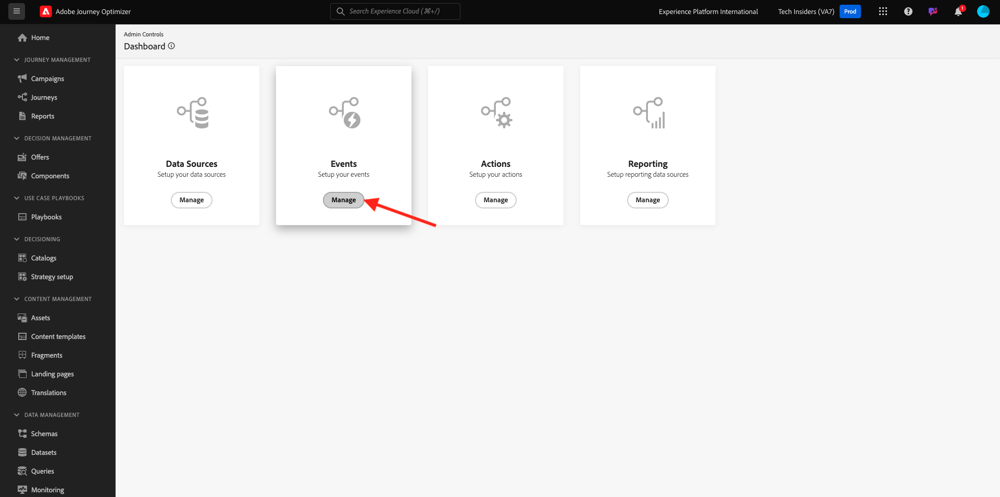
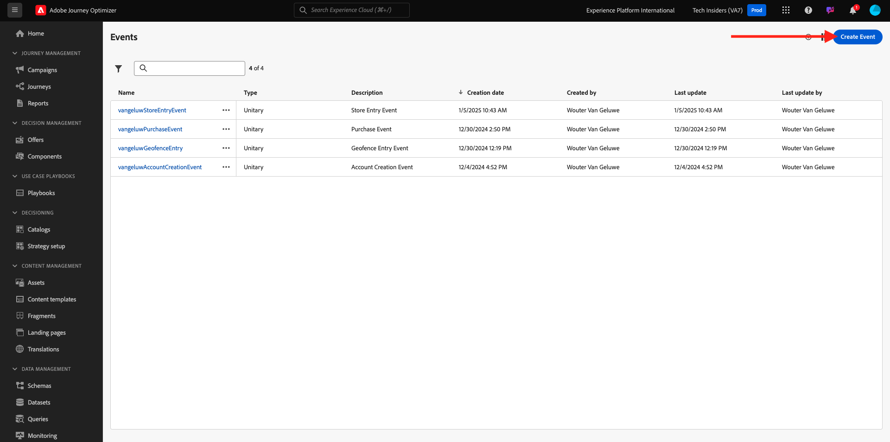

# 3.4.5 Skapa en affärshändelseresa

Logga in på Adobe Journey Optimizer på [Adobe Experience Cloud](https://experience.adobe.com). Klicka på **Journey Optimizer**.


Du omdirigeras till vyn **Hem** i Journey Optimizer. Kontrollera först att du använder rätt sandlåda. Sandlådan som ska användas kallas `--aepSandboxName--`. Du kommer sedan att vara i vyn **Hem** i din sandlåda `--aepSandboxName--`.


## 3.4.5.1 Skapa en affärshändelse

Klicka på **Konfigurationer** på den vänstra menyn. Klicka på knappen **Hantera** i kortet **Händelser**.



Affärshändelser är en ny typ av händelser som du kan skapa i Journey Optimizer. Till skillnad från de **Unitary**-händelser som du har skapat i tidigare moduler aktiveras inte affärshändelserna av kunden utan av organisationen. Nu ska du skapa en affärshändelse.

Klicka på **Skapa händelse**.



Ange följande värden i formuläret för att skapa händelse:

- **Namn**: `--aepUserLdap--ItemBackInStock`. Till exempel: **vangeluwItemBackInStock**
- **Beskrivning**: Den här händelsen utlöses när en produkt är tillbaka i lager
- **Typ**: välj **Företag** i listrutan


För schemat väljer du **Demonstrationssystem - händelseschema för JO-affärshändelser (Global v1.1) v.1**. Du måste nu markera de fält i schemat som du behöver för vår användning.


Följ de här stegen:

Klicka på ikonen **penna** i fältet där **1-fältet är markerat**.


Markera alla tillgängliga fält i schemat och klicka sedan på **OK**.


För villkoret: du måste ange vilka poster i det här schemat som ska utlösa affärshändelsen.

Följ de här stegen:

Klicka på ikonen **penna** i fältet där det står **Lägg till ett villkor**.


Utöka objektet `--aepTenantId--` till vänster, expandera objektet **joBusinessEvents** och dra och släpp fältet **eventName** på arbetsytan.


Ange följande värde för fältet **eventName**: `--aepUserLdap--ItemBackInStock`. Exempel: vangeluwItemBackInStock.
Klicka på **OK**.


Klicka på **OK**.


Slutligen bör ditt formulär för att skapa event se ut så här. Klicka på **Spara** för att spara din affärshändelse.


## 3.4.5.2 Skapa en affärshändelseresa

Nu kan ni utnyttja den här affärshändelsen och budskapet inuti en resa. Gå till **Resor**. Klicka på **Skapa resa**.


Till höger ser du ett formulär där du måste ange resans namn och beskrivning. Ange följande värden:

- **Namn**: `--aepUserLdap-- - Item back in stock journey`. Till exempel: vangeluw - objekt tillbaka i lagerresan
- **Beskrivning**: Den här resan skickar ett SMS när ett objekt är tillbaka i lager till besökare som har visat intresse.

Klicka på **OK**.


På den vänstra menyn, under **Händelser**, söker du efter din ldap. Du hittar den tidigare skapade affärshändelsen `--aepUserLdap--ItemBackInStock`. Dra och släpp den här händelsen på arbetsytan eftersom det här blir startpunkten på resan.


Som du ser har en **Läs målgrupp** automatiskt lagts till på arbetsytan. Det beror på att affärshändelserna bara skickar en utlösare för resan för att läsa en viss målgrupp, som sedan hämtar listan över profiler för den resan.

Klicka på aktiviteten **Läs målgrupp**.
Konfigurationen **Läs målgrupp** förväntar sig att du väljer målgrupp som du vill meddela om den affärshändelse som just har inträffat. Klicka på fältet **Välj en målgrupp**.


I popup-fönstret **Välj en målgrupp** söker du efter din ldap och väljer målgruppen som du skapade i [Modul 2.3 - CDP i realtid - Bygg en målgrupp och utför åtgärden ](./../../../modules/rtcdp-b2c/module2.3/real-time-cdp-build-a-segment-take-action.md) med namnet `--aepUserLdap-- - Interest in Galaxy S24`. Klicka på **Spara**.


Klicka sedan på **OK**.


Nästa steg är att dra och släppa den åtgärd som vi vill utföra på den här resan. Välj åtgärden **SMS** och dra och släpp den efter villkoret som du just lade till.


Ange **kategorin** till **Marknadsföring** och välj en sms-yta som gör att du kan skicka sms. I det här fallet är e-postytan som ska väljas **SMS**.


Nästa steg är att skapa ett meddelande. Det gör du genom att klicka på **Redigera innehåll**.


Nu visas meddelandekontrollpanelen där du kan konfigurera texten i ditt SMS. Klicka på området **Disponera meddelande** för att skapa meddelandet.


Ange följande text: `Hi {{profile.person.name.firstName}}, the Proteus Fitness Jackshirt is back in stock at Luma.`. Klicka på **Spara**.


Gå tillbaka till meddelandekontrollpanelen genom att klicka på **pilen** intill ämnesraden i det övre vänstra hörnet.


Nu visas den slutförda SMS-åtgärden. Klicka på **OK**.


Din resa är nu klar att publiceras. Klicka på **Publish**.


Klicka på **Publish** igen.


Din resa är nu publicerad, du kan testa den!


## 3.4.5.3 Testa din resa till affärshändelser

Nu simulerar du återbördningen av en produkt genom att anropa en ny händelse mot **Demo System - Event Schema for JO Business Events (Global v1.1) v.1** med Postman.

Klicka på **Källor** på den vänstra menyn och klicka sedan på fliken **Konton**.


På fliken **Konton** hittar du kontot **Journey Optimizer Business Events**. Klicka för att öppna den.


Det här kontot har bara ett dataflöde. Klicka på dataflödets namn för att markera det.


Klicka på **Kopiera schemanyttolast** på den högra menyn. Med det här alternativet kopieras hela **curl** -kommandot för att infoga en post mot **Demo System - Event Schema for JO Business Events (Global v1.1) v.1** till Urklipp.


Klistra in kommandot Rulla i en textredigerare


Låt oss titta närmare på denna förfrågan,

- Begäran om POST skickas till DCS Inlet ID
- Begäran refererar till schemat, datauppsättningen och organisations-ID:t.
- Slutligen innehåller den xdmEntity-noden som representerar de data som vi vill skapa i datauppsättningen.

Du måste nu ersätta följande `xdmEntity`-rad..

```json
"xdmEntity": {
  "_experienceplatform": {
    "joBusinessEvents": {
      "eventDescription": "string",
      "eventName": "string",
      "stockEventId": "string"
    }
  },
  "_id": "/uri-reference",
  "eventType": "advertising.completes",
  "timestamp": "2018-11-12T20:20:39+00:00"
}
```

...på den här raden kontrollerar du att field eventName har samma namn som `--aepUserLdap--ItemBackInStock`, som representerar det villkor som du har angett i din affärshändelse för att utlösa din resa.

```json
"xdmEntity": {
  "_experienceplatform": {
    "joBusinessEvents": {
      "eventDescription": "Product Proteus Fitness Jackshirt is back in stock",
      "eventName": "--aepUserLdap--ItemBackInStock",
      "stockEventId": "1"
    }
  },
  "_id": "/uri-reference",
  "eventType": "productBackInStock",
  "timestamp": "2021-04-19T15:25:39+00:00"
}
```

Det uppdaterade **curl**-kommandot ska se ut så här:


Markera allt och kopiera det till Urklipp.

Öppna Postman. Klicka på **Importera** till vänster om Postman.


Markera fliken **Raw-text** och klistra in kommandot som tidigare kopierats här. Klicka på **Fortsätt**.


Klicka på **Importera**.


Postman har automatiskt konverterat kommandot **curl** till ett REST-kommando som är klart att utlösas. Tryck bara på knappen **Skicka** för att begära att posten ska skapas i datauppsättningen.


Kontrollera att din begäran har tagits emot. Leta efter statusen **200 OK** i postman.


SMS:et kan ta några minuter att komma fram till din mobiltelefon. Om den inte gör det kanske ditt **Intresse-fodral för Proteus Fitness** inte innehåller en profil med rätt mobiltelefon. Gå i så fall till Lumas webbplats, gå till produkten **Proteus Fitness Jackshirt** och registrera dig medan du ser till att du anger rätt mobiltelefonnummer.


Du har nu avslutat den här övningen.

Nästa steg: [Sammanfattning och förmåner](./summary.md)

[Gå tillbaka till modul 3.4](./journeyoptimizer.md)

[Gå tillbaka till Alla moduler](../../../overview.md)
