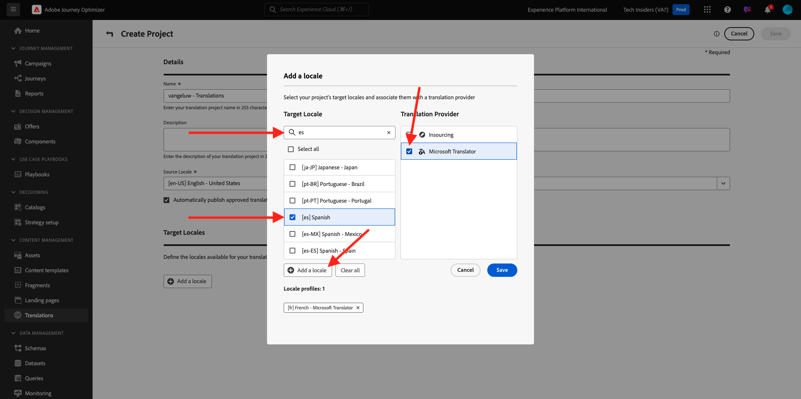
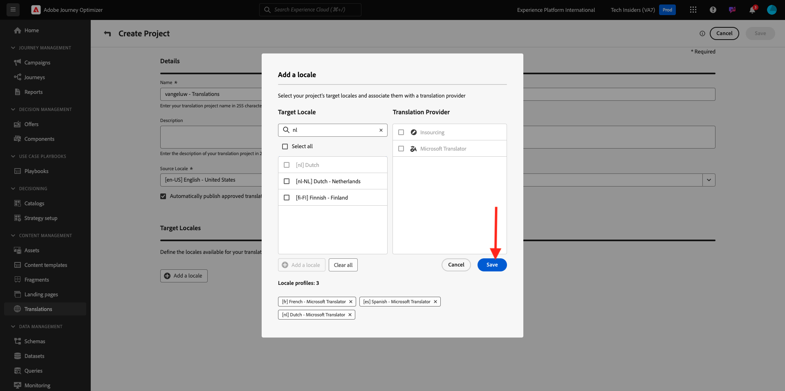
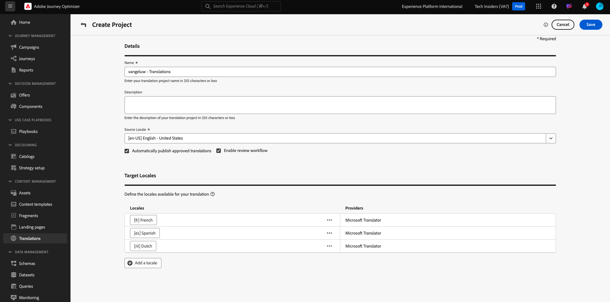
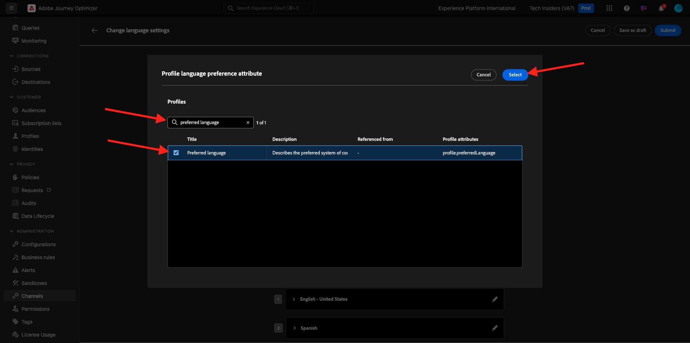

# 3.5.1 Översättningsleverantör

## 3.5.1.1 Konfigurera Microsoft Azure Translator

Gå till [https://portal.azure.com/#home](https://portal.azure.com/#home).

Ange `translators` i sökfältet. Klicka sedan på **+ Skapa**.

Välj **Skapa översättare**.

Välj ditt **prenumerations-ID** och **resursgrupp**.
Ange **Region** till **Global**.
Ange **prisnivån** till **kostnadsfri F0**.

Välj **Granska + skapa**.

Välj **Skapa**.

Välj **Gå till resursen**.

Gå till **Resurshantering** > **Tangenter och slutpunkt** på den vänstra menyn. Klicka för att kopiera nyckeln.

## 3.5.1.2 Språkordlista

Gå till [https://experience.adobe.com/](https://experience.adobe.com/). Klicka på **Journey Optimizer**.

Gå till **Översättningar** på den vänstra menyn och gå sedan till **Språkordlista**. Om det här meddelandet visas klickar du på **Lägg till standardspråk**.

Du borde se det här då.

## 3.5.1.3 Konfigurera översättningsprovider i AJO

Gå till [https://experience.adobe.com/](https://experience.adobe.com/). Klicka på **Journey Optimizer**.

Gå till **Översättningar** på den vänstra menyn och gå sedan till **Providers**. Klicka på **Lägg till provider**.

Under **Providers** väljer du **Microsoft Translator**. Markera kryssrutan för att aktivera användningen av översättningsprovidern. Klistra in nyckeln som du kopierade från Microsoft Azure Translators. Klicka sedan på **Verifiera autentiseringsuppgifter**.

Dina autentiseringsuppgifter bör sedan valideras. Om de är det, bläddrar du nedåt för att välja språk för översättning.

Välj `[en-US] English`, `[es] Spanish`, `[fr] French`, `[nl] Dutch`.

Bläddra uppåt och klicka på **Spara**.

**Översättningsprovidern** är nu klar att användas.

## 3.5.1.4 Konfigurera översättningsprojekt

Gå till [https://experience.adobe.com/](https://experience.adobe.com/). Klicka på **Journey Optimizer**.

Gå till **Översättningar** på den vänstra menyn och gå sedan till **Språkordlista**. Om det här meddelandet visas klickar du på **Skapa projekt**.

Ange namnet `--aepUserLdap-- - Translations`, ställ in **Source Locale** på `[en-US] English - United States` och markera kryssrutorna för att aktivera både **Publicera automatiskt godkända översättningar** och **Aktivera granskningsarbetsflöde**. Klicka sedan på **+ Lägg till en språkinställning**.

Sök efter `fr`, aktivera kryssrutan för `[fr] French` och aktivera sedan kryssrutan för **Microsoft Translator**. Klicka på **+ Lägg till en språkinställning**.

Sök efter `es`, aktivera kryssrutan för `[es] Spanish` och aktivera sedan kryssrutan för **Microsoft Translator**. Klicka på **+ Lägg till en språkinställning**.

Sök efter `nl`, aktivera kryssrutan för `[nl] Spanish` och aktivera sedan kryssrutan för **Microsoft Translator**. Klicka på **+ Lägg till en språkinställning**.

Klicka på **Spara**.

Ditt **översättningsprojekt** är nu klart att användas.

## 3.5.1.5 Konfigurera språkinställningar

Gå till **Kanaler** > **Allmänna inställningar** > **Språkinställningar**. Klicka på **Skapa språkinställningar**.

Använd namnet `--aepUserLdap--_translations`. Välj **Översättningsprojekt**. Klicka sedan på ikonen **redigera** .

Välj det översättningsprojekt som du skapade i föregående steg. Klicka på **Markera**.

Du borde se det här då. Ange **Återställningsinställningen** till **Engelska - USA**. Klicka för att välja **Välj profilspråkets attribut**, vilket avgör vilket fält i kundprofilen som ska användas för att läsa in översättningarna. Klicka sedan på ikonen **redigera** för att välja vilket fält som ska användas.

Ange **önskat språk** i sökfältet och markera sedan fältet **Önskat språk**.

Klicka på ikonen **edit** för både **English - United States** och **Dutch** för att granska konfigurationen.

Här är konfigurationen för **engelska - USA**. Klicka på **Avbryt**.

Klicka för att visa konfigurationen för **Dutch**. Klicka på **Avbryt**.

Bläddra uppåt och klicka på **Skicka**.

Dina språkinställningar har nu konfigurerats.

Du har gjort klart den här övningen.

## Nästa steg

Gå till [3.5.2 Skapa din kampanj](./ex2.md)

Gå tillbaka till [Modul 3.5](./ajotranslationsvcs.md){target="_blank"}

Gå tillbaka till [Alla moduler](./../../../overview.md){target="_blank"}
