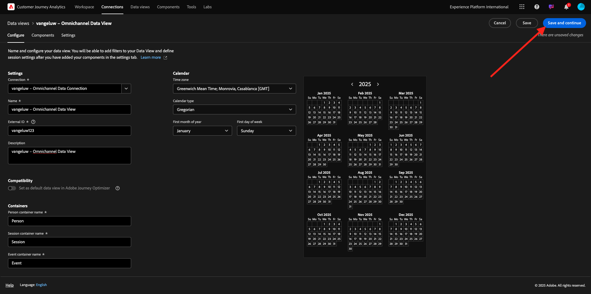
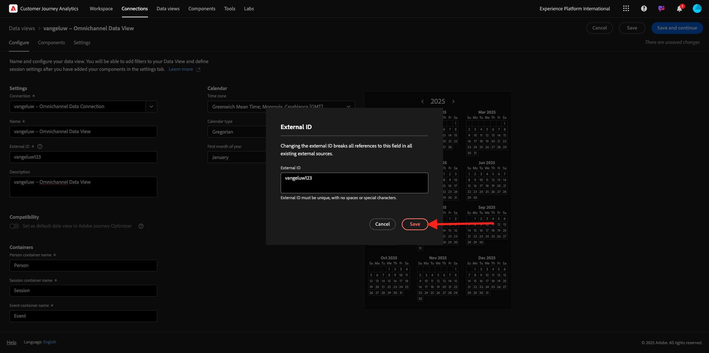
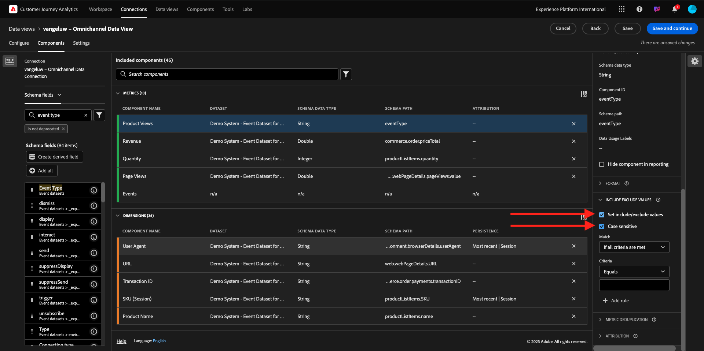
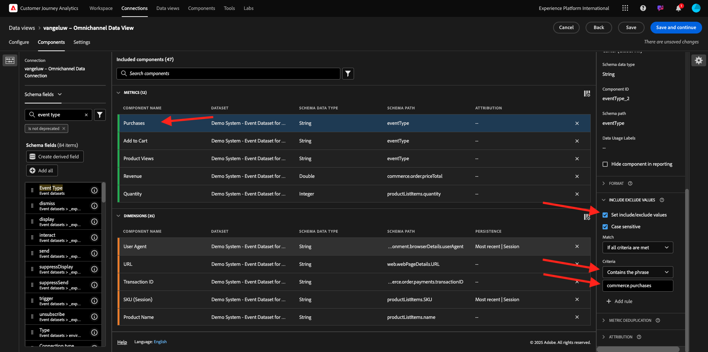

# 4.1.3 Skapa en datavy

## Mål

- Förstå användargränssnittet för datavy
- Förstå grundläggande inställningar för besöksdefinition
- Förstå attribuering och beständighet i en datavy

## 4.1.3.1 Datavy

När anslutningen är klar kan du nu gå vidare och påverka visualiseringen. En skillnad mellan Adobe Analytics och CJA är att CJA behöver en datavy för att rensa och förbereda data före visualisering.

En datavy liknar begreppet Virtual Report Suites i Adobe Analytics, där du definierar kontextmedvetna besöksdefinitioner, filtrering och även hur komponenterna anropas.

Du behöver minst en datavy per anslutning. Men för vissa fall är det bra att ha flera datavyer för samma anslutning, med målet att ge olika insikter till olika team.
Om ni vill att ert företag ska bli datadrivet bör ni anpassa hur data ska visas i varje team. Några exempel:

- UX-värden endast för UX-designteamet
- Använd samma namn för KPI:er och Metrics för Google Analytics som för Customer Journey Analytics så att de digitala analysteamen bara kan tala ett språk.
- Datavy filtrerad för att exempelvis visa data för en marknad, ett varumärke eller endast för mobila enheter.

På skärmen **Anslutningar** markerar du kryssrutan framför den anslutning du just skapade. Klicka på **Skapa datavy**.

Du omdirigeras till arbetsflödet **Skapa datavy**.

## 4.1.3.2 Datavy Definition

Nu kan du konfigurera de grundläggande definitionerna för din datavy.

**Anslutningen** som du skapade i den föregående övningen har redan valts. Anslutningen har namnet `--aepUserLdap-- – Omnichannel Data Connection`.

Ge sedan datavyn ett namn enligt följande namnkonvention: `--aepUserLdap-- – Omnichannel Data View`.

Ange samma värde för beskrivningen: `--aepUserLdap-- – Omnichannel Data View`.

| Namn | Beskrivning | Externt ID |
| ----------------- |-------------|-------------| 
| `--aepUserLdap-- – Omnichannel Data View` | `--aepUserLdap-- – Omnichannel Data View` | `--aepUserLdap--123` |

För **tidszonen** väljer du tidszonen **Greenwich Mean Time; Monrovia, Casablanca [GMT]**. Det här är en intressant situation eftersom vissa företag är verksamma i olika länder och i olika geografiska områden. Genom att tilldela rätt tidszon för varje land undviks typiska datafel, som att tro att majoriteten av människorna i Peru till exempel köper T-shirts klockan 04:00.

Du kan också ändra huvudmåttsnamnet (person, session och händelse). Detta är inte obligatoriskt, men vissa kunder gillar att använda Personer, Besök och träffar i stället för Person, Session och Events (standardnamnkonvention från Customer Journey Analytics).

Du bör nu ha följande inställningar konfigurerade:

Klicka på **Spara och fortsätt**.

Klicka på **Spara**.

## 4.1.3.3 Datavy Components

I den här övningen ska du konfigurera de komponenter du behöver för att analysera data och visualisera dem med Analysis Workspace. I det här användargränssnittet finns det tre huvudområden:

- Vänster sida: Tillgängliga komponenter från de markerade datauppsättningarna
- Mitten: Komponenter har lagts till i datavyn
- Höger sida: Komponentinställningar

Du måste nu dra och släppa de komponenter som du behöver för analysen till **Komponenter som lagts till**. För att göra detta måste du markera komponenterna i den vänstra menyn och dra och släppa dem på arbetsytan i mitten.

Låt oss börja med den första komponenten: **Namn (web.webPageDetails.name)**. Sök efter den här komponenten och dra och släpp den på arbetsytan.

Den här komponenten är sidnamnet, vilket du kan härleda genom att läsa schemafältet `(web.webPageDetails.name)`.

Att använda **Namn** som namn är dock inte den bästa namnkonventionen för en affärsanvändare för att snabbt förstå den här dimensionen.

Vi ändrar namnet till **Sidnamn**. Klicka på komponenten och byt namn på den i området **Komponentinställningar**.

Något som är mycket viktigt är **inställningarna för beständighet**. Begreppet evar och prop finns inte i CJA, men inställningarna för persistence gör att liknande beteende kan användas.

Om du inte ändrar de här inställningarna tolkar CJA dimensionen som **Prop** (träffnivå). Vi kan också ändra Persistence så att dimensionen blir **eVar** (kvarstår värdet under hela resan).

Om du inte känner till eVars och Props kan du [läsa mer om dem i dokumentationen](https://experienceleague.adobe.com/docs/analytics/landing/an-key-concepts.html?lang=sv-SE).

Låt oss lämna sidnamnet som en propp. Därför behöver du inte ändra några **Persistence-inställningar**.

| Komponentnamn att söka efter | Nytt namn | Inställningar för beständighet |
| ----------------- |-------------| --------------------| 
| Namn (web.webPageDetails.name) | Sidnamn |          |

Välj sedan dimensionen **phoneNumber** och släpp den på arbetsytan. Det nya namnet ska vara **Telefonnummer**.

Äntligen ändrar vi inställningarna för Upprepning eftersom mobilnumret ska finnas kvar på användarnivå.

Om du vill ändra Persistence rullar du ned på den högra menyn och öppnar fliken **Persistence** :

Markera kryssrutan för att ändra inställningarna för beständighet. Välj omfattningen **Senaste** och **Person (rapportfönstret)** eftersom vi bara bryr oss om den personens senaste mobilnummer. Om kunden inte fyller i mobilen vid framtida besök kommer ni fortfarande att se det här värdet fyllas i.

| Komponentnamn att söka efter | Nytt namn | Inställningar för beständighet |
| ----------------- |-------------| --------------------| 
| phoneNumber | Telefonnummer | Fönstret Senaste, Personrapportering |

Nästa komponent är `web.webPageDetails.pageViews.value`.

Sök efter `web.webPageDetails.pageViews.value` på den vänstra menyn. Dra mätvärdena till arbetsytan.

Ändra namnet till **Sidvyer** under **Komponentinställningarna**.

| Komponentnamn att söka efter | Nytt namn | Attributinställningar |
| ----------------- |-------------| --------------------| 
| web.webPageDetails.pageViews.value | Sidvyer |         |

Du behöver inte ändra något för att dra till dig några attraktionsinställningar.

Obs! Du kan även ändra inställningarna för persistence för mått i Analysis Workspace. I vissa fall kan du välja att ställa in den här för att undvika att företagsanvändare behöver tänka på vilken som är den bästa persistensmodellen.

Därefter måste du konfigurera många Dimensioner och mått enligt tabellen nedan.

### DIMENSIONER

| Komponentnamn att söka efter | Nytt namn | Inställningar för beständighet |
| ----------------- |-------------| --------------------| 
| brandName | Märkesnamn | Senaste, session |
| kallkänsla | Ring |          |
| call ID | Samtalsinteraktionstyp |          |
| callTopic | Ämne | Senaste, session |
| ecid | ECID | Fönstret Senaste, Personrapportering |
| e-post | E-post-ID | Fönstret Senaste, Personrapportering |
| Betalningstyp | Betalningstyp |          |
| Metod för produkttillägg | Metod för produkttillägg | Senaste, session |
| Händelsetyp | Händelsetyp |         |
| Namn (productListItems.name) | Produktnamn |         |
| SKU | SKU (session) | Senaste, session |
| Transaktions-ID | Transaktions-ID |         |
| URL (web.webPageDetails.URL) | URL |         |
| Användaragent | Användaragent | Senaste, session |

### METRIK

| Komponentnamn att söka efter | Nytt namn | Attributinställningar |
| ----------------- |-------------| --------------------| 
| Kvantitet | Kvantitet |          |
| commerce.order.priceTotal | Intäkter |         |

Din konfiguration bör sedan se ut så här. Glöm inte att **spara** din datavy. Klicka på **Spara** nu.

## 4.1.3.4 Beräknade värden

Även om du har organiserat alla komponenter i datavyn måste du fortfarande anpassa vissa av dem, så att företagsanvändare är redo att börja analysera.

Om du kommer ihåg det, har du inte angett några metriska uppgifter som Lägg till i kundvagnen, produktvyn eller Inköp i datavyn.
Du har dock en dimension som heter: **Händelsetyp**. Du kan alltså härleda dessa interaktionstyper genom att skapa 3 beräknade värden.

Låt oss börja med första måttet: **Produktvyer**.

Till vänster söker du efter **Händelsetyp** och väljer dimension. Dra och släpp det sedan på arbetsytan för **Inkluderade komponenter**.
Klicka för att välja det nya måttet **Händelsetyp**.

Ändra nu komponentnamnet och beskrivningen till följande värden:

| Komponentnamn | Komponentbeskrivning |
| ----------------- |-------------| 
| Produktvyer | Produktvyer |

Nu kan endast **produktvyer**-händelser räknas. Det gör du genom att rulla nedåt på **komponentinställningarna** tills du ser **Inkludera exkluderade värden**. Aktivera alternativet **Ange värden för inkludera/exkludera**.

Eftersom du bara vill räkna **produktvyer** anger du **commerce.productViews** enligt villkoren.

Ditt beräknade mätvärde är nu klart!

Upprepa sedan samma process för händelserna **Lägg till i kundvagnen** och **Köp**.

### Lägg i kundvagnen

Dra och släpp först samma dimension **Händelsetyp**.

Du kommer att se en popup-varning för ett duplicerat fält när vi använder samma variabel. Klicka på **Lägg till ändå**:

Nu följer du samma process som vi gjorde för mätbara produktvyer:
- Ändra först namn och beskrivning.
- Lägg slutligen till **commerce.productListAdds** som villkor för att endast räkna Lägg till i kundvagnen

| Namn | Beskrivning | Kriterier |
| ----------------- |-------------| -------------|
| Lägg i kundvagnen | Lägg i kundvagnen | commerce.productListAdds |

### Inköp

Dra och släpp först samma dimension **Händelsetyp** som vi gjorde för båda tidigare mätvärden.

Du kommer att se en popup-varning för ett duplicerat fält när vi använder samma variabel. Klicka på **Lägg till ändå**:

Nu följer du samma process som vi gjorde för måtten Produktvyer och Lägg i kundvagnen:
- Ändra först namn och beskrivning.
- Lägg slutligen till **commerce.purchase** som villkor för att endast räkna Lägg till i kundvagnar

| Namn | Beskrivning | Kriterier |
| ----------------- |-------------| -------------|
| Inköp | Inköp | commerce.purchases |

Din slutliga konfiguration bör sedan se ut ungefär så här. Klicka på **Spara och fortsätt**.

## 4.1.3.5 Datavy Settings

Du bör omdirigeras till den här skärmen:

På den här fliken kan du ändra några viktiga inställningar för att ändra hur data bearbetas. Vi börjar med att ange **Sessionstimeout** till 30 min. Tack vare varje upplevelsehändelses tidsstämpel kan du utöka begreppet session över alla kanaler. Vad händer till exempel om en kund ringer callcenter efter att ha besökt webbplatsen? Med anpassade tidsgränser för sessioner får du stor flexibilitet när det gäller att bestämma vad en session är och hur den sessionen ska sammanfoga data.

På den här fliken kan du ändra andra saker, t.ex. filtrera data genom att använda ett segment/filter. Du behöver inte göra det i den här övningen.

När du är klar klickar du på **Spara och slutför**.

>[!NOTE]
>
>Du kan när som helst gå tillbaka till den här datavyn och ändra inställningar och komponenter. Ändringarna påverkar hur historiska data visas.

Nu kan du fortsätta med visualiserings- och analysdelen!

Nästa steg: [4.1.4 Dataförberedelse i Customer Journey Analytics](./ex4.md)

[Gå tillbaka till modul 4.1](./customer-journey-analytics-build-a-dashboard.md)

[Gå tillbaka till Alla moduler](./../../../overview.md)
