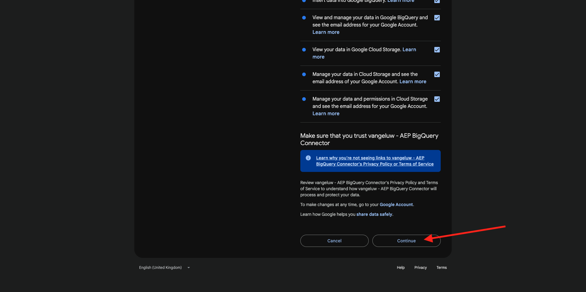
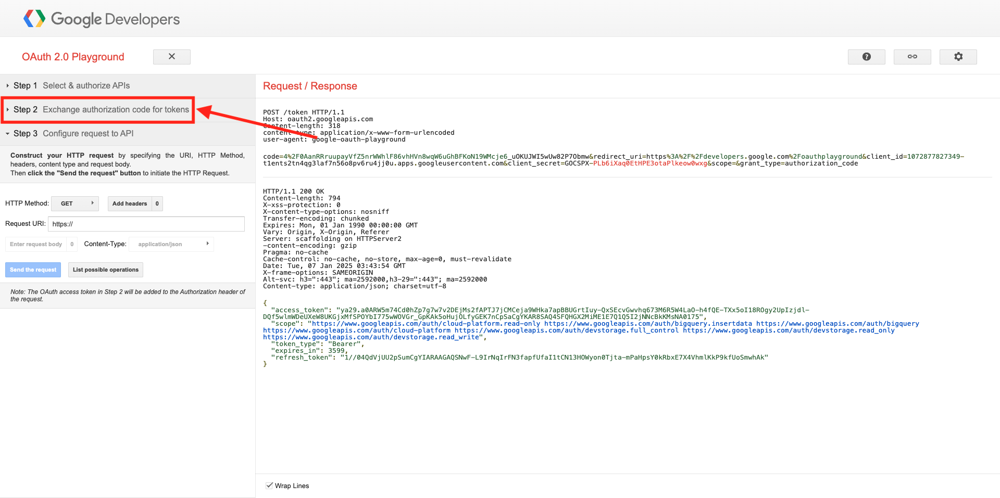

# 4.2.3 Anslut GCP och BigQuery till Adobe Experience Platform

## Mål

- Utforska API och tjänster i Google Cloud Platform
- Bekanta dig med OAuth Playground för att testa Google API:er
- Skapa din första BigQuery-anslutning i Adobe Experience Platform

## Kontext

Adobe Experience Platform tillhandahåller en koppling i **Sources** som hjälper dig att hämta BigQuery-datauppsättningar till Adobe Experience Platform. Denna dataanslutning baseras på Google BigQuery API. Därför är det viktigt att förbereda Google Cloud Platform och BigQuery-miljön för att kunna ta emot API-anrop från Adobe Experience Platform.

För att konfigurera BigQuery Source Connector i Adobe Experience Platform behöver du följande fyra värden:

- projekt
- clientId
- clientSecret
- refreshToken

Hittills har du bara den första, **projekt-ID**. Detta **projekt-ID**-värde är ett slumpmässigt ID som genererades av Google när du skapade ditt BigQuery-projekt under övning 12.1.

Kopiera projekt-ID i en separerad textfil.

| Autentiseringsuppgifter | Namngivning | Exempel |
| ----------------- |-------------| -------------|
| Projekt-ID | random | possible-bee-447102-h3 |

Du kan när som helst kontrollera ditt projekt-ID genom att klicka på ditt **projektnamn** i den övre menyraden:

Du kommer att se ditt projekt-ID till höger:

I den här övningen får du lära dig hur du får de tre andra obligatoriska fälten:

- clientId
- clientSecret
- refreshToken

## 4.2.3.1 Google Auth Platform

Börja med att gå tillbaka till startsidan för Google Cloud Platform. Det gör du genom att klicka på logotypen i det övre vänstra hörnet på skärmen.

När du är på startsidan kan du söka efter **Google Auth Platform** i sökfältet. Klicka på det första resultatet för att öppna det.

Nu visas startsidan för **Google Auth Platform**. Klicka på **GETEN STARTAD**.

Använd följande för **appnamnet**:

| Namngivning | Exempel |
| ----------------- |-------------| 
| `--aepUserLdap-- - AEP BigQuery Connector` | vangeluw - AEP BigQuery Connector |

Välj din e-postadress för fältet **E-postadress för användarsupport**.

Klicka på **NÄSTA**.

Välj **Extern** och klicka på **NÄSTA**.

Ange din e-postadress och klicka på **NÄSTA**.

Markera kryssrutan och klicka på **FORTSÄTT**. Klicka sedan på **SKAPA**.

## 4.2.3.2 Skapa OAuth-klient

Klicka på **SKAPA OAUTH-KLIENT**.

Då ser du det här.

Välj **Webbprogram**.

Flera nya fält visas. Du måste nu ange **Namn** för OAuth-klient-ID:t och även ange **auktoriserade omdirigerings-URI:er**.

Använd följande för fältet **Namn**:

| Fält | Värde | Exempel |
| ----------------- |-------------| -------------| 
| Namn | ldap - AEP BigQuery Connector | vangeluw - Platform BigQuery Connector |

Klicka på **+ ADD URI** under **Auktoriserade omdirigerings-URI:er**. Lägg till den nya URI:n nedan.

| Fält | Värde |
| ----------------- |-------------| 
| Auktoriserade omdirigerings-URI | https://developers.google.com/oauthplayground |

Fältet **Auktoriserade omdirigerings-URI:er** är ett mycket viktigt fält eftersom du behöver det senare för att få den RefreshToken som du behöver för att slutföra installationen av BigQuery Source Connector i Adobe Experience Platform.

Klicka på **Skapa**.

Ditt OAuth-klient-ID har skapats. Klicka på den för att se ditt klient-ID och din klienthemlighet.

Därefter visas värdena för Klient-ID och Klienthemlighet.

Kopiera dessa två fält och klistra in dem i en textfil på skrivbordet. Du kan alltid komma åt dessa autentiseringsuppgifter i ett senare skede, men det är enklare om du sparar dem i en textfil bredvid ditt BigQuery-projekt-ID.

Som en vändning för dina BigQuery Source Connector-inställningar i Adobe Experience Platform finns nu dessa värden redan tillgängliga:

| Referenser för BigQuery Connector | Värde |
| ----------------- |-------------| 
| Projekt-ID | ditt eget projekt-ID (t.ex.: possible-bee-447102-h3) |
| klientid | dinclientid |
| cilenthemlighet | din klienthemlighet |

Därefter måste du publicera din OAuth-app. Gå till **Målgrupp** och klicka på **PUBLISH APP**.

Klicka på **BEKRÄFTA**.

Du saknar fortfarande **refreshToken**. refreshToken är ett krav på grund av säkerhetsskäl. I API:ernas värld går tokens normalt ut var 24:e timme. **refreshToken** behövs därför för att uppdatera säkerhetstoken var 24:e timme, så att Source Connector-konfigurationen kan fortsätta ansluta till Google Cloud Platform och BigQuery.

## 4.2.3.3 BigQuery API och refreshToken

Det finns många sätt att få en refreshToken för att få åtkomst till API:er för Google Cloud-plattformen. Ett av dessa alternativ är t.ex. att använda Postman.
Google har dock byggt något enklare att testa och spela upp med sina API:er, ett verktyg som kallas **OAuth 2.0 Playground**.

Gå till [https://developers.google.com/oauthplayground](https://developers.google.com/oauthplayground) om du vill komma åt **OAuth 2.0 Playground**.

Du ser då startsidan för **OAuth 2.0 Playground**.

Klicka på ikonen **kugghjulet** i skärmens övre högra hörn. Kontrollera att inställningarna är desamma som i bilden ovan.

Markera kryssrutan: **Använd dina egna OAuth-autentiseringsuppgifter**

Två fält visas.

Fyll i fälten efter denna tabell:

| Inställningar för uppspelnings-API | Dina Google API-autentiseringsuppgifter |
| ----------------- |-------------| 
| OAuth-klient-ID | ditt eget klient-ID (i textfilen på skrivbordet) |
| OAuth-klienthemlighet | din egen klienthemlighet (i textfilen på skrivbordet) |

När du har fyllt i dina autentiseringsuppgifter klickar du på **Stäng**.

På den vänstra menyn kan du se alla tillgängliga Google API:er. Sök efter **BigQuery API v2** och klicka på den för att öppna den.

Välj sedan det omfång som anges i bilden nedan. Du måste klicka på var och en av de tillgängliga API:erna, och en bock visas för varje valt API.

Klicka sedan på **Auktorisera API:er**.

Klicka på den e-postadress som du använde för att konfigurera GCP och BigQuery.

Då visas en stor varning: **Den här appen har inte verifierats**. Detta beror på att din Platform BigQuery Connector inte har granskats formellt än, så Google vet inte om det är en autentisk app eller inte.

Klicka på **Avancerat**.

Klicka sedan på **Gå till —aepUserLdap— - AEP BigQuery Connector (osäker)**.

Då visas en säkerhetsfråga. Klicka på **Markera alla**.

Bläddra nedåt och klicka på **Fortsätt**.

Du kommer nu att skickas tillbaka till OAuth 2.0 Playground och du kommer att se detta. Klicka på **Exchange-auktoriseringskod för tokens**.

Efter några sekunder stängs vyn **Steg 2 - Exchange-auktoriseringskod för tokens** automatiskt och du ser **Steg 3 - Konfigurera begäran till API**.

Du måste gå tillbaka till **steg 2-auktoriseringskoden för Exchange för tokens**, så klicka på **steg 2-auktoriseringskoden för Exchange för tokens** igen för att visa **uppdateringstoken**.

Du kommer nu att se **Uppdateringstoken**.

Kopiera **uppdateringstoken** och klistra in den i textfilen på skrivbordet tillsammans med andra Source Connector-autentiseringsuppgifter för BigQuery:

| BigQuery Source Connector-autentiseringsuppgifter | Värde |
| ----------------- |-------------| 
| Projekt-ID | ett eget slumpmässigt projekt-ID (t.ex.: apt-sommar-273608) |
| klientid | dinclientid |
| cilenthemlighet | din klienthemlighet |
| uppdateringstoken | din uppdateringstoken |

Sedan ställer vi in Source Connector i Adobe Experience Platform.

## 4.2.3.5 - Ansluta plattformen med din egen BigQuery-tabell

Logga in på Adobe Experience Platform via följande URL: [https://experience.adobe.com/platform](https://experience.adobe.com/platform).

När du har loggat in loggar du in på Adobe Experience Platform hemsida.

Innan du fortsätter måste du välja en **sandlåda**. Sandlådan som ska markeras har namnet ``--aepSandboxName--``. När du har valt rätt sandlåda ser du skärmändringen och nu befinner du dig i din dedikerade sandlåda.

Gå till Källor på den vänstra menyn. Du kommer då att se hemsidan **Källor**. Klicka på **Databaser** på menyn **Källor**. Klicka på **Google BigQuery**-kortet. Klicka sedan på **Konfigurera**.

Nu bör du skapa en ny anslutning.

Klicka på **Nytt konto**. Nu måste du fylla i alla nedanstående fält, baserat på de inställningar du gjorde i GCP och BigQuery.

Vi börjar med att namnge anslutningen:

Använd den här namnkonventionen:

| Referenser för BigQuery Connector | Värde | Exempel |
| ----------------- |-------------| -------------| 
| Kontonamn | `--aepUserLdap-- - BigQuery Connection` | vangeluw - BigQuery Connection |
| Beskrivning | `--aepUserLdap-- - BigQuery Connection` | vangeluw - BigQuery Connection |

Då får du den här:

Fyll sedan i informationen för GCP- och BigQuery API **Account Authentication** som du lagrade i en textfil på skrivbordet:

| Referenser för BigQuery Connector | Värde |
| ----------------- |-------------| 
| Projekt-ID | ett eget slumpmässigt projekt-ID (t.ex.: possible-bee-447102-h3) |
| clientId | ... |
| cilentSecret | ... |
| refreshToken | ... |

Din **kontoautentisering**-information ska nu se ut så här. Klicka på **Anslut till källa**.

Om dina **kontoautentiseringsdata** har fyllts i korrekt bör du nu se en visuell bekräftelse på att anslutningen fungerar som den ska genom att se bekräftelsen **Ansluten**. Klicka på **Nästa**.

Du kommer nu att se den BigQuery-datauppsättning som du skapade i föregående övning.

Bra gjort! I nästa övning läser du in data från den tabellen och mappar den mot ett schema och en datauppsättning i Adobe Experience Platform.

Nästa steg: [4.2.4 Läs in data från BigQuery till Adobe Experience Platform](./ex4.md)

[Gå tillbaka till modul 4.2](./customer-journey-analytics-bigquery-gcp.md)

[Gå tillbaka till Alla moduler](./../../../overview.md)
