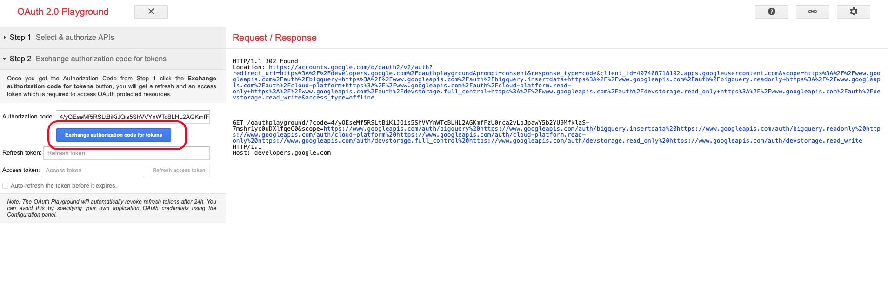

# 4.2.3 Anslut GCP och BigQuery till Adobe Experience Platform

## Mål

- Utforska API och tjänster i Google Cloud Platform
- Bekanta dig med OAuth Playground för att testa Google API:er
- Skapa din första BigQuery-anslutning i Adobe Experience Platform

## Kontext

Adobe Experience Platform tillhandahåller en koppling i **Sources** som hjälper dig att hämta BigQuery-datauppsättningar till Adobe Experience Platform. Denna dataanslutning baseras på Google BigQuery API. Därför är det viktigt att förbereda Google Cloud Platform och BigQuery-miljön för att kunna ta emot API-anrop från Adobe Experience Platform.

För att konfigurera BigQuery Source Connector i Adobe Experience Platform behöver du följande fyra värden:

- projekt
- clientId
- clientSecret
- refreshToken

Hittills har du bara den första, **projekt-ID**. Detta **projekt-ID**-värde är ett slumpmässigt ID som genererades av Google när du skapade ditt BigQuery-projekt under övning 12.1.

Kopiera projekt-ID i en separerad textfil.

| Autentiseringsuppgifter | Namngivning | Exempel |
| ----------------- |-------------| -------------|
| Projekt-ID | random | sammansatt-uppgift-306413 |

Du kan när som helst kontrollera ditt projekt-ID genom att klicka på ditt **projektnamn** i den övre menyraden:

Du kommer att se ditt projekt-ID till höger:

I den här övningen får du lära dig hur du får de tre andra obligatoriska fälten:

- clientId
- clientSecret
- refreshToken

## 4.2.3.1 API och tjänster för Google Cloud

Börja med att gå tillbaka till startsidan för Google Cloud Platform. Det gör du genom att klicka på logotypen i det övre vänstra hörnet på skärmen.

När du är på startsidan går du till den vänstra menyn och klickar på **API:er och tjänster**. Klicka sedan på **Kontrollpanelen**.

Nu visas startsidan för **API:er och tjänster**.

På den här sidan kan du se hur olika Google API-anslutningar används. Om du vill konfigurera en API-anslutning så att Adobe Experience Platform kan läsa från BigQuery måste du göra följande:

- Först måste du skapa en OAuth-tillståndsskärm för att kunna aktivera framtida autentiseringar. Google säkerhetsskäl kräver också att en människa gör den första autentiseringen innan en programmatisk åtkomst tillåts.
- För det andra behöver du API-autentiseringsuppgifter (clientId och clientSecret) som ska användas för API-autentisering och åtkomst till BigQuery Connector.

## 4.2.3.2 OAuth-godkännandeskärm

Låt oss börja med att skapa OAuth-godkännandeskärmen. Klicka på **OAuth-medgivandeskärmen** på den vänstra menyn på hemsidan för **API:er och tjänster**.

Då ser du det här:

Välj användartyp: **Extern**. Klicka sedan på **SKAPA**.

Du kommer sedan att vara i fönstret **Konfiguration av OAuth-godkännandeskärm**.

Det enda du kan göra här är att ange namnet på medgivandeskärmen i fältet **Programnamn** och välja e-postadressen **Användarsupport**. Använd den här namnkonventionen för programnamnet:

| Namngivning | Exempel |
| ----------------- |-------------| 
| `--aepUserLdap-- - AEP BigQuery Connector` | vangeluw - AEP BigQuery Connector |

Bläddra sedan nedåt tills du ser **kontaktinformation för utvecklare** och fyller i en e-postadress.

Klicka på **SPARA OCH FORTSÄTT**.

Då ser du det här. Klicka på **SPARA OCH FORTSÄTT**.

Då ser du det här. Klicka på **SPARA OCH FORTSÄTT**.

Då ser du det här. Klicka **TILLBAKA TILL KONTROLLPANELEN**.

Då ser du det här. Klicka på **PUBLISH APP**.

Klicka på **BEKRÄFTA**.

Då ser du det här.

I nästa steg avslutar du API-konfigurationen och får dina API-autentiseringsuppgifter.

## 4.2.3.3 Google API-autentiseringsuppgifter: Klienthemlighet och klient-ID

Klicka på **Autentiseringsuppgifter** på den vänstra menyn. Då ser du det här:

Klicka på knappen **+ SKAPA AUTENTISERINGSUPPGIFTER** .

Du kommer att se tre alternativ. Klicka på **OAuth-klient-ID**:

Välj **Webbprogram** på nästa skärm.

Flera nya fält visas. Du måste nu ange **Namn** för OAuth-klient-ID:t och även ange **auktoriserade omdirigerings-URI:er**.

Följ den här namnkonventionen:

| Fält | Värde | Exempel |
| ----------------- |-------------| -------------| 
| Namn | ldap - AEP BigQuery Connector | vangeluw - Platform BigQuery Connector |
| Auktoriserade omdirigerings-URI | https://developers.google.com/oauthplayground | https://developers.google.com/oauthplayground |

Fältet **Auktoriserade omdirigerings-URI:er** är ett mycket viktigt fält eftersom du behöver det senare för att få den RefreshToken som du behöver för att slutföra installationen av BigQuery Source Connector i Adobe Experience Platform.

Innan du fortsätter måste du trycka på knappen **Retur** fysiskt efter att du angett URL:en för att lagra värdet i fältet **Auktoriserade omdirigerings-URI**. Om du inte klickar på knappen **Retur** kommer du att stöta på problem i ett senare skede i **OAuth 2.0 Playground** .

Klicka sedan på **Skapa**:

Nu visas ditt klient-ID och din klienthemlighet.

Kopiera dessa två fält och klistra in dem i en textfil på skrivbordet. Du kan alltid komma åt dessa autentiseringsuppgifter i ett senare skede, men det är enklare om du sparar dem i en textfil bredvid ditt BigQuery-projekt-ID.

Som en vändning för dina BigQuery Source Connector-inställningar i Adobe Experience Platform finns nu dessa värden redan tillgängliga:

| Referenser för BigQuery Connector | Värde |
| ----------------- |-------------| 
| Projekt-ID | ditt eget projekt-ID (t.ex.: sammansatt-uppgift-306413) |
| klientid | dinclientid |
| cilenthemlighet | din klienthemlighet |

Du saknar fortfarande **refreshToken**. refreshToken är ett krav på grund av säkerhetsskäl. I API:ernas värld går tokens normalt ut var 24:e timme. **refreshToken** behövs därför för att uppdatera säkerhetstoken var 24:e timme, så att Source Connector-konfigurationen kan fortsätta ansluta till Google Cloud Platform och BigQuery.

## 4.2.3.4 BigQuery API och refreshToken

Det finns många sätt att få en refreshToken för att få åtkomst till API:er för Google Cloud-plattformen. Ett av dessa alternativ är t.ex. att använda Postman.
Google har dock byggt något enklare att testa och spela upp med sina API:er, ett verktyg som kallas **OAuth 2.0 Playground**.

Gå till [https://developers.google.com/oauthplayground](https://developers.google.com/oauthplayground) om du vill komma åt **OAuth 2.0 Playground**.

Du ser då startsidan för **OAuth 2.0 Playground**.

Klicka på ikonen **kugghjulet** längst upp till höger på skärmen:

Kontrollera att inställningarna är desamma som i bilden ovan.

Kontrollera inställningarna så att de är 100 % säkra.

När du är klar markerar du kryssrutan **Använd dina egna OAuth-autentiseringsuppgifter**

Två fält ska visas och du har värdet för dem.

Fyll i fälten efter denna tabell:

| Inställningar för uppspelnings-API | Dina Google API-autentiseringsuppgifter |
| ----------------- |-------------| 
| OAuth-klient-ID | ditt eget klient-ID (i textfilen på skrivbordet) |
| OAuth-klienthemlighet | din egen klienthemlighet (i textfilen på skrivbordet) |

Kopiera **klient-ID** och **klienthemlighet** från textfilen som du skapade på skrivbordet.

När du har fyllt i dina inloggningsuppgifter klickar du på **Stäng**

På den vänstra menyn kan du se alla tillgängliga Google API:er. Sök efter **BigQuery API v2**.

Välj sedan det omfång som anges i bilden nedan:

När du har valt dem bör du se en blå knapp som säger **Auktorisera API:er**. Klicka på den.

Välj det Google-konto du använde för att konfigurera GCP och BigQuery.

En stor varning kan visas: **Den här appen har inte verifierats**. Detta beror på att din Platform BigQuery Connector inte har granskats formellt än, så Google vet inte om det är en autentisk app eller inte. Du bör bortse från det här meddelandet.

Klicka på **Avancerat**.

Klicka sedan på **Gå till ldap - AEP BigQuery Connector (osäker)**.

Du omdirigeras till den OAuth-godkännandeskärm som du skapade.

Om du använder tvåfaktorsautentisering (2FA) anger du den verifieringskod som skickas till dig.

Google visar nu åtta olika **behörighetsanvisningar**. Klicka på **Tillåt** för alla åtta behörighetsbegäranden. (Detta är en procedur som måste följas och bekräftas en gång av en riktig människa, innan API:t tillåter programmatiska begäranden)

Även här visas inte **åtta olika popup-fönster**. Du måste klicka på **Tillåt** för alla.

Efter de åtta behörighetsbegärandena visas den här översikten. Klicka på **Tillåt** för att slutföra processen.

Efter det sista **Tillåt**-klicket skickas du tillbaka till OAuth 2.0 Playground och du ser detta:

Klicka på **Exchange-auktoriseringskod för tokens**.

Efter några sekunder stängs vyn **Steg 2 - Exchange-auktoriseringskod för tokens** automatiskt och du ser **Steg 3 - Konfigurera begäran till API**.

Du måste gå tillbaka till **steg 2-auktoriseringskoden för Exchange för tokens**, så klicka på **steg 2-auktoriseringskoden för Exchange för tokens** igen för att visa **uppdateringstoken**.

Du kommer nu att se **Uppdateringstoken**.

Kopiera **uppdateringstoken** och klistra in den i textfilen på skrivbordet tillsammans med andra Source Connector-autentiseringsuppgifter för BigQuery:

| BigQuery Source Connector-autentiseringsuppgifter | Värde |
| ----------------- |-------------| 
| Projekt-ID | ett eget slumpmässigt projekt-ID (t.ex.: apt-sommar-273608) |
| klientid | dinclientid |
| cilenthemlighet | din klienthemlighet |
| uppdateringstoken | din uppdateringstoken |

Sedan ställer vi in Source Connector i Adobe Experience Platform.

## 4.2.3.5 - Ansluta plattformen med din egen BigQuery-tabell

Logga in på Adobe Experience Platform via följande URL: [https://experience.adobe.com/platform](https://experience.adobe.com/platform).

När du har loggat in loggar du in på Adobe Experience Platform hemsida.

Innan du fortsätter måste du välja en **sandlåda**. Sandlådan som ska markeras har namnet ``--aepSandboxName--``. Du kan göra detta genom att klicka på texten **[!UICONTROL Production Prod]** i den blå raden ovanför skärmen. När du har valt rätt sandlåda ser du skärmändringen och nu befinner du dig i din dedikerade sandlåda.

Gå till Källor på den vänstra menyn. Du kommer då att se hemsidan **Källor**. Klicka på **Databaser** på menyn **Källor**. Klicka på **Google BigQuery**-kortet. Klicka sedan på **Konfigurera** eller **+ Konfigurera**.

Nu bör du skapa en ny anslutning.

Klicka på **Nytt konto**. Nu måste du fylla i alla nedanstående fält, baserat på de inställningar du gjorde i GCP och BigQuery.

Vi börjar med att namnge anslutningen:

Använd den här namnkonventionen:

| Referenser för BigQuery Connector | Värde | Exempel |
| ----------------- |-------------| -------------| 
| Kontonamn | `--aepUserLdap-- - BigQuery Connection` | vangeluw - BigQuery Connection |
| Beskrivning | `--aepUserLdap-- - BigQuery Connection` | vangeluw - BigQuery Connection |

Det borde ge dig något sådant här:

Fyll sedan i informationen för GCP- och BigQuery API **Account Authentication** som du lagrade i en textfil på skrivbordet:

| Referenser för BigQuery Connector | Värde |
| ----------------- |-------------| 
| Projekt-ID | ett eget slumpmässigt projekt-ID (t.ex.: apt-sommar-273608) |
| clientId | ... |
| cilentSecret | ... |
| refreshToken | ... |

Din **kontoautentisering**-information ska nu se ut så här:

När du har fyllt i alla dessa fält klickar du på **Anslut till källa**.

Om dina **kontoautentiseringsdata** har fyllts i korrekt bör du nu se en visuell bekräftelse på att anslutningen fungerar som den ska genom att se bekräftelsen **Ansluten**.

Klicka **Nästa** när du har skapat din anslutning:

Du kommer nu att se den BigQuery-datauppsättning som du skapade under övning 12.2.

Bra gjort! I nästa övning läser du in data från den tabellen och mappar den mot ett schema och en datauppsättning i Adobe Experience Platform.

Nästa steg: [4.2.4 Läs in data från BigQuery till Adobe Experience Platform](./ex4.md)

[Gå tillbaka till modul 4.2](./customer-journey-analytics-bigquery-gcp.md)

[Gå tillbaka till Alla moduler](./../../../overview.md)
