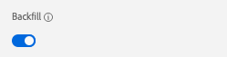

# 4.2.4 Läs in data från BigQuery till Adobe Experience Platform

## Mål

- Mappa BigQuery-data till ett XDM-schema
- Läs in BigQuery-data i Adobe Experience Platform
- Bekanta dig med användargränssnittet i BigQuery Source Connector

## Innan du börjar

När du har tränat 12.3 bör du ha den här sidan öppen i Adobe Experience Platform:

**Om du har den öppen fortsätter du med träning 12.4.1.**

**Om du inte har den öppen går du till [Adobe Experience Platform](https://experience.adobe.com/platform/home).**

Gå till Källor på den vänstra menyn. Du kommer då att se hemsidan **Källor**. Klicka på **Databaser** på menyn **Källor**.

Markera **Google BigQuery** Source Connector och klicka på **+ Configure**.

Då visas urvalsskärmen för Google BigQuery-konto.

Välj ditt konto och klicka på **Nästa**.

Du ser sedan vyn **Lägg till data**.

## 4.2.4.1 Val av BigQuery-tabell

I vyn **Lägg till data** väljer du din BigQuery-datauppsättning.

Nu kan du se en förhandsvisning av Google Analytics data i BigQuery.

Klicka på **Nästa**.

## 4.2.4.2 XDM-mappning

Nu ser du det här:

Du måste nu antingen skapa en ny datauppsättning eller välja en befintlig datauppsättning att läsa in Google Analytics data i. För den här övningen har en datauppsättning och ett schema redan skapats. Du behöver inte skapa ett nytt schema eller en ny datauppsättning.

Välj **Befintlig datauppsättning**. Öppna listrutan för att välja en datauppsättning. Sök efter datauppsättningen `Demo System - Event Dataset for BigQuery (Global v1.1)` och markera den. Klicka på **Nästa**.

Rulla ned. Du måste nu mappa varje **Source Field** från Google Analytics/BigQuery till ett XDM **målfält**, fält för fält.

Använd mappningstabellen nedan för den här övningen.

| Source Field | Målfält |
| ----------------- |-------------| 
| **_id** | _id |
| **_id** | kanal._id |
| timeStamp | tidsstämpel |
| GA_ID | ``--aepTenantId--``.identity.core.gaid |
| customerID | ``--aepTenantId--``.identity.core.loyaltyId |
| Sida | web.webPageDetails.name |
| Enhet | device.type |
| Webbläsare | environment.browserDetails.vendor |
| MarketingChannel | marketing.trackingCode |
| TrafficSource | channel.typeAtSource |
| TrafficMedium | channel.mediaType |
| TransactionID | commerce.order.payments.transactionID |
| eCommerce_Action_Type | eventType |
| Sidor | web.webPageDetails.pageViews.value |
| Unique_Purchases | commerce.purchases.value |
| product_detail_views | commerce.productViews.value |
| add_to_cart | commerce.productListAdds.value |
| product_removes_from_art | commerce.productListRemovals.value |
| Product_Checkouts | commerce.checkouts.value |

När du har kopierat och klistrat in mappningen ovan i Adobe Experience Platform UI bör du kontrollera om det inte finns några fel på grund av stavfel eller inledande/avslutande blanksteg.

Du har nu en **mappning** som den här:

Källfälten **GA_ID** och **customerID** mappas till en identifierare i det här XDM-schemat. På så sätt kan du förbättra Google Analytics-data (webb-/appbeteendedata) med andra datauppsättningar som Loyalty eller Call Center-data.

Klicka på **Nästa**.

## 4.2.4.3 Anslutning och planering av dataöverföring

Fliken **Schemaläggning** visas nu:

På fliken **Schemaläggning** kan du definiera en frekvens för datainmatningsprocessen för den här **mappningen** och data.

Eftersom du använder demodata i Google BigQuery som inte kommer att uppdateras finns det inget behov av att ställa in ett schema i den här övningen. Du måste välja något och för att undvika för många onödiga dataöverföringsprocesser måste du ange frekvensen så här:

- Frekvens: **Vecka**
- Intervall: **200**

**Viktigt**: Kontrollera att du aktiverar växeln **Backfill**.

Sist men inte minst måste du definiera ett **delta**-fält.

Fältet **delta** används för att schemalägga anslutningen och bara överföra nya rader som kommer till din BigQuery-datamängd. Ett delta-fält är vanligtvis alltid en tidsstämpelkolumn. Så för framtida schemalagda datainmatningar kommer endast rader med en ny, nyare tidsstämpel att kapslas.

Välj **timeStamp** som deltafält.

Du har den här nu.

Klicka på **Nästa**.

## 4.2.4.4 Granska och starta anslutning

I vyn **Flödesinformation för datauppsättning**. du måste namnge anslutningen, vilket hjälper dig att hitta den senare.

Använd den här namnkonventionen:

| Fält | Namngivning | Exempel |
| ----------------- |-------------| -------------|
| Namn på dataflöde | DataFlow - ldap - BigQuery Web Interaction | DataFlow - vangeluw - BigQuery-webbplatsinteraktion |
| Beskrivning | DataFlow - ldap - BigQuery Web Interaction | DataFlow - vangeluw - BigQuery-webbplatsinteraktion |

Klicka på **Nästa**.

Nu visas en detaljerad översikt över din anslutning. Kontrollera att allt är korrekt innan du fortsätter, eftersom vissa inställningar inte kan ändras längre efteråt, till exempel XDM-mappningen.

Klicka på **Slutför**.

Det kan ta ett tag att konfigurera anslutningen, så oroa dig inte om följande visas:

När anslutningen har skapats ser du följande:

Du är nu redo att fortsätta med nästa övning, där du kommer att använda Customer Journey Analytics för att skapa kraftfulla visualiseringar utöver Google Analytics data.

Nästa steg: [4.2.5 Analysera Google Analytics-data med Customer Journey Analytics](./ex5.md)

[Gå tillbaka till modul 4.2](./customer-journey-analytics-bigquery-gcp.md)

[Gå tillbaka till Alla moduler](./../../../overview.md)
