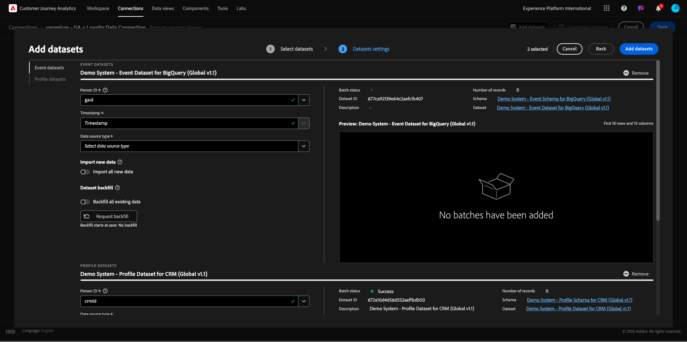
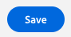
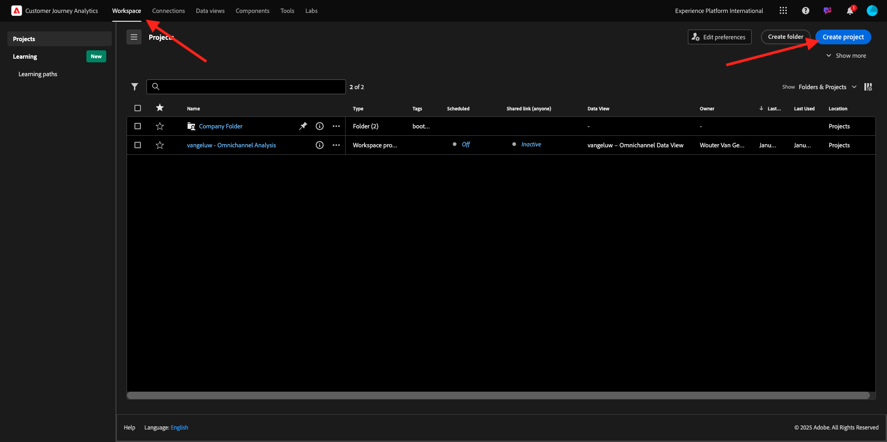
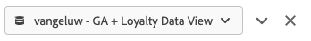
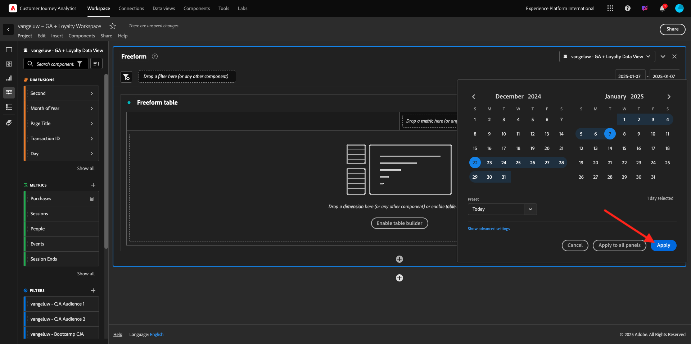
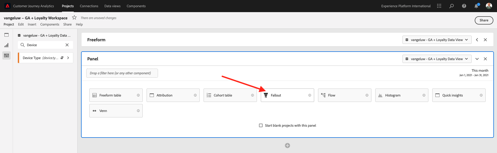
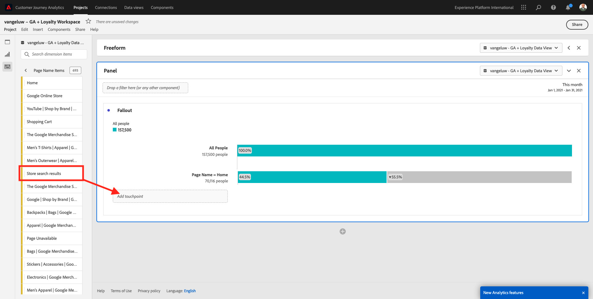

# 4.2.5 Analysera Google Analytics-data med Customer Journey Analytics

## Mål

- Koppla vår BigQuery-datauppsättning till Customer Journey Analytics (CJA)
- Koppla samman och anslut Google Analytics med lojalitetsdata.
- Bekanta dig med CJA UI

## 4.2.5.1 Skapa en anslutning

Gå till [analytics.adobe.com](https://analytics.adobe.com) om du vill komma åt Customer Journey Analytics.

Gå till **Anslutningar** på Customer Journey Analytics hemsida.

Här ser du alla olika anslutningar mellan CJA och Platform. Dessa anslutningar har samma mål som rapporteringsprogram i Adobe Analytics. Insamlingen av data är dock helt annorlunda. Alla data kommer från Adobe Experience Platform datamängder.

Klicka på **Skapa ny anslutning**.

Därefter visas gränssnittet **Skapa anslutning**.

Använd följande för namnet: `--aepUserLdap-- - GA + Loyalty Data Connection`.

Du måste välja rätt sandlåda att använda. Välj din sandlåda på sandlådemenyn, som ska vara `--aepSandboxName--`. I det här exemplet är sandlådan som ska användas **Tech Insiders**.

Ange **Genomsnittligt antal dagliga händelser** till **mindre än 1 miljon**.

Nu kan du börja lägga till datauppsättningar på datamenyn. Klicka på **Lägg till datauppsättningar**.

De datauppsättningar som ska läggas till är:
- `Demo System - Profile Dataset for CRM (Global v1.1)`
- `Demo System - Event Dataset for BigQuery (Global v1.1)`

Sök efter båda datauppsättningarna, markera kryssrutan för dem och klicka sedan på **Nästa**.

Då ser du det här:

Ändra **Person-ID** till **loyaltyId** för datauppsättningen `Demo System - Event Dataset for BigQuery (Global v1.1)` och ange **Datakälltyp** till **Webbdata**. Aktivera båda alternativen för **Importera alla nya data** och **Fyll i alla befintliga data**.

Kontrollera att **Person-ID** är inställt på **crmId** för datauppsättningen `Demo System - Event Dataset for BigQuery (Global v1.1)` och ställ in **datakälltypen** på **webbdata**. Aktivera båda alternativen för **Importera alla nya data** och **Fyll i alla befintliga data**. Klicka på **Lägg till datauppsättningar**.

Du kommer då att vara här. Klicka på **Spara**.

När du har skapat din **anslutning** kan det ta några timmar innan dina data är tillgängliga i CJA.

Sedan visas anslutningen i listan över tillgängliga anslutningar.

## 4.2.5.2 Skapa en datavy

När anslutningen är klar kan du nu gå vidare och påverka visualiseringen. En skillnad mellan Adobe Analytics och CJA är att CJA behöver en datavy för att rensa och förbereda data före visualisering.

En datavy liknar konceptet med virtuella rapportsviter i Adobe Analytics, där du definierar kontextmedvetna besöksdefinitioner, filtrering och även hur komponenterna anropas.

Du behöver minst en datavy per anslutning. Men för vissa fall är det bra att ha flera datavyer för samma anslutning, med målet att ge olika insikter till olika team.

Om ni vill att ert företag ska bli datadrivet bör ni anpassa hur data ska visas i varje team. Några exempel:

- UX-värden endast för UX-designteamet
- Använd samma namn för KPI:er och Metrics för Google Analytics som för Customer Journey Analytics så att de digitala analysteamen bara kan tala ett språk.
- datavy filtrerad för att exempelvis visa data för 1 marknad, 1 varumärke eller endast för mobila enheter.

På skärmen **Anslutningar** markerar du kryssrutan framför den anslutning du just skapade. Klicka på **Skapa datavy**.

Du omdirigeras till arbetsflödet **Skapa datavy**.

Nu kan du konfigurera de grundläggande definitionerna för datavyn. Exempel på tidszon, tidsgräns för session eller filtrering av datavyn (segmenteringsdelen liknar den för virtuella rapportsviter i Adobe Analytics).

**Anslutningen** som du skapade i den föregående övningen har redan valts. Anslutningen har namnet `--aepUserLdap-- - GA + Loyalty Data Connection`.

Ge sedan datavyn ett namn enligt följande namnkonvention: `--aepUserLdap-- - GA + Loyalty Data View`.

Ange samma värde för beskrivningen: `--aepUserLdap-- - GA + Loyalty Data View`.

Innan vi gör någon analys eller visualisering måste vi skapa en datavy med alla fält, dimensioner och mått samt deras attribueringsinställningar.

| Fält | Namngivningskonvention |
| ----------------- |-------------|  
| Namnanslutning | `--aepUserLdap-- - GA + Loyalty Data View` | vangeluw - GA + lojalitetsdatavy |
| Beskrivning | `--aepUserLdap-- - GA + Loyalty Data View` |
| Externt ID | `--aepUserLdap--GA` |

Klicka på **Spara och fortsätt**.

Nu kan du lägga till komponenter i datavyn. Som du ser läggs vissa mått och mått till automatiskt.

Lägg till följande komponenter i datavyn:

| Komponentnamn | Komponenttyp | Komponentsökväg |
| -----------------|-----------------|-----------------|
| nivå | Dimension | _experienceplatform.loyaltyDetails.level |
| punkter | Mått | _experienceplatform.loyaltyDetails.points |
| commerce.checkouts.value | Mått | commerce.checkouts.value |
| commerce.productListRemovals.value | Mått | commerce.productListRemovals.value |
| commerce.productListAdds | Mått | commerce.productListAdds |
| commerce.productViews.value | Mått | commerce.productViews.value |
| commerce.purchases.value | Mått | commerce.purchases.value |
| web.webPageDetails.pageViews | Mått | web.webPageDetails.pageViews |
| Transaktions-ID | Dimension | commerce.order.payments.transactionID |
| channel.mediaType | Dimension | channel.mediaType |
| channel.typeAtSource | Dimension | channel.typeAtSource |
| Spårningskod | Dimension | marketing.trackingCode |
| gala | Dimension | _experience.platform.identify.core.gaid |
| web.webPageDetails.name | Dimension | web.webPageDetails.name |
| Händelsetyp | Dimension | eventType |
| Leverantör | Dimension | environment.browserDetails.vendor |
| Identifierare | Dimension | _id |
| Tidsstämpel | Dimension | tidsstämpel |
| Typ | Dimension | device.type |
| loyaltyId | Dimension | _experienceplatform.Identification.core.loyaltyId |

Då får du den här:

Därefter måste du ändra det egna namnet för några av ovanstående mått och mått så att du enkelt kan använda dem när du bygger upp din analys. Det gör du genom att markera måttet eller dimensionen och uppdatera fältet **Namn** enligt bilden nedan.

| Ursprungligt komponentnamn | Visningsnamn |
| -----------------|-----------------|
| nivå | Lojalitetsnivå |
| punkter | Lojalitetspunkter |
| commerce.checkouts.value | Utcheckningar |
| commerce.productListRemovals.value | Cart Removals |
| commerce.productListAdds | Cart Adds |
| commerce.productViews.value | Produktvyer |
| commerce.purchases.value | Inköp |
| web.webPageDetails.pageViews | Sidvyer |
| channel.mediaType | Traffic Medium |
| channel.typeAtSource | Traffic Source |
| Spårningskod | Marknadsföringskanal |
| gala | Google Analytics-ID |
| Namn | Sidrubrik |
| Leverantör | Webbläsare |
| Typ | Enhetstyp |
| loyaltyId | Förmåns-ID |

Då har du något sådant:

Därefter måste du göra några ändringar i person- och sessionskontexten för vissa av dessa komponenter genom att ändra **attributinställningarna**.

Ändra **attribueringsinställningarna** för nedanstående komponenter:

| Komponent |
| -----------------|
| Traffic Source |
| Marknadsföringskanal |
| Webbläsare |
| Traffic Medium |
| Enhetstyp |
| Google Analytics-ID |
| Förmåns-ID |
| Lojalitetsnivå |
| Lojalitetspunkter |

Det gör du genom att markera komponenten, klicka på **Använd anpassad attribueringsmodell** och ange **modell** till **sista beröringen** samt **Förfallotid** till **Person (rapporteringsfönster)**. Upprepa detta för alla ovannämnda komponenter.

När du har gjort ändringarna i attribueringsinställningarna för alla de ovannämnda komponenterna bör du ha den här vyn:

Datavyn är nu konfigurerad. Klicka på **Spara**.

Nu kan du analysera Google Analytics-data i Adobe Analytics Analysis Workspace. Låt oss gå vidare till nästa övning.

## 4.2.5.3 Skapa ett projekt

Gå till **Projekt** i Customer Journey Analytics.

Då ser du det här:

Skapa ett projekt genom att klicka på **Skapa nytt projekt**.

Du har nu ett tomt projekt:

Spara först projektet och ge det ett namn. Du kan använda följande kommando för att spara:

| OS | Kort klipp |
| ----------------- |-------------| 
| Windows | Ctrl+S |
| Mac | Kommando + S |

Den här popup-rutan visas:

Använd den här namnkonventionen:

| Namn | Beskrivning |
| ----------------- |-------------| 
| ldap - GA + Loyalty Workspace | ldap - GA + Loyalty Workspace |

Klicka sedan på **Spara projekt**.

Se sedan till att du väljer rätt datavy i skärmens övre högra hörn. Det här är datavyn som du skapade i föregående övning, med namnkonventionen `ldap - GA + Loyalty Data View`. I det här exemplet är den datavy som ska väljas `ldap - GA + Loyalty Data View`.

### 12.5.3.1 Frihandstabeller

Frihandstabeller fungerar mer eller mindre som pivottabeller i Excel. Välj något från det vänstra fältet och dra och släpp det i Frihand så får du en tabellrapport.

Frihandstabeller är nästan obegränsade. Du kan göra (nästan) vad som helst och det ger så mycket värde jämfört med Google Analytics (eftersom det här verktyget har vissa analysbegränsningar). Detta är en av anledningarna till att läsa in Google Analytics data i ett annat analysverktyg.

Låt oss se två exempel där du behöver använda SQL, BigQuery och lite tid för att besvara enkla frågor som inte går att göra i användargränssnittet för Google Analytics eller Google Data Studio:

- Hur många kommer till kassan från Safari Browser som delats upp av marknadsföringskanalen? Kontrollera att utcheckningsmåttet filtreras av webbläsaren Safari. Vi har just dragit och släppt variabeln Browser = Safari över utcheckningskolumnen.

- Som analytiker ser jag att kanalen för social marknadsföring har låga konverteringar. Jag använder Last Touch-attribuering som standard, men tänk om First Touch? När du placerar pekaren över ett mätresultat visas mätinställningarna. Där kan jag välja den attribueringsmodell jag vill ha. Du kan göra Attribution i GA (inte i en datatagbok) som en fristående aktivitet, men du kan inte ha andra mått eller mått som inte är relaterade till attribueringsanalys i samma tabell.

Låt oss svara på dessa frågor och lite mer med Analysis Workspace i CJA.

Välj först rätt datumintervall (**De senaste 53 fullständiga veckorna**) till höger på panelen.

Klicka sedan på **Använd** för att använda datumintervallet. Kom ihåg det här steget för nästa övning.

>[!NOTE]
>
>Om du precis skapade **dataanslutningen** och **datavyn** kan du behöva vänta några timmar. CJA behöver lite tid för att fylla i historiska data när det finns en enorm mängd dataposter.

Låt oss dra och släppa några dimensioner och mätvärden för att analysera marknadsföringskanalerna. Använd först dimensionen **Marknadskanal** och dra och släpp den på arbetsytan i **friformstabellen**. (Klicka på **Visa alla** om du inte ser måttet direkt på Metrisk-menyn)

Då ser du det här:

Därefter måste du lägga till måtten i frihandstabellen. Du bör lägga till följande mått: **Personer**, **sessioner**, **Produktvyer**, **Utcheckningar**, **Inköp**, **Konverteringsgrad** (beräknade värden).

Innan du kan göra det måste du skapa det beräknade måttet **konverteringsgraden**. Det gör du genom att klicka på ikonen **+** bredvid Metrisk:

Använd **Konverteringsgrad** som namn på det beräknade måttet. Dra sedan måtten **purchase** och **Sessions** till arbetsytan. Ange **Format** till **Procent** och **Decimalplatser** till **2**. Klicka slutligen på **Spara**.

Om du vill använda alla dessa mått i **frihandstabellen** drar och släpper du dem en i taget på **frihandstabellen**. Se exemplet nedan.

Du får ett bord som det här:

Som nämnts ovan ger **Frihandstabeller** dig friheten att utföra djupgående analyser. Du kan t.ex. välja vilken annan Dimension som helst för att dela upp ett visst mått i tabellen.

Du kan till exempel gå till dimensioner och söka efter och välja variabeln **Webbläsare** .

Därefter visas en översikt över tillgängliga värden för den här Dimensionen.

Välj Dimensionen **Safari** och dra och släpp den ovanpå ett mått, till exempel **Utcheckningar**. Då ser du det här:

Då svarade du just på en potentiell fråga: Hur många personer kommer till kassan via Safari, som delats av Marketing Channel?

Låt oss nu svara på frågan om attribuering.

Hitta måttet **Purchase** i tabellen.

Hovra över måttet och en **inställningsikon** visas. Klicka på den.

En snabbmeny visas. Markera kryssrutan för **icke-standardattribueringsmodell**.

På popup-menyn kan du enkelt ändra attribueringsmodellerna och uppslagsfönstret (som är ganska komplext att uppnå med SQL).

Välj **First Touch** som din attribueringsmodell.

Välj **Person** som Lookback-fönster.

Klicka nu på **Använd**.

Nu ser du att attribueringsmodellen för det aktuella måttet nu är First Touch.

Du kan göra så mycket uppdelning som du vill, utan gränser för typer av variabler, segment, dimensioner eller datumintervall.

Något som är ännu mer speciellt är möjligheten att ansluta till valfri datauppsättning från Adobe Experience Platform för att berika de digitala beteendedata från Google Analytics. Exempel: offline, callcenter, lojalitet eller CRM-data.

För att visa upp den funktionen måste vi konfigurera din första uppdelning som kombinerar offlinedata med onlinedata. Välj dimensionen **Lojalitetsnivå** och dra och släpp den på valfri **marknadsföringskanal**, till exempel **Organic Search**:

Låt oss sedan analysera vilken **enhetstyp** som används av kunder som kom till webbplatsen med **Organic Search** med en **lojalitetsnivå** som är **Bronze**. Ta Dimensionen **Enhetstyp** och dra den till **Bronze**. Då ser du det här:

Du ser att Lojalitetsnivån används för den första uppdelningen. Den här dimensionen kommer från en annan datauppsättning och ett annat schema än det du använde för BigQuery-kopplingen. Person-ID **loyaltyID** (Demo System - Event Schema för BigQuery (Global v1.1)) och **loyaltyID** (Demo System - Profile Schema for Loyalty (Global v1.1)) matchar varandra. Därför kan ni kombinera upplevelsehändelser från Google Analytics med profildata från lojalitetsschemat.

Vi kan fortsätta att dela upp raderna med segment eller specifika datumintervall (kanske för att återspegla vissa TV-kampanjer) för att ställa frågor till Customer Journey Analytics och få svar var vi än är.

Att uppnå samma slutresultat med SQL och sedan ett visualiseringsverktyg från tredje part är en stor utmaning. Speciellt när du ställer frågor och försöker få svar direkt. Customer Journey Analytics har inte denna utmaning och gör det möjligt för dataanalytiker att fråga data flexibelt och i realtid.

## 4.2.5.3.2 Tratt- eller fallanalys

Funktioner är ett bra sätt att förstå de viktigaste stegen i en kundresa. De här stegen kan också komma från offlineinteraktioner (till exempel från callcenter) och sedan kan du kombinera dem med digitala kontaktytor i samma tratt.

Med Customer Journey Analytics kan du göra det och mycket mer. Om du kommer ihåg Modul 13 kan vi högerklicka och göra saker som:

- Analysera vart användarna ska gå efter ett bortfallssteg
- Skapa ett segment från vilken punkt som helst av tratten
- Se trenden när som helst i en linjegrafisk visualisering

Låt oss se en annan sak du kan göra: Hur är det med kundresan den här månaden jämfört med föregående månad? Och mobilen jämfört med datorn?

Här nedan skapar du två paneler:

- Trattanalys (januari)
- Trattanalys (februari)

Du kommer att se att vi jämför en tratt under olika tidsperioder (januari och februari) uppdelad efter enhetstyp.

Den här typen av analys är inte möjlig i användargränssnittet för Google Analytics, eller är mycket begränsad. Så CJA tillför ännu mycket värde till de data som hämtas av Google Analytics.

För att skapa din första utfallsvisualisering. Stäng den aktuella panelen för att börja från med en ny.

Titta på panelens högra sida och klicka på pilen för att stänga den.

Klicka sedan på **+** för att skapa en ny panel.

Välj **Utfall**-visualisering.

Som analytiker kan du föreställa dig att du vill förstå vad som händer med din huvudsakliga e-handelstratt: Hem > Intern sökning > Produktinformation > Utcheckning > Inköp.

Vi börjar med att lägga till några nya steg i tratten. Öppna dimensionen **Sidnamn** om du vill göra det.

Då visas alla tillgängliga sidor som har besöktes.

Dra och släpp **Hem** till det första steget.

Använd **Lagra sökresultat** som ett andra steg

Nu behöver du lägga till några e-handelsåtgärder. Sök efter Dimensionen **Händelsetyp** i Dimensionerna. Klicka för att öppna dimensionen.

Välj **Produkt_Detail_Views** och dra och släpp den i nästa steg.

Välj **Produkt_Utcheckningar** och dra och släpp den i nästa steg.

Ändra storlek på din utfallsvisualisering.

Din utfallsvisualisering är nu klar.

Om du vill börja analysera och dokumentera insikterna är det alltid en bra idé att använda en **Text**-visualisering. Om du vill lägga till en **Text**-visualisering klickar du på ikonen **Diagram** i den vänstra menyn för att visa alla tillgängliga visualiseringar. Dra och släpp sedan **textvisualiseringen** på arbetsytan. Ändra storlek och flytta den så att den ser ut som bilden nedan.

Och återigen, ändra storlek på den så att den passar kontrollpanelen:

Bortfallsvisualiseringar tillåter även uppdelningar. Använd dimensionen **Enhetstyp** genom att öppna den och dra och släppa några av värdena på en i visualiseringen:

Resultatet blir en mer avancerad visualisering:

Med Customer Journey Analytics kan du göra det och mycket mer. Genom att högerklicka var som helst i utfallet kan du..

- Analysera vart användarna ska gå från ett utfallssteg
- Skapa ett segment från vilken punkt som helst av tratten
- Träna alla steg i en linjevisualisering
- Jämför alla trattar med olika tidsperioder på ett visuellt sätt.

Du kan till exempel högerklicka i ett steg i bortfallet för att se några av dessa analysalternativ.

## 4.2.5.3.3 Flödesanalys och visualisering

Om du vill göra en avancerad flödesanalys med Google Analytics måste du använda SQL för att extrahera data och sedan använda en tredjepartslösning för visualiseringsdelen. Customer Journey Analytics kommer att hjälpa till med det.

I det här steget ska du konfigurera en flödesanalys som besvarar den här frågan: Vilka är de viktigaste bidragande kanalerna före en viss landningssida.  Med två dra-och-släpp-funktioner och ett klick som analytiker kan ni upptäcka användarens flöde mot landningssidan med de två sista kontakterna i marknadsföringskanalerna.

Andra frågor som Customer Journey Analytics kan hjälpa dig att svara på:

- Vilken är den huvudsakliga kombinationen av kanaler före en viss landningssida?
- Vad gör att en användare avslutar sessionen när han/hon kommer till Product_Checkout? Vad var föregående steg?

Låt oss börja med en tom panel igen för att besvara dessa frågor. Stäng den aktuella panelen och klicka på **+**.

Välj nu visualiseringen för **Flöde**.

Nu ska vi konfigurera en kanalflödesanalys för flervägsmarknadsföring. Dra och släpp dimensionen **Marknadskanal** till området **Dimensioner**.

Nu kan du se de första inmatningssökvägarna:

Klicka på den första banan för att gå ned på den.

Nu kan du se nästa sökväg (marknadsföringskanal).

Låt oss göra en tredje genomgång. Klicka på det första alternativet i den nya sökvägen, **Referens**.

Nu bör du se visualiseringen så här:

Låt oss komplicera saker och ting. Tänk dig att du vill analysera vad landningssidan var efter två marknadsföringsvägar? Om du vill göra det kan du använda en andra dimension för att ändra den sista banan. Hitta dimensionen **Sidnamn** och dra och släpp den så här:

Nu ser du det här:

Låt oss göra en annan flödesanalys. Den här gången ska du analysera vad som hände efter en specifik slutpunkt. Andra Analytics-lösningar kräver att du använder SQL/ETL och även här, ett visualiseringsverktyg från tredje part, för att uppnå samma sak.

Placera en ny **Flödesvisualisering** på panelen.

Då får du den här:

Hitta Dimensionen **Händelsetyp** och dra och släpp den i området **Avsluta dimension**.

Nu kan du se vilka **händelsetyp**-sökvägar som ledde kunderna till avfarten.

Låt oss undersöka vad som hände innan utcheckningen är avslutad. Klicka på sökvägen **Product_Checkouts**:

En ny åtgärdssökväg visas med data som inte är insiktsfulla.

Låt oss analysera mer! Sök i Dimensionen **Sidnamn** och dra och släpp den till den nya genererade sökvägen.

Du har nu en avancerad flödesanalys klar på några minuter. Du kan klicka på de olika banorna för att se hur de ansluter från avslutningen till föregående steg.

Nu har ni ett kraftfullt verktyg för att analysera trattar och utforska kundbeteendevägar över digitala men även offline-kontaktytor.

Glöm inte att spara ändringarna!

## 4.2.5.4 Dela projektet

>[!IMPORTANT]
>
>Innehållet nedan är avsett som FYI - du behöver **INTE** dela ditt projekt med någon annan.

Obs! Du kan dela det här projektet med kollegor för att samarbeta eller för att analysera affärsfrågor tillsammans.

Nästa steg: [Sammanfattning och fördelar](./summary.md)

[Gå tillbaka till modul 4.2](./customer-journey-analytics-bigquery-gcp.md)

[Gå tillbaka till Alla moduler](./../../../overview.md)
