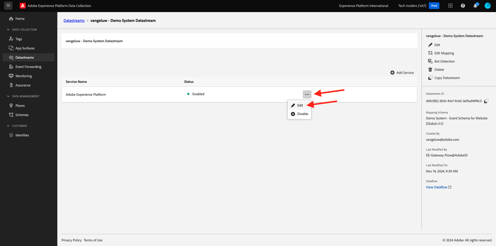

# 1.1.2 Edge Network, datastreams och datainsamling på serversidan

## Kontext

I den här övningen skapar du en **datastream**. En **datastream** anger för Adobe Edge-servrarna var data ska skickas när de har samlats in av Web SDK. Vill du till exempel skicka data till Adobe Experience Platform? Adobe Analytics? Adobe Audience Manager? Adobe Target?

Datastreams hanteras alltid i användargränssnittet i Adobe Experience Platform Data Collection och är viktiga för Adobe Experience Platform datainsamling med Web SDK. Även om du implementerar Web SDK med en tagghanteringslösning som inte är Adobe måste du ändå skapa din datastream i Adobe Experience Platform Data Collection-användargränssnittet.

Du implementerar Web SDK i webbläsaren i nästa övning. Då blir det tydligare för er hur de data som samlas in ser ut. För närvarande berättar vi bara för DataStream var vi ska vidarebefordra data.

## Skapa ett datastream

I [Komma igång](./../../../modules/gettingstarted/gettingstarted/ex2.md) har du redan skapat en datastream, men vi har inte diskuterat bakgrunden och anledningen till att du var med i datastream.

En strömma talar om för Adobe Edge-servrarna var data ska skickas när de har samlats in av Web SDK. Vill du till exempel skicka data till Adobe Experience Platform? Adobe Analytics? Adobe Audience Manager? Adobe Target? Datastreams hanteras i användargränssnittet i Adobe Experience Platform Data Collection och är viktiga för datainsamling med Web SDK, oavsett om du implementerar Web SDK via Adobe Experience Platform Data Collection eller inte.

Vi granskar din **[!UICONTROL Datastream]**:

Gå till [https://experience.adobe.com/launch/](https://experience.adobe.com/launch/).

Klicka på **[!UICONTROL Datastreams]** på den vänstra menyn.

Öppna ditt datastream med namnet `--aepUserLdap-- - Demo System Datastream`.

Då ser du detaljerna om din datastream.

Klicka på **..** bredvid **Adobe Experience Platform** och klicka på **Redigera**.

Då ser du det här. För tillfället har du bara aktiverat Adobe Experience Platform. Konfigurationen ser ut ungefär som i konfigurationen nedan. (Beroende på din miljö och Adobe Experience Platform-instans kan namnet på sandlådan vara ett annat)

Du bör tolka nedanstående fält så här:

För denna datastream...

- Alla data som samlas in lagras i sandlådan `--aepSandboxName--` i Adobe Experience Platform
- Alla Experience Event-data samlas som standard in i datauppsättningen **Demo System - Event Dataset för webbplatsen (Global v1.1)**
- Alla profildata samlas som standard in i datauppsättningen **Demo System - profildatauppsättning för webbplats (Global v1.1)** (Inhämtning av profildata internt med Web SDK stöds för närvarande inte av Web SDK ännu)
- Om du vill använda programtjänsten **Offer decisioning** för det här dataflödet måste du markera rutan för Offer decisioning. (Detta ingår i [Modul 3.3](./../../../modules/ajo-b2c/module3.3/offer-decisioning.md))
- **Edge-segmentering** är aktiverat som standard, vilket innebär att kvalificerande segment utvärderas i kanten vid inkommande trafik
- Om du vill använda **Personalization Destinations** måste du markera kryssrutan för Personalization Destinations.
- 
   - Om du vill använda **Adobe Journey Optimizer** s funktioner i det här dataflödet måste du markera kryssrutan för Adobe Journey Optimizer.

För närvarande behövs ingen annan konfiguration för din datastream.

Nästa steg: [1.1.3 Introduktion till Adobe Experience Platform Data Collection](./ex3.md)

[Gå tillbaka till modul 1.1](./data-ingestion-launch-web-sdk.md)

[Gå tillbaka till Alla moduler](./../../../overview.md)
