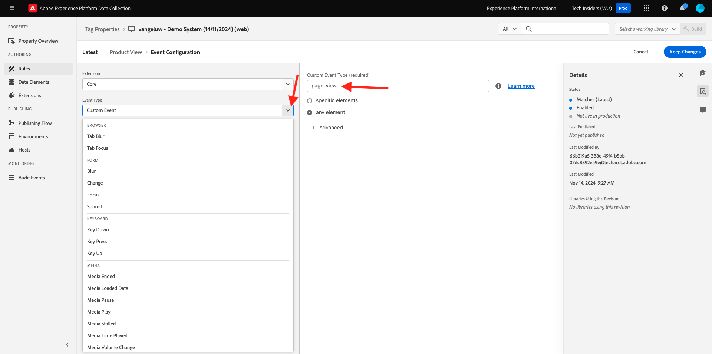

# 1.1.3 Introduktion till Adobe Experience Platform Data Collection

## Kontext

Nu ska vi titta närmare på byggstenarna i Adobe Experience Platform Data Collection för att förstå vad som är installerat på demowebbplatsen. Du kommer närmare titta på Adobe Experience Platform Web SDK Extension, du kommer att konfigurera ett dataelement och en regel och du kommer att lära dig hur du publicerar ett bibliotek.

## Adobe Experience Platform Web SDK-taggtillägg

Ett taggtillägg är en paketerad uppsättning kod som utökar Adobe Experience Platform Data Collection-gränssnittet och biblioteksfunktionerna. Adobe Experience Platform Data Collection är plattformen och taggtillägg fungerar som appar som körs på plattformen. Alla tillägg som används i självstudiekursen skapas och hanteras av Adobe, men tredjepartsleverantörer kan skapa egna tillägg för att begränsa mängden anpassad kod som Adobe Experience Platform Data Collection-användare måste hantera.

Gå till [Adobe Experience Platform Data Collection](https://experience.adobe.com/launch/) och välj **Taggar**.

Det här är egenskapssidan för Adobe Experience Platform Data Collection som du såg tidigare.

I **Komma igång** skapade Demo System två klientegenskaper åt dig: en för webbplatsen och en för mobilappen. Sök efter dem genom att söka efter `--aepUserLdap--` i rutan **[!UICONTROL Search]**.
Klicka för att öppna egenskapen **Webb**.

Därefter visas sidan Egenskapsöversikt. Klicka på **[!UICONTROL Extensions]** i den vänstra listen, klicka på **Adobe Experience Platform Web SDK** och sedan på **[!UICONTROL Configure]**.

Välkommen till Adobe Experience Platform Web SDK! Här kan du konfigurera tillägget med den dataström du skapade i [Komma igång](./../../../modules/gettingstarted/gettingstarted/ex2.md) samt en mer avancerad konfiguration.

Standardkantdomänen är alltid **edge.adobedc.net**. Om du har implementerat en CNAME-konfiguration i din Adobe Experience Cloud- eller Adobe Experience Platform-miljö måste du uppdatera **[!UICONTROL Edge Domain]**.

Om din instans edge domain inte är samma som standard uppdaterar du edge domain här. Om du inte är säker använder du standarddomänen. En edge-domän gör det möjligt att konfigurera en första part-spårningsserver, som sedan använder en CNAME-konfiguration i serverdelen för att säkerställa att data samlas in i Adobe.

Under **[!UICONTROL Datastreams]** har du redan valt ditt datastream i avsnittet **Komma igång**. Du har valt följande datastream: `--aepUserLdap-- - Demo System Datastream`, från listan i rutan **[!UICONTROL Datastream]**, för varje miljö.

Klicka på **[!UICONTROL Save]** för att gå tillbaka till vyn Tillägg.

## Dataelement

Dataelement är byggstenarna för dataordlistan (eller datamappningen). Använd dataelement för att samla in, ordna och leverera data över marknadsförings- och annonseringsteknologier.

Ett enskilt dataelement är en variabel vars värde kan mappas till frågesträngar, URL:er, cookie-värden, JavaScript-variabler osv. Du kan referera till det här värdet med hjälp av dess variabelnamn i Adobe Experience Platform Data Collection. Den här samlingen dataelement blir en ordbok med definierade data som du kan använda för att skapa regler (händelser, villkor och åtgärder). Den här dataordlistan delas av alla Adobe Experience Platform Data Collection för användning med alla tillägg som du har lagt till i din egenskap.

Du kommer nu att redigera ett befintligt dataelement i ett format som passar för Web SDK.

Klicka på Dataelement i den vänstra listen för att gå till sidan Dataelement.

>[!NOTE]
>
>Du redigerar bara ett dataelement i den här övningen, men du kan se knappen **[!UICONTROL Add Data Element]** på den här sidan, som skulle användas för att lägga till en ny variabel i dataordlistan. Detta kan sedan användas i hela Adobe Experience Platform Data Collection. Se gärna vilka andra dataelement som redan finns, huvudsakligen med hjälp av lokal lagring som datakälla.

Skriv **XDM - produktvy** i sökfältet och klicka på det dataelement som returneras.

På den här skärmen visas XDM-objektet som du ska redigera. Experience Data Model (XDM) är ett koncept som kommer att utforskas mycket mer i den här tekniska självstudiekursen, men för närvarande räcker det att förstå att det är det format som Adobe Experience Platform Web SDK kräver. Du kommer att lägga till lite mer information till de data som samlas in på artikelsidorna på demowebbplatsen.

Klicka på plusknappen bredvid **webb** längst ned i trädet.

Klicka på plusknappen bredvid **webPageDetails**.

Klicka på **siteSection**. Du ser nu att **siteSection** inte är länkad till något dataelement än. Låt oss ändra på det.

Rulla uppåt och ange texten `%Product Category%`. Klicka på **[!UICONTROL Save]**.

Nu är Adobe Experience Platform Web SDK Extension installerat och du har uppdaterat ett dataelement för att samla in data mot en XDM-struktur. Nu ska vi kontrollera reglerna som skickar data vid rätt tidpunkt.

## Regler

Adobe Experience Platform Data Collection är ett regelbaserat system. Den söker efter användarinteraktion och associerade data. När villkoren som beskrivs i reglerna är uppfyllda utlöser regeln det tillägg, skript eller den klientkod som du identifierade.

Bygg regler för att integrera data och funktionalitet i marknadsförings- och annonseringsteknologier som förenar olika produkter i en enda lösning.

Låt oss dela upp regeln som skickar data på artikelsidor.

Klicka på **[!UICONTROL Rules]** i den vänstra listen.

**[!UICONTROL Search]** för `Product View`.

Klicka på regeln som returneras.

Låt oss titta på de enskilda elementen som utgör den här regeln.

För alla regler: Om en angiven **[!UICONTROL Event]** inträffar utvärderas **[!UICONTROL Conditions]**, utförs den angivna **[!UICONTROL Actions]** om det behövs.

Klicka på händelsen **Core - Custom Event**. Det här är vyn som läses in.

Klicka på listrutan **Händelsetyp**.

Här visas några av de standardinteraktioner som du kan använda för att signalera till Adobe Experience Platform Data Collection att köra åtgärderna om villkoren är uppfyllda.

Klicka på **[!UICONTROL Cancel]** för att gå tillbaka till regeln.

Klicka på händelsen **Skicka &quot;produktvy&quot; för åtgärden**.

Här ser du de data som skickas till utkanten av Adobe Experience Platform Web SDK. Mer specifikt används **alloy** **[!UICONTROL Instance]** för Web SDK. Händelsen **[!UICONTROL Type]** är inställd på **Commerce produktvy (kundvagn)** och de XDM-data som du skickar är det **XDM - produktvy** -dataelement som du ändrade tidigare.

Nu när du tittar på regeln kan du publicera alla ändringar i Adobe Experience Platform Data Collection.

## Publish i ett bibliotek

Slutligen, för att kunna validera regeln och dataelementet som du just har uppdaterat måste du publicera ett bibliotek som innehåller de redigerade objekten i vår egenskap. Du måste utföra några snabba steg i avsnittet **[!UICONTROL Publishing]** i Adobe Experience Platform Data Collection.

Klicka på **[!UICONTROL Publishing Flow]** i den vänstra navigeringen

Klicka på det befintliga biblioteket med namnet **Main**.

Klicka på knappen **Lägg till alla ändrade resurser** . Nästa,
Klicka på knappen **Spara och bygg för utveckling**.

Det kan ta några minuter att skapa biblioteket och när det är klart visas en grön punkt till vänster om biblioteksnamnet.

Som du ser på skärmen Publiceringsflöde finns det mycket mer att göra med publiceringsprocessen i Adobe Experience Platform Data Collection som ligger utanför kursens räckvidd. Vi kommer bara att använda ett enda bibliotek i vår utvecklingsmiljö.

Nästa steg: [1.1.4 Webbdatainsamling på klientsidan](./ex4.md)

[Gå tillbaka till modul 1.1](./data-ingestion-launch-web-sdk.md)

[Gå tillbaka till Alla moduler](./../../../overview.md)
