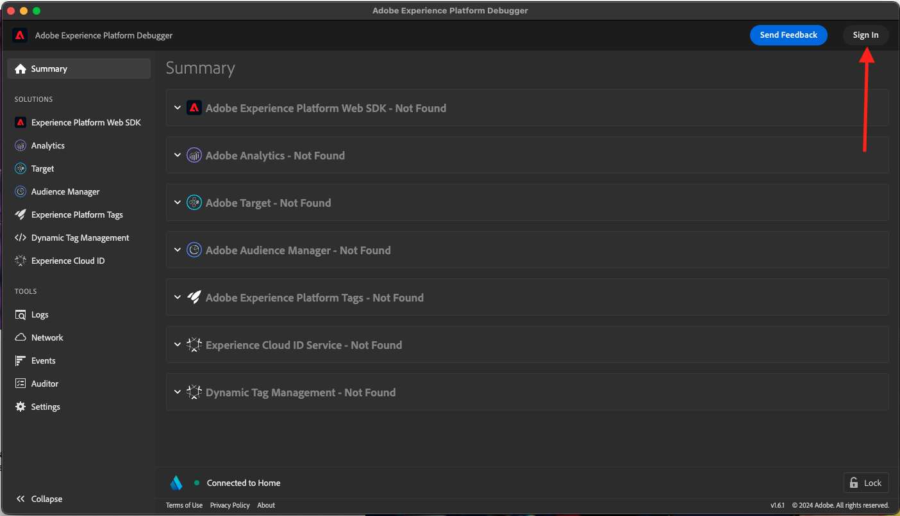
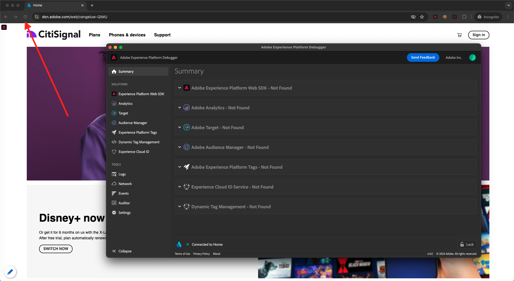

# 1.1.4 Webbdatainsamling på klientsidan

## 1.1.4.1 Validera data i begäran

### Installera Adobe Experience Platform Debugger

Felsökaren Experience Platform är ett tillägg för Chrome- och Firefox-webbläsare som gör det enklare att se hur Adobe-tekniken används på dina webbsidor. Installera versionen för den webbläsare du föredrar:

- [Firefox-tillägg](https://addons.mozilla.org/sv-SE/firefox/addon/adobe-experience-platform-dbg/)

- [Chrome-tillägg](https://chrome.google.com/webstore/detail/adobe-experience-platform/bfnnokhpnncpkdmbokanobigaccjkpob)

Om du aldrig har använt Felsökning tidigare - och den här är en annan än den tidigare Adobe Experience Cloud Debugger - kan du titta på den här fem minuter långa översiktsvideon:

>[!VIDEO](https://video.tv.adobe.com/v/32156?quality=12&learn=on)

Eftersom du läser in demowebbplatsen i inkognito-läge måste du se till att Experience Platform Debugger även är tillgänglig i inkognito-läge. Om du vill göra det går du till **chrome://extensions** i webbläsaren och öppnar felsökningstillägget Experience Platform.

Kontrollera att dessa två inställningar är aktiverade:

- Utvecklarläge
- Tillåt inkognitiv

### Öppna demowebbplatsen

Gå till [https://dsn.adobe.com](https://dsn.adobe.com). När du har loggat in med din Adobe ID ser du det här. Klicka på de tre punkterna **..** i webbplatsprojektet och klicka sedan på **Kör** för att öppna det.

Du kommer då att se din demowebbplats öppnas. Markera URL-adressen och kopiera den till Urklipp.

Öppna ett nytt inkognito-webbläsarfönster.

Klistra in webbadressen till demowebbplatsen, som du kopierade i föregående steg. Du ombeds sedan logga in med din Adobe ID.

Välj kontotyp och slutför inloggningsprocessen.

Därefter visas webbplatsen i ett inkognitivt webbläsarfönster. För varje demonstration måste du använda ett nytt, inkognitivt webbläsarfönster för att läsa in webbadressen till demowebbplatsen.

### Använd Experience Platform Debugger för att se samtalen till Edge

Kontrollera att demowebbplatsen är öppen och klicka på Experience Platform-ikonen för felsökningstillägget.

Felsökaren öppnas och visar information om implementeringen som har skapats i Adobe Experience Platform Data Collection Property. Kom ihåg att du felsöker tillägget och reglerna som du just har redigerat.

Klicka på knappen **[!UICONTROL Sign In]** överst till höger för att autentisera. Om du redan har en webbläsarflik öppen med Adobe Experience Platform Data Collection-gränssnittet kommer autentiseringssteget att vara automatiskt och du behöver inte ange ditt användarnamn och lösenord igen.

Du loggas sedan in i Felsökning.

Klicka på knappen för att ladda om på demowebbplatsen för att ansluta felsökaren till den specifika fliken.

Bekräfta att felsökaren är **[!UICONTROL Connected to Home]** enligt bilden ovan och klicka sedan på ikonen **[!UICONTROL lock]** för att låsa felsökaren till demowebbplatsen. Om du inte gör detta fortsätter felsökaren att växla för att visa implementeringsinformationen på den webbläsarflik som är i fokus, vilket kan vara förvirrande. När felsökaren är låst ändras ikonen till **Lås upp**.

Gå sedan till valfri sida på demowebbplatsen, till exempel kategorisidan **Planer**.

Klicka nu på **[!UICONTROL Experience Platform Web SDK]** i den vänstra navigeringen för att visa **[!UICONTROL Network Requests]**.

Varje begäran innehåller en **[!UICONTROL events]**-rad.

Klicka för att öppna en **[!UICONTROL events]**-rad. Observera hur du kan se händelsen **web.webpagedetails.pageViews** samt andra variabler som inte finns i kartongen och som följer formatet **Web SDK ExperienceEvent XDM**.

Den här typen av förfrågningsinformation visas också på fliken Nätverk. Filtrera efter förfrågningar med **interact** för att hitta förfrågningar som skickats av Web SDK. Du hittar all information om XDM-nyttolasten i avsnittet Nyttolast:

Nästa steg: [1.1.5 Implementera Adobe Analytics och Adobe Audience Manager](./ex5.md)

[Gå tillbaka till modul 1.1](./data-ingestion-launch-web-sdk.md)

[Gå tillbaka till Alla moduler](./../../../overview.md)
