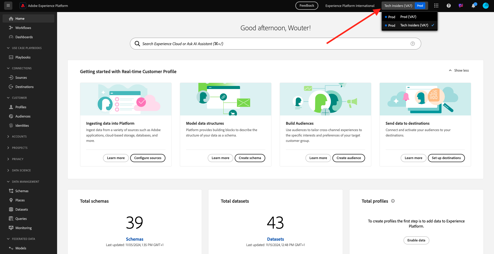

# 1.1.7 XDM-schemakrav i Adobe Experience Platform

För att säkerställa att Web SDK och alloy.js kan importera data till Adobe Experience Platform finns det ett krav på att en specifik XDM-mixin ska ingå i XDM-schemat i Adobe Experience Platform.

Gå till [https://experience.adobe.com/platform](https://experience.adobe.com/platform) och logga in.

När du har loggat in väljer du lämplig sandlåda genom att klicka på texten **Produktionsprodukt** på den blå raden ovanför skärmen. Markera sandlådan `--aepSandboxName--`.

När du har valt sandlådan ser du skärmändringen och nu befinner du dig i sandlådan.

Gå till **Scheman** på den vänstra menyn och öppna **Demo System - Event Schema för webbplats (Global v1.1)** Schema.

I det schemat ser du att fältgruppen **AEP Web SDK ExperienceEvent Mixin** har lagts till. Den här fältgruppen lägger till alla minimalt obligatoriska fält i schemat. Alla Experience Event Schema i Adobe Experience Platform som ska användas av Web SDK kräver alltid att fältgruppen är en del av schemat.

I [Modul 1.2](./../module1.2/data-ingestion.md) får du lära dig att lägga till fältgrupper i scheman.

Nästa steg: [Sammanfattning och förmåner](./summary.md)

[Gå tillbaka till modul 1.1](./data-ingestion-launch-web-sdk.md)

[Gå tillbaka till Alla moduler](./../../../overview.md)
