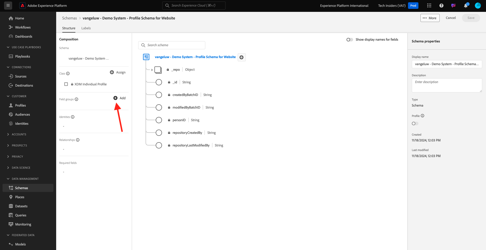
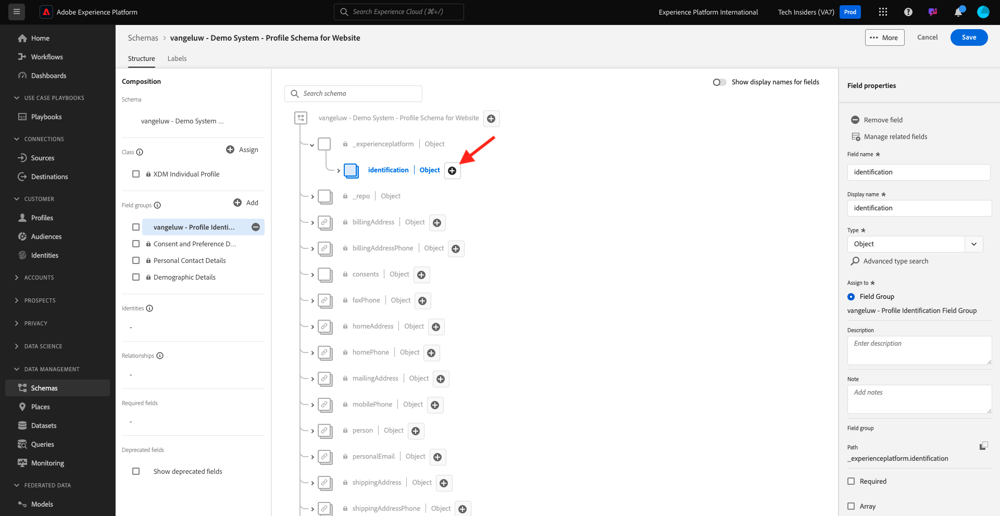
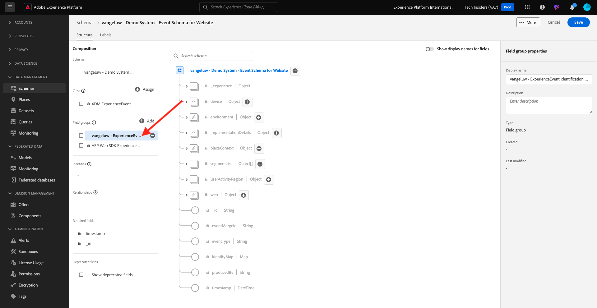

# 1.2.2 Konfigurera scheman och ange identifierare

I den här övningen ska du granska konfigurationen av de XDM-scheman som krävs för att klassificera profilinformation och kundbeteende. I varje XDM-schema ser du även att en primär identifierare har definierats för att länka all kundrelaterad information till.

## Artikel

Innan du börjar konfigurera XDM-scheman och definierar identifierare måste du tänka på företagskontexten för det vi försöker göra:

- Du vill ha data
- Du vill länka data till en kund
- Du vill skapa en progressiv kundprofil i realtid

Det finns två typer av data som vi vill hämta:

- Vem är den här kunden?
- Vad gör den här kunden?

Frågan **Vem är den här kunden?** är en mycket öppen fråga som har många svar. När din organisation vill få svar på den här frågan letar du efter demografisk information som Förnamn, Efternamn och Adress. Men även för kontaktinformation som e-postadress eller mobiltelefonnummer. Och även för information som är länkad till Språk kan du välja OptIn/OptOut och till och med Profile Pictures. Och slutligen, vad ni verkligen behöver veta, är hur vi kommer att identifiera den här kunden i de olika system som er organisation använder.

Samma sak gäller frågan **Vad gör den här kunden?**. Det är en mycket öppen fråga med många svar. När organisationen vill få svar på den här frågan letar ni efter någon interaktion som kunden har haft med era online- och offlinetillgångar. Vilka sidor eller produkter har besökts? Har den här kunden lagt till en produkt i kundvagnen eller till och med köpt en artikel? Vilken enhet och webbläsare har använts för att bläddra på webbplatsen? Vilken typ av information söker den här kunden och hur kan vi använda den för att konfigurera och leverera en bra upplevelse till den här kunden? Och slutligen, vad vi verkligen behöver veta, är hur vi kommer att identifiera den här kunden i de olika system som er organisation kommer att använda.

## Vem är den här kunden?

Hämtar svaret till **Vem är den här kunden?** för din organisation görs via inloggnings-/registreringssidan.

Från ett schemaperspektiv ser vi detta som en **klass**. Frågan: **Vem är den här kunden?** är något som vi definierar i klassen **[!UICONTROL XDM Individual Profile]**.

Så när du skapar ett XDM-schema för att hämta svaret till **Vem är den här kunden?** först och främst måste du skapa och definiera 1 schema som refererar till klassen **[!UICONTROL XDM Individual Profile]**.

Om du vill ange vilken typ av svar som kan ges på den frågan måste du definiera [!UICONTROL Field Groups]. [!UICONTROL Field Groups] är tillägg till klassen Profile och har mycket specifika konfigurationer. Demografisk information som Förnamn, Efternamn, Kön och Födelsedag ingår till exempel i [!UICONTROL Field Group]: **[!UICONTROL Demographic Details]**.

För det andra måste organisationen bestämma hur kunden ska identifieras. När det gäller din organisation kan den huvudsakliga identifieraren för en känd kund vara ett specifikt kund-ID, till exempel en e-postadress. Men tekniskt sett finns det andra sätt att identifiera en kund på din organisation, som att använda ett mobiltelefonnummer.
I det här labbet definierar vi e-postadressen som primär identifierare och telefonnumret som en sekundär identifierare.

Slutligen är det viktigt att skilja på vilken kanal som data hämtades från. I det här fallet ska vi prata om webbplatsregistreringar och schemat som måste definieras måste återspegla **var** registreringsdata hämtades. Kanalen kommer också att ha en viktig roll när det gäller att påverka vilka data som hämtas. Därför är det en god vana att definiera scheman för varje kombination av kanal, primär identifierare och typ av data som samlas in.

Baserat på ovanstående har scheman skapats i Adobe Experience Platform.

Logga in på Adobe Experience Platform via följande URL: [https://experience.adobe.com/platform](https://experience.adobe.com/platform).

När du har loggat in loggar du in på Adobe Experience Platform hemsida.

Innan du fortsätter måste du välja en **sandlåda**. Sandlådan som ska markeras har namnet ``--aepSandboxName--``. Du kan göra detta genom att klicka på texten **[!UICONTROL Production Prod]** i den blå raden ovanför skärmen. När du har valt rätt sandlåda ser du skärmändringen och nu befinner du dig i din dedikerade sandlåda.

Klicka på **[!UICONTROL Schemas]** på menyn till vänster på skärmen i Adobe Experience Platform. Du ser listan över tillgängliga [!UICONTROL Schemas].

Du bör skapa ett nytt schema. Om du vill skapa ett nytt schema klickar du på **[!UICONTROL + Create Schema]**.

Välj **Manuell** och klicka på **Markera**.

Välj sedan **Enskild profil** och klicka på **Nästa**.

Ange schemats namn så här: `--aepUserLdap-- - Demo System - Profile Schema for Website`. Klicka på **Slutför**.

Ett nytt schema har skapats.

Nu måste du definiera vilket svar på frågan **Vem är den här kunden?** ska se ut som.
I inledningen av labbet noterade vi att det fanns behov av följande attribut för att definiera en kund:

- Demografisk information som förnamn, efternamn och adress
- Kontaktinformation som hemadress, e-postadress eller mobiltelefonnummer
- Annan information länkad till Språk, OptIn/OptOut och kanske även profilbilder.
- Primär identifierare för en kund

Om du vill göra den informationen till en del av ditt schema måste du lägga till följande [!UICONTROL Field Groups] i ditt schema:

- Demografiska detaljer (demografiska uppgifter)
- Kontaktuppgifter (kontaktinformation)
- Information om samtycke och inställningar (annan information)
- din organisations anpassade profilidentifieringsfältgrupp (primära och sekundära identifierare)

Klicka på knappen **+Lägg till** under **Fältgrupper**.

På skärmen **[!UICONTROL Add Field Group]** väljer du [!UICONTROL Field Group] **[!UICONTROL Demographic Details]**, **[!UICONTROL Personal Contact Details]** och **[!UICONTROL Consent and Preference Details]**.

Klicka på knappen **[!UICONTROL Add Field Groups]** för att lägga till [!UICONTROL Field Group] i ditt schema.

Nu får du den här:

Därefter behöver du en ny [!UICONTROL Field Group] för att hämta **[!UICONTROL Identifier]** som används för datainsamling. Som du har sett i föregående övning finns det ett koncept för identifierare. En primär identifierare är den viktigaste eftersom alla insamlade data länkas till den här identifieraren.

Du kommer nu att skapa din egen anpassade [!UICONTROL Field Group] och därför kommer du att utöka [!UICONTROL XDM Schema] för att uppfylla din egen organisations krav.

Klicka på **[!UICONTROL + Add]** under **Fältgrupper** för att börja lägga till en [!UICONTROL Field Group].

I stället för att återanvända en befintlig [!UICONTROL Field Group] skapar du nu en egen [!UICONTROL Field Group]. Du kan göra det genom att välja **[!UICONTROL Create New Field Group]**.

Du måste nu ange **[!UICONTROL Display Name]** och **[!UICONTROL Description]** för din nya [!UICONTROL Field Group].

Vi kommer att använda det här som namn för vårt schema:
`--aepUserLdap-- - Profile Identification Field Group`

Klicka på knappen **[!UICONTROL Add Field Groups]** för att lägga till den nya [!UICONTROL Field Group] i ditt schema.

Du har nu den här schemastrukturen på plats.

Din nya [!UICONTROL Field Group] är fortfarande tom, så nu måste du lägga till fält i [!UICONTROL Field Group].
Klicka på din anpassade [!UICONTROL Field Group] i listan [!UICONTROL Field Group].

Nu visas ett antal nya knappar.

Klicka på knappen **[!UICONTROL + Add Field]** på den översta nivån i schemat.

När du har klickat på knappen **[!UICONTROL + Add Field]** visas nu ett nytt namnlöst fält i ditt schema.

Nu bör du ange informationen i det nya fältet med följande objektdefinitioner:

- Fältnamn: **[!UICONTROL identification]**
- Visningsnamn: **[!UICONTROL identification]**
- Typ: **[!UICONTROL Object]**
- Fältgrupp: **`--aepUserLdap-- - Profile Identification Field Group`**

Klicka på **Använd**.

Du kommer nu att se ett nytt objekt i ditt schema, som representerar en anpassad **[!UICONTROL object]** i schemat och som har fått namn efter ditt Adobe Experience Platform Klient-ID. Klient-ID:t för Adobe Experience Platform är `--aepTenantId--` och det är unikt för alla AEP-instanser.

Du kommer nu att lägga till tre nya fältobjekt under den innehavaren i det **identifiering** -objekt som du just har skapat. Om du vill börja lägga till var och en av dessa tre fält klickar du på **+-ikonen** under **identifiering** för varje fält.

Använd informationen nedan för att skapa de tre nya fälten under objektet **[!UICONTROL identification]**:

- ecid:
   - Fältnamn: **[!UICONTROL ecid]**
   - Visningsnamn: **[!UICONTROL ecid]**
   - Typ: **[!UICONTROL String]**
   - Fältgrupp: **`--aepUserLdap-- - Profile Identification Field Group`**

- emailId
   - Fältnamn: **[!UICONTROL emailId]**
   - Visningsnamn: **[!UICONTROL emailId]**
   - Typ: **[!UICONTROL String]**
   - Fältgrupp: **`--aepUserLdap-- - Profile Identification Field Group`**

- mobiltelefon
   - Fältnamn: **[!UICONTROL mobilenr]**
   - Visningsnamn: **[!UICONTROL mobilenr]**
   - Typ: **[!UICONTROL String]**
   - Fältgrupp: **`--aepUserLdap-- - Profile Identification Field Group`**

Så här ska varje fält se ut efter den ursprungliga fältkonfigurationen.

- mobiltelefon

Om du vill spara fältet rullar du nedåt i **[!UICONTROL Field Properties]** tills du ser knappen **[!UICONTROL Apply]**. Klicka på knappen **[!UICONTROL Apply]**.

- ecid

Glöm inte att rulla nedåt och klicka på **Använd**.

- emailId

Glöm inte att rulla nedåt och klicka på **Använd**.

Varje fält definieras som typen **[!UICONTROL String]** och du konfigurerar nu dessa fält som **[!UICONTROL Identities]**. För det här schemat antar vi att en kund alltid identifieras av sin e-postadress, vilket innebär att du måste konfigurera fältet **[!UICONTROL emailId]** som en **[!UICONTROL primary]**-identifierare och de andra fälten som vanliga identifierare.

Dina tre fält måste nu definieras som **[!UICONTROL Identity]**-fält.

Så här definierar du de här fälten som **[!UICONTROL Identity]**-fält:

- Markera fältet **[!UICONTROL emailId]**.
- Till höger i fältegenskaperna rullar du nedåt tills du ser **[!UICONTROL Identity]**. Markera kryssrutan för **[!UICONTROL Identity]**.

- Markera kryssrutan för **[!UICONTROL Primary Identity]**.

- Välj sedan namnområdet **[!UICONTROL Email]** i listan med **[!UICONTROL Namespaces]**. Ett namnutrymme används av identitetsdiagrammet i Adobe Experience Platform för att klassificera identifierare i namnutrymmen och definiera relationen mellan dessa namnutrymmen. Klicka på **[!UICONTROL Apply]** om du vill spara ändringarna.

Därefter måste du definiera de andra fälten för **[!UICONTROL ecid]** och **[!UICONTROL mobilenr]** som standardidentifierare.

Markera fältet **[!UICONTROL ecid]**. Till höger i fältegenskaperna rullar du nedåt tills du ser **[!UICONTROL Identity]**. Markera kryssrutan för **[!UICONTROL Identity]**.
Välj sedan namnområdet **[!UICONTROL ECID]** i listan med **[!UICONTROL Namespaces]**.
Klicka på **[!UICONTROL Apply]** om du vill spara ändringarna.

Markera fältet **[!UICONTROL mobilenr]**. Till höger i fältegenskaperna rullar du nedåt tills du ser **[!UICONTROL Identity]**. Markera kryssrutan för **[!UICONTROL Identity]**.
Markera namnområdet **[!UICONTROL Phone]** i listan med **[!UICONTROL Namespaces]**.
Klicka på **[!UICONTROL Apply]** om du vill spara ändringarna.

Objektet **[!UICONTROL identification]** ska nu se ut så här, med de tre ID-fälten som nu även visar en **[!UICONTROL fingerprint]** -ikon för att visa att de har definierats som identifierare.

Klicka på **[!UICONTROL Save]** om du vill spara ändringarna.

Det sista du bör göra här är att aktivera schemat som ska länkas till **[!UICONTROL Profile]**.
Genom att aktivera ditt schema för profil ser du till att alla data som skickas till Adobe Experience Platform mot det här schemat blir en del av kundprofilmiljön i realtid, vilket ser till att alla dessa data kan användas i realtid för frågor, segmentering och aktivering.

Markera schemats namn för att göra detta.

Klicka på **[!UICONTROL Profile toggle]** på den högra fliken i schemat, som för närvarande är inaktiverad.

Aktivera [!UICONTROL Profile] - växla genom att klicka på den.

Klicka på **[!UICONTROL Enable]** om du vill aktivera det här schemat för profil.

Schemat är nu konfigurerat att ingå i [!UICONTROL Real-time Customer Profile]. Klicka på **[!UICONTROL Save]** för att spara ditt schema.

### Vad gör en kund?

Hämtar svaret på frågan **Vad gör den här kunden?** för din organisation görs via till exempel en produktvy på en produktsida.

Från ett schemaperspektiv ser vi det här som en **[!UICONTROL Class]**. Frågan: **Vad gör den här kunden?** är något som vi har definierat i klassen **[!UICONTROL ExperienceEvent]**.

Så när du skapar en [!UICONTROL XDM Schema] att hämta svaret på **Vad gör den här kunden?** först och främst måste du skapa och definiera 1 schema som refererar till klassen **[!UICONTROL ExperienceEvent]**.

Om du vill ange vilken typ av svar som kan ges på den frågan måste du definiera [!UICONTROL Field Group]. [!UICONTROL Field Groups] är tillägg till klassen [!UICONTROL ExperienceEvent] och har mycket specifika konfigurationer. Information om vilken typ av produkter en kund har visat eller lagt till i kundvagnen ingår i [!UICONTROL Field Group] **Commerce-informationen**.

För det andra måste ni bestämma hur ni ska identifiera kundens beteende. Eftersom vi talar om interaktioner på en webbplats är det möjligt att organisationen känner kunden, men det är lika möjligt att en okänd anonym besökare är aktiv på webbplatsen. Så vi kan inte använda en identifierare som e-postadress. I det här fallet kommer din organisation antagligen att välja att använda [!UICONTROL Experience Cloud ID (ECID)] som primär identifierare.

Slutligen är det viktigt att skilja på vilken kanal som data hämtades från. I det här fallet ska vi prata om webbplatsinteraktioner och schemat som måste definieras måste återspegla **var** interaktionsdata hämtades. Kanalen kommer också att ha en viktig roll när det gäller att påverka vilka data som hämtas. Därför är det en god vana att definiera scheman för varje kombination av kanal, primär identifierare och typ av data som samlas in.

Baserat på ovanstående måste du konfigurera ett schema i Adobe Experience Platform.

När du har loggat in loggar du in på Adobe Experience Platform hemsida.

Innan du fortsätter måste du välja en **[!UICONTROL sandbox]**. [!UICONTROL sandbox] som ska väljas har namnet ``--module2sandbox--``. Du kan göra detta genom att klicka på texten **[!UICONTROL Production Prod]** i den blå raden ovanför skärmen. När du har valt rätt sandlåda ser du skärmändringen och nu befinner du dig i din dedikerade sandlåda.

Klicka på **[!UICONTROL Schemas]** på menyn till vänster på skärmen i Adobe Experience Platform.

Om [!UICONTROL Schemas] visas alla befintliga scheman. Du bör skapa ett nytt schema. Om du vill skapa ett nytt schema klickar du på knappen **[!UICONTROL + Create Schema]**.

Välj **Manuell** och klicka på **Markera**.

Välj **Experience Event** och klicka på **Next**.

Ange ett namn för schemat enligt följande: `--aepUserLdap-- - Demo System - Event Schema for Website`. Klicka på **Slutför**.

Ett nytt schema skapas och du kan konfigurera vilka data som ska samlas in mot det.

Nu måste du definiera vilket svar på frågan **Vad gör den här kunden?** ska se ut som.
I inledningen av labbet noterade vi att det fanns behov av följande attribut för att definiera vad en kund gör:

- Vilka sidor eller produkter har besökts?
- Har den här kunden lagt till en produkt i kundvagnen eller till och med köpt en artikel?
- Vilken enhet och webbläsare har använts för att bläddra på webbplatsen?
- Vilken typ av information söker den här kunden och hur kan vi använda den för att konfigurera och leverera en bra upplevelse till den här kunden?
- Primär identifierare för en kund

Om du vill göra den informationen till en del av ditt schema måste du lägga till följande [!UICONTROL Field Group] i ditt schema:

- AEP Web SDK ExperienceEvent
- din organisations anpassade profilidentifiering [!UICONTROL Field Group]

Klicka på **+ Lägg till** under **Fältgrupper**.

Markera [!UICONTROL Field Group] **[!UICONTROL AEP Web SDK ExperienceEvent]** på skärmen **[!UICONTROL Add Field Group]**. Klicka på **[!UICONTROL Add Field Groups]**.

Då får du den här:

Därefter måste du skapa en ny [!UICONTROL Field Group] för att kunna hämta **[!UICONTROL Identifier]** som används för datainsamling.

Du kommer nu att skapa din egen anpassade [!UICONTROL Field Group] och därför kommer du att utöka [!UICONTROL XDM Schema] för att uppfylla din egen organisations krav.

En [!UICONTROL Field Group] är länkad till en [!UICONTROL Class], vilket innebär att du inte kan återanvända den [!UICONTROL Field Group] som skapades tidigare.

Klicka på knappen **[!UICONTROL + Add]** för att börja lägga till en [!UICONTROL Field Group].

I stället för att återanvända en befintlig [!UICONTROL Field Group] skapar du nu en egen [!UICONTROL Field Group]. Välj **[!UICONTROL Create New Field Group]** och ange namnet på fältgruppen, så här: `--aepUserLdap-- - ExperienceEvent Identification Field Group`.
Klicka på **Lägg till fältgrupper**

Du bör nu ha den här [!UICONTROL Schema]-strukturen på plats.

Din nya [!UICONTROL Field Group] är fortfarande tom, så nu måste du lägga till fält i den fältgruppen.
Klicka på din anpassade [!UICONTROL Field Group] i listan [!UICONTROL Field Group].

Nu visas ett antal nya knappar.

Klicka på knappen **[!UICONTROL +]** bredvid schemanamnet på den översta nivån i schemat.

När du har klickat på knappen **+** visas nu ett nytt namnlöst fält i ditt schema.

Använd detta för att definiera ditt nya fält:

- Fältnamn: **[!UICONTROL identification]**
- Visningsnamn: **[!UICONTROL identification]**
- Typ: **[!UICONTROL Object]**
- Fältgrupp: `--aepUserLdap-- - ExperienceEvent Identification Field Group`

Klicka på **Använd**.

Ditt nya fält skapas nu under ditt Adobe Experience Platform Klient-ID. Ditt Adobe Experience Platform-klient-ID är `--aepTenantId--`.

Du lägger nu till 1 nytt fält under objektet **[!UICONTROL identification]**.

Klicka på knappen **[!UICONTROL +]** bredvid objektet **[!UICONTROL identification]** för att skapa ett nytt fält.

ECID-fältet definieras som typen **[!UICONTROL String]** och du konfigurerar det här fältet som en **[!UICONTROL Identity]**. För schemat **[!UICONTROL Demo System - Event Schema for Website]** antar vi att en kund alltid identifieras av sin [!UICONTROL ECID], vilket innebär att du måste konfigurera fältet **[!UICONTROL ECID]** som en **primär**-identifierare

Du har nu ett tomt fält. Du måste konfigurera fältet ovan enligt anvisningarna.

- ecid:

   - Fältnamn: **[!UICONTROL ecidweb]**
   - Visningsnamn: **[!UICONTROL ecidweb]**
   - Typ: **[!UICONTROL String]**
   - Fältgrupp: `--aepUserLdap-- - ExperienceEvent Identification Field Group`

Så här ska fältet [!UICONTROL ecid] se ut efter din ursprungliga fältkonfiguration:

Rulla ned och klicka på **[!UICONTROL Apply]**.

Du har nu ett nytt fält, men det här fältet har inte definierats som ett **[!UICONTROL Identity]**-fält än.

Om du vill börja definiera dessa fält som **[!UICONTROL Identity]**-fält markerar du fältet **[!UICONTROL ecid]**.
Till höger i fältegenskaperna rullar du nedåt tills du ser **[!UICONTROL Identity]**. Markera kryssrutan för **[!UICONTROL Identity]** och markera kryssrutan för **[!UICONTROL Primary Identity]**.
Markera namnområdet **[!UICONTROL ECID]** i listan med **[!UICONTROL Namespaces]**.

Klicka på **[!UICONTROL Apply]** om du vill spara ändringarna.

Objektet **[!UICONTROL identification]** ska nu se ut så här, med det eke-fältet som nu även visar en **fingerprint** -ikon som visar att de har definierats som identifierare.
Klicka på **[!UICONTROL Save]** om du vill spara ändringarna.

Det är viktigt att komma ihåg att när data hämtas till det här schemat så behövs vissa fält.
Fälten **[!UICONTROL _id]** och **[!UICONTROL timestamp]** är till exempel obligatoriska fält.

- _id måste innehålla ett unikt ID för en specifik datainmatning
- tidsstämpeln måste vara tidsstämpeln för den här träffen, i formatet **[!UICONTROL "YYYY-MM-DDTHH:MM:SSSZ"]**, till exempel: **[!UICONTROL "2024-11-18T07:20:000Z"]**

Du har nu definierat ett schema, länkat befintligt och nyligen skapat [!UICONTROL Field Groups] och definierat identifierare.

Det sista du bör göra här är att aktivera schemat som ska länkas till **[!UICONTROL Profile]**.
Genom att aktivera ditt schema för [!UICONTROL Profile] ser du till att alla data som skickas till Adobe Experience Platform mot det här schemat blir en del av kundprofilen i realtid, vilket ser till att alla dessa data kan användas i realtid för frågor, segmentering och aktivering.

Om du vill göra det klickar du på schemats namn.

På den högra fliken i schemat visas en **[!UICONTROL Profile]-växel** som för närvarande är inaktiverad. Klicka på växeln [!UICONTROL Profile] - för att aktivera den.

Du kommer att se det här meddelandet. Klicka på **[!UICONTROL Enable]** om du vill aktivera det här schemat för profil.

Ditt schema är nu konfigurerat att ingå i kundprofilen i realtid.

Klicka på **[!UICONTROL Save]** för att spara ditt schema.

Du har nu skapat scheman som har aktiverats för användning i kundprofilen i realtid.

Låt oss titta på datauppsättningar i nästa övning.

Nästa steg: [1.2.3 Konfigurera datauppsättningar](./ex3.md)

[Gå tillbaka till modul 1.2](./data-ingestion.md)

[Gå tillbaka till Alla moduler](../../../overview.md)
