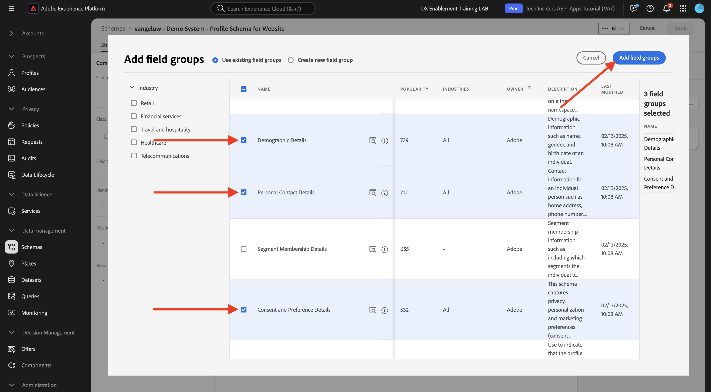
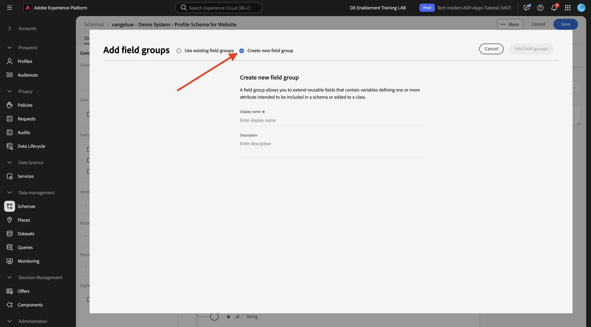
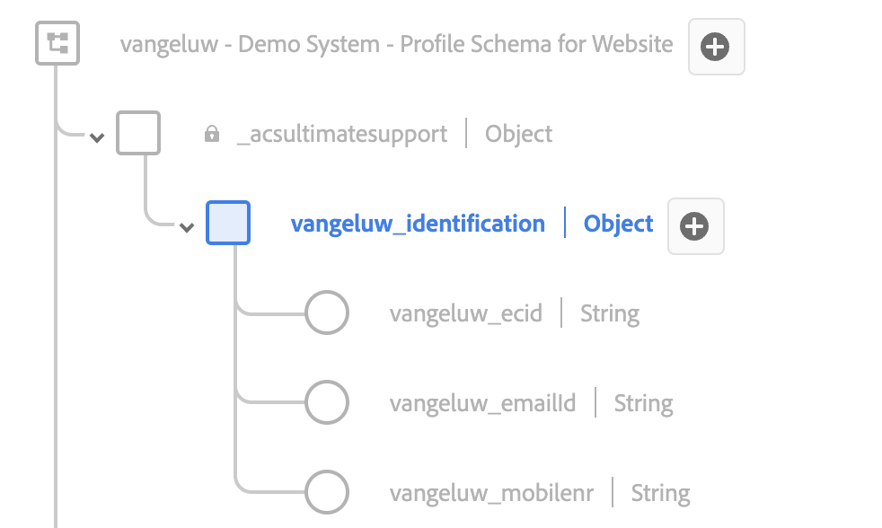
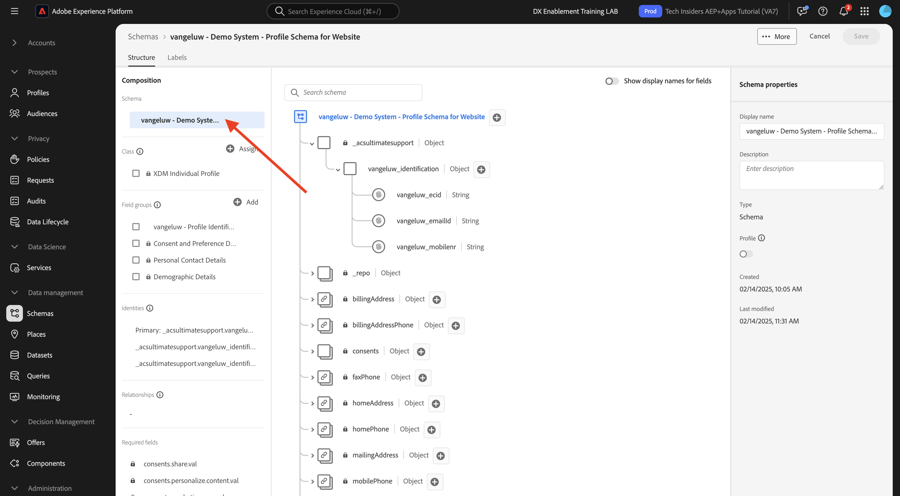

# 1.2.2 Konfigurera scheman och ange identifierare

I den här övningen konfigurerar du de XDM-scheman som krävs för att klassificera profilinformation och kundbeteende. I varje XDM-schema måste du också konfigurera en primär identifierare för att länka all information till.

## Artikel

Innan du börjar konfigurera XDM-scheman och ställer in primära identifierare måste vi tänka på företagskontexten för det vi försöker göra:

- Du vill ha data
- Du vill länka data till en kund
- Du vill skapa en progressiv kundprofil i realtid

Det finns två typer av data som vi vill hämta:

- Vem är den här kunden?
- Vad gör den här kunden?

Frågan **Vem är den här kunden?** är en mycket öppen fråga som har många svar. När ditt företag vill få svar på den här frågan letar du efter demografisk information som Förnamn, Efternamn och Adress. Men även för kontaktinformation som e-postadress eller mobiltelefonnummer. Och även för information som är länkad till Språk kan du välja OptIn/OptOut och till och med Profile Pictures. Och slutligen, vad ni verkligen behöver veta, är hur vi kommer att identifiera den här kunden i de olika system som ert företag använder.

Samma sak gäller frågan **Vad gör den här kunden?**. Det är en mycket öppen fråga med många svar. När ert företag vill få svar på den här frågan letar ni efter någon interaktion som kunden har haft med era online- och offlinetillgångar. Vilka sidor eller produkter har besökts? Har den här kunden lagt till en produkt i kundvagnen eller till och med köpt en artikel? Vilken enhet och webbläsare har använts för att bläddra på webbplatsen? Vilken typ av information söker den här kunden och hur kan vi använda den för att konfigurera och leverera en bra upplevelse till den här kunden? Och slutligen, vad vi verkligen behöver veta, är hur vi kommer att identifiera den här kunden i de olika system som ert företag kommer att använda.

## 1.2.1.1 - Vem är den här kunden

Hämtar svaret till **Vem är den här kunden?** för ditt företag görs via inloggnings-/registreringssidan.

Från ett schemaperspektiv ser vi detta som en **klass**. Frågan: **Vem är den här kunden?** är något som vi definierar i klassen **[!UICONTROL XDM Individual Profile]**.

Så när du skapar ett XDM-schema för att hämta svaret till **Vem är den här kunden?** först och främst måste du skapa och definiera 1 schema som refererar till klassen **[!UICONTROL XDM Individual Profile]**.

Om du vill ange vilken typ av svar som kan ges på den frågan måste du definiera [!UICONTROL Field Groups]. [!UICONTROL Field Groups] är tillägg till klassen Profile och har mycket specifika konfigurationer. Demografisk information som Förnamn, Efternamn, Kön och Födelsedag ingår till exempel i [!UICONTROL Field Group]: **[!UICONTROL Demographic Details]**.

För det andra måste företaget bestämma hur kunden ska identifieras. När det gäller ditt företag kan den huvudsakliga identifieraren för en känd kund vara ett specifikt kund-ID, till exempel en e-postadress. Men tekniskt sett finns det andra sätt att identifiera en kund på företaget, som att använda ett mobiltelefonnummer.
I det här labbet definierar vi e-postadressen som primär identifierare och telefonnumret som en sekundär identifierare.

Slutligen är det viktigt att skilja på vilken kanal som data hämtades från. I det här fallet ska vi prata om webbplatsregistreringar och schemat som måste definieras måste återspegla **var** registreringsdata hämtades. Kanalen kommer också att ha en viktig roll när det gäller att påverka vilka data som hämtas. Därför är det en god vana att definiera scheman för varje kombination av kanal, primär identifierare och typ av data som samlas in.

Baserat på ovanstående måste du konfigurera ett schema i Adobe Experience Platform.

Logga in på Adobe Experience Platform via följande URL: [https://experience.adobe.com/platform](https://experience.adobe.com/platform).

När du har loggat in loggar du in på Adobe Experience Platform hemsida.

Innan du fortsätter måste du välja en **sandlåda**. Sandlådan som ska markeras har namnet ``--module2sandbox--``. Du kan göra detta genom att klicka på texten **[!UICONTROL Production Prod]** i den blå raden ovanför skärmen. När du har valt rätt sandlåda ser du skärmändringen och nu befinner du dig i din dedikerade sandlåda.

Klicka på **[!UICONTROL Schemas]** på menyn till vänster på skärmen i Adobe Experience Platform. Du ser listan över tillgängliga [!UICONTROL Schemas].

Du bör skapa ett nytt schema. Om du vill skapa ett nytt schema klickar du på knappen **[!UICONTROL + Create Schema]** och väljer **[!UICONTROL XDM Individual Profile]**.

När du har klickat på knappen **[!UICONTROL + Create Schema]** skapas ett nytt schema och du uppmanas att välja eller skapa **fältgrupper**.

Nu måste du definiera vilket svar på frågan **Vem är den här kunden?** ska se ut som.
I inledningen av labbet noterade vi att det fanns behov av följande attribut för att definiera en kund:

- Demografisk information som förnamn, efternamn och adress
- Kontaktinformation som hemadress, e-postadress eller mobiltelefonnummer
- Annan information länkad till Språk, OptIn/OptOut och kanske även profilbilder.
- Primär identifierare för en kund

Om du vill göra den informationen till en del av ditt schema måste du lägga till följande [!UICONTROL Field Groups] i ditt schema:

- Demografiska detaljer (demografiska uppgifter)
- Kontaktuppgifter (kontaktinformation)
- Inställningsinformation (övrig information)
- företagets anpassade profilidentifieringsfältgrupp (primära och sekundära identifierare)

På skärmen **[!UICONTROL Add Field Group]** väljer du [!UICONTROL Field Group] **[!UICONTROL Demographic Details]**, **[!UICONTROL Personal Contact Details]** och **[!UICONTROL Preference Details]**.

Klicka på knappen **[!UICONTROL Add Field Groups]** för att lägga till [!UICONTROL Field Group] i ditt schema.

Nu får du den här:

Därefter behöver du en ny [!UICONTROL Field Group] för att hämta **[!UICONTROL Identifier]** som används för datainsamling. Som du har sett i föregående övning finns det ett koncept för primära och sekundära identifierare. En primär identifierare är den viktigaste eftersom alla insamlade data länkas till den här identifieraren.

Du kommer nu att skapa din egen anpassade [!UICONTROL Field Group] och därför kommer du att utöka [!UICONTROL XDM Schema] för att uppfylla ditt företags krav.

Klicka på knappen **[!UICONTROL + Add]** för att börja lägga till en [!UICONTROL Field Group].

I stället för att återanvända en befintlig [!UICONTROL Field Group] skapar du nu en egen [!UICONTROL Field Group]. Du kan göra det genom att välja **[!UICONTROL Create New Field Group]**.

Du måste nu ange **[!UICONTROL Display Name]** och **[!UICONTROL Description]** för din nya [!UICONTROL Field Group].

Vi kommer att använda det här som namn för vårt schema:
`--aepUserLdap-- - Profile Identification Field Group`

För ldap **[!UICONTROL vangeluw]** bör det här till exempel vara schemats namn:

**[!UICONTROL vangeluw - Profile Identification Field Group]**

Det borde ge dig något sådant:

Klicka på knappen **[!UICONTROL Add Field Groups]** för att lägga till den nya [!UICONTROL Field Group] i ditt schema.

Du bör nu ha den här schemastrukturen på plats.

Din nya [!UICONTROL Field Group] är fortfarande tom, så nu måste du lägga till fält i [!UICONTROL Field Group].
Klicka på din anpassade [!UICONTROL Field Group] i listan [!UICONTROL Field Group].

Nu visas ett antal nya knappar.

Klicka på knappen **[!UICONTROL + Add Field]** på den översta nivån i schemat.

När du har klickat på knappen **[!UICONTROL + Add Field]** visas nu en ny **[!UICONTROL object]** i ditt schema. Det här objektet representerar en anpassad **[!UICONTROL object]** i ditt schema och namnges efter ditt Adobe Experience Platform Klient-ID. Ditt Adobe Experience Platform-klient-ID är `--aepTenantId--`.

Du kommer nu att lägga till ett nytt objekt under den klienten. Det gör du genom att klicka på fältet **[!UICONTROL New Field]** under innehavarobjektet.

Använd dessa objektdefinitioner:

- Fältnamn: **[!UICONTROL identification]**
- Visningsnamn: **[!UICONTROL identification]**
- Typ: **[!UICONTROL Object]**

Klicka på **[!UICONTROL Apply]** om du vill spara ändringarna.

När du har klickat på **[!UICONTROL Apply]** ser du nu ditt **[!UICONTROL identification]**-objekt i schemat.

Nu ska du lägga till tre nya fält under objektet **[!UICONTROL identification]**:

- ecid:
   - Fältnamn: **[!UICONTROL ecid]**
   - Visningsnamn: **[!UICONTROL ecid]**
   - Typ: **[!UICONTROL String]**

- emailId
   - Fältnamn: **[!UICONTROL emailId]**
   - Visningsnamn: **[!UICONTROL emailId]**
   - Typ: **[!UICONTROL String]**

- mobiltelefon
   - Fältnamn: **[!UICONTROL mobilenr]**
   - Visningsnamn: **[!UICONTROL mobilenr]**
   - Typ: **[!UICONTROL String]**

Varje fält definieras som typen **[!UICONTROL String]** och vi konfigurerar fälten som **[!UICONTROL Identities]**. För schemat **[!UICONTROL Website Registration Schema]** antar vi att en kund alltid identifieras av sin e-postadress, vilket innebär att du måste konfigurera fältet **[!UICONTROL emailId]** som en **[!UICONTROL primary]**-identifierare och de andra fälten som **[!UICONTROL secondary]**-identifierare.

Om du vill lägga till fälten klickar du på knappen **[!UICONTROL +]** bredvid objektet **[!UICONTROL identification]**.

Du har nu ett tomt fält. Du måste konfigurera de tre fälten ovan enligt indikationen.

Så här ska varje fält se ut efter den ursprungliga fältkonfigurationen.

Klicka på knappen **[!UICONTROL +]** bredvid objektet **[!UICONTROL identification]** för att skapa ett nytt fält och fylla i fälten som anges.

- ecid

Om du vill spara fältet rullar du nedåt i **[!UICONTROL Field Properties]** tills du ser knappen **[!UICONTROL Apply]**. Klicka på knappen **[!UICONTROL Apply]**.

Klicka på knappen **[!UICONTROL +]** bredvid objektet **[!UICONTROL identification]** för att skapa ett nytt fält och fylla i fälten som anges.

- emailId

Om du vill spara fältet rullar du nedåt i **[!UICONTROL Field Properties]** tills du ser knappen **[!UICONTROL Apply]**. Klicka på knappen **[!UICONTROL Apply]**.

Klicka på knappen **[!UICONTROL +]** bredvid objektet **[!UICONTROL identification]** för att skapa ett nytt fält och fylla i fälten som anges.

- mobiltelefon

Om du vill spara fältet rullar du nedåt i **[!UICONTROL Field Properties]** tills du ser knappen **[!UICONTROL Apply]**. Klicka på knappen **[!UICONTROL Apply]**.

Du har nu tre fält, men dessa fält har inte definierats som **[!UICONTROL Identity]**-fält än.

Så här definierar du de här fälten som **[!UICONTROL Identity]**-fält:

- Markera fältet **[!UICONTROL emailId]**.
- Till höger i fältegenskaperna rullar du nedåt tills du ser **[!UICONTROL Identity]**. Markera kryssrutan för **[!UICONTROL Identity]**.

  

- Markera kryssrutan för **[!UICONTROL Primary Identity]**.

  

- Välj sedan namnområdet **[!UICONTROL Email]** i listan med **[!UICONTROL Namespaces]**. Ett namnutrymme används av identitetsdiagrammet i Adobe Experience Platform för att klassificera identifierare i namnutrymmen och definiera relationen mellan dessa namnutrymmen.

  

- Klicka slutligen på **[!UICONTROL Apply]** för att spara ändringarna.

  

Därefter måste du definiera de andra fälten för **[!UICONTROL ecid]** och **[!UICONTROL mobilenr]** som sekundära identifierare.

- Markera fältet **[!UICONTROL ecid]**.
- Till höger i fältegenskaperna rullar du nedåt tills du ser **[!UICONTROL Identity]**. Markera kryssrutan för **[!UICONTROL Identity]**.

  

- Välj sedan namnområdet **[!UICONTROL ECID]** i listan med **[!UICONTROL Namespaces]**. Ett [!UICONTROL Namespace] används av identitetsdiagrammet i Adobe Experience Platform för att klassificera identifierare i namnutrymmen och definiera relationen mellan dessa namnutrymmen.

  

- Klicka på **[!UICONTROL Apply]** om du vill spara ändringarna.

  

- Markera fältet **[!UICONTROL mobilenr]**.
- Till höger i fältegenskaperna rullar du nedåt tills du ser **[!UICONTROL Identity]**. Markera kryssrutan för **[!UICONTROL Identity]**.

  

- Se till att du väljer namnområdet **[!UICONTROL Phone]** i listan med **[!UICONTROL Namespaces]**. Ett namnutrymme används av identitetsdiagrammet i Adobe Experience Platform för att klassificera identifierare i namnutrymmen och definiera relationen mellan dessa namnutrymmen.

  

- Klicka på **[!UICONTROL Apply]** om du vill spara ändringarna.

  

Objektet **[!UICONTROL identification]** ska nu se ut så här, med de tre ID-fälten som nu även visar en **[!UICONTROL fingerprint]** -ikon för att visa att de har definierats som identifierare.

Nu ger vi ditt schema ett namn. Markera fältet **Namnlöst schema**.

Som namn för vårt schema ska du använda följande:

`--aepUserLdap-- - Demo System - Profile Schema for Website`

Ersätt **[!UICONTROL ldap]** med din specifika ldap. För ldap **[!UICONTROL vangeluw]** bör det här till exempel vara schemats namn:

**[!UICONTROL vangeluw - Demo System - Profile Schema for Website]**

Det borde ge dig något sådant:

Du har nu definierat ett schema, länkat befintligt och nyligen skapat [!UICONTROL Field Groups] och definierat identifierare.

Klicka på **[!UICONTROL Save]** om du vill spara ändringarna.

Det sista du bör göra här är att aktivera schemat som ska länkas till **[!UICONTROL Profile]**.
Genom att aktivera ditt schema för profil ser du till att alla data som skickas till Adobe Experience Platform mot det här schemat blir en del av kundprofilmiljön i realtid, vilket ser till att alla dessa data kan användas i realtid för frågor, segmentering och aktivering.

Vi gör detta genom att välja namnet på ditt schema.

På den högra fliken i schemat visas en **[!UICONTROL Profile toggle]** som för närvarande är inaktiverad.

Aktivera [!UICONTROL Profile] - växla genom att klicka på den.

Det här meddelandet visas:

Klicka på **[!UICONTROL Enable]** om du vill aktivera det här schemat för profil.

Schemat är nu konfigurerat att ingå i [!UICONTROL Real-time Customer Profile].

Klicka slutligen på **[!UICONTROL Save]** för att spara schemat.

### 1.2.1.2 - Vad gör den här kunden

Hämtar svaret på frågan **Vad gör den här kunden?** för ditt företag görs via till exempel en produktvy på en produktsida.

Från ett schemaperspektiv ser vi det här som en **[!UICONTROL Class]**. Frågan: **Vad gör den här kunden?** är något som vi har definierat i klassen **[!UICONTROL ExperienceEvent]**.

Så när du skapar en [!UICONTROL XDM Schema] att hämta svaret på **Vad gör den här kunden?** först och främst måste du skapa och definiera 1 schema som refererar till klassen **[!UICONTROL ExperienceEvent]**.

Om du vill ange vilken typ av svar som kan ges på den frågan måste du definiera [!UICONTROL Field Group]. [!UICONTROL Field Groups] är tillägg till klassen [!UICONTROL ExperienceEvent] och har mycket specifika konfigurationer. Information om vilken typ av produkter en kund har visat eller lagt till i kundvagnen ingår i [!UICONTROL Field Group] **Commerce-informationen**.

För det andra måste ert företag bestämma hur ni ska identifiera kundens beteende. Eftersom vi talar om interaktioner på en webbplats är det möjligt att ert företag känner till kunden, men det är lika möjligt att en okänd anonym besökare är aktiv på webbplatsen. Så vi kan inte använda en identifierare som e-postadress. I det här fallet kommer ditt företag antagligen att välja att använda [!UICONTROL Experience Cloud ID (ECID)] som primär identifierare.

Slutligen är det viktigt att skilja på vilken kanal som data hämtades från. I det här fallet ska vi prata om webbplatsinteraktioner och schemat som måste definieras måste återspegla **var** interaktionsdata hämtades. Kanalen kommer också att ha en viktig roll när det gäller att påverka vilka data som hämtas. Därför är det en god vana att definiera scheman för varje kombination av kanal, primär identifierare och typ av data som samlas in.

Baserat på ovanstående måste du konfigurera ett schema i Adobe Experience Platform.

När du har loggat in loggar du in på Adobe Experience Platform hemsida.

Innan du fortsätter måste du välja en **[!UICONTROL sandbox]**. [!UICONTROL sandbox] som ska väljas har namnet ``--module2sandbox--``. Du kan göra detta genom att klicka på texten **[!UICONTROL Production Prod]** i den blå raden ovanför skärmen. När du har valt rätt sandlåda ser du skärmändringen och nu befinner du dig i din dedikerade sandlåda.

Klicka på **[!UICONTROL Schemas]** på menyn till vänster på skärmen i Adobe Experience Platform.

Om [!UICONTROL Schemas] visas alla befintliga scheman.

Du bör skapa ett nytt schema. Om du vill skapa ett nytt schema klickar du på knappen **[!UICONTROL + Create Schema]** och väljer **[!UICONTROL XDM ExperienceEvent]**.

När du har klickat på knappen **[!UICONTROL + Create Schema]** skapas ett nytt schema och du uppmanas att välja eller skapa **fältgrupper**.

Nu måste du definiera vilket svar på frågan **Vad gör den här kunden?** ska se ut som.
I inledningen av labbet noterade vi att det fanns behov av följande attribut för att definiera vad en kund gör:

- Vilka sidor eller produkter har besökts?
- Har den här kunden lagt till en produkt i kundvagnen eller till och med köpt en artikel?
- Vilken enhet och webbläsare har använts för att bläddra på webbplatsen?
- Vilken typ av information söker den här kunden och hur kan vi använda den för att konfigurera och leverera en bra upplevelse till den här kunden?
- Primär identifierare för en kund

Om du vill göra den informationen till en del av ditt schema måste du lägga till följande [!UICONTROL Field Group] i ditt schema:

- Webbinformation
- Information om Commerce
- Miljöinformation
- ditt företags anpassade profilidentifiering [!UICONTROL Field Group] (primära och sekundära identifierare)

På skärmen **[!UICONTROL Add Field Group]** väljer du [!UICONTROL Field Groups] **[!UICONTROL Web Details]**, **[!UICONTROL Commerce Details]** och **[!UICONTROL Environment Details]**.

Klicka på knappen **[!UICONTROL Add Field Groups]** för att lägga till fältgruppen i ditt schema.

Då får du den här:

Därefter måste du skapa en ny [!UICONTROL Field Group] för att kunna hämta **[!UICONTROL Identifier]** som används för datainsamling. Som du har sett i föregående övning finns det ett koncept för primära och sekundära identifierare. En primär identifierare är den viktigaste eftersom alla insamlade data länkas till den här identifieraren.

Du kommer nu att skapa din egen anpassade [!UICONTROL Field Group] och därför kommer du att utöka [!UICONTROL XDM Schema] för att uppfylla ditt företags krav.

En [!UICONTROL Field Group] är länkad till en [!UICONTROL Class], vilket innebär att du inte kan återanvända den [!UICONTROL Field Group] som skapades tidigare.

Klicka på knappen **[!UICONTROL + Add]** för att börja lägga till en [!UICONTROL Field Group].

I stället för att återanvända en befintlig [!UICONTROL Field Group] skapar du nu en egen [!UICONTROL Field Group]. Du kan göra det genom att välja **[!UICONTROL Create New Field Group]**.

Du måste nu ange **[!UICONTROL Display Name]** och **[!UICONTROL Description]** för den nya fältgruppen.

Använd följande som namn för fältgruppen:

`--aepUserLdap-- - ExperienceEvent Identification Field Group`

För ldap **[!UICONTROL vangeluw]** bör det här till exempel vara schemats namn:

**[!UICONTROL vangeluw - ExperienceEvent Identification Field Group]**

Det borde ge dig något sådant:

Klicka på knappen **[!UICONTROL Add Field Group]** för att lägga till den nya [!UICONTROL Field Group] i ditt schema.

Du bör nu ha den här [!UICONTROL Schema]-strukturen på plats.

Din nya [!UICONTROL Field Group] är fortfarande tom, så nu måste du lägga till fält i den fältgruppen.
Klicka på din anpassade [!UICONTROL Field Group] i listan [!UICONTROL Field Group].

Nu visas ett antal nya knappar.

Klicka på knappen **[!UICONTROL +]** bredvid schemanamnet på den översta nivån i schemat.

När du har klickat på knappen **[!UICONTROL +]** visas nu en ny **[!UICONTROL object]** i ditt schema. Det här objektet representerar en anpassad **[!UICONTROL object]** i din [!UICONTROL Schema] och namnges efter ditt Adobe Experience Platform Klient-ID. Ditt Adobe Experience Platform-klient-ID är `--aepTenantId--`.

Du kommer nu att lägga till ett nytt objekt under den klienten. Det gör du genom att klicka på fältet **[!UICONTROL New Field]** under innehavarobjektet.

Använd dessa objektdefinitioner:

- Fältnamn: **[!UICONTROL identification]**
- Visningsnamn: **[!UICONTROL identification]**
- Typ: **[!UICONTROL Object]**

Bläddra nedåt och klicka på **[!UICONTROL Apply]** för att spara ändringarna.

När du har klickat på **[!UICONTROL Apply]** ser du nu ditt **[!UICONTROL identification]**-objekt i schemat.

Du lägger nu till 1 nytt fält under objektet **[!UICONTROL identification]**.

Klicka på knappen **[!UICONTROL +]** bredvid objektet **[!UICONTROL identification]** för att skapa ett nytt fält.

ECID-fältet definieras som typen **[!UICONTROL String]** och du konfigurerar det här fältet som en **[!UICONTROL Identity]**. För schemat **[!UICONTROL Demo System - Event Schema for Website]** antar vi att en kund alltid identifieras av sin [!UICONTROL ECID], vilket innebär att du måste konfigurera fältet **[!UICONTROL ECID]** som en **primär**-identifierare

Du har nu ett tomt fält. Du måste konfigurera fältet ovan enligt anvisningarna.

- ecid:

   - Fältnamn: **[!UICONTROL ecid]**
   - Visningsnamn: **[!UICONTROL ecid]**
   - Typ: **[!UICONTROL String]**

Så här ska fältet [!UICONTROL ecid] se ut efter din ursprungliga fältkonfiguration:

Rulla ned och klicka på **[!UICONTROL Apply]**.

Du har nu ett nytt fält, men det här fältet har inte definierats som ett **[!UICONTROL Identity]**-fält än.

Så här definierar du de här fälten som **[!UICONTROL Identity]**-fält:

- Markera fältet **[!UICONTROL ecid]**.
- Till höger i fältegenskaperna rullar du nedåt tills du ser **[!UICONTROL Identity]**. Markera kryssrutan för **[!UICONTROL Identity]**.

- Markera kryssrutan för **[!UICONTROL Primary Identity]**.

- Välj sedan namnområdet **[!UICONTROL ECID]** i listan med **[!UICONTROL Namespaces]**. [!UICONTROL Namespace] används av [!UICONTROL Identity Graph] i Adobe Experience Platform för att klassificera identifierare i namnutrymmen och definiera relationen mellan dessa namnutrymmen.

  

- Klicka slutligen på **[!UICONTROL Apply]** för att spara ändringarna.

  

Objektet **[!UICONTROL identification]** ska nu se ut så här, med det eke-fältet som nu även visar en **fingerprint** -ikon som visar att de har definierats som identifierare.

Nu ger vi ditt schema ett namn. Markera fältet **Namnlöst schema**.

Vi kommer att använda det här som namn för vårt schema:
`--aepUserLdap-- - Demo System - Event Schema for Website`

För ldap **[!UICONTROL vangeluw]** bör det här till exempel vara schemats namn:

**[!UICONTROL vangeluw - Demo System - Event Schema for Website]**

Det borde ge dig något sådant:

Klicka på **[!UICONTROL Save]** om du vill spara ändringarna.

Det är viktigt att komma ihåg att när data hämtas till det här schemat så behövs vissa fält.
Fälten **[!UICONTROL _id]** och **[!UICONTROL timestamp]** är till exempel obligatoriska fält.

- _id måste innehålla ett unikt ID för en specifik datainmatning
- tidsstämpeln måste vara tidsstämpeln för den här träffen, i formatet **[!UICONTROL "YYYY-MM-DDTHH:MM:SSSZ"]**, till exempel: **[!UICONTROL "2019-04-08T07:20:000Z"]**

Du har nu definierat ett schema, länkat befintligt och nyligen skapat [!UICONTROL Field Groups] och definierat identifierare.

Det sista du bör göra här är att aktivera schemat som ska länkas till **[!UICONTROL Profile]**.
Genom att aktivera ditt schema för [!UICONTROL Profile] ser du till att alla data som skickas till Adobe Experience Platform mot det här schemat blir en del av kundprofilen i realtid, vilket ser till att alla dessa data kan användas i realtid för frågor, segmentering och aktivering.

Vi gör detta genom att välja namnet på ditt schema.

På den högra fliken i schemat visas en **[!UICONTROL Profile]-växel** som för närvarande är inaktiverad.

Aktivera [!UICONTROL Profile] - växla genom att klicka på den.

Det här meddelandet visas:

Klicka på **[!UICONTROL Enable]** om du vill aktivera det här schemat för profil.

Ditt schema är nu konfigurerat att ingå i kundprofilen i realtid.

Klicka slutligen på **[!UICONTROL Save]** för att spara schemat.

Du har nu skapat scheman som har aktiverats för användning i kundprofilen i realtid.

Låt oss titta på datauppsättningar i nästa övning.

Nästa steg: [1.2.3 Konfigurera datauppsättningar](./ex3.md)

[Gå tillbaka till modul 1.2](./data-ingestion.md)

[Gå tillbaka till Alla moduler](../../../overview.md)
