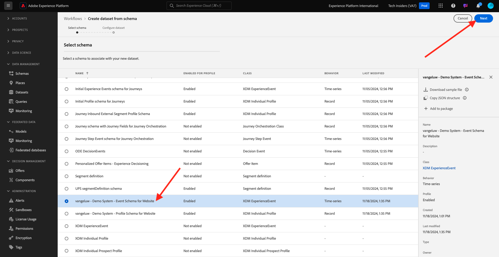
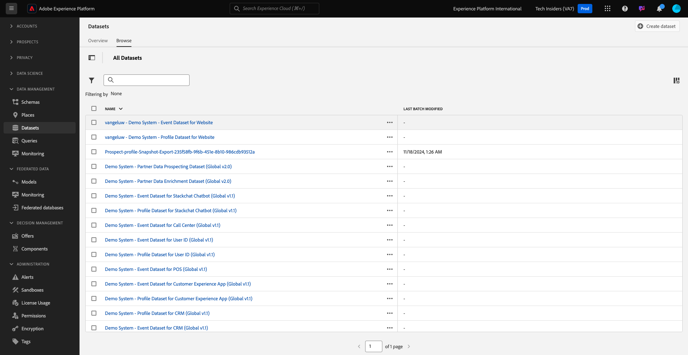

# 1.2.3 Konfigurera datauppsättningar

I den här övningen ska du konfigurera de nödvändiga datauppsättningarna för att hämta in och lagra profilinformation och kundbeteende. Alla datauppsättningar som du skapar i det här steget använder ett av de scheman som du skapade i föregående steg.

## Artikel

När du har definierat svaret på frågorna **Vem är den här kunden?** och **Vad gör den här kunden?** ska se ut som om du nu måste skapa en bucket som använder den informationen för att ta emot och validera data som skickats till Adobe Experience Platform.

## 1.2.3.1 - Skapa datauppsättningar

Nu behöver du skapa två datauppsättningar:

- 1 datauppsättning för att hämta information som besvarar **Vem är den här kunden?** - fråga.
- 1 datauppsättning för att hämta information som besvarar **Vad gör den här kunden?** - fråga.

Logga in på Adobe Experience Platform via följande URL: [https://experience.adobe.com/platform](https://experience.adobe.com/platform).

När du har loggat in loggar du in på Adobe Experience Platform hemsida.

Innan du fortsätter måste du välja en **[!UICONTROL sandbox]**. Sandlådan som ska markeras har namnet ``--module2sandbox--``. Du kan göra detta genom att klicka på texten **[!UICONTROL Production Prod]** i den blå raden ovanför skärmen. När du har valt rätt [!UICONTROL sandbox] visas skärmändringen och nu är du i din dedikerade [!UICONTROL sandbox].

Klicka på **[!UICONTROL Datasets]** på menyn till vänster på skärmen i Adobe Experience Platform.  Då ser du det här:

Vi börjar med att skapa datauppsättningen för att hämta registreringsinformation för webbplatsen.

Du bör skapa en ny datauppsättning. Om du vill skapa en ny datauppsättning klickar du på knappen **[!UICONTROL + Create Dataset]**.

När du har klickat på knappen **[!UICONTROL + Create Dataset]** visas följande skärm.

Du måste definiera en datauppsättning från schemat som du definierade i föregående steg. Klicka på alternativet **[!UICONTROL Create Dataset from Schema]** -.

På nästa skärm måste du välja det schema som du skapade i , `--aepUserLdap-- - Demo System - Profile Schema for Website`.

När du har valt schemat klickar du på **[!UICONTROL Next]** för att fortsätta.

Låt oss ge datauppsättningen ett namn.

Använd följande som namn på datauppsättningen:

`--aepUserLdap-- - Demo System - Profile Dataset for Website`

För ldap **[!UICONTROL vangeluw]** bör det här till exempel vara schemats namn:

**[!UICONTROL vangeluw - Demo System - Profile Dataset for Website]**

Det borde ge dig något sådant:

Klicka på **[!UICONTROL Finish]** för att slutföra datauppsättningskonfigurationen.

Nu ser du det här:

Gå tillbaka till översikten för [!UICONTROL Datasets]. Nu visas den datauppsättning som du skapade i översikten.

Därefter ska du konfigurera en andra datauppsättning för att fånga upp webbplatsinteraktioner.

Du bör skapa en ny datauppsättning. Om du vill skapa en ny datauppsättning klickar du på knappen **[!UICONTROL + Create Dataset]**.

När du har klickat på knappen **[!UICONTROL + Create Dataset]** visas följande skärm.

Du måste definiera en datauppsättning från schemat som du definierade i föregående steg. Klicka på alternativet **[!UICONTROL Create Dataset from Schema]** -.

På nästa skärm måste du välja det schema som du skapade i 2.2, `--aepUserLdap-- - Demo System - Event Schema for Website`.

När du har valt schemat klickar du på **[!UICONTROL Next]** för att fortsätta.

Låt oss ge datauppsättningen ett namn.

Som namn för vår datauppsättning använder vi följande:

`--aepUserLdap-- - Demo System - Event Dataset for Website`

För ldap **[!UICONTROL vangeluw]** bör det här till exempel vara schemats namn:

**[!UICONTROL vangeluw - Demo System - Event Dataset for Website]**

Det borde ge dig något sådant:

Klicka på **[!UICONTROL Finish]** för att slutföra datauppsättningskonfigurationen.

Då ser du det här:

Gå tillbaka till översiktsskärmen [!UICONTROL Datasets].

Nu måste du aktivera dina datauppsättningar som en del av Adobe Experience Platform kundprofil i realtid.

Öppna datauppsättningen `--aepUserLdap--` - demosystem - profildatauppsättning för webbplats genom att klicka på den.

Leta reda på växlingsikonen [!UICONTROL Profile] till höger på skärmen.

Klicka på växlingsknappen [!UICONTROL Profile] för att aktivera den här datauppsättningen för [!UICONTROL Profile].

Klicka på **[!UICONTROL Enable]**.

Din datauppsättning har nu aktiverats för [!UICONTROL Profile].

Gå tillbaka till översikten över datauppsättningarna och öppna datauppsättningen `--aepUserLdap-- - Demo System - Event Dataset` för webbplatsen genom att klicka på den.

Leta reda på växlingsikonen [!UICONTROL Profile] till höger på skärmen.

Klicka på [!UICONTROL Profile] för att aktivera [!UICONTROL Profile].

Klicka på **[!UICONTROL Enable]**.

Din datauppsättning har nu aktiverats för [!UICONTROL Profile].

Nästa steg: [1.2.4 Datainmatning från offlinekällor](./ex4.md)

[Gå tillbaka till modul 1.2](./data-ingestion.md)

[Gå tillbaka till Alla moduler](../../../overview.md)
