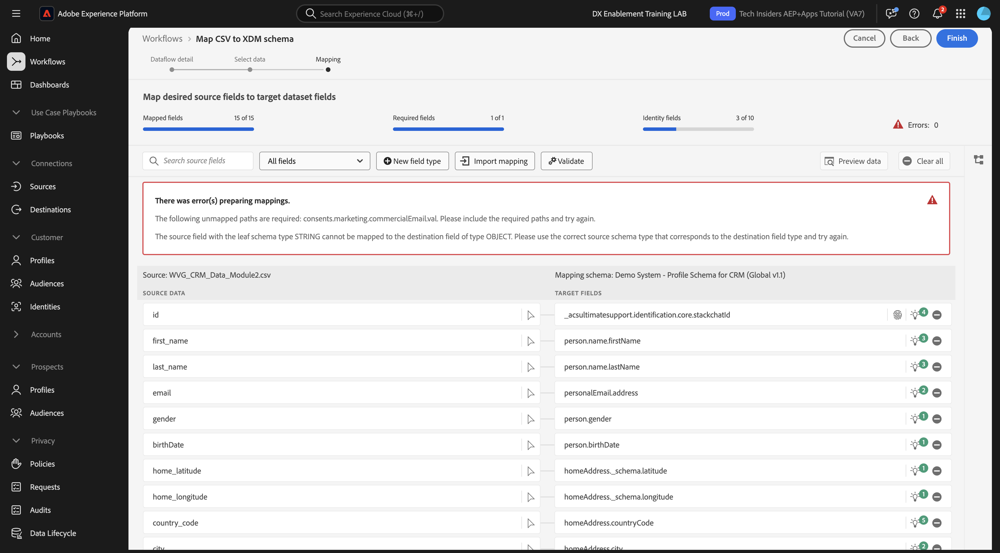

# 1.2.4 Datainmatning från offlinekällor

I den här övningen är målet att lägga in externa data som CRM-data i plattformen.

## Utbildningsmål

- Lär dig generera testdata
- Lär dig hur du importerar CSV
- Lär dig använda webbgränssnittet för datainmatning via arbetsflöden
- Förstå datastyrningsfunktionerna i Experience Platform

## Resurser

- Mockaroo-gränssnitt: [https://www.mockaroo.com/](https://www.mockaroo.com/)
- Experience Platform-gränssnitt: [https://experience.adobe.com/platform/](https://experience.adobe.com/platform/)

## Uppgifter

- Skapa en CSV-fil med demodatum. Importera CSV-filen i Adobe Experience Platform med hjälp av de tillgängliga arbetsflödena.
- Förstå datastyrningsalternativ i Adobe Experience Platform

## 1.2.4.1 Skapa din CRM-datauppsättning med ett datagenereringsverktyg

För detta behöver du 1 000 exempelrader med CRM-data.

Öppna Mockaroo-mallen genom att gå till [https://www.mockaroo.com/12674210](https://www.mockaroo.com/12674210).

I mallen ska du lägga märke till följande fält:

- id
- first_name
- last_name
- e-post
- kön
- födelsedatum
- home_latitude
- home_longitude
- country_code
- stad
- land

Alla dessa fält har definierats för att producera data som är kompatibla med plattformen.

Om du vill generera en CSV-fil klickar du på knappen **[!UICONTROL Download Data]** som ger dig en CSV-fil med 1 000 rader med demodata.

Öppna CSV-filen i Microsoft Excel för att se innehållet.

När CSV-filen är klar kan du mappa den mot XDM.

### 1.2.4.2 Verifiera informationen om CRM-introduktionen i Adobe Experience Platform

Öppna [Adobe Experience Platform](https://experience.adobe.com/platform) och gå till **[!UICONTROL Datasets]**.

Innan du fortsätter måste du välja en **[!UICONTROL sandbox]**. Sandlådan som ska markeras har namnet ``--module2sandbox--``. Du kan göra detta genom att klicka på texten **[!UICONTROL Production Prod]** i den blå raden ovanför skärmen. När du har valt rätt [!UICONTROL sandbox] visas skärmändringen och nu är du i din dedikerade [!UICONTROL sandbox].

Klicka på **[!UICONTROL Datasets]** på menyn till vänster på skärmen i Adobe Experience Platform.

Du kommer att använda en delad datamängd som är baserad i den här aktiveringen. Den delade datamängden har redan skapats och kallas **[!UICONTROL Demo System - Profile Dataset for CRM (Global v1.1)]**.

Öppna datauppsättningen **[!UICONTROL Demo System - Profile Dataset for CRM (Global v1.1)]**.

På översiktsskärmen ser du tre viktiga informationsdelar.

Först och främst visar kontrollpanelen [!UICONTROL Dataset Activity] det totala antalet CRM-poster i datauppsättningen och de inkapslade batcharna och deras status

För det andra kan du genom att bläddra nedåt på sidan kontrollera när grupper av data har importerats, hur många poster som har registrerats och även om batchen har tagits med eller inte. **[!UICONTROL Batch ID]** är identifieraren för ett specifikt batchjobb och **[!UICONTROL Batch ID]** är viktig eftersom den kan användas för att felsöka varför en specifik batch inte kunde registreras.

Fliken [!UICONTROL Dataset Info] visar dessutom viktig information, som [!UICONTROL Dataset ID] (som är viktig även för felsökningsaspekter), datauppsättningens namn och om datauppsättningen har aktiverats för profilen.

Den viktigaste inställningen här är länken mellan datauppsättningen och schemat. Schemat definierar vilka data som kan importeras och hur dessa data ska se ut.

I det här fallet använder vi **[!UICONTROL Demo System - Profile Schema for CRM (Global v1.1)]**, som är mappad mot klassen för **[!UICONTROL Profile]** och har implementerat tillägg, som även kallas fältgrupper.

Genom att klicka på schemats namn kommer du till översikten [!UICONTROL Schema] där du kan se alla fält som har aktiverats för det här schemat.

Alla scheman måste ha en anpassad, primär beskrivare definierad. När det gäller CRM-datauppsättningen har schemat definierat att fältet **[!UICONTROL crmId]** ska vara den primära identifieraren. Om du vill skapa ett schema och länka det till [!UICONTROL Real-time Customer Profile] måste du definiera en anpassad [!UICONTROL Field Group] som refererar till din primära beskrivning.

På skärmbilden ovan ser du att beskrivningen finns i `--aepTenantId--.identification.core.crmId`, som är inställd som [!UICONTROL Primary Identifier], länkad till [!UICONTROL namespace] för **[!UICONTROL Demo System - CRMID]**.

Alla scheman och som sådana ska alla datauppsättningar som ska användas i [!UICONTROL Real-time Customer Profile] ha en [!UICONTROL Primary identifier]. [!UICONTROL Primary Identifier] är identifieraranvändaren av varumärket för en kund i den datauppsättningen. När det gäller en CRM-datauppsättning kan det vara e-postadressen eller CRM-ID:t, när det gäller en Call Center-datauppsättning kan det vara en kunds mobilnummer.

Det är bästa sättet att skapa ett separat, specifikt schema för varje datauppsättning och att ange beskrivningen för varje datauppsättning specifikt för att matcha hur de aktuella lösningar som används av varumärket fungerar.

### 1.2.4.3 Använda ett arbetsflöde för att mappa en CSV-fil till ett XDM-schema

Målet med detta är att integrera CRM-data i plattformen. Alla data som är inkapslade i Platform ska mappas mot det specifika XDM-schemat. Det du för närvarande har är en CSV-datauppsättning med 1 000 rader på ena sidan och en datauppsättning som är länkad till ett schema på den andra sidan. Om du vill läsa in CSV-filen i den datauppsättningen måste en mappning göras. Vi har **[!UICONTROL Workflows]** tillgängligt i Adobe Experience Platform för att underlätta den här kartläggningen.

[!UICONTROL workflow] som vi ska använda här är [!UICONTROL workflow] med namnet **[!UICONTROL Map CSV to XDM Schema]** på menyn [!UICONTROL Data Ingestion].

Klicka på knappen **[!UICONTROL Map CSV to XDM Schema]**. Klicka på **[!UICONTROL Launch]** för att starta processen.

På nästa skärm måste du välja en datauppsättning att importera filen till. Du kan välja mellan att välja en befintlig datauppsättning eller att skapa en ny. För den här övningen återanvänder vi en befintlig: välj **[!UICONTROL Demo System - Profile Dataset for CRM (Global v1.1)]** enligt nedan och lämna de andra inställningarna inställda på standard.

Klicka på **[!UICONTROL Next]** för att gå till nästa steg.

Dra och släpp CSV-filen eller klicka på **[!UICONTROL Browse]** och navigera på datorn till skrivbordet och välj CSV-filen.

När du har valt en CSV-fil överförs den omedelbart och du kommer att se en förhandsgranskning av filen inom några sekunder.

Klicka på **[!UICONTROL Next]** för att gå till nästa steg. Det kan ta några sekunder innan filen har bearbetats helt.

Du måste nu mappa dina CSV-kolumnrubriker med en XDM-egenskap i **[!UICONTROL Demo System - Profile Dataset for CRM]**.

Adobe Experience Platform har redan gjort några förslag åt dig genom att försöka länka [!UICONTROL Source Attributes] till [!UICONTROL Target Schema Fields].

För [!UICONTROL Schema Mappings] har Adobe Experience Platform redan försökt länka samman fält. Alla förslag på mappning är dock inte korrekta. Du måste nu **acceptera målfält** en i taget.

#### födelsedatum

Source-schemafältet **bornDate** ska länkas till målfältet **person.bornDate**.

#### stad

Source-schemafältet **city** ska länkas till målfältet **homeAddress.city**.

#### land

Source-schemafältet **country** ska länkas till målfältet **homeAddress.country**.

#### country_code

Source-schemafältet **country_code** ska länkas till målfältet **homeAddress.countryCode**.

#### e-post

Source-schemafältet **email** ska länkas till målfältet **personalEmail.address**.

#### krut

Source-schemafältet ** crmid** ska länkas till målfältet **`--aepTenantId--`.identify.core.crmId**.

#### first_name

Source-schemafältet **first_name** ska länkas till målfältet **person.name.firstName**.

#### kön

Source-schemafältet **kön** ska länkas till målfältet **person.kön**.

#### home_latitude

Source-schemafältet **home_latitude** ska länkas till målfältet **homeAddress._schema.latitude**.

#### home_longitude

Source-schemafältet **home_longitude** ska länkas till målfältet **homeAddress._schema.longitude**.

#### id

Source-schemafältet **id** ska länkas till målfältet **_id**.

#### last_name

Source-schemafältet **last_name** ska länkas till målfältet **person.name.lastName**.

Nu bör du ha den här:

Klicka på knappen **[!UICONTROL Finish]** för att slutföra arbetsflödet.

När du har klickat på **[!UICONTROL Finish]** visas översikten för **Dataflöd** och efter några minuter kan du uppdatera skärmen för att se om arbetsflödet har slutförts. Klicka på **namnet på måldatauppsättningen**.

Sedan ser du datauppsättningen där ditt intag har bearbetats.

På datauppsättningen ser du en [!UICONTROL Batch ID] som har importerats just nu, med 1 000 poster inkapslade och statusen **[!UICONTROL Success]**.

Klicka på knappen **[!UICONTROL Preview Dataset]**- för att få en snabb visning av ett litet urval av datauppsättningen för att säkerställa att inlästa data är korrekta.

När data har lästs in kan du definiera rätt datastyrningsmetod för vår datamängd.

### 1.2.5.4 Lägga till datastyrning i datauppsättningen

Nu när era kunddata är insamlade måste ni se till att datauppsättningen styrs på rätt sätt för användnings- och exportkontroll. Klicka på fliken **[!UICONTROL Data Governance]** och observera att du kan ange tre typer av begränsningar: Contractual, Identity och Sensitive Data.

Du hittar mer information om de olika etiketterna och hur de kommer att tillämpas i framtiden via principramverket på den här länken: [https://www.adobe.io/apis/experienceplatform/home/dule/duleservices.html](https://www.adobe.io/apis/experienceplatform/home/dule/duleservices.html)

Låt oss begränsa identitetsdata för hela datauppsättningen. Håll pekaren över datauppsättningsnamnet och klicka på pennikonen för att redigera inställningarna.

Gå till **[!UICONTROL Identity Data]** så ser du att alternativet **[!UICONTROL I2]** är markerat. Det förutsätter att alla informationsdelar i den här datauppsättningen åtminstone är indirekt identifierbara för personen.

Klicka på **[!UICONTROL Save Changes]** och observera att **[!UICONTROL I2]** nu är inställt för alla datafält i datauppsättningen.

Du kan också ange de här flaggorna för enskilda datafält, till exempel kommer fältet **[!UICONTROL firstName]** troligtvis att klassificeras som en **[!UICONTROL I1]**-nivå för direkt identifierbar information.

Markera fältet **[!UICONTROL firstName]** genom att markera kryssrutan och klicka på **[!UICONTROL Edit Governance Labels]** i skärmens övre högra hörn.

Gå till **[!UICONTROL Identity Data]** så ser du att alternativet **[!UICONTROL I2]** redan är markerat (ärvs från datauppsättningen). Fältet firstName har också en fältspecifik konfiguration och är inställt på **[!UICONTROL I1 - Directly Identifiable Data]**.

Detta innebär att du nu har inhämtat och klassificerat CRM-data i Adobe Experience Platform.

Nästa steg: [1.2.5 Data Landing Zone](./ex5.md)

[Gå tillbaka till modul 1.2](./data-ingestion.md)

[Gå tillbaka till Alla moduler](../../../overview.md)
