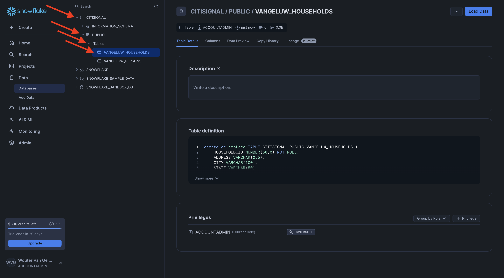

# 1.3.1 Konfigurera Snowflake-miljön

## 1.3.1.1 Skapa ditt konto

Gå till [https://snowflake.com](https://snowflake.com). Klicka på **STARTA KOSTNADSFRITT**.


Ange dina uppgifter och klicka på **Fortsätt**.


Ange dina uppgifter, välj din molnleverantör och klicka på **Kom igång**.


Ange dina uppgifter eller klicka på **Hoppa över** (x2).


Då ser du det här. Kontrollera din e-post och klicka på bekräftelsemeddelandet som skickades till dig.


Klicka på länken i bekräftelsemeddelandet för att aktivera ditt konto, ange ditt användarnamn och lösenord. Klicka på **Kom igång**. Du måste använda det här användarnamnet och lösenordet i nästa övning.


Du loggas sedan in i Snowflake. Klicka på **Hoppa över just nu**.


## 1.3.1.2 Skapa en databas

Gå till **Data > Databaser**. Klicka på **+ databas**.


Använd namnet **CITISIGNAL** för databasen. Klicka på **SKAPA**.


## 1.3.1.3 Skapa tabeller

Nu kan du börja skapa tabeller i Snowflake. Här nedan finns skript som du kan köra för att skapa tabeller.

### Tabell CK_PERSONER

Klicka på **+ Skapa**, klicka på **Tabell** och sedan på **Standard**.


Då ser du det här. Kopiera frågan nedan och klistra in den i Snowflake. Se till att du väljer databasen **CITISIGNAL** i det övre vänstra hörnet av skärmen innan du skapar tabellen.

```sql
create or replace TABLE CITISIGNAL.PUBLIC.CK_PERSONS (
	PERSON_ID NUMBER(38,0) NOT NULL,
	NAME VARCHAR(255),
	AGE NUMBER(38,0),
	EMAIL VARCHAR(255),
	PHONE_NUMBER VARCHAR(20),
	GENDER VARCHAR(10),
	OCCUPATION VARCHAR(100),
	ISATTMOBILESUB BOOLEAN,
	primary key (PERSON_ID)
);
```

Klicka på **Skapa tabell**.


När skriptet har körts hittar du tabellen under **Databaser > CITISIGNAL > PUBLIC**.


### Tabell CK_HOUSEHOLDS

Klicka på **+ Skapa**, klicka på **Tabell** och sedan på **Standard**.


Då ser du det här. Kopiera frågan nedan och klistra in den i Snowflake. Se till att du väljer databasen **CITISIGNAL** i det övre vänstra hörnet av skärmen innan du skapar tabellen.

```sql
create or replace TABLE CITISIGNAL.PUBLIC.CK_HOUSEHOLDS (
	HOUSEHOLD_ID NUMBER(38,0) NOT NULL,
	ADDRESS VARCHAR(255),
	CITY VARCHAR(100),
	STATE VARCHAR(50),
	POSTAL_CODE VARCHAR(20),
	COUNTRY VARCHAR(100),
	ISELIGIBLEFORFIBER BOOLEAN,
	PRIMARY_PERSON_ID NUMBER(38,0),
	ISFIBREENABLED BOOLEAN,
	primary key (HOUSEHOLD_ID)
);
```

Klicka på **Skapa tabell**.


När skriptet har körts hittar du tabellen under **Databaser > CITISIGNAL > PUBLIC**.



### Table CK_USERS

Klicka på **+ Skapa**, klicka på **Tabell** och sedan på **Standard**.


Då ser du det här. Kopiera frågan nedan och klistra in den i Snowflake. Se till att du väljer databasen **CITISIGNAL** i det övre vänstra hörnet av skärmen innan du skapar tabellen.

```sql
create or replace TABLE CITISIGNAL.PUBLIC.CK_USERS (
	USER_ID NUMBER(38,0) NOT NULL,
	PERSON_ID NUMBER(38,0),
	HOUSEHOLD_ID NUMBER(38,0),
	primary key (USER_ID),
	foreign key (PERSON_ID) references CITISIGNAL.PUBLIC.CK_PERSONS(PERSON_ID),
	foreign key (HOUSEHOLD_ID) references CITISIGNAL.PUBLIC.CK_HOUSEHOLDS(HOUSEHOLD_ID)
);
```

Klicka på **Skapa tabell**.


När skriptet har körts hittar du tabellen under **Databaser > CITISIGNAL > PUBLIC**.


### Tabell CK_MONTHLY_DATA_USAGE

Klicka på **+ Skapa**, klicka på **Tabell** och sedan på **Standard**.


Då ser du det här. Kopiera frågan nedan och klistra in den i Snowflake. Se till att du väljer databasen **CITISIGNAL** i det övre vänstra hörnet av skärmen innan du skapar tabellen.

```sql
create or replace TABLE CITISIGNAL.PUBLIC.CK_MONTHLY_DATA_USAGE (
	USAGE_ID NUMBER(38,0) NOT NULL autoincrement start 1 increment 1 noorder,
	USER_ID NUMBER(38,0),
	MONTH DATE,
	DATA_USAGE_GB NUMBER(10,2),
	primary key (USAGE_ID)
);
```

Klicka på **Skapa tabell**.


När skriptet har körts hittar du tabellen under **Databaser > CITISIGNAL > PUBLIC**.


### Tabell CK_MOBILE_DATA_USAGE

Klicka på **+ Skapa**, klicka på **Tabell** och sedan på **Standard**.


Då ser du det här. Kopiera frågan nedan och klistra in den i Snowflake. Se till att du väljer databasen **CITISIGNAL** i det övre vänstra hörnet av skärmen innan du skapar tabellen.


```sql
create or replace TABLE CITISIGNAL.PUBLIC.CK_MOBILE_DATA_USAGE (
	USAGE_ID NUMBER(38,0) NOT NULL autoincrement start 1 increment 1 noorder,
	USER_ID NUMBER(38,0),
	DATE DATE,
	TIME TIME(9),
	APP_NAME VARCHAR(255),
	DATA_USAGE_MB NUMBER(10,2),
	NETWORK_TYPE VARCHAR(50),
	DEVICE_TYPE VARCHAR(50),
	COUNTRY_CODE VARCHAR(10),
	primary key (USAGE_ID)
);
```

Klicka på **Skapa tabell**.


När skriptet har körts hittar du tabellen under **Databaser > CITISIGNAL > PUBLIC**.


Alla tabeller har skapats.


## 1.3.1.4 Samplingsdata

Nu kan du börja läsa in exempeldata i databasen.

...

Du är nu klar med konfigurationen i Snowflake.


Nästa steg: [1.3.2 Skapa scheman, datamodell och länkar](./ex2.md)

[Gå tillbaka till modul 1.3](./fac.md)

[Gå tillbaka till Alla moduler](../../../overview.md)
