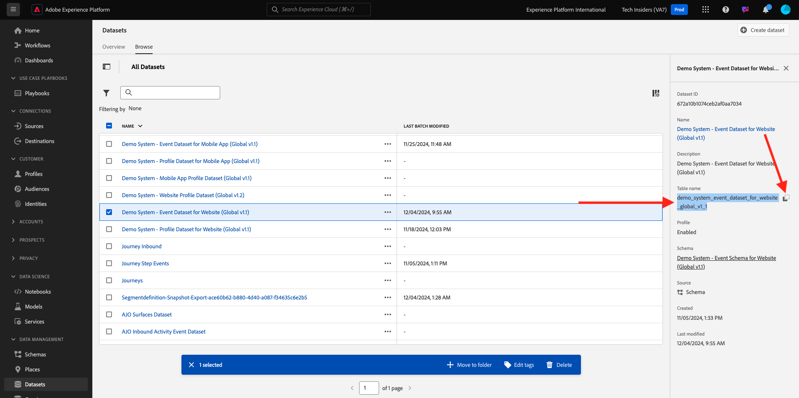
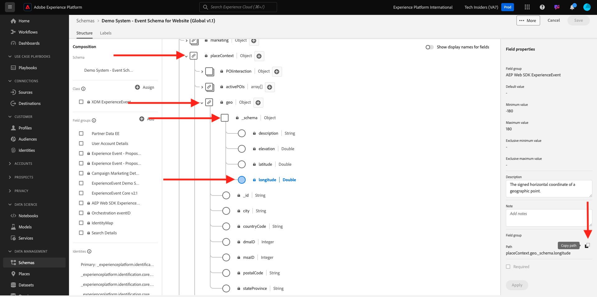

# 5.1.3 Använda frågetjänsten

## Syfte

- Hitta och utforska datauppsättningar
- Lär dig hur du hanterar Experience Data Models-objekt och -attribut i dina frågor

## Kontext

Här får du lära dig hur du använder PSQL för att hämta information om tillgängliga datauppsättningar, hur du skriver frågor för Experience Data Model (XDM) och skriver dina första enkla rapporteringsfrågor med hjälp av datamängderna Frågetjänst och Citi Signal.

## Grundläggande frågor

Här får du lära dig mer om metoderna för att hämta information om tillgängliga datauppsättningar och hur du hämtar data korrekt med en fråga från en XDM-datauppsättning.

Alla datauppsättningar som vi har utforskat via Adobe Experience Platform i början av 1 är också tillgängliga som tabeller via ett SQL-gränssnitt. Om du vill visa de tabellerna kan du använda kommandot **Visa tabeller;**.

Kör `show tables;` i kommandoradsgränssnittet **PSQL**. (glöm inte att avsluta kommandot med ett semikolon).

Kopiera kommandot `show tables;` och klistra in det vid uppmaningen:


Följande resultat visas:

```text
tech-insiders:all=> show tables;
                               name                               |                                                  dataSetId                                                   |                                       dataSet                                        | description |        labels        
------------------------------------------------------------------+--------------------------------------------------------------------------------------------------------------+--------------------------------------------------------------------------------------+-------------+----------------------
 ajo_bcc_feedback_event_dataset                                   | 672a07cb7728e82aefa1ec56                                                                                     | AJO BCC Feedback Event Dataset                                                       |             | 
 ajo_classification_dataset                                       | 672a07cab55b0d2aef6f9626                                                                                     | AJO Classification Dataset                                                           |             | 
 ajo_consent_service_dataset                                      | 672a07c80fd5fd2aee4155ca                                                                                     | AJO Consent Service Dataset                                                          |             | 'PROFILE'
 ajo_email_tracking_experience_event_dataset                      | 672a07c926d57d2aef020230                                                                                     | AJO Email Tracking Experience Event Dataset                  :
                               name                               |                                                  dataSetId                                                   |                                       dataSet                                        | description |        labels        
------------------------------------------------------------------+--------------------------------------------------------------------------------------------------------------+--------------------------------------------------------------------------------------+-------------+----------------------
 ajo_bcc_feedback_event_dataset                                   | 672a07cb7728e82aefa1ec56                                                                                     | AJO BCC Feedback Event Dataset                                                       |             | 
 ajo_classification_dataset                                       | 672a07cab55b0d2aef6f9626                                                                                     | AJO Classification Dataset                                                           |             | 
 ajo_consent_service_dataset                                      | 672a07c80fd5fd2aee4155ca                                                                                     | AJO Consent Service Dataset                                                          |             | 'PROFILE'
 ajo_email_tracking_experience_event_dataset                      | 672a07c926d57d2aef020230                                                                                     | AJO Email Tracking Experience Event Dataset   
```

Tryck på blankstegstangenten i kolonet för att visa nästa sida i resultatuppsättningen, eller ange `q` för att återgå till kommandotolken.

Varje datauppsättning i AEP har sin motsvarande frågetjänsttabell. Du kan hitta en datamängds tabell via användargränssnittet för datauppsättningar:



Tabellen `demo_system_event_dataset_for_website_global_v1_1` är den frågetjänsttabell som motsvarar datamängden `Demo System - Event Schema for Website (Global v1.1)`.

Om du vill fråga om var en produkt har visats väljer vi **geo**-informationen.

Kopiera frågan nedan och klistra in den vid uppmaningen i **PSQL-kommandoradsgränssnittet** och tryck på Retur:

```sql
select placecontext.geo
from   demo_system_event_dataset_for_website_global_v1_1
where  eventType = 'commerce.productViews'
and placecontext.geo.countryCode <> ''
limit 1;
```

I frågeresultatet kommer du att märka att kolumner i Experience Data Model (XDM) kan vara komplexa typer och inte bara skalära typer. I frågan ovan vill vi identifiera geografiska platser där en **commerce.productViews** inträffade. För att kunna identifiera en **commerce.productViews** måste vi navigera genom XDM-modellen med **.** (punkt)-notation.

```text
tech-insiders:all=> select placecontext.geo
from   demo_system_event_dataset_for_website_global_v1_1
where  eventType = 'commerce.productViews'
and placecontext.geo.countryCode <> ''
limit 1;
                 geo                  
--------------------------------------
 ("(51.59119,-1.407848)",Charlton,GB)
(1 row)
```

Observera att resultatet är ett platt objekt i stället för ett enda värde? Objektet **placecontext.geo** innehåller fyra attribut: schema, land och stad. När ett objekt deklareras som en kolumn returneras hela objektet som en sträng. XDM-schemat kan vara mer komplext än det du är van vid, men det är mycket kraftfullt och har utformats för att stödja många lösningar, kanaler och användningsfall.

Om du vill välja enskilda egenskaper för ett objekt använder du **.** (punkt)-notation.

Kopiera instruktionen nedan och klistra in den vid uppmaningen i **PSQL-kommandoradsgränssnittet**:

```sql
select placecontext.geo._schema.longitude
      ,placecontext.geo._schema.latitude
      ,placecontext.geo.city
      ,placecontext.geo.countryCode
from   demo_system_event_dataset_for_website_global_v1_1
where  eventType = 'commerce.productViews'
and placecontext.geo.countryCode <> ''
limit 1;
```

Resultatet av ovanstående fråga bör se ut så här.
Resultatet är nu ett inställt enkelt värde:

```text
tech-insiders:all=> select placecontext.geo._schema.longitude
      ,placecontext.geo._schema.latitude
      ,placecontext.geo.city
      ,placecontext.geo.countryCode
from   demo_system_event_dataset_for_website_global_v1_1
where  eventType = 'commerce.productViews'
and placecontext.geo.countryCode <> ''
limit 1;
 longitude | latitude |   city   | countrycode 
-----------+----------+----------+-------------
 -1.407848 | 51.59119 | Charlton | GB
(1 row)
```

Oroa dig inte, det finns ett enkelt sätt att hitta vägen till en viss egenskap. Här nedan får du lära dig hur.

Du måste redigera en fråga, så vi öppnar först en redigerare.

I Windows: använd **Anteckningar**

I Mac: installera valfritt textredigeringsprogram och öppna det.

Kopiera följande programsats till textredigeraren:

```sql
select your_attribute_path_here
from   demo_system_event_dataset_for_website_global_v1_1
where  eventType = 'commerce.productViews'
and placecontext.geo.countryCode <> ''
limit 1;
```

Gå tillbaka till ditt Adobe Experience Platform-gränssnitt (bör vara öppet i webbläsaren) eller navigera till [Adobe Experience Platform](https://experience.adobe.com/platform).

Välj **Scheman**, ange `Demo System - Event Schema for Website` i fältet **sök** och klicka för att öppna schemat `Demo System - Event Schema for Website (Global v1.1) Schema`.


Utforska XDM-modellen för **Demonstrationssystem - händelseschema för webbplatsen (Global v1.1)** genom att klicka på ett objekt. Expandera trädet för **placecontext**, **geo** och **schema**. När du väljer det faktiska attributet **longitude** visas den fullständiga sökvägen i den markerade röda rutan. Om du vill kopiera attributets sökväg klickar du på ikonen för kopieringssökväg.



Växla till din anteckningsruta/parenteser och ta bort **your_attribute_path_here** från den första raden. Placera markören efter **välj** på den första raden och klistra in (CTRL-V).


Kopiera den ändrade satsen och klistra in den vid uppmaningen i **PSQL-kommandoradsgränssnittet** och tryck på Retur.

Resultatet bör se ut så här:

```text
tech-insiders:all=> select placeContext.geo._schema.longitude
from   demo_system_event_dataset_for_website_global_v1_1
where  eventType = 'commerce.productViews'
and placecontext.geo.countryCode <> ''
limit 1;
 longitude 
-----------
 -1.407848
(1 row)
```

Nästa steg: [5.1.4 Frågor, frågor, frågor... och segmentanalys](./ex4.md)

[Gå tillbaka till modul 5.1](./query-service.md)

[Gå tillbaka till Alla moduler](../../../overview.md)
