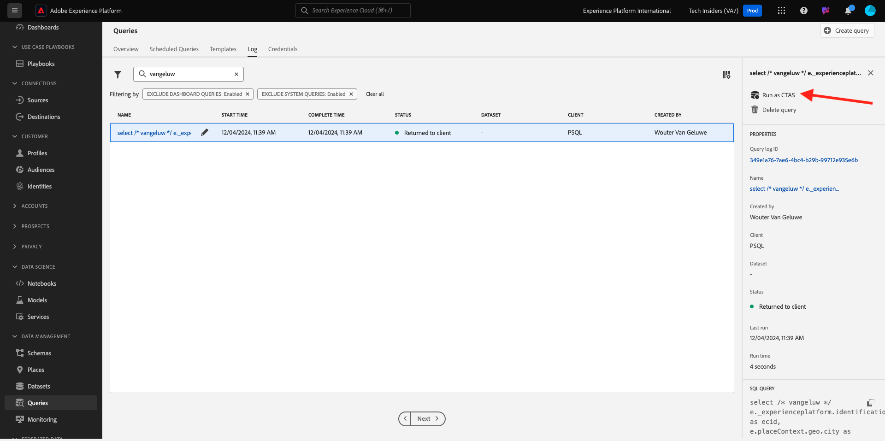

# 5.1.5 Generera en datauppsättning från en fråga

## Syfte

Lär dig hur du genererar datauppsättningar från frågeresultat
Anslut Microsoft Power BI Desktop/Tableau direkt till Query Service
Skapa en rapport i Microsoft Power BI Desktop/Tableau Desktop

## Kontext

Kommandoradsgränssnittet för att fråga efter data är spännande, men det visas inte bra. I den här lektionen vägleder vi dig genom ett rekommenderat arbetsflöde för hur du kan använda Microsoft Power BI Desktop/Tableau direkt i frågetjänsten för att skapa visuella rapporter för dina intressenter.

## Skapa en datauppsättning från en SQL-fråga

Frågans komplexitet påverkar hur lång tid det tar för frågetjänsten att returnera resultaten. Och när du frågar direkt från kommandoraden eller andra lösningar som Microsoft Power BI/Tableau konfigureras frågetjänsten med en 5-minuters timeout (600 sekunder). I vissa fall kommer dessa lösningar att konfigureras med kortare tidsgränser. Om du vill köra större frågor och läsa in den tid det tar att returnera resultaten, erbjuder vi en funktion för att generera en datauppsättning från frågeresultaten. Den här funktionen använder den vanliga SQL-funktionen som kallas Skapa tabell som markerad (CTAS). Det är tillgängligt i plattformsgränssnittet från frågelistan och kan även köras direkt från kommandoraden med PSQL.

I föregående exempel har du ersatt **Ange ditt namn** med din egen ldap innan du kör den i PSQL.

```sql
select /* enter your name */
       e.--aepTenantId--.identification.core.ecid as ecid,
       e.placeContext.geo.city as city,
       e.placeContext.geo._schema.latitude latitude,
       e.placeContext.geo._schema.longitude longitude,
       e.placeContext.geo.countryCode as countrycode,
       c.--aepTenantId--.interactionDetails.core.callCenterAgent.callFeeling as callFeeling,
       c.--aepTenantId--.interactionDetails.core.callCenterAgent.callTopic as callTopic,
       c.--aepTenantId--.interactionDetails.core.callCenterAgent.callContractCancelled as contractCancelled,
       l.--aepTenantId--.loyaltyDetails.level as loyaltystatus,
       l.--aepTenantId--.loyaltyDetails.points as loyaltypoints,
       l.--aepTenantId--.identification.core.crmId as crmid
from   demo_system_event_dataset_for_website_global_v1_1 e
      ,demo_system_event_dataset_for_call_center_global_v1_1 c
      ,demo_system_profile_dataset_for_crm_global_v1_1 l
where  e.--aepTenantId--.demoEnvironment.brandName IN ('Citi Signal')
and    e.web.webPageDetails.name in ('Cancel Service', 'Call Start')
and    e.--aepTenantId--.identification.core.ecid = c.--aepTenantId--.identification.core.ecid
and    l.--aepTenantId--.identification.core.ecid = e.--aepTenantId--.identification.core.ecid;
```

Navigera till Adobe Experience Platform-gränssnittet - [https://experience.adobe.com/platform](https://experience.adobe.com/platform)

Du söker efter den programsats som körs i användargränssnittet för Adobe Experience Platform Query genom att ange din ldap i sökfältet:

Välj **Frågor**, gå till **Logg** och ange din ldap i sökfältet.


Markera frågan och klicka på **Kör som CTAS**.



Ange `--aepUserLdap-- Callcenter Interaction Analysis` som namn och beskrivning för datauppsättningen och klicka på **Kör som CTAS**.


Därför visas en ny fråga med statusen **Skickat**.


När du är klar visas en ny post för **datauppsättningen skapad** (du kan behöva uppdatera sidan).


Så snart datauppsättningen har skapats (vilket kan ta 5-10 minuter) kan du fortsätta med övningen.

Nästa steg - Alternativ A: [5.1.6 Frågetjänst och Power BI](./ex6.md)

Nästa steg - Alternativ B: [5.1.7 Query Service och Tableu](./ex7.md)

[Gå tillbaka till modul 5.1](./query-service.md)

[Gå tillbaka till Alla moduler](../../../overview.md)
