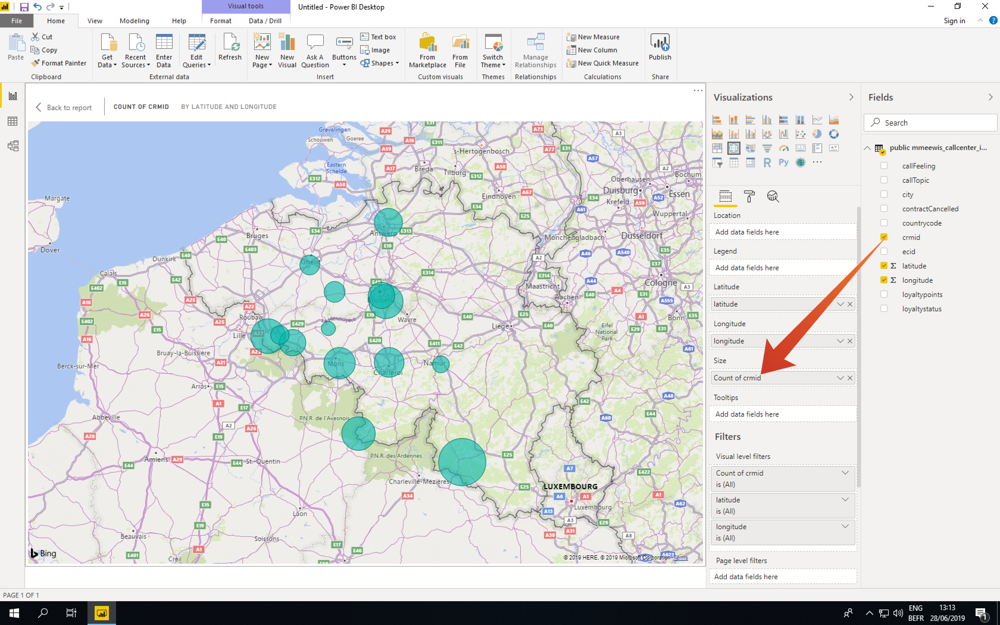

# 5.1.6 Query Service och Power BI

Öppna Microsoft Power BI Desktop.

Klicka på **Hämta data**.

Sök efter **affischer** (1), välj **Postgres** (2) i listan och **Connect** (3).

Gå till Adobe Experience Platform, till **Frågor** och till **Referenser**.

Kopiera **Host** från sidan **Credentials** i Adobe Experience Platform och klistra in den i fältet **Server**. Kopiera sedan **Database** och klistra in den i fältet **Database** i PowerBI. Klicka sedan på OK (2).

>[!IMPORTANT]
>
>Se till att du inkluderar porten **:80** i slutet av servervärdet eftersom frågetjänsten för närvarande inte använder PostgreSQL-standardporten 5432.

I nästa dialogruta fyller du i användarnamnet och lösenordet med ditt användarnamn och lösenord som finns i **Autentiseringsuppgifter** för frågor i Adobe Experience Platform.

I dialogrutan Överblick placerar du **LDAP** i sökfältet (1) för att hitta dina CTAS-datauppsättningar och markerar kryssrutan bredvid varje (2). Klicka sedan på Läs in (3).

Kontrollera att fliken **Rapport** (1) är markerad.

Markera kartan (1) och förstora kartan (2) när den har lagts till på rapportarbetsytan.

Därefter måste vi definiera mått och mått. Det gör du genom att dra fält från avsnittet **fält** till motsvarande platshållare (som finns under **visualiseringar**) enligt nedan:

Som mått använder vi antalet **customerId**. Dra fältet **crmid** från avsnittet **fields** till platshållaren **Size**:

Om du vill göra en del **callTopic**-analyser drar vi fältet **callTopic** till platshållaren för **sidnivåfilter** (du kan behöva rulla i avsnittet **visualiseringar** ).

Välj/avmarkera **callTopics** för att undersöka:

Du har nu avslutat den här övningen.

Nästa steg: [5.1.8 API för frågetjänst](./ex8.md)

[Gå tillbaka till modul 5.1](./query-service.md)

[Gå tillbaka till Alla moduler](../../../overview.md)
