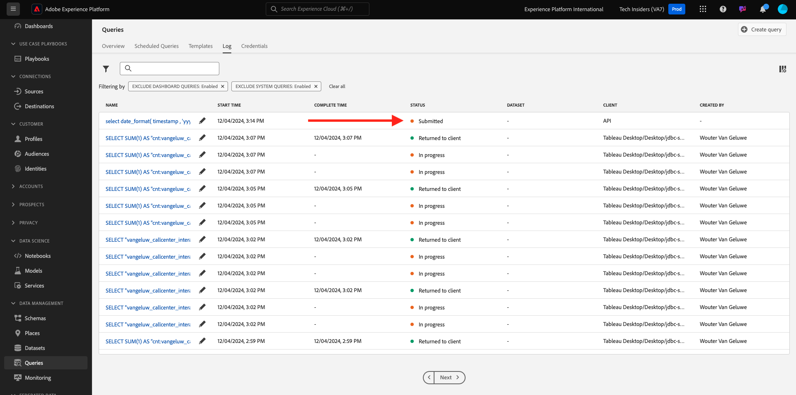

# 5.1.8 Query Service API

## Syfte

- Använd API:t för frågetjänsten för att hantera frågemallar och frågescheman

## Kontext

I den här övningen kör du API-anrop för att hantera frågemallar och frågescheman med hjälp av en Postman-samling. Du definierar frågemallar, kör vanliga frågor och CTAS-frågor. En **CTAS**-fråga (skapa tabell som urvalsfråga) lagrar sin resultatuppsättning i en explicit datamängd. Vanliga frågor lagras i en implicit (eller systemgenererad) datauppsättning, som vanligtvis exporteras i ett parquet-filformat.

## Dokumentation

- [Adobe Experience Platform Query Service - hjälp](https://experienceleague.adobe.com/docs/experience-platform/query/api/getting-started.html)
- [API för frågetjänst](https://www.adobe.io/apis/experienceplatform/home/api-reference.html#!acpdr/swagger-specs/qs-api.yaml)

## API för frågetjänst

Med API:t för frågetjänsten kan du hantera icke-interaktiva frågor mot Adobe Experience Platform datasjön.

Icke-interaktiv innebär att en begäran om att köra en fråga inte resulterar i ett omedelbart svar. Frågan bearbetas och dess resultatuppsättning lagras i en implicit eller explicit (CTAS: create table as select) datamängd.

## Exempelfråga

Som en exempelfråga använder du den första frågan som listas i [ 4.3 - Frågor, frågor, frågor... och segmentanalys](./ex3.md):

Hur många produktvisningar har vi dagligen?

**SQL**

```sql
select date_format( timestamp , 'yyyy-MM-dd') AS Day,
       count(*) AS productViews
from   demo_system_event_dataset_for_website_global_v1_1
where  --aepTenantId--.demoEnvironment.brandName IN ('Citi Signal')
and eventType = 'commerce.productViews'
group by Day
limit 10;
```

## Frågor

>[!IMPORTANT]
>
>Om du är anställd i Adobe följer du instruktionerna här för att använda [PostBuster](./../../../postbuster.md).

Öppna Postman på datorn. Som en del av modul 2.1 skapade du en Postman-miljö och importerade en Postman-samling. Följ instruktionerna i [övning 2.1.3](./../../../modules/rtcdp-b2c/module2.1/ex3.md) om du inte har gjort det än.

Som en del av den Postman-samling som du importerade visas en mapp **3. Frågetjänst**. Om du inte ser den här mappen kan du ladda ned [Postman-samlingen](./../../../assets/postman/postman_profile.zip) på nytt och importera samlingen i Postman enligt anvisningarna i [Exercise 2.1.3](./../../../modules/rtcdp-b2c/module2.1/ex3.md).


>[!NOTE]
>
>För tillfället är det bara mappen **1. Frågorna** innehåller begäranden. Andra förfrågningar läggs till i ett lagersteg.

Öppna den mappen och lär dig hur API-anropen för frågetjänsten ska köras, övervakas och hämtas.

Ett POST-anrop till [/query/queries] med följande nyttolast kommer att utlösa körningen av vår fråga;

### Skapa fråga

Klicka på begäran **1.1 QS - Skapa fråga** och gå till **Sidhuvuden**. Då ser du det här:


Låt oss fokusera på rubrikfältet:

| Nyckel | Värde |
| ----------- | ----------- |
| x-sandbox-name | `--aepSandboxName--` |

>[!NOTE]
>
>Du måste ange namnet på den Adobe Experience Platform-sandlåda som du använder. Rubrikfältet **x-sandbox-name** ska vara `--aepSandboxName--`.

Gå till avsnittet **Brödtext** i den här begäran. I **brödtexten** i den här begäran visas följande:


```sql
{
    "name" : "ldap - QS API demo - Citi Signal - Product Views Per Day",
	"description": "ldap - QS API demo - Citi Signal - Product Views Per Day",
	"dbName": "--aepSandboxName--:all",
	"sql": "select date_format( timestamp , 'yyyy-MM-dd') AS Day, count(*) AS productViews from demo_system_event_dataset_for_website_global_v1_1 where --aepTenantId--.demoEnvironment.brandName IN ('Citi Signal') and eventType = 'commerce.productViews' group by Day limit 10"
}
```

Obs! Uppdatera variabeln **name** i nedanstående begäran genom att ersätta **ldap** med din specifika **- aepUserLdap—**.

När du har lagt till din specifika **ldap** bör brödtexten se ut ungefär så här:

```json
{
    "name" : "vangeluw - QS API demo - Citi Signal - Product Views Per Day",
	"description": "vangeluw - QS API demo - Citi Signal - Product Views Per Day",
	"dbName": "tech-insiders:all",
	"sql": "select date_format( timestamp , 'yyyy-MM-dd') AS Day, count(*) AS productViews from demo_system_event_dataset_for_website_global_v1_1 where _experienceplatform.demoEnvironment.brandName IN ('Citi Signal') and eventType = 'commerce.productViews' group by Day limit 10"
}
```

>[!NOTE]
>
>Nyckeln **dbName** i JSON-brödtexten ovan refererar till den sandlåda som används i din Adobe Experience Platform-instans. Om du använder sandlådan PROD ska dbName vara **prod:all**, och om du använder en annan sandlåda, till exempel **tech-insiders**, ska dbName vara lika med **tech-insiders:all**.

Klicka sedan på den blå knappen **Skicka** för att skapa segmentet och visa resultatet av det.


När POSTEN har lyckats returnerar den följande svar:

```json
{
    "isInsertInto": false,
    "request": {
        "dbName": "module7:all",
        "sql": "select date_format( timestamp , 'yyyy-MM-dd') AS Day, count(*) AS productViews from demo_system_event_dataset_for_website_global_v1_1 where _experienceplatform.demoEnvironment.brandName IN ('Luma Telco', 'Citi Signal') and eventType = 'commerce.productViews' group by Day limit 10",
        "name": "vangeluw - QS API demo - Citi Signal - Product Views Per Day",
        "description": "vangeluw - QS API demo - Citi Signal - Product Views Per Day"
    },
    "clientId": "5a143b5ae4aa4631a1f3b09cd051333f",
    "state": "SUBMITTED",
    "rowCount": 0,
    "errors": [],
    "isCTAS": false,
    "version": 1,
    "id": "8f0d7f25-f7aa-493b-9792-290f884a7e5b",
    "elapsedTime": 0,
    "updated": "2021-01-20T13:23:13.951Z",
    "client": "API",
    "userId": "A3392DB95FFF08EE0A495E87@techacct.adobe.com",
    "created": "2021-01-20T13:23:13.951Z",
    "_links": {
        "self": {
            "href": "https://platform-va7.adobe.io/data/foundation/query/queries/8f0d7f25-f7aa-493b-9792-290f884a7e5b",
            "method": "GET"
        },
        "soft_delete": {
            "href": "https://platform-va7.adobe.io/data/foundation/query/queries/8f0d7f25-f7aa-493b-9792-290f884a7e5b",
            "method": "PATCH",
            "body": "{ \"op\": \"soft_delete\"}"
        },
        "cancel": {
            "href": "https://platform-va7.adobe.io/data/foundation/query/queries/8f0d7f25-f7aa-493b-9792-290f884a7e5b",
            "method": "PATCH",
            "body": "{ \"op\": \"cancel\"}"
        }
    }
}
```

Aktuellt **läge** för frågan är **SKICKAT**. När frågans tillstånd har körts blir det **SUCCESS**.

Du kan även söka efter skickade frågor via Adobe Experience Platform UI, öppna [Adobe Experience Platform](https://experience.adobe.com/#/@experienceplatform/platform/home), navigera till **Frågor**, till **Logga** och välja din fråga:



### Hämta frågor

Klicka på begäran **1.2 QS - Hämta frågor** och gå till **Sidhuvuden**. Då ser du det här:


Låt oss fokusera på rubrikfältet:

| Nyckel | Värde |
| ----------- | ----------- |
| x-sandbox-name | `--aepSandboxName--` |

>[!NOTE]
>
>Du måste ange namnet på den Adobe Experience Platform-sandlåda som du använder. Rubrikfältet **x-sandbox-name** ska vara `--aepSandboxName--`.

Gå till **Parametrar**. Då ser du det här:


Med parametern **orderby** kan du ange en sorteringsordning baserat på egenskapen **created** . Observera **-**-tecknet framför skapad, vilket innebär att den ordning i vilken listan med frågor returneras kommer att använda deras skapandedatum i **fallande**-ordning. Din fråga bör vara högst upp i listan.

Klicka sedan på den blå knappen **Skicka** för att skapa segmentet och visa resultatet av det.


När begäran slutförs returneras ett svar som liknar det nedan. Svarets **tillstånd** kan vara **SKICKAT**, **IN_PROGRESS** eller **SUCCESS**. Det kan ta flera minuter innan frågan har tillståndet **SUCCESS**. Du kan skicka den här begäran flera gånger tills du ser statusen **SUCCESS**.

```json
{
    "queries": [
        {
            "isInsertInto": false,
            "sessionType": "HTTP_SESSION",
            "request": {
                "dbName": "tech-insiders:all",
                "sql": "select date_format( timestamp , 'yyyy-MM-dd') AS Day, count(*) AS productViews from demo_system_event_dataset_for_website_global_v1_1 where _experienceplatform.demoEnvironment.brandName IN ('Citi Signal') and eventType = 'commerce.productViews' group by Day limit 10",
                "name": "vangeluw - QS API demo - Citi Signal - Product Views Per Day",
                "description": "vangeluw - QS API demo - Citi Signal - Product Views Per Day"
            },
            "computeMetrics": null,
            "clientId": "b7d8a1fc396242889bb31dc83644e91d",
            "state": "IN_PROGRESS",
            "rowCount": 0,
            "isService": false,
            "errors": [],
            "isCTAS": false,
            "version": 1,
            "id": "a535234e-dc0c-42ea-bcad-eb09c5997d76",
            "elapsedTime": 8088,
            "updated": "2024-12-04T14:17:10.627Z",
            "client": "API",
            "effectiveSQL": "select date_format( timestamp , 'yyyy-MM-dd') AS Day, count(*) AS productViews from demo_system_event_dataset_for_website_global_v1_1 where _experienceplatform.demoEnvironment.brandName IN ('Citi Signal') and eventType = 'commerce.productViews' group by Day limit 10",
            "userId": "8CD31E54673C49EE0A495E05@techacct.adobe.com",
            "isParentLevel": true,
            "created": "2024-12-04T14:14:22.637Z",
                "version": 1,
    "_links": {
        "next": {
            "href": "https://platform-va7.adobe.io/data/foundation/query/queries?orderby=-created&start=2024-11-22T00:32:04.505Z"
        },
        "prev": {
            "href": "https://platform-va7.adobe.io/data/foundation/query/queries?orderby=-created&start=2024-12-04T14:14:22.637Z&isPrevLink=true"
        }
    }
}
```

När tillståndet är **Slutfört** kan du fortsätta med nästa begäran.

### Hämta frågestatus

Klicka på begäran **1.3 QS - Hämta frågestatus** och gå till **Sidhuvuden**. Då ser du det här:


Låt oss fokusera på rubrikfältet:

| Nyckel | Värde |
| ----------- | ----------- |
| x-sandbox-name | `--aepSandboxName--` |

>[!NOTE]
>
>Du måste ange namnet på den Adobe Experience Platform-sandlåda som du använder. Rubrikfältet **x-sandbox-name** ska vara `--aepSandboxName--`.

Klicka sedan på den blå knappen **Skicka** för att skapa segmentet och visa resultatet av det.


När begäran slutförs returneras ett svar som liknar det nedan.

```json
{
    "isInsertInto": false,
    "sessionType": "HTTP_SESSION",
    "request": {
        "dbName": "tech-insiders:all",
        "sql": "select date_format( timestamp , 'yyyy-MM-dd') AS Day, count(*) AS productViews from demo_system_event_dataset_for_website_global_v1_1 where _experienceplatform.demoEnvironment.brandName IN ('Citi Signal') and eventType = 'commerce.productViews' group by Day limit 10",
        "name": "vangeluw - QS API demo - Citi Signal - Product Views Per Day",
        "description": "vangeluw - QS API demo - Citi Signal - Product Views Per Day"
    },
    "computeMetrics": {
        "executorVMSeconds": 138,
        "clusterCpuSeconds": 3312,
        "clusterVMHours": 0.07666666805744171,
        "driverVMSeconds": 138,
        "clusterVMSeconds": 276
    },
    "clientId": "b7d8a1fc396242889bb31dc83644e91d",
    "state": "SUCCESS",
    "rowCount": 1,
    "isService": false,
    "errors": [],
    "isCTAS": false,
    "version": 1,
    "id": "a535234e-dc0c-42ea-bcad-eb09c5997d76",
    "elapsedTime": 199219,
    "updated": "2024-12-04T14:17:41.856Z",
    "client": "API",
    "effectiveSQL": "select date_format( timestamp , 'yyyy-MM-dd') AS Day, count(*) AS productViews from demo_system_event_dataset_for_website_global_v1_1 where _experienceplatform.demoEnvironment.brandName IN ('Citi Signal') and eventType = 'commerce.productViews' group by Day limit 10",
    "userId": "8CD31E54673C49EE0A495E05@techacct.adobe.com",
    "isParentLevel": true,
    "created": "2024-12-04T14:14:22.637Z",
    "_links": {
        "self": {
            "href": "https://platform-va7.adobe.io/data/foundation/query/queries/a535234e-dc0c-42ea-bcad-eb09c5997d76",
            "method": "GET"
        },
        "soft_delete": {
            "href": "https://platform-va7.adobe.io/data/foundation/query/queries/a535234e-dc0c-42ea-bcad-eb09c5997d76",
            "method": "PATCH",
            "body": "{ \"op\": \"soft_delete\"}"
        },
        "referenced_datasets": [
            {
                "id": "672a10b1074ceb2af0aa7034",
                "href": "https://platform-va7.adobe.io/data/foundation/catalog/dataSets/672a10b1074ceb2af0aa7034"
            }
        ]
    }
}
```

När en fråga når tillståndet **SUCCESS** anger svaret även antalet rader som hämtats av frågan via egenskapen **rowCount** . I vårt exempel returneras 10 rader av frågan. I nästa avsnitt får vi se hur vi kan hämta de tio raderna.

### Hämta frågeresultat

Svaret **SUCCESS** ovan innehåller en **referenced_datasets** -egenskap som pekar på den implicita datauppsättningen som lagrar frågeresultatet. För att få åtkomst till resultatet använder vi egenskapen **href** eller **id**.

Klicka på begäran **1.4 QS - Hämta frågeresultat** och gå till **Sidhuvuden**. Då ser du det här:


Låt oss fokusera på rubrikfältet:

| Nyckel | Värde |
| ----------- | ----------- |
| x-sandbox-name | `--aepSandboxName--` |

>[!NOTE]
>
>Du måste ange namnet på den Adobe Experience Platform-sandlåda som du använder. Rubrikfältet **x-sandbox-name** ska vara `--aepSandboxName--`.

Klicka sedan på den blå knappen **Skicka** för att skapa segmentet och visa resultatet av det.


Svaret på denna begäran kommer att peka på datauppsättningsfilerna:

```json
{
    "672a10b1074ceb2af0aa7034": {
        "name": "Demo System - Event Dataset for Website (Global v1.1)",
        "description": "Demo System - Event Dataset for Website (Global v1.1)",
        "enableErrorDiagnostics": false,
        "tags": {
            "adobe/siphon/partition/definition": [
                "day(timestamp, _ACP_DATE)",
                "identity(_ACP_BATCHID)"
            ],
            "adobe/siphon/meta": [
                "acpBufferedFlag::false"
            ],
            "aep/siphon/partitions": [
                "_ACP_DATE",
                "_ACP_BATCHID"
            ],
            "acp_granular_plugin_validation_flags": [
                "identity:enabled",
                "profile:disabled"
            ],
            "adobe/pqs/table": [
                "demo_system_event_dataset_for_website_global_v1_1"
            ],
            "acp_granular_validation_flags": [
                "requiredFieldCheck:enabled"
            ],
            "aep/siphon/cleanup/trash/timestamp": [
                "1733302532212"
            ],
            "acp_validationContext": [
                "enabled"
            ],
            "adobe/siphon/table/format": [
                "delta"
            ],
            "unifiedProfile": [
                "enabled:true",
                "enabledAt:2024-11-05 12:33:59"
            ],
            "aep/siphon/cleanup/meta/timestamp": [
                "1733302532287"
            ],
            "unifiedIdentity": [
                "enabled:true"
            ]
        },
        "state": "ACTIVE",
        "imsOrg": "907075E95BF479EC0A495C73@AdobeOrg",
        "sandboxId": "79e3c8b2-0609-4564-a3c8-b20609a5648c",
        "extensions": {
            "adobe_lakeHouse": {
                "metrics": {
                    "storageSize": 810709,
                    "rowCount": 1141,
                    "asOf": 1732494676514
                }
            },
            "adobe_unifiedProfile": {}
        },
        "version": "1.0.21",
        "created": 1730810034023,
        "updated": 1733302532348,
        "createdClient": "d75039d36ca543c78612f7aac18e6c2b",
        "createdUser": "53FB1E5E66CDC87D0A495FC0@techacct.adobe.com",
        "updatedUser": "acp_foundation_dataTracker@AdobeID",
        "classification": {
            "dataBehavior": "time-series",
            "managedBy": "CUSTOMER"
        },
        "viewId": "672a10b2074ceb2af0aa7035",
        "fileDescription": {
            "format": "parquet"
        },
        "files": "@/dataSetFiles?dataSetId=672a10b1074ceb2af0aa7034",
        "schemaRef": {
            "id": "https://ns.adobe.com/experienceplatform/schemas/d9b88a044ad96154637965a97ed63c7b20bdf2ab3b4f642e",
            "contentType": "application/vnd.adobe.xed-full+json;version=1"
        }
    }
}
```

Nästa steg: [Sammanfattning och förmåner](./summary.md)

[Gå tillbaka till modul 5.1](./query-service.md)

[Gå tillbaka till Alla moduler](../../../overview.md)
