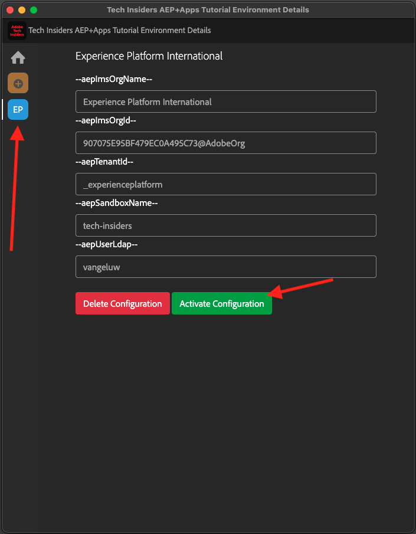

# 0.1.1 Installera Chrome-tillägget för dokumentationen för Experience League

## Om Chrome-tillägget

Dokumentationen har gjorts generisk så att den enkelt kan återanvändas av vem som helst, med valfri Adobe Experience Platform-instans.
För att dokumentationen ska kunna återanvändas introducerades **miljövariabler** i dokumentationen, vilket innebär att du hittar **platshållarna** nedan i dokumentationen. Varje platshållare är en specifik variabel för en viss miljö, och Chrome-tillägget ändrar variabeln så att du enkelt kan kopiera kod och text från självstudiesidorna och klistra in den i de olika användargränssnitt som du kommer att använda som en del av självstudiekursen.

Ett exempel på sådana värden finns nedan. Dessa värden kan för närvarande inte användas ännu, men så fort du installerar och aktiverar Chrome-tillägget kommer dessa variabler att ändras till normal text som du kan kopiera och återanvända.

| Namn | Nyckel |
|:-------------:| :---------------:|
| AEP IMS-organisations-ID | `--aepImsOrgId--` |
| Klient-ID för AEP | `--aepTenantId--` |
| Namn på AEP-sandlåda | `--aepSandboxName--` |
| LDAP för lärarprofil | `--aepUserLdap--` |

I skärmbilden nedan visas till exempel en referens till `aepTenantId`.

När tillägget har installerats ändras den texten automatiskt så att den återspeglar dina instansspecifika värden.

## 0.1.1.1 Installera Chrome-tillägget

Om du vill installera det Chrome-tillägget öppnar du webbläsaren i Chrome och går till: [https://chromewebstore.google.com/detail/tech-insiders-learning-fo/hhnbkfgioecmhimdhooigajdajplinfi](https://chromewebstore.google.com/detail/tech-insiders-learning-fo/hhnbkfgioecmhimdhooigajdajplinfi). Då ser du det här.

Klicka på **Lägg till i Chrome**.

Då ser du det här. Klicka på **Lägg till tillägg**.

Tillägget installeras sedan och ett liknande meddelande visas.

Klicka på ikonen **pusselbit** på menyn **extensions** och fäst tillägget **Platform Learn - Configuration** på tilläggsmenyn.

## 0.1.1.2 Konfigurera Chrome-tillägget

Gå till [https://experienceleague.adobe.com/en/docs/platform-learn/tutorial-comprehensive-technical/overview](https://experienceleague.adobe.com/en/docs/platform-learn/tutorial-comprehensive-technical/overview) och klicka sedan på tilläggsikonen för att öppna den.

Du kommer då att se den här popup-rutan. Klicka på ikonen **+**.

Ange de värden som anges nedan, som alla är relaterade till din Adobe Experience Platform-instans.

Om du är osäker på vilka värden du ska ange för de här fälten följer du riktlinjerna nedan.

**AEP IMS-organisationsnamn**

När du loggar in på din Adobe Experience Platform-instans på [https://platform.adobe.com/](https://platform.adobe.com/) hittar du namnet på din instans i skärmens övre högra hörn.

**AEP IMS-organisation-ID**

IMS-organisations-ID är den unika identifieraren för din Adobe Experience Cloud-instans, och den refereras till på flera platser under hela kursen.

Du kan söka efter ditt IMS-organisations-ID på flera sätt. Om du är osäker kan du söka efter ditt ID hos en av systemadministratörerna för instansen.

Du kan hitta den genom att gå till [Admin Console](https://https://adminconsole.adobe.com/), där du kan hitta den som en del av URL:en.

Du kan också hitta den genom att gå till **Datahantering > Frågor** på AEP-menyn, där du hittar den under **Användarnamn**.

Se till att kopiera och klistra in delen **@AdobeOrg** tillsammans med ID:t.

**AEP-klient-ID**

Klient-ID är den unika identifieraren för organisationens AEP-instans. När du loggar in på din Adobe Experience Platform-instans på [https://platform.adobe.com/](https://platform.adobe.com/) hittar du klient-ID:t i URL:en.

När du anger det i Chrome-tillägget bör du se till att ett understreck läggs till som ett prefix, så i det här exemplet blir **ExperiencePlatform** **_experienceplatform**.

**Namn på AEP-sandlåda**

Ditt sandlådenamn är namnet på miljön som du kommer att använda i din AEP-instans. När du loggar in på din Adobe Experience Platform-instans på [https://platform.adobe.com/](https://platform.adobe.com/) hittar du klient-ID:t i URL:en.

Innan du tar sandlådans namn från URL:en bör du kontrollera att du är i sandlådan som du bör använda för den här självstudiekursen. Du kan växla till den högra sandlådan genom att klicka på sandlådeväxlarmenyn i skärmens övre högra hörn.

I det här exemplet är AEP-sandlådans namn **tech-insiders**.

**Din LDAP**

Det här är användarnamnet som kommer att användas som en del av självstudiekursen. I det här exemplet baseras LDAP på den här användarens e-postadress. E-postadressen är **vangeluw@adobe.com** så LDAP blir **vangeluw**.

LDAP används för att se till att konfigurationen som du gör länkas till dig och inte hamnar i konflikt med andra användare som kanske använder samma instans och sandlåda som du använder.

Dina värden bör se ut ungefär som dessa.
Klicka slutligen på **Skapa ny**.

På den vänstra menyn i tillägget visas nu en ny ikon med miljöns initialer. Klicka på den. Du ser sedan mappningen mellan **miljövariablerna** och dina specifika Adobe Experience Platform-instansvärden. Klicka på **Aktivera konfiguration**.

När du har aktiverat konfigurationen visas en grön punkt bredvid initialerna för miljön. Det innebär att din miljö nu är aktiv.

## 0.1.1.3 Verifiera kursens innehåll

Gå till [den här sidan](https://experienceleague.adobe.com/en/docs/platform-learn/tutorial-comprehensive-technical/datadistiller/module51/ex3) som ett test.

Du bör nu se att alla **miljövariabler** har ersatts med sina verkliga värden, baserat på den aktiverade miljön i Chrome-tillägget.

Du bör nu ha en vy som liknar den nedan, där miljövariabeln `aepTenantId` har ersatts av ditt riktiga AEP-klient-ID, som i det här fallet är **_experienceplatform**.

Nästa steg: [0.2 Använd demonstrationssystemet bredvid för att konfigurera klientegenskapen för Adobe Experience Platform Data Collection](./ex2.md)

[Gå tillbaka till modul 0](./getting-started.md)

[Gå tillbaka till Alla moduler](./../../../overview.md)
