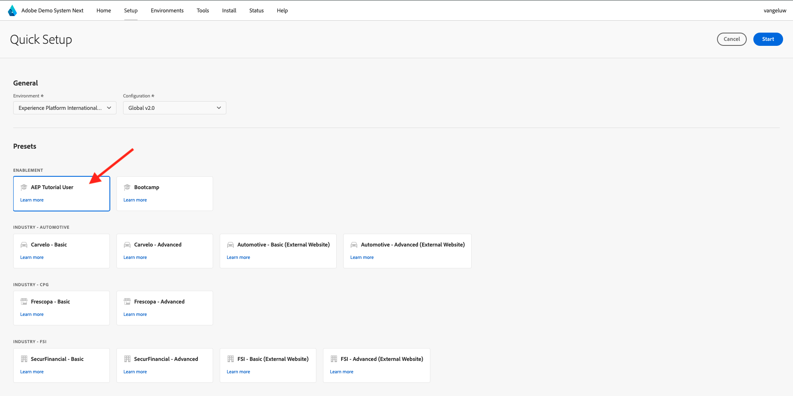

# Använd Demo System bredvid för att konfigurera klientegenskapen för Adobe Experience Platform Data Collection

För att visualisera inlärningarna i den här självstudiekursen och göra det möjligt för dig att testa konfigurationen i en säker miljö använder den här självstudiekursen verktygen Adobe Demo System Next. För att få ut det mesta av den här självstudiekursen måste din AEP-instans konfigureras så att den integreras med Demo System Next.

När du har tillgång till Demo System Next fortsätter du med stegen nedan.

Gå till [https://dsn.adobe.com/](https://dsn.adobe.com/) och navigera till **Inställningar**.

I listrutan **Miljö** väljer du AEP-instansen och sandlådan.

Välj sedan förinställningen **AEP Tutorial User**.

Klicka sedan på **Start**.

På popup-menyn anger du ett namn för dina datainsamlingsegenskaper och Experience Builder-projekt. Använd den här namnkonventionen: **Demonstrationssystem (DD/MM/ÅÅÅÅ)**. Obs! LDAP-filen läggs till automatiskt, du behöver inte lägga till den själv.

Klicka på **Start**.

Du kommer då att se den här popup-rutan, som visar hur arbetet fortskrider när du skapar projekt för webbplatser och mobilappar samt egenskaper för datainsamling.

När snabbinstallationsprocessen är klar får du:

- 1 webbprojekt, vilket gör det möjligt att använda en demowebbplats med ett telco-demomärke
- 1 mobilappsprojekt, vilket gör det möjligt att använda en demomobilapp med ett telco-demomärke
- 1 CX App-projekt, som gör det möjligt att använda en call center-app med ett telco-demomärke
- 1 Datainsamlingsegenskap för webben, som du använder för att samla in data från webbplatsen
- 1 Datainsamlingsegenskap för mobilen, som du använder för att samla in data från mobilappen

Håll den här skärmen öppen som du vill i nästa steg.

Nästa steg: [Skapa ditt datastream](./ex3.md)

[Gå tillbaka till Komma igång](./getting-started.md)

[Gå tillbaka till Alla moduler](./../../../overview.md)
