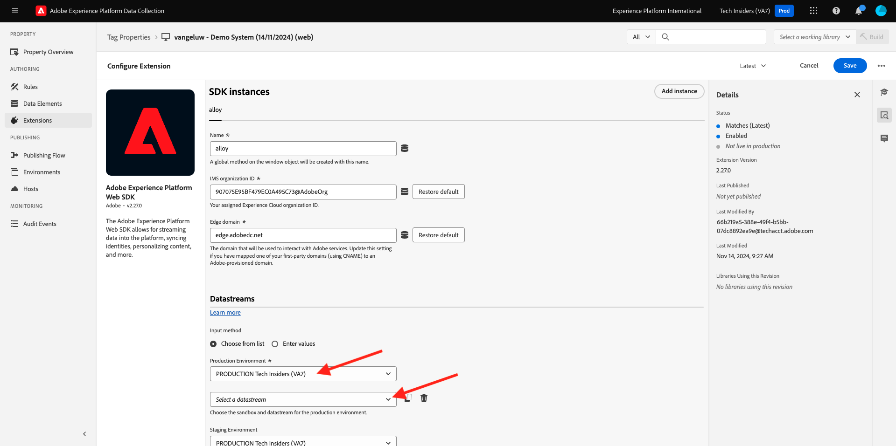
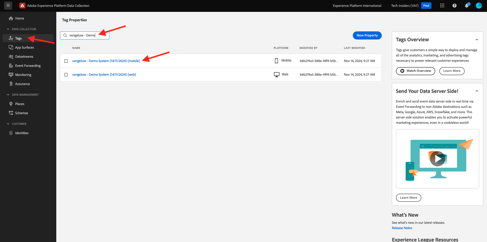

# Skapa ditt datastream

Gå till [https://experience.adobe.com/#/data-collection/](https://experience.adobe.com/#/data-collection/).

Klicka på **[!UICONTROL Tags]** på den vänstra menyn. Efter föregående övning har du nu tre egenskaper för datainsamling: en för webben, en för mobilen och en för CX-appen.

Dessa egenskaper är nästan klara att användas, men innan du kan börja samla in data med dessa egenskaper måste du konfigurera en datastream. Du får mer information om vad ett datastream är och vad det innebär i en senare övning i datainsamlingsmodulen.

Följ dessa steg tills vidare.

## Skapa ett datastream för webben

Klicka på **[!UICONTROL Datastreams]**.

I skärmens övre högra hörn väljer du namnet på sandlådan, som ska vara `--aepSandboxName--`.

Klicka på **[!UICONTROL New Datastream]**.

Ange `--aepUserLdap-- - Demo System Datastream` för **[!UICONTROL Name]** och den valfria beskrivningen. För **Mappningsschema** väljer du **Demonstrationssystem - händelseschema för webbplatsen (Global v1.1)**. Klicka på **Spara**.

Då ser du det här. Klicka på **Lägg till tjänst**.

Välj tjänsten **[!UICONTROL Adobe Experience Platform]**, som visar ytterligare fält. Då ser du det här.

För händelsedatauppsättning väljer du **Demonstrationssystem - händelsedatauppsättning för webbplats (Global v1.1)** och för profildatauppsättning väljer du **Demonstrationssystem - profildatauppsättning för webbplats (Global v1.1)**. Klicka på **Spara**.

Du kommer att se det här.

Det är allt för tillfället. I [Modul 1.1](./../../../modules/datacollection/module1.1/data-ingestion-launch-web-sdk.md) får du lära dig mer om Web SDK och hur du konfigurerar alla dess funktioner.

Klicka på **[!UICONTROL Tags]** på den vänstra menyn.

Filtrera sökresultaten så att du kan se dina datainsamlingsegenskaper. Öppna egenskapen för **webben** genom att klicka på den.

Då ser du det här. Klicka på **Tillägg**.

Klicka först på Adobe Experience Platform Web SDK-tillägget och sedan på **Konfigurera**.

Då ser du det här. Kontrollera att rätt sandlåda är markerad på menyn **Datastreams** och se till att rätt sandlåda är markerad, som i ditt fall ska vara `--aepSandboxName--`.

Öppna listrutan **Datastreams** och välj den datastream som du skapade tidigare.

Se till att du har valt din **datastream** i alla tre olika miljöer. Klicka sedan på **Spara**.

Gå till **Publiceringsflöde**.

Klicka på **..** för **Main** och klicka sedan på **Edit**.

Klicka på **Lägg till alla ändrade resurser** och sedan på **Spara och skapa för utveckling**.

Ändringarna publiceras nu och är klara om några minuter. Därefter visas den gröna punkten intill **Main**.

## Skapa ditt datastream för mobilen

Gå till [https://experience.adobe.com/#/data-collection/](https://experience.adobe.com/#/data-collection/).

Klicka på **[!UICONTROL Datastreams]**.

I skärmens övre högra hörn väljer du namnet på sandlådan, som ska vara `--aepSandboxName--`.

Klicka på **[!UICONTROL New Datastream]**.

Ange `--aepUserLdap-- - Demo System Datastream (Mobile)` för **[!UICONTROL Friendly Name]** och den valfria beskrivningen. För **Mappningsschema** väljer du **Demonstrationssystem - händelseschema för mobilapp (Global v1.1)**. Klicka på **Spara**.

Klicka på **[!UICONTROL Save]**.

Då ser du det här. Klicka på **Lägg till tjänst**.

Välj tjänsten **[!UICONTROL Adobe Experience Platform]**, som visar ytterligare fält. Då ser du det här.

För händelsedatauppsättning väljer du **Demonstrationssystem - händelsedatauppsättning för mobilapp (Global v1.1)** och för profildatauppsättning väljer du **Demonstrationssystem - profildatauppsättning för mobilapp (Global v1.1)**. Klicka på **Spara**.

Då ser du det här.

Din datastream är nu klar att användas i din klientegenskap för Adobe Experience Platform Data Collection för mobilen.

Gå till **Taggar** och filtrera sökresultaten så att du kan se dina datainsamlingsegenskaper. Öppna egenskapen för **Mobile** genom att klicka på den.

Då ser du det här. Klicka på **Tillägg**.

Klicka på tillägget **Adobe Experience Platform Edge Network** och sedan på **Konfigurera**.

Då ser du det här. Nu måste du välja rätt sandlåda och datastream som du precis konfigurerade. Sandlådan som ska användas är `--aepSandboxName--` och datastream kallas `--aepUserLdap-- - Demo System Datastream (Mobile)`.

Använd standarddomänen för **Edge Network**.

Klicka på **Spara** för att spara ändringarna.

Gå till **Publiceringsflöde**.

Klicka på **..** bredvid **Huvudsida** och klicka sedan på **Redigera**.

Klicka på **Lägg till alla ändrade resurser** och sedan på **Spara och skapa för utveckling**.

Ändringarna publiceras nu och är klara om några minuter. Därefter visas den gröna punkten intill **Main**.

Nästa steg: [Använd webbplatsen](./ex4.md)

[Gå tillbaka till Komma igång](./getting-started.md)

[Gå tillbaka till Alla moduler](./../../../overview.md)
