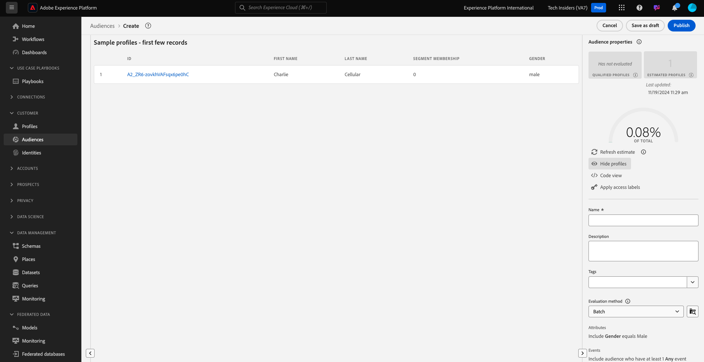

# 2.1.4 Skapa ett segment - användargränssnitt

I den här övningen skapar du ett segment genom att använda Adobe Experience Platform Segment Builder.

Gå till [Adobe Experience Platform](https://experience.adobe.com/platform). När du har loggat in loggar du in på Adobe Experience Platform hemsida.


Innan du fortsätter måste du välja en **sandlåda**. Sandlådan som ska markeras har namnet ``--aepSandboxName--``. När du har valt rätt [!UICONTROL sandbox] visas skärmändringen och nu är du i din dedikerade [!UICONTROL sandbox].


Gå till **Publiker** på menyn till vänster. På den här sidan visas en översikt över alla befintliga segment. Klicka på knappen **+ Skapa målgrupp** för att börja skapa ett nytt segment.


Välj **Skapa regel** och klicka på **Skapa**.


När du är i det nya segmentbyggaren lägger du omedelbart märke till menyalternativet **Attribut** och referensen **XDM Individual Profile** .


Eftersom XDM är det språk som driver upplevelseverksamheten är XDM också grunden för målgruppsbyggaren. Alla data som är inkapslade i Platform ska mappas mot XDM, och som sådana blir alla data en del av samma datamodell oavsett varifrån dessa data kommer. Detta ger er en stor fördel när ni bygger målgrupper, och från det här användargränssnittet för målgruppsbyggaren kan ni kombinera data från vilket ursprung som helst i samma arbetsflöde. Publiker som skapats i målgruppsbyggaren kan skickas till lösningar som Adobe Target, Adobe Campaign och Adobe Audience Manager för aktivering.

Låt oss skapa en målgrupp som innehåller alla **manliga** kunder.

För att komma till könsattributet måste du förstå och känna till XDM.

Kön är ett attribut till Person, som finns under Attribut. För att komma dit börjar du med att klicka på **XDM Individual Profile**. Då ser du det här. I fönstret **XDM Individual Profile** väljer du **Person**.


Då ser du det här. I **Person** hittar du attributet **Kön**. Dra könsattributet till målgruppsverktyget.


Nu kan du välja ett specifikt kön bland de förifyllda alternativen. I det här fallet väljer vi **Man**.


När du har valt **Handbok** kan du få en uppskattning av målgruppens population genom att trycka på knappen **Uppdatera uppskattning** . Detta är mycket användbart för en affärsanvändare, så att de kan se effekten av vissa attribut på målgruppens storlek.


Du kommer då att se en uppskattning som den nedan:


Därefter bör ni förfina er målgrupp lite. Du måste skapa en målgrupp med alla manliga kunder som har tittat på produkten **iPhone 15 Pro**.

Om ni vill bygga ut den här målgruppen måste ni lägga till en Experience Event. Du kan hitta alla Experience Events genom att klicka på ikonen **Händelser** i menyfältet **Fält** . Därefter visas noden **XDM ExperienceEvents** på den översta nivån. Klicka på **XDM ExperienceEvent**.


Gå till **Produktlisteobjekt**.


Markera **Namn** och dra och släpp objektet **Namn** från den vänstra menyn på målgruppsarbetsytan i avsnittet **Händelser**.


Då ser du det här:


Jämförelseparametern ska vara **lika med** och i indatafältet anger du **iPhone 15 Pro**.


Varje gång du lägger till ett element i målgruppsverktyget kan du klicka på knappen **Uppdatera uppskattning** för att få en ny uppskattning av målgruppspopulationen.

Hittills har ni bara använt användargränssnittet för att skapa er målgrupp, men det finns också ett kodalternativ för att skapa en målgrupp.

När du skapar en målgrupp komponerar du faktiskt en Profile Query Language-fråga (PQL). Om du vill visualisera PQL-koden kan du klicka på **kodvyn** i det övre högra hörnet i målgruppsverktyget.


Nu kan du se hela PQL-satsen:

```sql
person.gender in ["male"] and CHAIN(xEvent, timestamp, [C0: WHAT(productListItems.exists(name.equals("iPhone 15 Pro", false)))])
```

Du kan också förhandsgranska ett exempel på kundprofiler som är en del av den här målgruppen genom att klicka på **Visa profiler**.



Äntligen får ni ett namn
Ange **Utvärderingsmetoden** till **Direktuppspelning** och klicka på **Publish**.

Använd följande som namnkonvention:

- `--aepUserLdap-- - Male customers with interest in iPhone 15 Pro`


Du kommer tillbaka till sidan Audience overview.


Nästa steg: [2.1.5 Se hur kundprofilen i realtid fungerar i Call Center](./ex5.md)

[Gå tillbaka till modul 2.1](./real-time-customer-profile.md)

[Gå tillbaka till Alla moduler](../../../overview.md)
