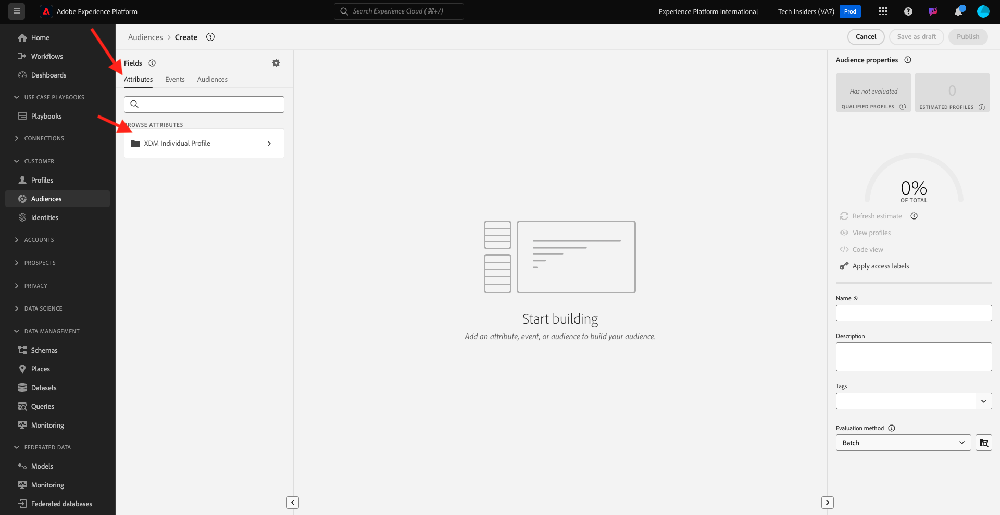

# 2.1.4 Skapa ett segment - användargränssnitt

I den här övningen skapar du ett segment genom att använda Adobe Experience Platform Segment Builder.

## Artikel

Gå till [Adobe Experience Platform](https://experience.adobe.com/platform). När du har loggat in loggar du in på Adobe Experience Platform hemsida.


Innan du fortsätter måste du välja en **sandlåda**. Sandlådan som ska markeras har namnet ``--aepSandboxName--``. Du kan göra detta genom att klicka på texten **[!UICONTROL Production Prod]** i den blå raden ovanför skärmen. När du har valt rätt [!UICONTROL sandbox] visas skärmändringen och nu är du i din dedikerade [!UICONTROL sandbox].


Gå till **Segment** på menyn till vänster. På den här sidan visas en översikt över alla befintliga segment. Klicka på knappen **+ Skapa segment** för att börja skapa ett nytt segment.


När du är i det nya segmentbyggaren lägger du omedelbart märke till menyalternativet **Attribut** och referensen **XDM Individual Profile** .



Eftersom XDM är det språk som används i upplevelseverksamheten är XDM även grunden för segmentbyggaren. Alla data som är inkapslade i Platform ska mappas mot XDM, och som sådana blir alla data en del av samma datamodell oavsett varifrån dessa data kommer. Detta ger en stor fördel när du skapar segment, eftersom ni från det här segmentbyggargränssnittet kan kombinera data från vilket ursprung som helst i samma arbetsflöde. Segment som byggts i Segment Builder kan skickas till lösningar som Adobe Target, Adobe Campaign och Adobe Audience Manager för aktivering.

Låt oss skapa ett segment som innehåller alla **manliga** kunder.

För att komma till könsattributet måste du förstå och känna till XDM.

Kön är ett attribut till Person, som finns under Attribut. För att komma dit börjar du med att klicka på **XDM Individual Profile**. Då ser du det här. I fönstret **XDM Individual Profile** väljer du **Person**.


Då ser du det här. I **Person** hittar du attributet **Kön**. Dra Genusattributet till segmentbyggaren.


Nu kan du välja ett specifikt kön bland de förifyllda alternativen. I det här fallet väljer vi **Man**.


När du har valt **Handbok** kan du få en uppskattning av segmentets population genom att trycka på knappen **Uppdatera uppskattning**. Detta är mycket användbart för en affärsanvändare, så att de kan se hur vissa attribut påverkar segmentstorleken.


Du kommer då att se en uppskattning som den nedan:


Därefter bör du finjustera segmentet lite. Du måste bygga ut ett segment av alla manliga kunder som har tittat på produkten **Proteus Fitness Jackshirt (Orange)**.

Om du vill bygga ut det här segmentet måste du lägga till en Experience Event. Du kan hitta alla Experience Events genom att klicka på ikonen **Händelser** i menyfältet **Fält** .


Därefter visas noden **XDM ExperienceEvents** på den översta nivån. Klicka på **XDM ExperienceEvent**.


Gå till **Produktlisteobjekt**.


Markera **Namn** och dra och släpp objektet **Namn** från den vänstra menyn på segmentbyggarbetsytan i avsnittet **Händelser**.


Då ser du det här:


Jämförelseparametern ska vara **lika med** och i indatafältet anger du **MONTANA WIND JACKET**.


Varje gång du lägger till ett element i segmentbyggaren kan du klicka på knappen **Uppdatera uppskattning** för att få en ny uppskattning av populationen i ditt segment.

Hittills har du bara använt användargränssnittet för att skapa ditt segment, men det finns också ett kodalternativ för att skapa ett segment.

När du skapar ett segment skapar du faktiskt en Profile Query Language-fråga (PQL). Om du vill visualisera PQL-koden kan du klicka på väljaren **Kodvy** i det övre högra hörnet av segmentverktyget.


Nu kan du se hela PQL-satsen:

```sql
person.gender in ["male"] and CHAIN(xEvent, timestamp, [C0: WHAT(productListItems.exists(name.equals("MONTANA WIND JACKET", false)))])
```

Du kan också förhandsgranska ett exempel på kundprofiler som ingår i det här segmentet genom att klicka på **Visa profiler**.


Till sist ger vi segmentet ett namn och sparar det.

Använd följande som namnkonvention:

- `--aepUserLdap-- - Male customers with interest in Montana Wind Jacket`


Klicka sedan på knappen **Spara och stäng** för att spara segmentet. Sedan återgår du till sidan Segmentöversikt.


Du kan nu fortsätta med nästa övning och skapa ett segment via API:t.

Nästa steg: [2.1.5 Skapa ett segment - API](./ex5.md)

[Gå tillbaka till modul 2.1](./real-time-customer-profile.md)

[Gå tillbaka till Alla moduler](../../../overview.md)
