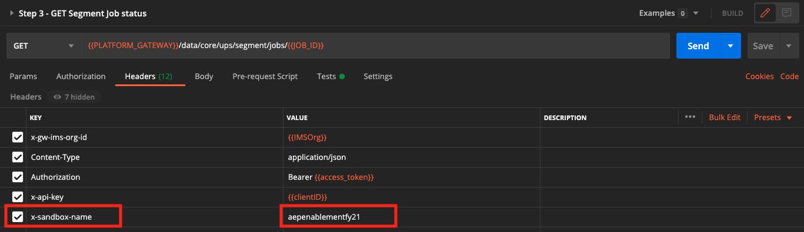

# 2.1.5 Skapa ett segment - API

I den här övningen ska du använda Postman och Adobe I/O för att skapa ett segment och lagra resultatet av det segmentet som en datauppsättning genom att använda Adobe Experience Platform API:er.

## Artikel

I kundprofilen i realtid visas alla profildata tillsammans med händelsedata och befintliga segmentmedlemskap. De data som visas kan komma var som helst, från Adobe-program och externa lösningar. Detta är den mest kraftfulla vyn i Adobe Experience Platform, det upplevelsesystem som finns.

## 2.1.5.1 - Skapa ett segment via plattforms-API

Gå till Postman.

Leta reda på samlingen: **_Adobe Experience Platform Enablement**. I den här samlingen visas en mapp **2. Segmentering**. Vi kommer att använda de här förfrågningarna i den här övningen.


Vi ska nu följa alla steg som krävs för att skapa ett segment via API:t. Vi ska skapa ett enkelt segment: **ldap** - Alla kvinnliga kunder.

### Steg 1 - Skapa en segmentdefinition

Klicka på begäran **Steg 1 - Profil: Skapa en segmentdefinition**.


Gå till avsnittet **Brödtext** i den här begäran.


I **brödtexten** i den här begäran visas följande:


Språket som används för denna begäran kallas Profile Query Language eller **PQL**.

Du hittar mer information och dokumentation om PQL [här](https://experienceleague.adobe.com/docs/experience-platform/segmentation/pql/overview.html?lang=en).


Obs! Uppdatera variabeln **name** i nedanstående begäran genom att ersätta **ldap** med din specifika **ldap**.

```json
{
    "name" : "ldap - API - All Female Customer",
    "expression" : {"type":"PQL", "format":"pql/json", "value":"{\"nodeType\":\"fnApply\",\"fnName\":\"in\",\"params\":[{\"nodeType\":\"fieldLookup\",\"fieldName\":\"gender\",\"object\":{\"nodeType\":\"fieldLookup\",\"fieldName\":\"person\",\"object\":{\"nodeType\":\"literal\",\"literalType\":\"XDMObject\",\"value\":\"profile\"}}},{\"literalType\":\"List\",\"nodeType\":\"literal\",\"value\":[\"female\"]}]}"},
    "createdBy": "ldap",
    "schema" : { "name" : "_xdm.context.profile"},
    "ttlInDays" : 90
}
```

När du har lagt till din specifika **ldap** bör brödtexten se ut ungefär så här:

```json
{
    "name" : "vangeluw - API - All Female Customer",
    "expression" : {"type":"PQL", "format":"pql/json", "value":"{\"nodeType\":\"fnApply\",\"fnName\":\"in\",\"params\":[{\"nodeType\":\"fieldLookup\",\"fieldName\":\"gender\",\"object\":{\"nodeType\":\"fieldLookup\",\"fieldName\":\"person\",\"object\":{\"nodeType\":\"literal\",\"literalType\":\"XDMObject\",\"value\":\"profile\"}}},{\"literalType\":\"List\",\"nodeType\":\"literal\",\"value\":[\"female\"]}]}"},
    "createdBy": "vangeluw",
    "schema" : { "name" : "_xdm.context.profile"},
    "ttlInDays" : 90
}
```

Du bör även verifiera fälten **Header** - i din begäran. Gå till **Sidhuvuden**. Då ser du det här:


| Nyckel | Värde |
| -------------- | ------------------ |
| x-sandbox-name | `--aepSandboxName--` |

>[!NOTE]
>
>Du måste ange namnet på den Adobe Experience Platform-sandlåda som du använder. Ditt x-sandbox-namn ska vara `--aepSandboxName--`.

Klicka nu på den blå **Skicka**-knappen för att skapa segmentet och visa resultatet av det.


Efter det här steget kan du visa din segmentdefinition i användargränssnittet för plattformen. Om du vill kontrollera detta loggar du in på Adobe Experience Platform och går till **Segment**.


### Steg 2 - Skapa ett jobb för POST av segment

I den föregående övningen skapade du ett _direktuppspelat_-segment. Ett direktuppspelningssegment utvärderar kontinuerligt kvalifikationer i realtid. Det du gör här är att skapa ett _batch_-segment. Gruppsegmentet ger dig en förhandsvisning av hur segmentet kan se ut när det gäller kvalifikationer, men _betyder inte att segmentet faktiskt har körts_. _Ingen kvalificerar sig för det här segmentet_. För att göra folk kvalificerade måste gruppsegmentet köras, vilket är precis vad vi ska göra här.

Nu ska vi POST ett segmentjobb.

Gå till Postman.


Öppna Postman-samlingen genom att klicka på begäran **Steg 2 - POST Segment Job**.


Du bör även verifiera fälten **Header** - i din begäran. Gå till **Sidhuvuden**. Då ser du det här:


| Nyckel | Värde |
| -------------- | ------------------ |
| x-sandbox-name | `--aepSandboxName--` |

>[!NOTE]
>
>Du måste ange namnet på den Adobe Experience Platform-sandlåda som du använder. Ditt x-sandbox-namn ska vara `--aepSandboxName--`.

Klicka på den blå **Skicka**-knappen.

Du bör få ett liknande resultat:


Det här segmentjobbet körs nu och det kan ta en stund. I steg 3 kan du kontrollera statusen för det här jobbet.


### Steg 3 - Jobbstatus för GET segment

Gå till Postman.


I din Postman-samling klickar du på den begäran som heter **Steg 3 - jobbstatus för GET-segmentet**.


Du bör även verifiera fälten **Header** - i din begäran. Gå till **Sidhuvuden**. Då ser du det här:



| Nyckel | Värde |
| -------------- | ------------------ |
| x-sandbox-name | `--aepSandboxName--` |

>[!NOTE]
>
>Du måste ange namnet på den Adobe Experience Platform-sandlåda som du använder. Ditt x-sandbox-namn ska vara `--aepSandboxName--`.

Klicka på den blå **Skicka**-knappen.

Du bör få ett liknande resultat:


I det här exemplet är jobbets **status** inställd på **QUEUED**.

Upprepa denna begäran genom att klicka på den blå knappen **Skicka** var minut tills **status** är inställd på **SLUTFÖRT**.


När statusen är **SLUTFÖRD** har ditt segmentjobb körts och kunderna kvalificerar sig nu för segmentet.

Grattis, du har slutfört segmenteringsövningen. Nu ska vi se hur kundprofilen i realtid kan aktiveras i hela företaget.

Nästa steg: [2.1.6 Se hur kundprofilen i realtid fungerar i Call Center](./ex6.md)

[Gå tillbaka till modul 2.1](./real-time-customer-profile.md)

[Gå tillbaka till Alla moduler](../../../overview.md)
