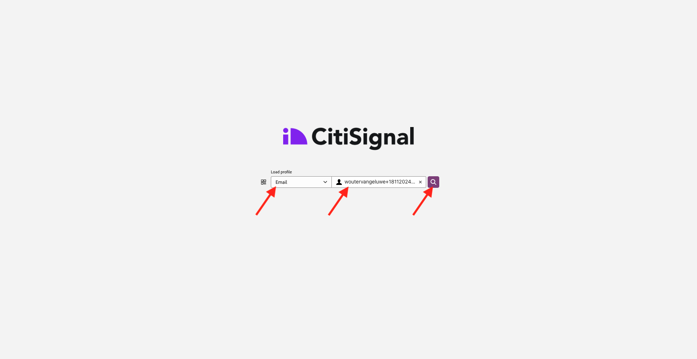

# 2.1.6 Se hur kundprofilen i realtid fungerar i Call Center

I den här övningen är målet att få er att gå igenom kundresan och agera som en riktig kund.

På denna webbplats har vi implementerat Adobe Experience Platform. Varje åtgärd betraktas som en upplevelsehändelse och skickas till Adobe Experience Platform i realtid, vilket innebär att kundprofilen i realtid hydreras.

I en tidigare övning började du som anonym kund som surfade på webbplatsen, och efter ett par steg blev du en känd kund.

När samma kund så småningom får tag i telefonen och ringer ert callcenter är det avgörande att informationen från andra kanaler blir tillgänglig omedelbart, så att samtalscentrets upplevelse kan vara relevant och personaliserad.

## 2.1.6.1 Använda din CX-app

Som en del av vårt demosystem har vi skapat en CX App-mall som kan användas för att simulera en callcentermiljö. Följ de här stegen för att skapa ett sådant CX App-projekt.

Gå till [https://builder.adobedemo.com/projects](https://builder.adobedemo.com/projects). Klicka på **Nytt projekt**.

Sedan visas ditt CX App-projekt. Klicka på projektet för att öppna det.

Gå till **Integreringar** i ditt CX-appprojekt. Markera Adobe Experience Platform Data Collection-egenskapen som skapades i modul 0. Du måste markera egenskapen som har **(enablement)** i namnet. Klicka sedan på **Kör**.

Då ser du det här.

På panelen Profilvisningsprogram kan du se följande kombinationer av ID:n och namnutrymmen:

| Identitet | Namnutrymme |
|:-------------:| :---------------:|
| Experience Cloud ID (ECID) | 12507560687324495704459439363261812234 |
| E-post-ID | woutervangeluwe+06022022-01@gmail.com |
| Mobilnummer-ID | +32473622044+06022022-01 |

När kunden ringer till er kundtjänst kan telefonnumret användas för att identifiera kunden. I den här övningen använder du telefonnumret för att hämta kundens profil i appen för kundupplevelser.

Välj **Telefonnummer** i listrutan och ange det telefonnummer som du använde på webbplatsen. Tryck på **Enter**.

Nu kommer du att se den information som helst skulle visas i Samtalscentret, så att de anställda på Samtalscentret får all relevant information direkt tillgänglig när de talar till en kund.

Nästa steg: [Sammanfattning och förmåner](./summary.md)

[Gå tillbaka till modul 2.1](./real-time-customer-profile.md)

[Gå tillbaka till Alla moduler](../../../overview.md)
