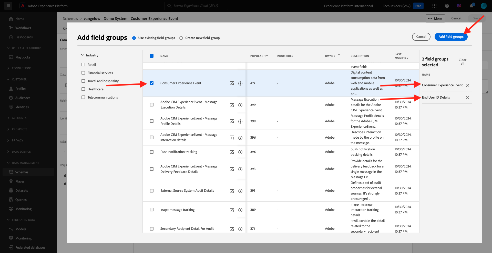
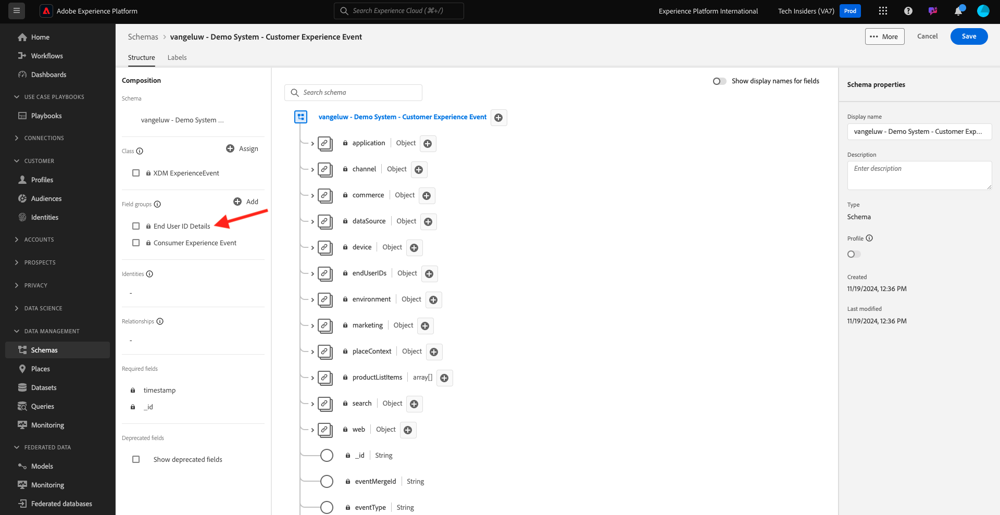

# 2.2.1 Customer AI - Data Preparation (Ingest)

För att Intelligent Services ska kunna hitta insikter från era marknadsföringshändelsedata måste data anrikas semantiskt och underhållas i en standardstruktur. Intelligent Services utnyttjar scheman från Adobe Experience Data Model (XDM) för att uppnå detta.
Alla datauppsättningar som används i Intelligent Services måste överensstämma med XDM-schemat **Consumer Experience Event** .

## 2.2.1.1 Skapa schema

I den här övningen skapar du ett schema som innehåller **Consumer Experience Event mixin**, vilket krävs av **Customer AI** Intelligent Service.

Logga in på Adobe Experience Platform via följande URL: [https://experience.adobe.com/platform](https://experience.adobe.com/platform).

När du har loggat in loggar du in på Adobe Experience Platform hemsida.

Innan du fortsätter måste du välja en **sandlåda**. Sandlådan som ska markeras har namnet ``--module10sandbox--``. Du kan göra detta genom att klicka på texten **[!UICONTROL Production Prod]** i den blå raden ovanför skärmen. När du har valt rätt sandlåda ser du skärmändringen och nu befinner du dig i din dedikerade sandlåda.

Klicka på **Scheman** på den vänstra menyn och gå till **Bläddra**. Klicka på **Skapa schema**.

Välj **XDM ExperienceEvent** på popup-menyn.

Då ser du det här.

Sök efter och välj följande **Mixins** som ska läggas till i schemat:

- Consumer Experience Event

  

- Information om slutanvändar-ID

  

Klicka på **Lägg till fältgrupper**.

Då ser du det här. Välj **Information om** för blandat användar-ID.

Navigera till fältet **endUserID:n._experience.emailid.id**.

I den högra menyn för fältet **endUserIDs._experience.emailid.id**, rulla nedåt och markera kryssrutan för **Identitet**, markera kryssrutan för **Primär identitet** och markera **Identitetsnamnrymden** för **E-post**.

Navigera till fältet **endUserID:n._experience.mcid.id**. Markera kryssrutan för **Identitet** och markera **Identitetsnamnrymden** för **ECID**. Klicka på **Använd**.

Ge schemat ett namn nu.

Som namn för vårt schema ska du använda följande:

- `--aepUserLdap-- - Demo System - Customer Experience Event`

För ldap **vangeluw** bör det här till exempel vara schemats namn:

- **vangeluw - Demo System - Customer Experience Event**

Det borde ge dig något såhär. Klicka på knappen **+ Lägg till** för att lägga till nya **mixar**.

Välj namnet på schemat. Du bör nu aktivera ditt schema för **profilen** genom att klicka på växlingsknappen **Profil**.

Då ser du det här. Klicka på **Aktivera**.

Du borde ha den här nu. Klicka på **Spara** för att spara schemat.

## 2.2.1.2 Skapa datauppsättning

Klicka på **Datauppsättningar** på den vänstra menyn och gå till **Bläddra**. Klicka på **Skapa datauppsättning**.

Klicka på **Skapa datauppsättning från schema**.

På nästa skärm väljer du den datauppsättning som du skapade i föregående övning, med namnet **[!UICONTROL ldap - Demo System - Customer Experience Event]**. Klicka på **Nästa**.

Använd `--aepUserLdap-- - Demo System - Customer Experience Event Dataset` som namn för datauppsättningen. Klicka på **Slutför**.

Din datauppsättning har skapats. Aktivera växlingsknappen **Profil**.

Klicka på **Aktivera**.

Nu bör du ha den här:

Du är nu redo att börja inhämta data från kundupplevelsehändelser och börja använda kundens AI-tjänst.

## 2.2.1.3 Hämta testdata för Experience Event

När **schemat** och **datauppsättningen** har konfigurerats är du nu redo att importera Experience Event-data. Eftersom kundens AI kräver data på minst **kvartal** 2 måste du importera externt förberedda data.

Data som har förberetts för upplevelsehändelser måste uppfylla kraven och schemat för [Consumer Experience Event XDM Mixin](https://github.com/adobe/xdm/blob/797cf4930d5a80799a095256302675b1362c9a15/docs/reference/context/experienceevent-consumer.schema.md).

Hämta filen som innehåller exempeldata från den här platsen: [https://dashboard.adobedemo.com/data](https://dashboard.adobedemo.com/data). Klicka på knappen **Hämta**.

Om du inte kan komma åt länken ovan kan du även hämta filen från den här platsen: [https://aepmodule10.s3-us-west-2.amazonaws.com/retail-v1-dec2020-xl.json.zip](https://aepmodule10.s3-us-west-2.amazonaws.com/retail-v1-dec2020-xl.json.zip).

Du har nu laddat ned en fil med namnet **retail-v1-dec2020-xl.json.zip**. Placera filen på datorns skrivbord och zippa upp den. Därefter visas filen **retail-v1.json**. Du kommer att behöva den här filen i nästa övning.

## 2.2.1.4 Testdata för händelsen Ingest Experience

I Adobe Experience Platform går du till **Datauppsättningar** och öppnar din datauppsättning, som har namnet **[!UICONTROL ldap - Demo System - Customer Experience Event Dataset]**.

Klicka på **Välj filer** i datauppsättningen för att lägga till data.

På popup-menyn markerar du filen **retail-v1.json** och klickar på **Öppna**.

Du ser sedan de data som importeras och en ny grupp skapas i läget **Inläsning**. Navigera inte bort från den här sidan förrän filen har överförts.

När filen har överförts ser du att batchstatusen har ändrats från **Inläsning** till **Bearbetning**.

Inmatning och bearbetning av data kan ta 10-20 minuter.

När dataimporten är klar ändras batchstatusen till **Slutfört**.

Nästa steg: [2.2.2 Kundens AI - Skapa en ny instans (Konfigurera)](./ex2.md)

[Gå tillbaka till modul 2.2](./intelligent-services.md)

[Gå tillbaka till Alla moduler](./../../../overview.md)
