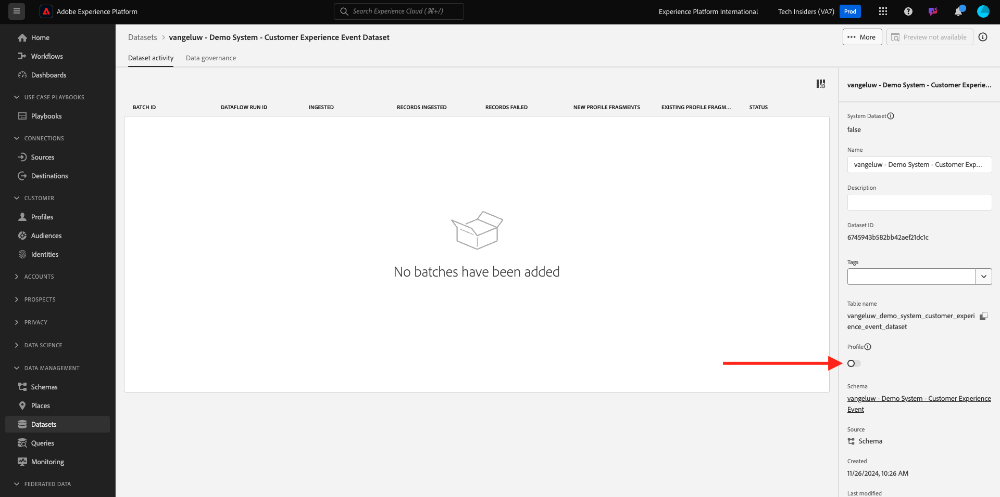

# 2.2.1 Customer AI - Data Preparation (Ingest)

För att Intelligent Services ska kunna hitta insikter från era marknadsföringshändelsedata måste data anrikas semantiskt och underhållas i en standardstruktur. Intelligent Services utnyttjar scheman från Adobe Experience Data Model (XDM) för att uppnå detta.
Alla datauppsättningar som används i Intelligent Services måste överensstämma med XDM-schemat **Consumer Experience Event** .

## Skapa schema

I den här övningen skapar du ett schema som innehåller **Consumer Experience Event mixin**, vilket krävs av **Customer AI** Intelligent Service.

Logga in på Adobe Experience Platform via följande URL: [https://experience.adobe.com/platform](https://experience.adobe.com/platform).

När du har loggat in loggar du in på Adobe Experience Platform hemsida.

Innan du fortsätter måste du välja en **sandlåda**. Sandlådan som ska markeras har namnet ``--aepSandboxName--``. När du har valt rätt sandlåda ser du skärmändringen och nu befinner du dig i din dedikerade sandlåda.

Klicka på **Scheman** på den vänstra menyn och gå till **Bläddra**. Klicka på **Skapa schema**.

Välj **Manuell** på popup-menyn och klicka på **Markera**.

Välj sedan **Experience Event** och klicka på **Next**.

Du måste ange ett namn för schemat nu. Använd det här som namn för vårt schema: `--aepUserLdap-- - Demo System - Customer Experience Event` och klicka på **Slutför**.

Då ser du det här. Klicka på **+ Lägg till** under Fältgrupper.

Sök efter och markera följande **fältgrupper** som ska läggas till i schemat:

- Consumer Experience Event

- IdentityMap

Klicka på **Lägg till fältgrupper**.

Då ser du det här. Välj sedan schemats namn. Du bör nu aktivera ditt schema för **profilen** genom att klicka på växlingsknappen **Profil**.

Då ser du det här. Markera kryssrutan för **Data för det här schemat kommer att innehålla en primär identitet i fältet identityMap.**. Klicka på **Aktivera**.

Du borde ha den här nu. Klicka på **Spara** för att spara schemat.

## Skapa datauppsättning

Klicka på **Datauppsättningar** på den vänstra menyn och gå till **Bläddra**. Klicka på **Skapa datauppsättning**.

Klicka på **Skapa datauppsättning från schema**.

På nästa skärm väljer du den datauppsättning som du skapade i föregående övning, med namnet **[!UICONTROL ldap - Demo System - Customer Experience Event]**. Klicka på **Nästa**.

Använd `--aepUserLdap-- - Demo System - Customer Experience Event Dataset` som namn för datauppsättningen. Klicka på **Slutför**.

Din datauppsättning har skapats. Aktivera växlingsknappen **Profil**.

Klicka på **Aktivera**.

Nu bör du ha den här:

Du är nu redo att börja inhämta data från kundupplevelsehändelser och börja använda kundens AI-tjänst.

## Hämta testdata för Experience Event

När **schemat** och **datauppsättningen** har konfigurerats är du nu redo att importera Experience Event-data. Eftersom kundens AI kräver särskilda datakrav måste du importera externt förberedda data.

De data som har förberetts för upplevelsehändelserna i den här övningen måste uppfylla kraven och schemat för [Consumer Experience Event XDM Field Group](https://github.com/adobe/xdm/blob/797cf4930d5a80799a095256302675b1362c9a15/docs/reference/context/experienceevent-consumer.schema.md).

Hämta zip-filen med demodata från den här platsen: [https://tech-insiders.s3.us-west-2.amazonaws.com/CUSTOM-CAI-EVENTS-WEB.zip](https://tech-insiders.s3.us-west-2.amazonaws.com/CUSTOM-CAI-EVENTS-WEB.zip).

Du har nu laddat ned en fil med namnet **CUSTOM-CAI-EVENTS-WEB.zip**. Placera filen på datorns skrivbord och zippa upp den. Därefter visas en mapp med namnet **CUSTOM-CAI-EVENTS-WEB**.

I den mappen hittar du flera sekvensjson-filer som alla måste importeras i nästa övning.

## Testdata för Ingest Experience Event

I Adobe Experience Platform går du till **Datauppsättningar** och öppnar din datauppsättning, som har namnet **[!UICONTROL ldap - Demo System - Customer Experience Event Dataset]**.

Klicka på **Välj filer** i datauppsättningen för att lägga till data.

På popup-menyn markerar du filerna **WEBSITE-EE-1.json** till **WEBSITE-EE-5.json** och klickar på **Öppna**.

Upprepa den här importprocessen för filerna **WEBSITE-EE-6.json** och **WEBSITE-EE-7.json**.

Du ser sedan de data som importeras och en ny grupp skapas i läget **Inläsning**. Navigera inte bort från den här sidan förrän filen har överförts.

När filen har överförts ser du att batchstatusen har ändrats från **Inläsning** till **Bearbetning**.

Inmatning och bearbetning av data kan ta 10-20 minuter.

När dataimporten är klar ändras batchstatusen för de olika överföringarna till **Slutfört**.

Nästa steg: [2.2.2 Kundens AI - Skapa en ny instans (Konfigurera)](./ex2.md)

[Gå tillbaka till modul 2.2](./intelligent-services.md)

[Gå tillbaka till Alla moduler](./../../../overview.md)
