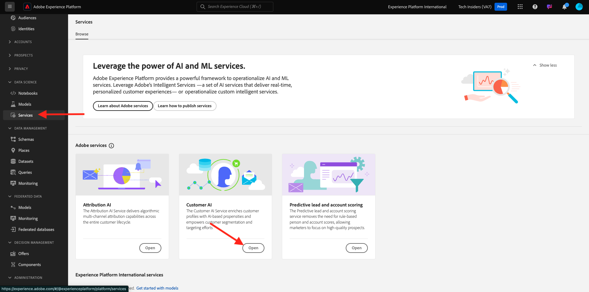

# 2.2.2 Kund-AI - Skapa en ny instans (Konfigurera)

Kunds-AI fungerar genom att analysera befintliga data om kundupplevelsehändelser för att förutsäga bortfall eller konverteringsbenägenhetspoäng. Genom att skapa en ny instans av kundens AI kan marknadsförarna definiera mål och åtgärder.

## Konfigurera en ny AI-instans för kund

Klicka på **Tjänster** i den vänstra menyn i Adobe Experience Platform. Webbläsaren **Services** visas och visar alla tillgängliga tjänster. Klicka på **Öppna** på kortet för kundens AI.

Klicka på **Skapa instans**.

Då ser du det här.

Ange nödvändig information för kundens AI-instans:

- Namn: använd `--aepUserLdap-- Product Purchase Propensity`
- Beskrivning: använd: **Förutse sannolikheten för att kunder ska köpa en produkt**
- Proportionstyp: välj **Konvertering**

Klicka på **Spara och fortsätt**.

Då ser du det här. Markera den datauppsättning som du skapade i föregående övning med namnet `--demoProfileLdap - Demo System - Customer Experience Event Dataset`. Klicka på **Lägg till**.

Då ser du det här. du måste definiera fältet **Identitet**. Klicka på **Inget**.

På popup-menyn väljer du **Identitetskarta (identityMap)** och sedan namnområdet **Demo System - CRMID (crmId)**. Klicka sedan på **Spara**.

Klicka på **Spara och fortsätt**.

Välj **Kommer att inträffa** i din specifika datauppsättning och definiera fältet **commerce.purchase.value** som målvariabel.

Ange sedan att schemat ska köra **Veckovis** och ange att tiden ska vara så nära den aktuella tiden som möjligt. Kontrollera att alternativet **Aktivera bakgrundsmusik för profilen** är aktiverat. Klicka på **Spara och fortsätt**.

När du har konfigurerat instansen kan du se den i kundens AI-tjänstlista och du kan även förhandsgranska sammanfattningen av konfigurations- och körningsinformationen genom att klicka på kundens AI-instansrad. I sammanfattningspanelen visas även felinformation om fel hittas.

>[!NOTE]
>
>Du kan ändra alla definitioner och attribut så länge som kundens AI-instansstatus är antingen **Väntar på utbildning** eller **Fel**

När modellen är klar ser du det här.

Nästa steg: [2.2.3 Kundens AI - Bedömningsinstrumentpanel och segmentering (predikt och åtgärd)](./ex3.md)

[Gå tillbaka till modul 2.2](./intelligent-services.md)

[Gå tillbaka till Alla moduler](./../../../overview.md)
