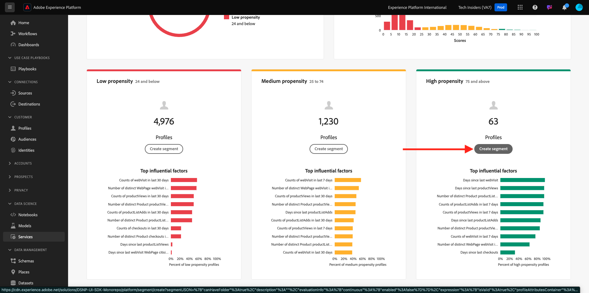

# 2.2.3 Kundens AI - Instrumentpanel för bedömning och segmentering (predikt &amp; Take Action)

När kundens AI-instans har slutfört en modellkörning kan ni visualisera den benägenhetspoäng som utvärderas för att förutsäga att kunden genomför ett köp inom 30 dagar.

>[!NOTE]
>
>Det är bara en kunds-AI-instans med statusen **Slutfört** som du kan förhandsgranska tjänstens insikter.

## Förutsägelse av känslighet

Nu ska vi granska den förväntade benägenheten som genereras av kundens AI-instansmodell. Klicka på instansnamnet för att visa kontrollpanelen.

Kundens AI-instrumentpanel visar sammanfattningen om poäng, fördelning av populationen och de faktorer som påverkar modellen.

Håll muspekaren över de inflytelserika faktorerna för att se hur datafördelningen kan fördelas ytterligare.

## Affärsåtgärder

### Segmentera kunder

Med kundens AI-panel kan du definiera segment med ett enda klick. Klicka på knappen **Skapa segment** på benägenhetskorten.

Du ser att en segmentdefinition skapas automatiskt.

Ge segmentet ett namn enligt följande namnkonvention: `--aepUserLdap-- - Customer AI High Propensity`. Klicka på **Publish**.

Du kan nu använda det här segmentet för målinriktning med till exempel CDP i realtid, Journey Optimizer och Adobe Target.

## Rensa

För att säkerställa att inga onödiga demodata sparas i din miljö måste du ta bort datauppsättningen `--aepUserLdap-- - Demo System - Customer Experience Event Dataset` när du har slutfört den här övningen. Om du inte tar bort demodata kommer det att påverka AEP-instansen negativt.

Nästa steg: [Sammanfattning och förmåner](./summary.md)

[Gå tillbaka till modul 2.2](./intelligent-services.md)

[Gå tillbaka till Alla moduler](./../../../overview.md)
