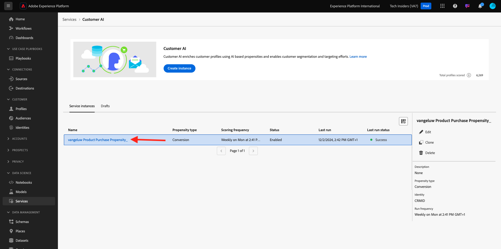

# 2.2.3 Kundens AI - Instrumentpanel för bedömning och segmentering (predikt &amp; Take Action)

När kundens AI-instans har slutfört en modellkörning kan ni visualisera den benägenhetspoäng som utvärderas för att förutsäga att kunden genomför ett köp inom 30 dagar.

>[!NOTE]
>
>Det är bara en kunds-AI-instans med statusen **Slutfört** som du kan förhandsgranska tjänstens insikter.

## 2.2.3.1 Förutsägbarhet

Nu ska vi granska den förväntade benägenheten som genereras av kundens AI-instansmodell. Klicka på instansnamnet för att visa kontrollpanelen.

Kundens AI-instrumentpanel visar sammanfattningen om poäng, fördelning av populationen och de faktorer som påverkar modellen.

Håll muspekaren över de inflytelserika faktorerna för att se hur datafördelningen kan fördelas ytterligare.

## 2.2.3.2 Verksamhetsåtgärder

### 2.2.3.2.1 Segmentera kunder

Med kundens AI-panel kan du definiera segment med ett enda klick. Klicka på knappen **Skapa segment** på benägenhetskorten.

Du ser att en segmentdefinition skapas automatiskt.

Ge segmentet ett namn enligt följande namnkonvention: `--aepUserLdap-- - Customer AI High Propensity`. Klicka på **Spara**.

Du kan nu använda det här segmentet för målinriktning med till exempel CDP, Journey Orchestration och Adobe Target i realtid.

### 2.2.3.2.2 Profilöversikt

Eftersom kundens AI-benägenhetspoäng blir en del av kundprofilen i realtid kan du se enskilda kunders poäng.

I Adobe Experience Platform går du till **Profiler** i den vänstra menyn och väljer **Bläddra**.

Sök efter en profil med hjälp av någon av identifierarna, t.ex. **EMAIL hbirkenshawa@businessweek.com**, som är tillgängliga i JSON-filen som du kapslade. Klicka på **profil-ID** för att öppna profilen.

Då ser du det här:

Gå till **Attribut**, som innehåller utdata från kundens AI-modell.

Bläddra nedåt för att se hur väl dina kunder uppnår AI-modellen.

Nästa steg: [Sammanfattning och förmåner](./summary.md)

[Gå tillbaka till modul 2.2](./intelligent-services.md)

[Gå tillbaka till Alla moduler](./../../../overview.md)
