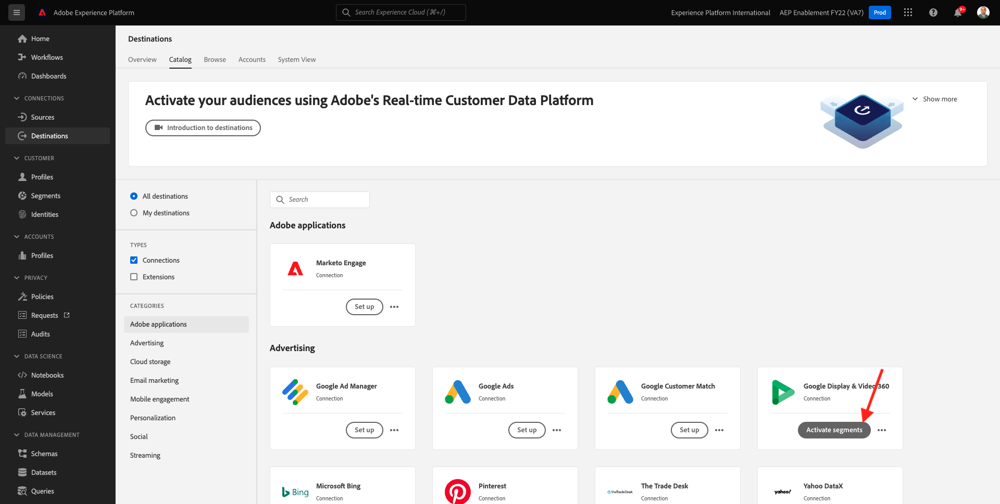

# 2.3.3 Vidta åtgärd: skicka segmentet till DV360

Gå till [Adobe Experience Platform](https://experience.adobe.com/platform). När du har loggat in loggar du in på Adobe Experience Platform hemsida.

Innan du fortsätter måste du välja en **sandlåda**. Sandlådan som ska markeras har namnet ``--aepSandboxName--``. Du kan göra detta genom att klicka på texten **[!UICONTROL Production Prod]** i den blå raden ovanför skärmen. När du har valt rätt [!UICONTROL sandbox] visas skärmändringen och nu är du i din dedikerade [!UICONTROL sandbox].

Gå till **Destinationer** på den vänstra menyn och gå sedan till **Katalog**. Därefter visas **målkatalogen**.

I **Destinationer** klickar du på **Aktivera segment** på **Google Display &amp; Video 360** -kortet.

Välj ditt mål och klicka på **Nästa**.

I listan med tillgängliga segment väljer du det segment som du skapade i föregående övning. Klicka på **Nästa**.

Klicka på **Nästa** på sidan **Segmentschema**.

Klicka slutligen på **Slutför** på sidan **Granska**.

Ditt segment är nu länkat till Google DV360. Varje gång en kund kvalificerar sig för det här segmentet skickas en signal till Google DV360 för att inkludera den kunden i målgruppen på Google DV360-sidan.

Nästa steg: [2.3.4 Vidta åtgärd: skicka segmentet till ett S3-mål](./ex4.md)

[Gå tillbaka till modul 2.3](./real-time-cdp-build-a-segment-take-action.md)

[Gå tillbaka till Alla moduler](../../../overview.md)
