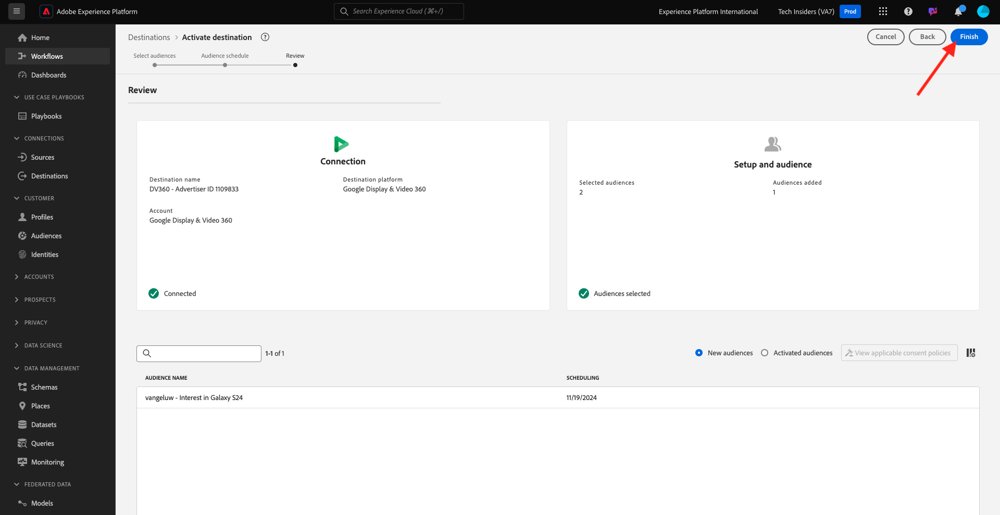

# 2.3.3 Take Action: send your audience to DV360

Gå till [Adobe Experience Platform](https://experience.adobe.com/platform). När du har loggat in loggar du in på Adobe Experience Platform hemsida.

Innan du fortsätter måste du välja en **sandlåda**. Sandlådan som ska markeras har namnet ``--aepSandboxName--``. När du har valt rätt [!UICONTROL sandbox] visas skärmändringen och nu är du i din dedikerade [!UICONTROL sandbox].

Gå till **Destinationer** på den vänstra menyn och gå sedan till **Bläddra**. Du ser sedan målet **DV360**. Klicka på de tre punkterna **..** och klicka på **Aktivera målgrupper**.

I listan över tillgängliga målgrupper väljer du den målgrupp du skapade i föregående övning. Klicka på **Nästa**.

Klicka på **Nästa** på sidan **Målgruppsplan**.

Klicka slutligen på **Slutför** på sidan **Granska**.

Din målgrupp är nu länkad till Google DV360. Varje gång en kund kvalificerar sig för den här målgruppen skickas en signal till Google DV360 för att inkludera den kunden i målgruppen på Google DV360-sidan.

Nästa steg: [2.3.4 Vidta åtgärd: skicka målgruppen till en S3-destination](./ex4.md)

[Gå tillbaka till modul 2.3](./real-time-cdp-build-a-segment-take-action.md)

[Gå tillbaka till Alla moduler](../../../overview.md)
