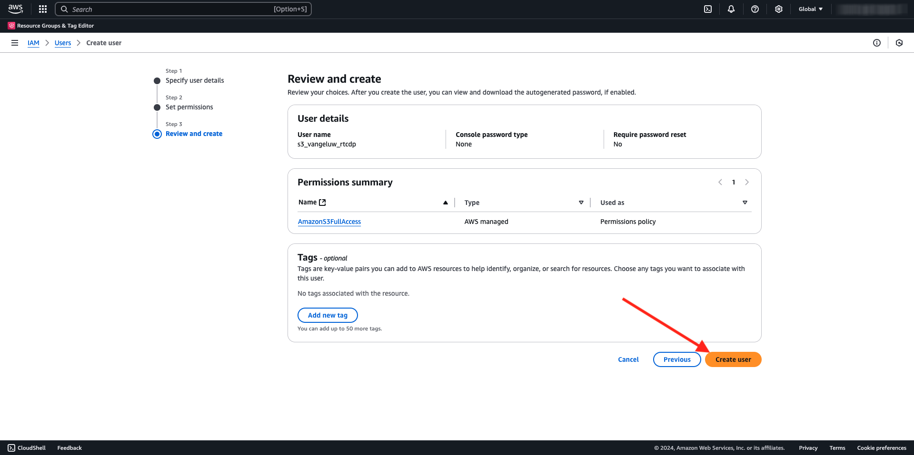

# 2.3.4 Take Action: send your segment to an S3 destination

Adobe Experience Platform kan också dela målgrupper med e-postmarknadsföringsdestinationer som Salesforce Marketing Cloud, Oracle Eloqua, Oracle Responsys och Adobe Campaign.

Du kan använda FTP eller SFTP som en del av de dedikerade destinationerna för var och en av dessa destinationer för e-postmarknadsföring, eller så kan du använda AWS S3 för att utbyta kundlistor mellan Adobe Experience Platform och dessa destinationer för e-postmarknadsföring.

I den här modulen konfigurerar du ett sådant mål genom att använda en AWS S3-bucket.

## 2.3.4.1 Skapa din S3-bucket

Gå till [https://console.aws.amazon.com](https://console.aws.amazon.com) och logga in med det Amazon-konto du skapade tidigare.

När du har loggat in omdirigeras du till **AWS Management Console**.

Sök efter **s3** på menyn **Hitta tjänster**. Klicka på det första sökresultatet: **S3 - Skalbar lagring i molnet**.

Därefter visas startsidan för **Amazon S3**. Klicka på **Skapa pyts**.

På skärmen **Skapa pyts** måste du konfigurera två saker:

- Namn: använd namnet `aepmodulertcdp--aepUserLdap--`. I den här övningen är till exempel bucket-namnet **aepmodulertcdpvangeluw**
- Regionen **EU (Frankfurt) eu-central-1**

Låt alla andra standardinställningar vara som de är. Bläddra nedåt och klicka på **Skapa hink**.

Då ser du att din bucket skapas och kommer att omdirigeras till Amazon S3-hemsida.

## 2.3.4.2 Ange behörigheter för att komma åt S3-bucket

Nästa steg är att konfigurera åtkomst till din S3-bucket.

Gå till [https://console.aws.amazon.com/iam/home](https://console.aws.amazon.com/iam/home) om du vill göra det.

Åtkomsten till AWS-resurser styrs av Amazon Identity and Access Management (IAM).

Du kommer nu att se den här sidan.

Klicka på **Användare** på den vänstra menyn. Sedan visas skärmen **Användare**. Klicka på **Lägg till användare**.

Konfigurera sedan användaren:

- Användarnamn: använd `s3_--aepUserLdap--_rtcdp` som namn, så i det här exemplet är namnet `s3_vangeluw_rtcdp`.
- AWS-åtkomsttyp: välj **Åtkomstnyckel - Programmatisk åtkomst**.

Klicka på **Nästa: Behörigheter**.

Då visas den här behörighetsskärmen. Klicka på **Koppla befintliga profiler direkt**.

Ange söktermen **s3** om du vill visa alla relaterade S3-principer. Välj principen **AmazonS3FullAccess**. Klicka på **Nästa: Taggar**.

På skärmen **Taggar** finns inget behov av att konfigurera något. Klicka på **Nästa: Granska**.

Granska konfigurationen. Klicka på **Skapa användare**.

Användaren har nu skapats och du ser dina autentiseringsuppgifter för att få åtkomst till din S3-miljö. Det här är enda gången som du ser dina autentiseringsuppgifter så skriv ned dem.

Klicka på **Visa** för att visa din hemliga åtkomstnyckel:

>[!IMPORTANT]
>
>Lagra dina inloggningsuppgifter i en textfil på datorn.
>
> - Åtkomstnyckel-ID: ...
> - Hemlig åtkomstnyckel: ...
>
> När du klickar på **Stäng** visas aldrig dina autentiseringsuppgifter igen!

Klicka på **Stäng**.

Du har nu skapat en AWS S3-bucket och du har skapat en användare med behörighet att komma åt den här bucket.

## 2.3.4.3 Konfigurera mål i Adobe Experience Platform

Gå till [Adobe Experience Platform](https://experience.adobe.com/platform). När du har loggat in loggar du in på Adobe Experience Platform hemsida.

Innan du fortsätter måste du välja en **sandlåda**. Sandlådan som ska markeras har namnet ``--aepSandboxName--``. Du kan göra detta genom att klicka på texten **[!UICONTROL Production Prod]** i den blå raden ovanför skärmen. När du har valt rätt [!UICONTROL sandbox] visas skärmändringen och nu är du i din dedikerade [!UICONTROL sandbox].

Gå till **Destinationer** på den vänstra menyn och gå sedan till **Katalog**. Därefter visas **målkatalogen**.

Klicka på **molnlagring** och sedan på knappen **Konfigurera** (eller på **Aktivera segment**, beroende på din miljö) på **Amazon S3** -kortet.

Beroende på din miljö kan du behöva klicka på **+ Konfigurera nytt mål** för att börja skapa ditt mål.

Välj **Nytt konto** som kontotyp. Använd de S3-autentiseringsuppgifter som du fick i föregående steg:

| Åtkomstnyckel-ID | Nyckel för hemlig åtkomst |
|:-----------------------:| :-----------------------:|
| AKIA... | Cm5Ln... |

Klicka på **Anslut till mål**.

En visuell bekräftelse visas på att det här målet nu är anslutet.

Du måste ange ett namn och en mapp så att Adobe Experience Platform kan ansluta till S3-bucket.

Använd följande som namngivningskonvention:

| Åtkomstnyckel-ID | Nyckel för hemlig åtkomst |
|:-----------------------:| :-----------------------:|
| Namn | `AWS - S3 - --aepUserLdap--` |
| Beskrivning | `AWS - S3 - --aepUserLdap--` |
| Buckennamn | `aepmodulertcdp--aepUserLdap--` |
| Mappsökväg | / |

Klicka på **Nästa**.

Du kan nu även bifoga en datastyrningspolicy till ditt nya mål. Klicka på **Nästa**.

I listan med segment söker du efter det segment som du skapade i övning 1 och markerar det. Klicka på **Nästa**.

Då ser du det här. Om du vill kan du redigera schemat genom att klicka på ikonen **penna** . **Skapa schema**.

Definiera ditt valschema. Välj **Exportera inkrementella filer** och ange frekvensen till **Varje timme** var **3:e timme**. Klicka på **Skapa**.

Du får den här då. Klicka på **Nästa**.

Nu kan du välja attribut för exporten till AWS S3. Klicka på **Lägg till nytt fält** och kontrollera att fältet `--aepTenantId--.identification.core.ecid` har lagts till och markerats som **Dedupliceringsnyckel**.

Du kan också lägga till så många andra fält som behövs.

När du har lagt till alla fält klickar du på **Nästa**.

Granska konfigurationen. Klicka på **Slutför** för att slutföra konfigurationen.

Du kommer sedan tillbaka till skärmen Målaktivering och då ser du att ditt segment har lagts till i det här målet.

Om du vill lägga till fler segmentexporter kan du klicka på **Aktivera segment** för att starta om processen och lägga till fler segment.

Nästa steg: [2.3.5 Vidta åtgärd: skicka ditt segment till Adobe Target](./ex5.md)

[Gå tillbaka till modul 2.3](./real-time-cdp-build-a-segment-take-action.md)

[Gå tillbaka till Alla moduler](../../../overview.md)
