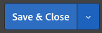
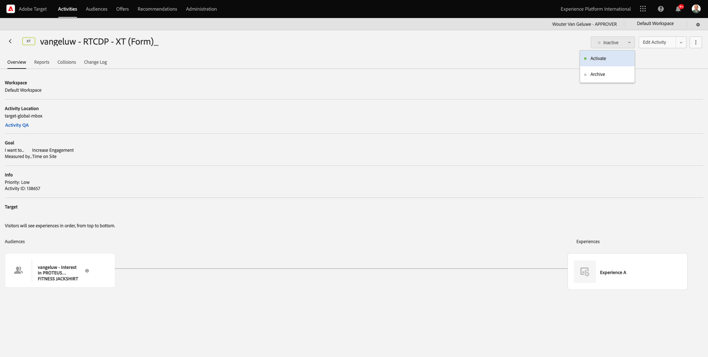

# 2.3.5 Take Action: send your segment to Adobe Target

Gå till [Adobe Experience Platform](https://experience.adobe.com/platform). När du har loggat in loggar du in på Adobe Experience Platform hemsida.


Innan du fortsätter måste du välja en **sandlåda**. Sandlådan som ska markeras har namnet ``--aepSandboxName--``. Du kan göra detta genom att klicka på texten **[!UICONTROL Production Prod]** i den blå raden ovanför skärmen. När du har valt rätt [!UICONTROL sandbox] visas skärmändringen och nu är du i din dedikerade [!UICONTROL sandbox].


## 2.3.5.1 Verifiera ditt dataflöde

Adobe Target-målet i Real-Time CDP är anslutet till den datastream som används för att importera data till kantnätverket i Adobe. Om du vill ställa in ditt Adobe Target-mål måste du först kontrollera om ditt datastream redan är aktiverat för Adobe Target. Ditt datastram konfigurerades i [övning 0.2 Skapa ditt datastream](./../../../modules/gettingstarted/gettingstarted/ex2.md) och namngavs `--aepUserLdap-- - Demo System Datastream`.

Gå till [https://experience.adobe.com/#/data-collection/](https://experience.adobe.com/#/data-collection/) och klicka sedan på **Datastreams** eller **Datastreams (Beta)**.


I skärmens övre högra hörn väljer du namnet på sandlådan, som ska vara `--aepSandboxName--`.


Sök efter din datastream med namnet `--aepUserLdap-- - Demo System Datastream` i Datastreams. Klicka på ditt datastream för att öppna det.


Du ser sedan detta genom att klicka på **..** bredvid **Adobe Experience Platform** och sedan klicka på **Redigera**.


Markera kryssrutorna för både **Edge Segmentation** och **Personalization Destinations**. Klicka på **Spara**.


Klicka sedan på **+ Lägg till tjänst**.


Välj tjänsten **Adobe Target**. Klicka på **Spara**.


Din datastream är nu konfigurerad för Adobe Target.


## 2.3.5.2 Konfigurera ditt Adobe Target-mål

Adobe Target finns som mål från Real-Time CDP. Gå till **Destinationer** och **Katalog** om du vill konfigurera din Adobe Target-integrering.


Klicka på **Personalization** på menyn **Kategorier**. Sedan visas **Adobe Target**-målkortet. Klicka på **Aktivera segment** (eller **Konfigurera** beroende på din miljö).


Beroende på din miljö kan du behöva klicka på **+ Konfigurera nytt mål** för att börja skapa ditt mål.


Då ser du det här.


På skärmen **Konfigurera nytt mål** måste du konfigurera två saker:

- Namn: använd namnet `--aepUserLdap-- - Adobe Target (Web)` som ska se ut så här: **vangeluw - Adobe Target (webb)**.
- Datastream-ID: Du måste välja det datastream som du konfigurerade i [Utför 0.2 Skapa ditt datastream](./../../../modules/gettingstarted/gettingstarted/ex2.md). Namnet på din datastream ska vara: `--aepUserLdap-- - Demo System Datastream`.

Klicka på **Nästa**.


På nästa skärm kan du välja en policy. Du behöver inte välja någon, i det här fallet behöver du inte välja någon, så klicka på **Skapa**.


Målet har skapats och kommer att visas i listan. Välj mål och klicka på **Nästa** för att börja skicka segment till målet.


I listan med tillgängliga segment väljer du det segment som du skapade i [Utför 6.1 Skapa ett segment](./ex1.md) med namnet `--aepUserLdap-- - Interest in PROTEUS FITNESS JACKSHIRT`. Klicka sedan på **Nästa**.


På nästa sida klickar du på **Nästa**.


Klicka på **Slutför**.


Ditt segment är nu aktiverat mot Adobe Target.


>[!IMPORTANT]
>
>När du just har skapat Adobe Target-destinationen i Real-Time CDP kan det ta upp till en timme innan destinationen är aktiv. Detta är en engångsväntetid på grund av konfigurationen av serverdelskonfigurationen. När den inledande väntetiden på en timme och backend-konfigurationen är klar, kommer nytillagda kantsegment som skickas till Adobe Target-destinationen att vara tillgängliga för målgruppsanpassning i realtid.

## 2.3.5.3 Konfigurera din formulärbaserade Adobe Target-aktivitet

Nu när ditt Real-Time CDP-segment är konfigurerat att skickas till Adobe Target kan du konfigurera din Experience Targeting-aktivitet i Adobe Target. I den här övningen ska du konfigurera en formulärbaserad aktivitet.

Gå till Adobe Experience Cloud hemsida på [https://experiencecloud.adobe.com/](https://experiencecloud.adobe.com/). Klicka på **Mål** för att öppna det.


På startsidan för **Adobe Target** visas alla befintliga aktiviteter.


Klicka på **+ Skapa aktivitet** för att skapa en ny aktivitet.


Välj **Experience Targeting**.


Välj **Formulär** och välj **Inga egenskapsbegränsningar**. Klicka på **Nästa**.


Du är nu med i den formulärbaserade aktivitetshanteraren.


För fältet **LOCATION 1** väljer du **target-global-mbox**.


Standardmålgruppen är **Alla besökare**. Klicka på **3 punkter** bredvid **Alla besökare** och klicka på **Ändra publik**.


Du ser nu en lista över tillgängliga målgrupper, och Adobe Experience Platform-segmentet som du skapade tidigare och skickade till Adobe Target ingår nu i den här listan. Markera det segment som du tidigare har skapat i Adobe Experience Platform. Klicka på **Tilldela målgrupp**.


Ditt Adobe Experience Platform-segment är nu en del av denna Experience Targeting Activity.


Nu ska vi ändra Hero Image på webbplatsens hemsida. Klicka för att öppna listrutan bredvid **Standardinnehåll** och klicka på **Skapa HTML-erbjudande**.


Klistra in följande kod. Klicka sedan på **Nästa**.

```javascript
<script>document.querySelector("#home > div > div > div > div > div.banner_img.d-none.d-lg-block > img").src="https://parsefiles.back4app.com/hgJBdVOS2eff03JCn6qXXOxT5jJFzialLAHJixD9/ff92fdc3885972c0090ad5419e0ef4d4_Luma - Product - Proteus - Hero Banner.png"; document.querySelector(".banner_text > *").remove()</script>
```


Du kommer då att se den nya upplevelsen av den nya bilden för den valda målgruppen.


Klicka på aktivitetens titel i det övre vänstra hörnet för att byta namn på den.


För namnet, använd:

- `--aepUserLdap-- - RTCDP - XT (Form)`


Klicka på **Nästa**.


Gå till **Målmått** på sidan **Mål och inställningar** -.


Ange som primärt mål **engagemang** - **tid på plats**.


Klicka på **Spara och stäng**.



Du finns nu på sidan **Aktivitetsöversikt**. Du måste fortfarande aktivera din aktivitet.


Klicka på fältet **Inaktiv** och välj **Aktivera**.



Sedan får du en visuell bekräftelse på att din aktivitet nu är aktiv.


Din aktivitet finns nu tillgänglig och kan testas på demowebbplatsen.

>[!IMPORTANT]
>
>När du just har skapat Adobe Target-destinationen i Real-Time CDP kan det ta upp till en timme innan destinationen är aktiv. Detta är en engångsväntetid på grund av konfigurationen av serverdelskonfigurationen. När den inledande väntetiden på en timme och backend-konfigurationen är klar, kommer nytillagda kantsegment som skickas till Adobe Target-destinationen att vara tillgängliga för målgruppsanpassning i realtid.

Om du nu går tillbaka till din demowebbplats och besöker produktsidan för PROTEUS FITNESS JACKSHIRT, kan du direkt kvalificera dig för det segment du har skapat och du ser Adobe Target-aktiviteten visas på startsidan i realtid.


Nästa steg: [2.3.6 Externa målgrupper](./ex6.md)

[Gå tillbaka till modul 2.3](./real-time-cdp-build-a-segment-take-action.md)

[Gå tillbaka till Alla moduler](../../../overview.md)
