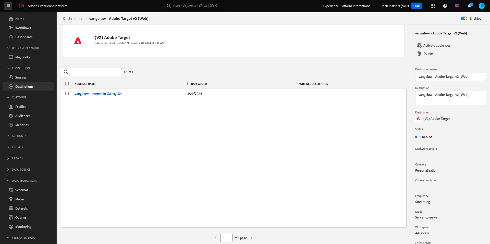

# 2.3.5 Take Action: send your målgrupp to Adobe Target

Gå till [Adobe Experience Platform](https://experience.adobe.com/platform). När du har loggat in loggar du in på Adobe Experience Platform hemsida.


Innan du fortsätter måste du välja en **sandlåda**. Sandlådan som ska markeras har namnet ``--aepSandboxName--``. När du har valt rätt [!UICONTROL sandbox] visas skärmändringen och nu är du i din dedikerade [!UICONTROL sandbox].


## Verifiera ditt dataflöde

Adobe Target-målet i Real-Time CDP är anslutet till den datastream som används för att importera data till Adobe Edge-nätverket. Om du vill konfigurera ditt Adobe Target-mål måste du först kontrollera om ditt datastream redan är aktiverat för Adobe Target. Ditt datastram konfigurerades i [övning 0.2 Skapa ditt datastream](./../../../modules/gettingstarted/gettingstarted/ex2.md) och namngavs `--aepUserLdap-- - Demo System Datastream`.

Bläddra nedåt på den vänstra menyn och klicka på **Datastreams**. Sök efter din datastream med namnet `--aepUserLdap-- - Demo System Datastream` i Datastreams. Klicka på ditt datastream för att öppna det.


Du ser sedan detta genom att klicka på **..** bredvid **Adobe Experience Platform** och sedan klicka på **Redigera**.


Markera kryssrutorna för både **Edge Segmentation** och **Personalization Destinations**. Klicka på **Spara**.


Klicka sedan på **+ Lägg till tjänst**.


Välj tjänsten **Adobe Target**. Klicka på **Spara**.


Din datastream är nu konfigurerad för Adobe Target.


## Konfigurera ditt Adobe Target-mål

Adobe Target finns som mål från Real-Time CDP. Gå till **Destinationer** och **Katalog** om du vill konfigurera din Adobe Target-integrering.

Klicka på **Personalization** på menyn **Kategorier**. Därefter visas målkortet **(v2) Adobe Target**.


Klicka på **Anslut till mål**.


Då ser du det här. Du måste skapa ett eget Adobe Target-mål enligt följande:

- Namn: använd namnet `--aepUserLdap-- - Adobe Target v2  (Web)`.
- Datastream-ID: Du måste välja det datastream som du konfigurerade i [Utför 0.2 Skapa ditt datastream](./../../../modules/gettingstarted/gettingstarted/ex2.md). Namnet på din datastream ska vara: `--aepUserLdap-- - Demo System Datastream`.
- Workspace: detta gäller Adobe Target arbetsytor. Om det inte finns någon specifik arbetsyta du behöver använda väljer du **Workspace** som standard.

Klicka på **Nästa**.


Du kan nu välja att välja en datastyrningsprincip. Klicka på **Nästa**.


I listan över tillgängliga målgrupper väljer du målgruppen som du skapade i den tidigare övningen [Skapa en målgrupp](./ex1.md) med namnet `--aepUserLdap-- - Interest in Galaxy S24`. Klicka sedan på **Nästa**.


På skärmen **Mappning** kan du mappa profilattribut som blir tillgängliga i Adobe Target. Detta hjälper er att lägga till ett extra lager av personalisering på er webbplats. Klicka på **Lägg till nytt fält**.


Markera fältet **person.name.firstName** för det nya fältet. Klicka på **Spara**.


Du får den här då. Klicka på **Nästa**.


Klicka på **Slutför**.


Din publik är nu aktiv mot Adobe Target.



>[!IMPORTANT]
>
>När du just har skapat Adobe Target-destinationen i Real-Time CDP kan det ta upp till en timme innan destinationen är aktiv. Detta är en engångsväntetid på grund av konfigurationen av serverdelskonfigurationen. När den inledande väntetiden på en timme och backend-konfigurationen är klar kommer nytillagda målgrupper som skickas till Adobe Target-destinationen att vara tillgängliga för målgruppsanpassning i realtid.

## Konfigurera din formulärbaserade Adobe Target-aktivitet

Nu när er Real-Time CDP-målgrupp är konfigurerad att skickas till Adobe Target kan ni konfigurera er Experience Targeting-aktivitet i Adobe Target. I den här övningen ska du konfigurera en formulärbaserad aktivitet.

Gå till Adobe Experience Cloud hemsida på [https://experiencecloud.adobe.com/](https://experiencecloud.adobe.com/). Klicka på **Mål** för att öppna det.


På startsidan för **Adobe Target** visas alla befintliga aktiviteter. Klicka på **Skapa aktivitet** och sedan på **Upplevelsemål**.


Välj **Webb**, **Formulär** och **Inga egenskapsbegränsningar**. Klicka på **Skapa**.


Du är nu med i den formulärbaserade aktivitetshanteraren.


För fältet **LOCATION 1** väljer du **target-global-mbox**.


Standardmålgruppen är **Alla besökare**. Klicka på **3 punkter** bredvid **Alla besökare** och klicka på **Ändra publik**.


Du ser nu en lista över tillgängliga målgrupper, och Adobe Experience Platform-målgruppen som du skapade tidigare och skickade till Adobe Target ingår nu i listan. Välj den målgrupp du redan har skapat i Adobe Experience Platform. Klicka på **Tilldela målgrupp**.


Din Adobe Experience Platform-publik är nu en del av denna Experience Targeting Activity.


Nu ska vi ändra Hero Image på webbplatsens hemsida. Klicka för att öppna listrutan bredvid **Standardinnehåll** och klicka på **Skapa HTML-erbjudande**.


Klistra in följande kod.

```javascript
<script>document.querySelector("#SpectrumProvider > div.App > div > div.Page.home > main > div.Banner.Banner--alignment-right.Banner--verticalAlignment-middle.main-banner > div.Image > img").src="https://tech-insiders.s3.us-west-2.amazonaws.com/citisignal-new-hero.png"; document.querySelector("#SpectrumProvider > div.App > div > div.Page.home > main > div.Banner.Banner--alignment-right.Banner--verticalAlignment-middle.main-banner > div.Banner__content > div > div > h1").innerHTML="Hi there ";
document.querySelector("#SpectrumProvider > div.App > div > div.Page.home > main > div.Banner.Banner--alignment-right.Banner--verticalAlignment-middle.main-banner > div.Banner__content > div > div > div > div > p").innerHTML="What about 10% off of your next Galaxy S24 smartphone?";
</script>
```


Därefter måste du lägga till en personaliseringstoken från Adobe Experience Platform profilattribut. Kom ihåg att när du aktiverade målgruppen för Adobe Target markerar du även fältet **person.name.firstName** som ska delas med Adobe Target. Om du vill hämta fältet väljer du källan **Adobe Experience Platform**, markerar din sandlåda (som ska vara `--aepSandboxName--`) och sedan attributet **person.name.firstName**.


Innan du klickar på knappen **Lägg till** måste du gå till raden där du ser `... > h1").innerHTML="Hi there ";` och placera markören inom hakparenteserna efter ordet `there`, så här:

```
... > h1").innerHTML="Hi there ";
```

Klicka sedan på knappen **Lägg till** som lägger till token, som uppdaterar koden så här:

```
... > h1").innerHTML="Hi there ${aep.person.name.firstName}";
```


Klicka på **Nästa**.


Därefter visas en översikt över din upplevelse av den nya bilden för den valda målgruppen. Klicka på **Nästa**.


Klicka på aktivitetens titel i det övre vänstra hörnet för att byta namn på den, så här: `--aepUserLdap-- - RTCDP - XT (Form)`


Gå till **Målmått** på sidan **Mål och inställningar** -. Ange som primärt mål **engagemang** - **tid på plats**. Klicka på **Spara och stäng**.


Du finns nu på sidan **Aktivitetsöversikt**. Du måste fortfarande aktivera din aktivitet. Klicka på fältet **Inaktiv** och välj **Aktivera**.


Sedan får du en visuell bekräftelse på att din aktivitet nu är aktiv.


Din aktivitet finns nu tillgänglig och kan testas på demowebbplatsen.

>[!IMPORTANT]
>
>När du just har skapat Adobe Target-destinationen i Real-Time CDP kan det ta upp till en timme innan destinationen är aktiv. Detta är en engångsväntetid på grund av konfigurationen av serverdelskonfigurationen. När den inledande väntetiden på en timme och serverdelskonfigurationen är klar kommer nytillagda målgrupper som skickas till Adobe Target-destinationen att vara tillgängliga för målgruppsanpassning i realtid.

Om du nu går tillbaka till din demowebbplats och besöker produktsidan för Galaxy S24 får du rätt till den målgrupp du skapat och du ser Adobe Target-aktiviteten visas på startsidan i realtid.


Nästa steg: [2.3.6 Destinations SDK](./ex6.md)

[Gå tillbaka till modul 2.3](./real-time-cdp-build-a-segment-take-action.md)

[Gå tillbaka till Alla moduler](../../../overview.md)
