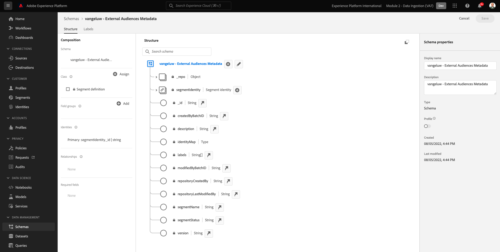
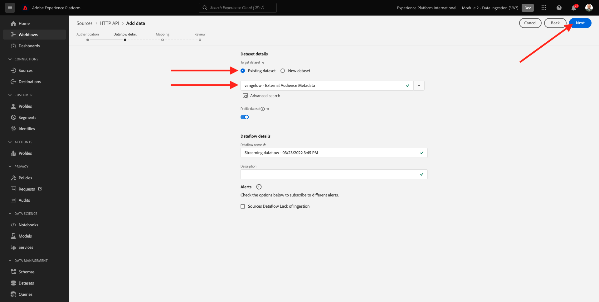
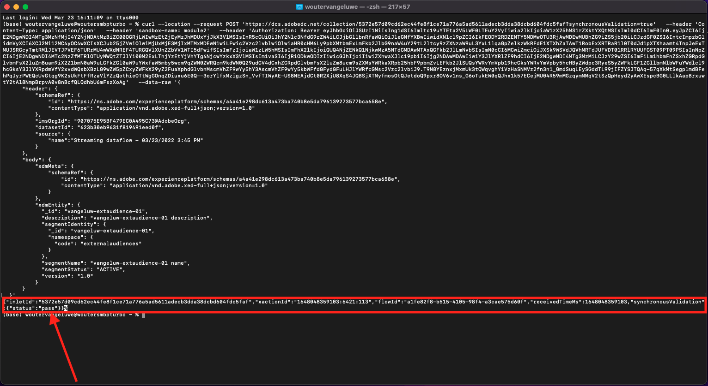
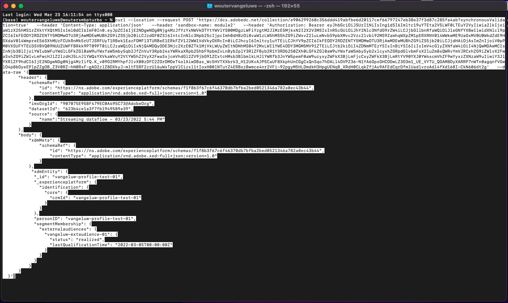
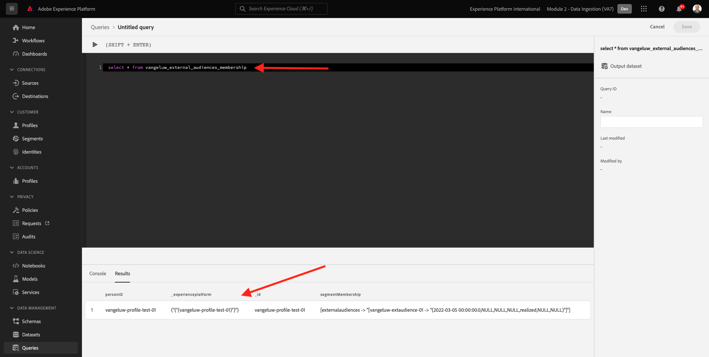
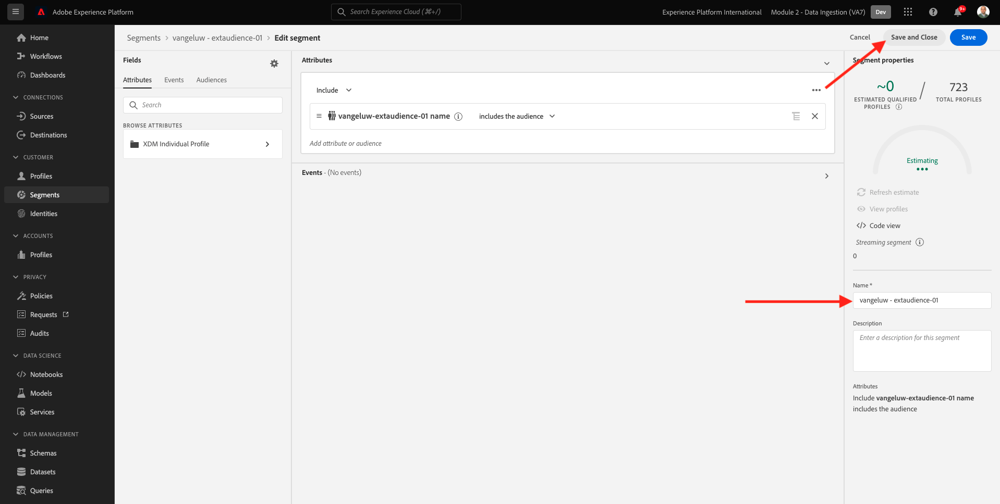

# 2.3.6 Externa målgrupper

I många fall kanske ditt företag vill använda befintliga segment från andra program för att förbättra kundprofilen i Adobe Experience Platform.
Dessa externa målgrupper kan ha definierats baserat på en datavetenskapsmodell eller externa dataplattformar.

Med funktionen för externa målgrupper i Adobe Experience Platform kan ni fokusera på att ta in externa målgrupper och deras aktivering utan att behöva definiera om motsvarande segmentdefinition i detalj i Adobe Experience Platform.

Den övergripande processen är uppdelad i tre huvudsteg:

- Importera externa målgruppsmetadata: det här steget är avsett att importera externa målgruppsmetadata, som målgruppens namn, till Adobe Experience Platform.
- Tilldela det externa målgruppsmedlemskapet till kundprofilen: det här steget ska berika kundprofilen med det externa segmentmedlemskapsattributet.
- Skapa segmenten i Adobe Experience Platform: det här steget är tänkt att skapa åtgärdbara segment baserat på det externa målgruppsmedlemskapet.

## 2.3.6.1 Metadata

Gå till [Adobe Experience Platform](https://experience.adobe.com/platform). När du har loggat in loggar du in på Adobe Experience Platform hemsida.


>[!IMPORTANT]
>
>Sandlådan som ska användas för den här övningen är ``--module2sandbox--``!

Innan du fortsätter måste du välja en **sandlåda**. Sandlådan som ska markeras har namnet ``--module2sandbox--``. Du kan göra detta genom att klicka på texten **[!UICONTROL Production Prod]** i den blå raden ovanför skärmen. När du har valt rätt [!UICONTROL sandbox] visas skärmändringen och nu är du i din dedikerade [!UICONTROL sandbox].


Medan segmentdata definierar villkoret för att en profil ska vara en del av ett segment, är segmentets metadata information om segmentet, till exempel namn, beskrivning och status för segmentet. När de externa målgruppsmetadata lagras i Adobe Experience Platform måste du använda ett identitetsnamnutrymme för att importera metadata i Adobe Experience Platform.

## 2.3.6.1.1 Identitetsnamnutrymme för externa målgrupper

Ett identitetsnamnområde har redan skapats för användning med **externa målgrupper**.
Om du vill visa identiteten som redan har skapats går du till **Identiteter** och söker efter **Extern**. Klicka på&quot;External Audiences&quot;.

Observera:

- Identitetssymbolen **externa målgrupper** används i nästa steg för att referera till den externa målgruppsidentiteten.
- Typen **Identifierare för icke-personer** används för det här identitetsnamnområdet, eftersom det här namnområdet inte är avsett att identifiera kundprofiler utan segment.


## 2.3.6.1.2 Skapa ett schema med metadata för externa målgrupper

De externa målgruppsmetadata baseras på **segmentdefinitionsschemat**. Mer information finns i [XDM Github-databasen](https://github.com/adobe/xdm/blob/master/docs/reference/classes/segmentdefinition.schema.md).

Gå till Scheman på den vänstra menyn. Klicka på **+ Skapa schema** och sedan på **Bläddra**.


Om du vill tilldela en klass söker du efter **segmentdefinitionen**. Markera klassen **Segmentdefinition** och klicka på **Tilldela klass**.


Då ser du det här. Klicka på **Avbryt**.


Då ser du det här. Markera fältet **_id**. Bläddra nedåt i den högra menyn och aktivera kryssrutorna **Identitet** och **Primär identitet**. Markera identitetsnamnområdet **Externa målgrupper**. Klicka på **Använd**.


Välj sedan schemanamnet **Namnlöst schema**. Ändra namnet till `--aepUserLdap-- - External Audiences Metadata`.



Aktivera alternativet **Profil** och bekräfta. Klicka slutligen på **Spara**.


## 2.3.6.1.3 Skapa datamängden för metadata för externa målgrupper

Gå till **Bläddra** i **Scheman**. Sök och klicka på det `--aepUserLdap-- - External Audiences Metadata`-schema som du skapade i föregående steg. Klicka sedan på **Skapa datauppsättning från schema**.


Ange `--aepUserLdap-- - External Audience Metadata` för fältet **Namn**. Klicka på **Skapa datauppsättning**.


Då ser du det här. Glöm inte att aktivera växeln **Profil**!


## 2.3.6.1.4 Skapa en HTTP API Source Connection

Därefter måste du konfigurera HTTP API Source Connector som du använder för att importera metadata till datauppsättningen.

Gå till **Källor**. Ange **HTTP** i sökfältet. Klicka på **Lägg till data**.


Ange följande information:

- **Kontotyp**: välj **Nytt konto**
- **Kontonamn**: ange `--aepUserLdap-- - External Audience Metadata`
- Markera kryssrutan **XDM-kompatibel ruta**

Klicka sedan på **Anslut till källa**.


Då ser du det här. Klicka på **Nästa**.


Välj **Befintlig datauppsättning** och sök efter och markera datauppsättningen `--aepUserLdap-- - External Audience Metadata` i listrutan.

Verifiera **dataflödesinformationen** och klicka sedan på **Nästa**.



Då ser du det här.

Steget **Mappning** i guiden är tomt eftersom du kommer att hämta en XDM-kompatibel nyttolast till HTTP API Source Connector, så ingen mappning krävs. Klicka på **Nästa**.


I steget **Granska** kan du granska anslutningen och mappningsinformationen om du vill. Klicka på **Slutför**.


Då ser du det här.


## 2.3.6.1.5 Metadata för externa målgrupper

På översiktsfliken för Source Connector klickar du på **..** och sedan på **Kopiera schemanyttolast**.

 för externa målgrupper

Öppna textredigeringsprogrammet på datorn och klistra in den nyttolast som du just kopierade. Den ser ut så här. Därefter måste du uppdatera objektet **xdmEntity** i den här nyttolasten.

 för externa målgrupper

Objektet **xdmEntity** måste ersättas med nedanstående kod. Kopiera koden nedan och klistra in den i textfilen genom att ersätta objektet **xdmEntity** i textredigeraren.

```
"xdmEntity": {
    "_id": "--aepUserLdap---extaudience-01",
    "description": "--aepUserLdap---extaudience-01 description",
    "segmentIdentity": {
      "_id": "--aepUserLdap---extaudience-01",
      "namespace": {
        "code": "externalaudiences"
      }
    },
    "segmentName": "--aepUserLdap---extaudience-01 name",
    "segmentStatus": "ACTIVE",
    "version": "1.0"
  }
```

Du bör då se det här:

 för externa målgrupper

Öppna sedan ett nytt **Terminal**-fönster. Kopiera all text i textredigeraren och klistra in den i terminalfönstret.

 för externa målgrupper

Tryck sedan på **Enter**.

Sedan visas en bekräftelse på ditt datainmatningsproblem i terminalfönstret:

 för externa målgrupper

Uppdatera skärmen för HTTP API Source Connector där du nu ser att data bearbetas:


## 2.3.6.1.6 Validera inmatning av metadata för externa målgrupper

När bearbetningen är klar kan du kontrollera datatillgängligheten i datauppsättningen med hjälp av frågetjänsten.

Gå till **Datauppsättningar** på den högra menyn och välj den `--aepUserLdap-- - External Audience Metadata` datauppsättning som du skapade tidigare.


Gå till Frågor på den högra menyn och klicka på **Skapa fråga**.


Ange följande kod och tryck sedan på **SKIFT + ENTER**:

```
select * from --aepUserLdap--_external_audience_metadata
```

I frågeresultatet ser du den externa målgruppens metadata som du har inkapslat.


## 2.3.6.2 Segmentmedlemskap

Med externa målgruppsmetadata tillgängliga kan ni nu importera segmentmedlemskapet för en viss kundprofil.

Nu måste du förbereda en profildatamängd som har anrikats mot segmentmedlemskapsschemat. Mer information finns i [XDM Github-databasen](https://github.com/adobe/xdm/blob/master/docs/reference/datatypes/segmentmembership.schema.md).

## 2.3.6.2.1 Skapa ett medlemsschema för externa målgrupper

Gå till **Scheman** på den högra menyn. Klicka på **Skapa schema** och sedan på **XDM-individuell profil**.


I popup-fönstret **Lägg till fältgrupper** söker du efter **Profilkärna**. Välj fältgruppen **Profilkärna v2**.


I popup-fönstret **Lägg till fältgrupper** söker du efter **Segmentmedlemskap**. Markera fältgruppen **Information om segmentmedlemskap**. Klicka sedan på **Lägg till fältgrupper**.


Då ser du det här. Navigera till fältet `--aepTenantId--.identification.core`. Klicka på fältet **crmId**. Bläddra nedåt i den högra menyn och markera kryssrutorna **Identitet** och **Primär identitet**. För **Identity Namespace** väljer du **Demo System - CRMID**.

Klicka på **Använd**.


Välj sedan schemanamnet **Namnlöst schema**. Ange `--aepUserLdap-- - External Audiences Membership` i fältet för visningsnamn.


Aktivera sedan växlingsknappen **Profil** och bekräfta. Klicka på **Spara**.


## 2.3.6.2.2 Skapa datauppsättningen External Audiences Membership

Gå till **Bläddra** i **Scheman**. Sök och klicka på det `--aepUserLdap-- - External Audiences Membership`-schema som du skapade i föregående steg. Klicka sedan på **Skapa datauppsättning från schema**.


Ange `--aepUserLdap-- - External Audiences Membership` för fältet **Namn**. Klicka på **Skapa datauppsättning**.


Då ser du det här. Glöm inte att aktivera växeln **Profil**!


## 2.3.6.2.3 Skapa en HTTP API Source Connection


Därefter måste du konfigurera HTTP API Source Connector som du använder för att importera metadata till datauppsättningen.

Gå till **Källor**. Ange **HTTP** i sökfältet. Klicka på **Lägg till data**.


Ange följande information:

- **Kontotyp**: välj **Nytt konto**
- **Kontonamn**: ange `--aepUserLdap-- - External Audience Membership`
- Markera kryssrutan **XDM-kompatibel ruta**

Klicka sedan på **Anslut till källa**.


Då ser du det här. Klicka på **Nästa**.


Välj **Befintlig datauppsättning** och sök efter och markera datauppsättningen `--aepUserLdap-- - External Audiences Membership` i listrutan.

Verifiera **dataflödesinformationen** och klicka sedan på **Nästa**.


Då ser du det här.

Steget **Mappning** i guiden är tomt eftersom du kommer att hämta en XDM-kompatibel nyttolast till HTTP API Source Connector, så ingen mappning krävs. Klicka på **Nästa**.


I steget **Granska** kan du granska anslutningen och mappningsinformationen om du vill. Klicka på **Slutför**.


Då ser du det här.


## 2.3.6.2.4 Information om medlemskap för externa målgrupper

På översiktsfliken för Source Connector klickar du på **..** och sedan på **Kopiera schemanyttolast**.

 för externa målgrupper

Öppna textredigeringsprogrammet på datorn och klistra in den nyttolast som du just kopierade. Den ser ut så här. Därefter måste du uppdatera objektet **xdmEntity** i den här nyttolasten.

 för externa målgrupper

Objektet **xdmEntity** måste ersättas med nedanstående kod. Kopiera koden nedan och klistra in den i textfilen genom att ersätta objektet **xdmEntity** i textredigeraren.

```
  "xdmEntity": {
    "_id": "--aepUserLdap---profile-test-01",
    "_experienceplatform": {
      "identification": {
        "core": {
          "crmId": "--aepUserLdap---profile-test-01"
        }
      }
    },
    "personID": "--aepUserLdap---profile-test-01",
    "segmentMembership": {
      "externalaudiences": {
        "--aepUserLdap---extaudience-01": {
          "status": "realized",
          "lastQualificationTime": "2022-03-05T00:00:00Z"
        }
      }
    }
  }
```

Du bör då se det här:

 för externa målgrupper

Öppna sedan ett nytt **Terminal**-fönster. Kopiera all text i textredigeraren och klistra in den i terminalfönstret.

 för externa målgrupper

Tryck sedan på **Enter**.

Sedan visas en bekräftelse på ditt datainmatningsproblem i terminalfönstret:

 för externa målgrupper

Uppdatera skärmen för HTTP API Source Connector där du efter några minuter kommer att se att data bearbetas:


## 2.3.6.2.5 Validera externa målgruppers medlemskap

När bearbetningen är klar kan du kontrollera datatillgängligheten i datauppsättningen med hjälp av frågetjänsten.

Gå till **Datauppsättningar** på den högra menyn och välj den `--aepUserLdap-- - External Audiences Membership ` datauppsättning som du skapade tidigare.


Gå till Frågor på den högra menyn och klicka på **Skapa fråga**.


Ange följande kod och tryck sedan på **SKIFT + ENTER**:

```
select * from --aepUserLdap--_external_audiences_membership
```

I frågeresultatet ser du den externa målgruppens metadata som du har inkapslat.



## 2.3.6.3 Skapa ett segment

Nu är ni redo att agera utifrån de externa målgrupperna.
Adobe Experience Platform satsar på åtgärder genom att skapa segment, fylla respektive målgrupper och dela dessa målgrupper med målgrupperna.
Nu kan du skapa ett segment med hjälp av den externa målgrupp du just skapade.

Gå till **Segment** på den vänstra menyn och klicka på **Skapa segment**.


Gå till **Publiker**. Då ser du det här. Klicka på **Externa målgrupper**.


Välj den externa målgrupp som du skapade tidigare, med namnet `--aepUserLdap---extaudience-01`. Dra och släpp målgruppen på arbetsytan.


Ge segmentet ett namn, använd `--aepUserLdap-- - extaudience-01`. Klicka på **Spara och stäng**.



Då ser du det här. Du kommer också att märka att profilen som du importerade segmentmedlemskapet för nu visas i listan med **Exempelprofiler**.


Ditt segment är klart nu och kan skickas till en destination för aktivering.

## 2.3.6.4 Visualisera kundprofil

Nu kan du även visualisera segmentkvalificeringen i din kundprofil. Gå till **Profiler**, använd identitetsnamnrymden **Demo System - CRMID** och ange identiteten `--aepUserLdap---profile-test-01` som du använde som en del av övning 6.6.2.4, och klicka på **Visa**. Klicka sedan på **profil-ID** för att öppna profilen.


Gå till **Segmentmedlemskap** där du ser din externa målgrupp visas.


Nästa steg: [2.3.7 Destinations SDK](./ex7.md)

[Gå tillbaka till modul 2.3](./real-time-cdp-build-a-segment-take-action.md)

[Gå tillbaka till Alla moduler](../../../overview.md)
