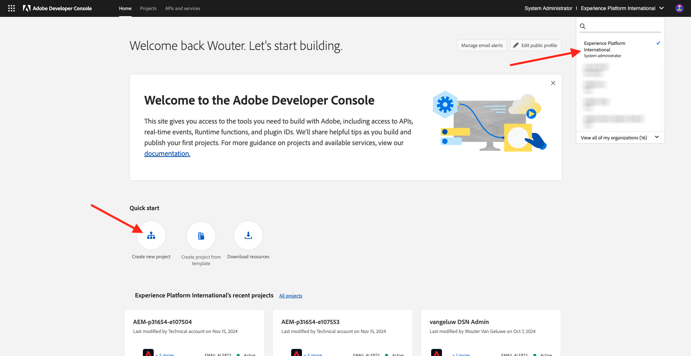
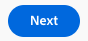
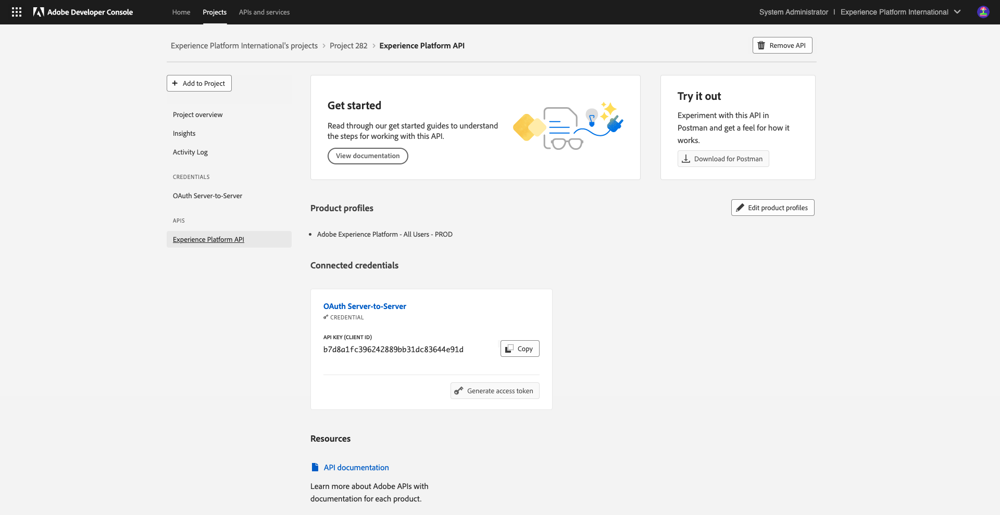

# 2.3.7 Destinations SDK

## 2.3.7.1 Konfigurera ditt Adobe I/O-projekt

>[!IMPORTANT]
>
>Om du har skapat ditt Adobe I/O-projekt efter december 2021 kan du återanvända det projektet, hoppa över den här övningen och gå direkt till övning 6.7.2.
>
>Om du skapade ditt Adobe I/O-projekt före december 2021 skapar du ett nytt projekt som är kompatibelt med API:t för målredigering.

I den här övningen kommer du att använda Adobe I/O intensivt för att ställa frågor mot plattformens API:er. Följ stegen nedan för att konfigurera Adobe I/O.

Gå till [https://developer.adobe.com/console/home](https://developer.adobe.com/console/home)


Se till att du väljer rätt Adobe Experience Platform-instans i skärmens övre högra hörn. Din instans är `--envName--`.



Klicka på **Skapa nytt projekt**.

 eller


Välj **+ Lägg till i projekt** och välj **API**.


Då ser du det här:


Klicka på ikonen **Adobe Experience Platform** .


Klicka på **Experience Platform API**.


Klicka på **Nästa**.



Nu kan du välja att antingen låta Adobe I/O generera ditt nyckelpar eller överföra ett befintligt.

Välj **Alternativ 1 - Generera ett nyckelpar**.


Klicka på **Skapa nyckelpar**.


Du får se en snurra i cirka 30 sekunder.


Du kommer då att se detta och det nyckelpar som genererats hämtas som en zip-fil: **config.zip**.

Zippa upp filen **config.zip** på skrivbordet så ser du att den innehåller 2 filer:


- **certificate_pub.crt** är ditt certifikat för offentlig nyckel. Ur säkerhetssynpunkt är detta det certifikat som fritt används för att konfigurera integreringar med onlineprogram.
- **private.key** är din privata nyckel. Det här ska aldrig delas med någon. Den privata nyckeln är det du använder för att autentisera din API-implementering och ska vara en hemlighet. Om du delar din privata nyckel med vem som helst kan de komma åt implementeringen och missbruka API:t för att importera skadliga data till Platform och extrahera alla data som finns i Platform.


Spara filen **config.zip** på en säker plats, eftersom du behöver detta för nästa steg och för framtida åtkomst till API:er för Adobe I/O och Adobe Experience Platform.

Klicka på **Nästa**.


Du måste nu välja **produktprofiler** för din integrering.

Välj önskade produktprofiler.

**FYI**: I din Adobe Experience Platform-instans får produktprofilerna ett annat namn. Du måste välja minst en produktprofil med rätt åtkomsträttigheter, som är konfigurerad i Adobe Admin Console.


Klicka på **Spara konfigurerat API**.


Du får se en snurra i några sekunder.


Och sedan ser du integreringen.



Klicka på knappen **Hämta för Postman** och sedan på **tjänstkonto (JWT)** för att hämta en Postman-miljö (vänta tills miljön har hämtats, det kan ta några sekunder).


Bläddra nedåt tills du ser **tjänstkonto (JWT)**, där du hittar all integreringsinformation som används för att konfigurera integreringen med Adobe Experience Platform.


IO-projektet har för närvarande ett generiskt namn. Du måste ge integreringen ett eget namn. Klicka på **Projekt 1** (eller liknande namn) som anges


Klicka på **Redigera projekt**.


Ange ett namn och en beskrivning för integreringen. Som namnkonvention använder vi `AEP API --aepUserLdap--`. Ersätt ldap med din ldap.
Om din ldap till exempel är vangeluw blir namnet och beskrivningen av din integrering AEP API-vangeluw.

Ange `AEP API --aepUserLdap--` som **projekttitel**. Klicka på **Spara**.


Integreringen av Adobe I/O är nu klar.


## 2.3.7.2 Postman-autentisering till Adobe I/O

Gå till [https://www.getpostman.com/](https://www.getpostman.com/).

Klicka på **Kom igång**.


Hämta och installera sedan Postman.


Starta programmet när du har installerat Postman.

I Postman finns det två koncept: Miljö och Samlingar.

- Miljön innehåller alla dina miljövariabler som är mer eller mindre konsekventa. I miljön hittar du saker som IMSOrg i vår plattformsmiljö, tillsammans med säkerhetsreferenser som din privata nyckel och andra. Miljöfilen är den som du hämtade under konfigurationen för Adobe I/O i den tidigare övningen. Den har följande namn: **service.postman_environment.json**.

- Samlingen innehåller ett antal API-begäranden som du kan använda. Vi kommer att använda 2 samlingar
   - 1 samling för autentisering till Adobe I/0
   - 1 Samling för övningar i denna modul
   - 1 samling för övningarna i Real-Time CDP-modulen, för målredigering

Hämta filen [postman.zip](./../../../assets/postman/postman_profile.zip) till ditt lokala skrivbord.

I den här **postman.zip**-filen hittar du följande filer:

- `_Adobe I-O - Token.postman_collection.json`
- `_Adobe Experience Platform Enablement.postman_collection.json`
- `Destination_Authoring_API.json`

Zippa upp filen **postman.zip** och lagra dessa tre filer i en mapp på skrivbordet tillsammans med den hämtade Postman-miljön från Adobe I/O. Du måste ha dessa fyra filer i den mappen:


Gå tillbaka till Postman. Klicka på **Importera**.


Klicka på **Överför filer**.


Navigera till den mapp på skrivbordet där du extraherade de 4 hämtade filerna. Markera de här fyra filerna samtidigt och klicka på **Öppna**.


När du har klickat på **Öppna** visas en översikt i Postman över miljön och de samlingar du håller på att importera. Klicka på **Importera**.


Nu har du allt du behöver i Postman för att börja interagera med Adobe Experience Platform via API:erna.

Det första du behöver göra är att se till att du är rätt autentiserad. Du måste begära en åtkomsttoken för att kunna autentiseras.

Kontrollera att du har valt rätt miljö innan du kör någon begäran. Du kan kontrollera den valda miljön genom att verifiera listrutan Miljö i det övre högra hörnet.

Den valda miljön bör ha ett namn som liknar det här:


Klicka på ikonen **ögat** och sedan på **Redigera** för att uppdatera den privata nyckeln i miljöfilen.


Då ser du det här. Alla fält är förifyllda, utom fältet **PRIVATE_KEY**.


Den privata nyckeln har genererats när du skapade ditt Adobe I/O-projekt. Den hämtades som en zip-fil med namnet **config.zip**. Extrahera zip-filen till skrivbordet.


Öppna mappen **config** och öppna filen **private.key** med valfri textredigerare.


Du kommer då att se något liknande, kopiera all text till Urklipp.


Gå tillbaka till Postman och klistra in den privata nyckeln i fälten bredvid variabeln **PRIVATE_KEY**, för båda kolumnerna **INITIAL VALUE** och **CURRENT VALUE**. Klicka på **Spara**.


Din Postman-miljö och dina samlingar är nu konfigurerade och fungerar. Nu kan du autentisera från Postman till Adobe I/O.

För att göra det måste du läsa in ett externt bibliotek som hanterar kryptering och dekryptering av kommunikation. Om du vill läsa in det här biblioteket måste du köra begäran med namnet **INIT: Läs in krypteringsbibliotek för RS256**. Markera den här begäran i **_Adobe I/O - tokensamlingen** så visas den mitt på skärmen.


Klicka på den blå **Skicka**-knappen. Efter några sekunder bör du se ett svar i avsnittet **Brödtext** i Postman:


Med kryptobiblioteket inläst kan vi autentisera till Adobe I/O.

I **\_Adobe I/O - Token-samlingen** markerar du begäran med namnet **IMS: JWT Generate + Auth**. Återigen visas informationen om begäran mitt på skärmen.


Klicka på den blå **Skicka**-knappen. Efter några sekunder bör du se ett svar i avsnittet **Brödtext** i Postman:


Om konfigurationen lyckades bör du se ett liknande svar som innehåller följande information:

| Nyckel | Värde |
|:-------------:| :---------------:| 
| token_type | **bärare** |
| access_token | **eyJ4NXUiOiJpbXNfbmEx...QT7mqZkumN1tdsPEioOEl4087Dg** |
| förfaller_in | **86399973** |

Adobe I/O har gett dig en **innehavartoken** med ett specifikt värde (denna mycket långa åtkomsttoken) och ett förfallofönster.

Den token vi har fått gäller nu i 24 timmar. Det innebär att om du efter 24 timmar vill använda Postman för att autentisera till Adobe I/O måste du generera en ny token genom att köra denna begäran igen.

## 2.3.7.3 Definiera slutpunkt och format

För den här övningen behöver du en slutpunkt för att konfigurera så att kvalificeringshändelsen kan direktuppspelas till den slutpunkten när ett segment kvalificerar sig. I den här övningen använder du en exempelslutpunkt med [https://webhook.site/](https://webhook.site/). Gå till [https://webhook.site/](https://webhook.site/), där du ser något liknande. Klicka på **Kopiera till Urklipp** för att kopiera URL:en. Du måste ange den här URL:en i nästa övning. URL:en i det här exemplet är `https://webhook.site/e0eb530c-15b4-4a29-8b50-e40877d5490a`.


När det gäller formatet kommer vi att använda en standardmall som direktuppspelar segmentens kvalifikationer eller kvalifikationer tillsammans med metadata som kundidentifierare. Mallar kan anpassas så att de uppfyller förväntningarna för specifika slutpunkter, men i den här övningen återanvänder vi en standardmall, vilket resulterar i en sådan här nyttolast som kommer att direktuppspelas till slutpunkten.

```json
{
  "profiles": [
    {
      "identities": [
        {
          "type": "ecid",
          "id": "64626768309422151580190219823409897678"
        }
      ],
      "AdobeExperiencePlatformSegments": {
        "add": [
          "f58c723c-f1e5-40dd-8c79-7bb4ab47f041"
        ],
        "remove": []
      }
    }
  ]
}
```

## 2.3.7.4 Skapa en server- och mallkonfiguration

Det första steget för att skapa ett eget mål i Adobe Experience Platform är att skapa en server- och mallkonfiguration.

Det gör du genom att gå till **API:t för målredigering**, till **Målservrar och mallar** och klicka för att öppna **POSTEN för begäran - Skapa en målserverkonfiguration**. Då ser du det här. Under **Sidhuvuden** måste du uppdatera värdet för nyckeln **x-sandbox-name** manuellt och ange den till `--aepSandboxName--`. Välj värdet **{{SANDBOX_NAME}}**.


Ersätt den med `--aepSandboxName--`.


Gå sedan till **Brödtext**. välj platshållaren **{{body}}**.


Du måste nu ersätta platshållaren **{{body}}** med följande kod:

```json
{
    "name": "Custom HTTP Destination",
    "destinationServerType": "URL_BASED",
    "urlBasedDestination": {
        "url": {
            "templatingStrategy": "PEBBLE_V1",
            "value": "yourURL"
        }
    },
    "httpTemplate": {
        "httpMethod": "POST",
        "requestBody": {
            "templatingStrategy": "PEBBLE_V1",
            "value": "{\n    \"profiles\": [\n    \n        {\n            \"identities\": [\n            \n            \n                \n                {\n                    \"type\": \"{{ namespace }}\",\n                    \"id\": \"{{ identity.id }}\"\n                },\n                ,\n            \n            ],\n            \"AdobeExperiencePlatformSegments\": {\n                \"add\": [\n                \n                    \"{{ segment.key }}\",\n                \n                ],\n                \"remove\": [\n                {#- Alternative syntax for filtering segments by status: -#}\n                \n                    \"{{ segment.key }}\",\n                \n                ]\n            }\n        },\n    \n    ]\n}"
        },
        "contentType": "application/json"
    }
}
```

När du har klistrat in ovanstående kod måste du uppdatera fältet **urlBasedDestination.url.value** manuellt, och du måste ange det till webbadressen för den webkrok du skapade i det föregående steget, som var `https://webhook.site/e0eb530c-15b4-4a29-8b50-e40877d5490a` i det här exemplet.


När fältet **urlBasedDesttion.url.value** har uppdaterats bör det se ut så här. Klicka på **Skicka**.


När du har klickat på **Skicka** skapas servermallen och som en del av svaret visas ett fält med namnet **instanceId**. Skriv ned det så som du behöver det i nästa steg. I det här exemplet är **instanceId**
`eb0f436f-dcf5-4993-a82d-0fcc09a6b36c`.


## 2.3.7.5 Skapa en destinationskonfiguration

I Postman går du till **Målkonfigurationer** under **API för målredigering** och klickar för att öppna **POSTEN för begäran - Skapa en målkonfiguration**. Då ser du det här. Under **Sidhuvuden** måste du uppdatera värdet för nyckeln **x-sandbox-name** manuellt och ange den till `--aepSandboxName--`. Välj värdet **{{SANDBOX_NAME}}**.


Ersätt den med `--aepSandboxName--`.


Gå sedan till **Brödtext**. välj platshållaren **{{body}}**.


Du måste nu ersätta platshållaren **{{body}}** med följande kod:

```json
{
    "name": "--aepUserLdap-- - Webhook",
    "description": "Exports segment qualifications and identities to a custom webhook via Destination SDK.",
    "status": "TEST",
    "customerAuthenticationConfigurations": [
        {
            "authType": "BEARER"
        }
    ],
    "customerDataFields": [
        {
            "name": "endpointsInstance",
            "type": "string",
            "title": "Select Endpoint",
            "description": "We could manage several instances across the globe for REST endpoints that our customers are provisioned for. Select your endpoint in the dropdown list.",
            "isRequired": true,
            "enum": [
                "US",
                "EU",
                "APAC",
                "NZ"
            ]
        }
    ],
    "uiAttributes": {
        "documentationLink": "https://experienceleague.adobe.com/docs/experience-platform/destinations/home.html?lang=en",
        "category": "streaming",
        "connectionType": "Server-to-server",
        "frequency": "Streaming"
    },
    "identityNamespaces": {
        "ecid": {
            "acceptsAttributes": true,
            "acceptsCustomNamespaces": false
        }
    },
    "segmentMappingConfig": {
        "mapExperiencePlatformSegmentName": true,
        "mapExperiencePlatformSegmentId": true,
        "mapUserInput": false
    },
    "aggregation": {
        "aggregationType": "BEST_EFFORT",
        "bestEffortAggregation": {
            "maxUsersPerRequest": "1000",
            "splitUserById": false
        }
    },
    "schemaConfig": {
        "profileRequired": false,
        "segmentRequired": true,
        "identityRequired": true
    },
    "destinationDelivery": [
        {
            "authenticationRule": "NONE",
            "destinationServerId": "yourTemplateInstanceID"
        }
    ]
}
```


När du har klistrat in ovanstående kod måste du uppdatera fältet **destinationDelivery manuellt. destinationServerId**, och du måste ange det till **instanceId** för målservermallen som du skapade i föregående steg, som var `eb0f436f-dcf5-4993-a82d-0fcc09a6b36c` i det här exemplet. Klicka sedan på **Skicka**.


Du kommer då att se det här svaret.


Målet har skapats i Adobe Experience Platform. Vi går dit och kollar det.

Gå till [Adobe Experience Platform](https://experience.adobe.com/platform). När du har loggat in loggar du in på Adobe Experience Platform hemsida.


Innan du fortsätter måste du välja en **sandlåda**. Sandlådan som ska markeras har namnet ``--aepSandboxName--``. Du kan göra detta genom att klicka på texten **[!UICONTROL Production Prod]** i den blå raden ovanför skärmen. När du har valt rätt [!UICONTROL sandbox] visas skärmändringen och nu är du i din dedikerade [!UICONTROL sandbox].


Gå till **Destinationer** på den vänstra menyn, klicka på **Katalog** och bläddra nedåt till kategorin **Direktuppspelning**. Du kommer att se ditt mål där nu.


## 2.3.7.6 Länka segmentet till målplatsen

I **Destinationer** > **Katalog** klickar du på **Konfigurera** på målet för att börja lägga till segment till det nya målet.


Ange en oanvändbar innehavartoken, som **1234**. Klicka på **Anslut till mål**.


Då ser du det här. Använd `--aepUserLdap-- - Webhook` som namn på målet. Välj en valfri slutpunkt, i det här exemplet **EU**. Klicka på **Nästa**.


Du kan också välja en datastyrningspolicy. Klicka på **Nästa**.


Markera segmentet som du skapade tidigare, med namnet `--aepUserLdap-- - Interest in PROTEUS FITNESS JACKSHIRT`. Klicka på **Nästa**.


Då ser du det här. Se till att mappa **SOURCE FIELD** `--aepTenantId--.identification.core.ecid` till fältet `Identity: ecid`. Klicka på **Nästa**.


Klicka på **Slutför**.


Din destination är nu aktiv, nya segmentkvalifikationer kommer att strömmas till din anpassade webkrok nu.


## 2.3.7.7 Testa aktiveringen av segmentet

Gå till [https://builder.adobedemo.com/projects](https://builder.adobedemo.com/projects). När du har loggat in med din Adobe ID ser du det här. Klicka på webbplatsprojektet för att öppna det.


Nu kan du följa nedanstående flöde för att komma åt webbplatsen. Klicka på **Integrationer**.


På sidan **Integrationer** måste du välja den datainsamlingsegenskap som skapades i övning 0.1.


Du kommer då att se din demowebbplats öppnas. Markera URL-adressen och kopiera den till Urklipp.


Öppna ett nytt inkognito-webbläsarfönster.


Klistra in webbadressen till demowebbplatsen, som du kopierade i föregående steg. Du ombeds sedan logga in med din Adobe ID.


Välj kontotyp och slutför inloggningsprocessen.


Därefter visas webbplatsen i ett inkognitivt webbläsarfönster. För varje demonstration måste du använda ett nytt, inkognitivt webbläsarfönster för att läsa in webbadressen till demowebbplatsen.


Gå till **Män** på hemsidan **Luma** och klicka på produkten **PROTEUS FITNESS JACKSHIRT**.


Du har nu besökt produktsidan för **PROTEUS FITNESS JACKSHIRT**, vilket innebär att du nu är berättigad till det segment som du skapade tidigare i den här övningen.


När du öppnar profilvisningsprogrammet och går till **Segment** ser du att segmentet är kvalificerat.


Gå tillbaka till din öppna webkrok på [https://webhook.site/](https://webhook.site/), där du bör se en ny inkommande begäran som kommer från Adobe Experience Platform och som innehåller segmentkvalificeringshändelsen.


Nästa steg: [Sammanfattning och förmåner](./summary.md)

[Gå tillbaka till modul 2.3](./real-time-cdp-build-a-segment-take-action.md)

[Gå tillbaka till Alla moduler](../../../overview.md)
