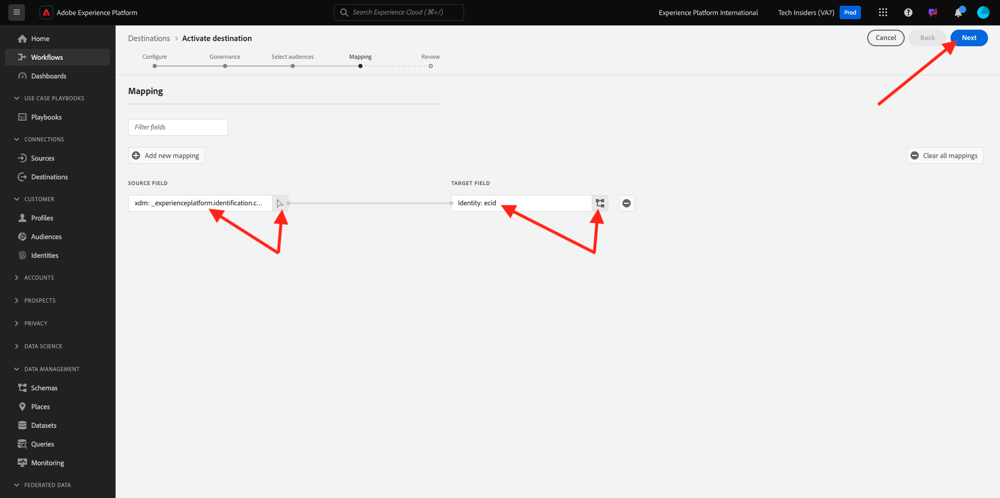

# 2.3.7 Destinations SDK

## Konfigurera ditt Adobe I/O-projekt

I den här övningen kommer du att använda Adobe I/O igen för att ställa frågor till Adobe Experience Platform API:er. Om du inte har konfigurerat ditt Adobe I/O-projekt ännu går du tillbaka till [Exercise 3 i Module 2.1](../module2.1/ex3.md) och följer instruktionerna där.

## Postman-autentisering till Adobe I/O

I den här övningen kommer du att använda Postman igen för att ställa frågor till Adobe Experience Platform API:er. Om du inte har konfigurerat ditt Postman-program ännu går du tillbaka till [Utgång 3 i modul 2.1](../module2.1/ex3.md) och följer instruktionerna där.

## Definiera slutpunkt och format

För den här övningen behöver du en slutpunkt för att konfigurera så att kvalificeringshändelsen kan direktuppspelas till den slutpunkten när ett segment kvalificerar sig. I den här övningen använder du en exempelslutpunkt med [https://webhook.site/](https://webhook.site/). Gå till [https://webhook.site/](https://webhook.site/), där du ser något liknande. Klicka på **Kopiera till Urklipp** för att kopiera URL:en. Du måste ange den här URL:en i nästa övning. URL:en i det här exemplet är `https://webhook.site/e0eb530c-15b4-4a29-8b50-e40877d5490a`.


När det gäller formatet kommer vi att använda en standardmall som direktuppspelar segmentens kvalifikationer eller kvalifikationer tillsammans med metadata som kundidentifierare. Mallar kan anpassas så att de uppfyller förväntningarna för specifika slutpunkter, men i den här övningen återanvänder vi en standardmall, vilket resulterar i en sådan här nyttolast som kommer att direktuppspelas till slutpunkten.

```json
{
  "profiles": [
    {
      "identities": [
        {
          "type": "ecid",
          "id": "64626768309422151580190219823409897678"
        }
      ],
      "AdobeExperiencePlatformSegments": {
        "add": [
          "f58c723c-f1e5-40dd-8c79-7bb4ab47f041"
        ],
        "remove": []
      }
    }
  ]
}
```

## Skapa en server- och mallkonfiguration

Det första steget för att skapa ett eget mål i Adobe Experience Platform är att skapa en server- och mallkonfiguration.

Det gör du genom att gå till **API:t för målredigering**, till **Målservrar och mallar** och klicka för att öppna **POSTEN för begäran - Skapa en målserverkonfiguration**. Då ser du det här. Under **Sidhuvuden** måste du uppdatera värdet för nyckeln **x-sandbox-name** manuellt och ange den till `--aepSandboxName--`. Välj värdet **{{SANDBOX_NAME}}**.


Ersätt den med `--aepSandboxName--`.


Gå sedan till **Brödtext**. välj platshållaren **{{body}}**.


Du måste nu ersätta platshållaren **{{body}}** med följande kod:

```json
{
    "name": "Custom HTTP Destination",
    "destinationServerType": "URL_BASED",
    "urlBasedDestination": {
        "url": {
            "templatingStrategy": "PEBBLE_V1",
            "value": "yourURL"
        }
    },
    "httpTemplate": {
        "httpMethod": "POST",
        "requestBody": {
            "templatingStrategy": "PEBBLE_V1",
            "value": "{\n    \"profiles\": [\n    \n        {\n            \"identities\": [\n            \n            \n                \n                {\n                    \"type\": \"{{ namespace }}\",\n                    \"id\": \"{{ identity.id }}\"\n                },\n                ,\n            \n            ],\n            \"AdobeExperiencePlatformSegments\": {\n                \"add\": [\n                \n                    \"{{ segment.key }}\",\n                \n                ],\n                \"remove\": [\n                {#- Alternative syntax for filtering segments by status: -#}\n                \n                    \"{{ segment.key }}\",\n                \n                ]\n            }\n        },\n    \n    ]\n}"
        },
        "contentType": "application/json"
    }
}
```

När du har klistrat in ovanstående kod måste du uppdatera fältet **urlBasedDestination.url.value** manuellt, och du måste ange det till webbadressen för den webkrok du skapade i det föregående steget, som var `https://webhook.site/e0eb530c-15b4-4a29-8b50-e40877d5490a` i det här exemplet.


När fältet **urlBasedDesttion.url.value** har uppdaterats bör det se ut så här. Klicka på **Skicka**.


När du har klickat på **Skicka** skapas servermallen och som en del av svaret visas ett fält med namnet **instanceId**. Skriv ned det så som du behöver det i nästa steg. I det här exemplet är **instanceId**
`eb0f436f-dcf5-4993-a82d-0fcc09a6b36c`.


## Skapa din destinationskonfiguration

I Postman går du till **Målkonfigurationer** under **API för målredigering** och klickar för att öppna **POSTEN för begäran - Skapa en målkonfiguration**. Då ser du det här. Under **Sidhuvuden** måste du uppdatera värdet för nyckeln **x-sandbox-name** manuellt och ange den till `--aepSandboxName--`. Välj värdet **{{SANDBOX_NAME}}**.


Ersätt den med `--aepSandboxName--`.


Gå sedan till **Brödtext**. välj platshållaren **{{body}}**.


Du måste nu ersätta platshållaren **{{body}}** med följande kod:

```json
{
    "name": "--aepUserLdap-- - Webhook",
    "description": "Exports segment qualifications and identities to a custom webhook via Destination SDK.",
    "status": "TEST",
    "customerAuthenticationConfigurations": [
        {
            "authType": "BEARER"
        }
    ],
    "customerDataFields": [
        {
            "name": "endpointsInstance",
            "type": "string",
            "title": "Select Endpoint",
            "description": "We could manage several instances across the globe for REST endpoints that our customers are provisioned for. Select your endpoint in the dropdown list.",
            "isRequired": true,
            "enum": [
                "US",
                "EU",
                "APAC",
                "NZ"
            ]
        }
    ],
    "uiAttributes": {
        "documentationLink": "https://experienceleague.adobe.com/docs/experience-platform/destinations/home.html?lang=en",
        "category": "streaming",
        "connectionType": "Server-to-server",
        "frequency": "Streaming"
    },
    "identityNamespaces": {
        "ecid": {
            "acceptsAttributes": true,
            "acceptsCustomNamespaces": false
        }
    },
    "segmentMappingConfig": {
        "mapExperiencePlatformSegmentName": true,
        "mapExperiencePlatformSegmentId": true,
        "mapUserInput": false
    },
    "aggregation": {
        "aggregationType": "BEST_EFFORT",
        "bestEffortAggregation": {
            "maxUsersPerRequest": "1000",
            "splitUserById": false
        }
    },
    "schemaConfig": {
        "profileRequired": false,
        "segmentRequired": true,
        "identityRequired": true
    },
    "destinationDelivery": [
        {
            "authenticationRule": "NONE",
            "destinationServerId": "yourTemplateInstanceID"
        }
    ]
}
```


När du har klistrat in ovanstående kod måste du uppdatera fältet **destinationDelivery manuellt. destinationServerId**, och du måste ange det till **instanceId** för målservermallen som du skapade i föregående steg, som var `eb0f436f-dcf5-4993-a82d-0fcc09a6b36c` i det här exemplet. Klicka sedan på **Skicka**.


Du kommer då att se det här svaret.


Målet har skapats i Adobe Experience Platform. Vi går dit och kollar det.

Gå till [Adobe Experience Platform](https://experience.adobe.com/platform). När du har loggat in loggar du in på Adobe Experience Platform hemsida.


Innan du fortsätter måste du välja en **sandlåda**. Sandlådan som ska markeras har namnet ``--aepSandboxName--``. Du kan göra detta genom att klicka på texten **[!UICONTROL Production Prod]** i den blå raden ovanför skärmen. När du har valt rätt [!UICONTROL sandbox] visas skärmändringen och nu är du i din dedikerade [!UICONTROL sandbox].


Gå till **Destinationer** på den vänstra menyn, klicka på **Katalog** och bläddra nedåt till kategorin **Direktuppspelning**. Du kommer att se ditt mål där nu.


## Länka segmentet till målet

I **Destinationer** > **Katalog** klickar du på **Konfigurera** på målet för att börja lägga till segment till det nya målet.


Ange en oanvändbar innehavartoken, som **1234**. Klicka på **Anslut till mål**.


Då ser du det här. Använd `--aepUserLdap-- - Webhook` som namn på målet. Välj en valfri slutpunkt, i det här exemplet **EU**. Klicka på **Nästa**.


Du kan också välja en datastyrningspolicy. Klicka på **Nästa**.


Markera segmentet som du skapade tidigare, med namnet `--aepUserLdap-- - Interest in PROTEUS FITNESS JACKSHIRT`. Klicka på **Nästa**.


Då ser du det här. Se till att mappa **SOURCE FIELD** `--aepTenantId--.identification.core.ecid` till fältet `Identity: ecid`. Klicka på **Nästa**.



Klicka på **Slutför**.


Din destination är nu aktiv, nya segmentkvalifikationer kommer att strömmas till din anpassade webkrok nu.


## Testa aktiveringen av ditt segment

Gå till [https://builder.adobedemo.com/projects](https://builder.adobedemo.com/projects). När du har loggat in med din Adobe ID ser du det här. Klicka på webbplatsprojektet för att öppna det.


Nu kan du följa nedanstående flöde för att komma åt webbplatsen. Klicka på **Integrationer**.


På sidan **Integrationer** måste du välja den datainsamlingsegenskap som skapades i övning 0.1.


Du kommer då att se din demowebbplats öppnas. Markera URL-adressen och kopiera den till Urklipp.


Öppna ett nytt inkognito-webbläsarfönster.


Klistra in webbadressen till demowebbplatsen, som du kopierade i föregående steg. Du ombeds sedan logga in med din Adobe ID.


Välj kontotyp och slutför inloggningsprocessen.


Därefter visas webbplatsen i ett inkognitivt webbläsarfönster. För varje demonstration måste du använda ett nytt, inkognitivt webbläsarfönster för att läsa in webbadressen till demowebbplatsen.


Gå till **Män** på hemsidan **Luma** och klicka på produkten **PROTEUS FITNESS JACKSHIRT**.


Du har nu besökt produktsidan för **PROTEUS FITNESS JACKSHIRT**, vilket innebär att du nu är berättigad till det segment som du skapade tidigare i den här övningen.


När du öppnar profilvisningsprogrammet och går till **Segment** ser du att segmentet är kvalificerat.


Gå tillbaka till din öppna webkrok på [https://webhook.site/](https://webhook.site/), där du bör se en ny inkommande begäran som kommer från Adobe Experience Platform och som innehåller segmentkvalificeringshändelsen.


Nästa steg: [Sammanfattning och förmåner](./summary.md)

[Gå tillbaka till modul 2.3](./real-time-cdp-build-a-segment-take-action.md)

[Gå tillbaka till Alla moduler](../../../overview.md)
