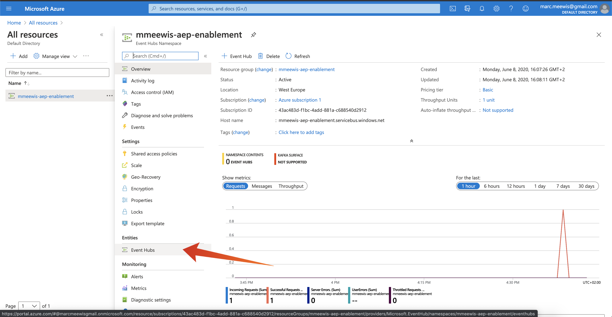

# 2.4.1 Konfigurera din Microsoft Azure EventHub-miljö

Azure Event Hubs är en mycket skalbar publiceringsprenumerationstjänst som kan importera miljontals händelser per sekund och strömma dem till flera program. På så sätt kan du bearbeta och analysera den enorma mängd data som produceras av dina anslutna enheter och program.

## 2.4.1.1 Vad är Azure Event Hubs?

Azure Event Hubs är en stor dataströmningsplattform och en tjänst för händelsehantering. Den kan ta emot och bearbeta miljontals händelser per sekund. Data som skickas till ett händelsehubb kan omformas och lagras med hjälp av alla realtidsanalysleverantörer eller batchnings-/lagringsadaptrar.

Händelsehubbar representerar **ytterdörren** för en händelsepipeline, som ofta kallas händelseinsättare i lösningsarkitekturer. En händelseinsättare är en komponent eller tjänst som är placerad mellan händelseutgivare (som Adobe Experience Platform RTCDP) och händelsekonsumenter för att frigöra produktionen av en händelseström från förbrukningen av dessa händelser. Event Hubs utgör en enhetlig direktuppspelningsplattform med en buffert för tidsbevarande, som frigör händelseproducenter från händelsekonsumenter.

## 2.4.1.2 Skapa namnutrymmet Event Hubs

Gå till [https://portal.azure.com/#home](https://portal.azure.com/#home) och välj **Skapa en resurs**.

Ange **Händelse** i sökfältet på resursskärmen och välj **Händelsehubbar** i listrutan:

Klicka på **Skapa**:

Om det här är första gången du skapar en resurs i Azure måste du skapa en ny **resursgrupp**. Om du redan har en resursgrupp kan du markera den (eller skapa en ny).

Välj **Skapa ny** och ge gruppen namnet `--aepUserLdap---aep-enablement`.

Utför testet av fälten enligt följande:

- Namnområde: Definiera namnområdet, det måste vara unikt, använd följande mönster `--aepUserLdap---aep-enablement`
- Plats: **Västeuropa** refererar till Azure-datacenter i Amsterdam
- Prisnivå: **Grundläggande**
- Genomströmningsenheter: **1**

Klicka på **Granska + skapa**.

Klicka på **Skapa**.

Distributionen av resursgruppen kan ta 1-2 minuter, och följande skärm visas när den är klar:

## 2.4.1.3 Konfigurera händelsehubben i Azure

Gå till [https://portal.azure.com/#home](https://portal.azure.com/#home) och välj **Alla resurser**.

Välj ditt `--aepUserLdap---aep-enablement`-namnområde i resurslistan:

Välj **Händelsehubbar** på `--aepUserLdap---aep-enablement`-detaljskärmen:

Klicka på **+ Händelsehubben**.

Använd `--aepUserLdap---aep-enablement-event-hub` som namn och klicka på **Skapa**.

Klicka på **Händelsehubbar** i händelsehubbens namnutrymme. Du bör nu se din **händelsehubb** i listan. I så fall kan du gå vidare till nästa övning.

## 2.4.1.4 Konfigurera ditt Azure Storage-konto

Om du vill felsöka din Azure Event Hub-funktion i senare övningar måste du tillhandahålla ett Azure Storage-konto som en del av projektkonfigurationen för Visual Studio Code. Du skapar nu det Azure Storage-kontot.

Gå till [https://portal.azure.com/#home](https://portal.azure.com/#home) och välj **Skapa en resurs**.

Ange **lagring** i sökningen och välj **Lagringskonto** i listan.

Välj **Skapa**.

Ange din **resursgrupp** (skapad i början av den här övningen), använd `--aepUserLdap--aepstorage` som lagringskontonamn, välj **Lokalt redundant lagring (LRS)** och klicka sedan på **Granska + skapa**.

Klicka på **Skapa**.

Det tar några sekunder att skapa ditt lagringskonto:

När skärmen är klar visas knappen **Gå till resurs**.

Klicka på **Microsoft Azure**.

Ditt lagringskonto visas nu under **Senaste resurser**.

Nästa steg: [2.4.2 Konfigurera Azure Event Hub-målet i Adobe Experience Platform](./ex2.md)

[Gå tillbaka till modul 2.4](./segment-activation-microsoft-azure-eventhub.md)

[Gå tillbaka till Alla moduler](./../../../overview.md)
