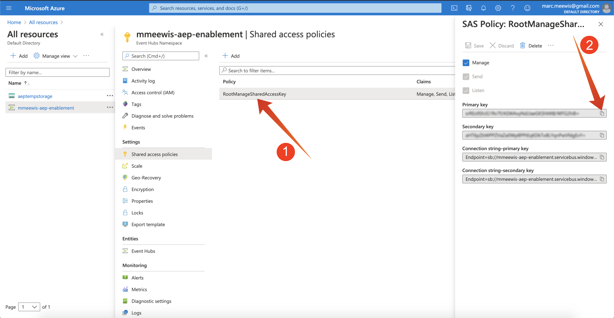

# 2.4.2 Konfigurera Azure Event Hub-målet i Adobe Experience Platform

## 2.4.2.1 Identifiera obligatoriska Azure Connection-parametrar

Om du vill definiera en Event Hub-destination i Adobe Experience Platform behöver du din

- Namnutrymme för händelsehubbar
- Händelsehubb
- Azure SAS-nyckelnamn
- Azure SAS-nyckel

Händelsehubben och EventHub-namnutrymmet har definierats i den föregående övningen: [Utgång 1 - Konfigurera händelsehubben i Azure](./ex1.md)

### Namnutrymme för händelsehubbar

Om du vill söka efter ovanstående information i Azure Portal går du till [https://portal.azure.com/#home](https://portal.azure.com/#home). Kontrollera att du använder rätt Azure-konto.

Välj **Alla resurser** i Azure Portal:

### Händelsehubb

Leta efter en resurs med resurstypen **Event Hubs Namespace**. Om du följt namnkonventionerna som användes i den tidigare övningen kommer du att använda Event Hubs Namespace `--aepUserLdap---aep-enablement`. Observera att du kommer att behöva det i nästa övning.

Klicka på namnet på händelsehubbens namnområde för att få mer information:

Välj **Händelsehubbar** om du vill visa en lista över händelsehubbar som har definierats i namnutrymmet för händelsehubbar. Om du följde namnkonventionerna som användes i den föregående övningen hittar du en händelsehubb med namnet `--aepUserLdap---aep-enablement-event-hub`. Observera att du kommer att behöva det i nästa övning.

### SAS-nyckelnamn

Välj **Principer för delad åtkomst** för **namnområdet för händelsehubbar**

Du ser en lista över principer för delad åtkomst. SAS-nyckeln som vi letar efter är **RootManageSharedAccessKey**. Detta är namnet på SAS-nyckeln. Skriv ner det.

### SAS-nyckelvärde

Klicka på **RootManageSharedAccessKey** för att hämta SAS-nyckelvärdet. Tryck på ikonen **Kopiera till Urklipp** för att kopiera **primärnyckeln**:

### Sammanfattning av målvärden

Nu bör du ha identifierat alla värden som behövs för att definiera Azure Event Hub-målet i Adobe Experience Platform CDP i realtid.

| Namn på målattribut | Värde för målattribut | Exempelvärde |
|---|---|---|
| sasKeyName | SAS-nyckelnamn | RootHanteraDeladÅtkomstnyckel |
| sasKey | SAS-nyckelvärde | srREx9ShJG1Rv7f/... |
| namespace | Namnutrymme för händelsehubbar | `--aepUserLdap---aep-enablement` |
| eventHubName | Händelsehubb | `--aepUserLdap---aep-enablement-event-hub` |

## 2.4.2.2 Skapa Azure Event Hub-mål i Adobe Experience Platform

Logga in på Adobe Experience Platform via följande URL: [https://experience.adobe.com/platform](https://experience.adobe.com/platform).

När du har loggat in loggar du in på Adobe Experience Platform hemsida.

Innan du fortsätter måste du välja en **sandlåda**. Sandlådan som ska markeras har namnet ``--aepSandboxName--``. Du kan göra detta genom att klicka på texten **[!UICONTROL Production Prod]** i den blå raden ovanför skärmen. När du har valt rätt sandlåda ser du skärmändringen och nu befinner du dig i din dedikerade sandlåda.

Gå till **Destinationer** och gå sedan till **Katalog**.

Välj **molnlagring** och gå till **Azure Event Hubs** och klicka på **Konfigurera** eller **Konfigurera**:

Fyll i de målvärden som du har samlat in i föregående övning. Klicka sedan på **Anslut till mål**.

Om dina autentiseringsuppgifter är korrekta visas en bekräftelse: **Ansluten**.

Du måste nu ange namn och beskrivning i formatet `--aepUserLdap---aep-enablement`. Ange **eventHubName** (se föregående övning, den ser ut så här: `--aepUserLdap---aep-enablement-event-hub`) och klicka på **Nästa**.

Klicka på **Spara och avsluta**.

Målet har nu skapats och är tillgängligt i Adobe Experience Platform.

Nästa steg: [2.4.3 Skapa ett segment](./ex3.md)

[Gå tillbaka till modul 2.4](./segment-activation-microsoft-azure-eventhub.md)

[Gå tillbaka till Alla moduler](./../../../overview.md)
