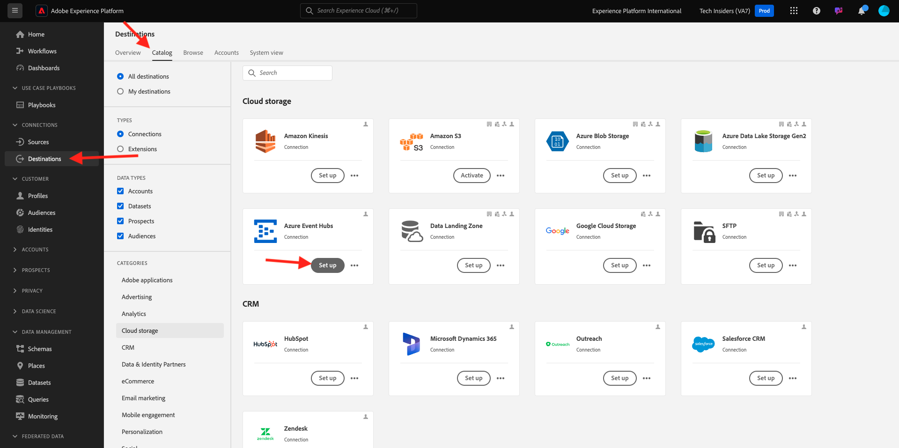

# 2.4.3 Konfigurera Azure Event Hub-målet i Adobe Experience Platform

## Identifiera obligatoriska Azure Connection-parametrar

Om du vill konfigurera ett Event Hub-mål i Adobe Experience Platform behöver du ditt:

- Namnutrymme för händelsehubbar
- Händelsehubb
- Azure SAS-nyckelnamn
- Azure SAS-nyckel

Händelsehubben och EventHub-namnområdet har definierats i den föregående övningen: [Konfigurera händelsehubben i Azure](./ex2.md)

### Namnutrymme för händelsehubbar

Om du vill söka efter ovanstående information i Azure Portal går du till [https://portal.azure.com/#home](https://portal.azure.com/#home). Kontrollera att du använder rätt Azure-konto.

Klicka på **Alla resurser** i din Azure-portal:

Leta reda på namnområdet **Event Hubs** i listan och klicka på det.

Namnet på **Event Hubs-namnområdet** visas nu tydligt. Det ska likna `--aepUserLdap---aep-enablement`.

### Händelsehubb

Klicka på **Enheter > Händelsehubbar** på sidan **Händelsehubbar för namnområde** för att visa en lista över händelsehubbar som har definierats i namnutrymmet för händelsehubbar, om du följde de namnkonventioner som användes i den föregående övningen kommer du att hitta en händelsehubb med namnet `--aepUserLdap---aep-enablement-event-hub`. Observera att du kommer att behöva det i nästa övning.

### SAS-nyckelnamn

Klicka på **Inställningar > Principer för delad åtkomst** på sidan **Händelsehubb-namnområde**. Du ser en lista över principer för delad åtkomst. SAS-nyckeln som vi letar efter är **RootManageSharedAccessKey**, vilket är **SAS-nyckelnamnet. Skriv ner det.

### SAS-nyckelvärde

Klicka sedan på **RootManageSharedAccessKey** för att hämta SAS-nyckelvärdet. Och tryck på ikonen **Kopiera till Urklipp** för att kopiera **primärnyckeln**, i det här fallet `pqb1jEC0KLazwZzIf2gTHGr75Z+PdkYgv+AEhObbQEY=`.

### Sammanfattning av målvärden

Nu bör du ha identifierat alla värden som behövs för att definiera Azure Event Hub-målet i Adobe Experience Platform CDP i realtid.

| Namn på målattribut | Värde för målattribut | Exempelvärde |
|---|---|---|
| sasKeyName | SAS-nyckelnamn | RootHanteraDeladÅtkomstnyckel |
| sasKey | SAS-nyckelvärde | pqb1jEC0KLazwZzIf2gTHGr75Z+PdkYgv+AEhObbQEY= |
| namespace | Namnutrymme för händelsehubbar | `--aepUserLdap---aep-enablement` |
| eventHubName | Händelsehubb | `--aepUserLdap---aep-enablement-event-hub` |

## Skapa Azure Event Hub-mål i Adobe Experience Platform

Logga in på Adobe Experience Platform via följande URL: [https://experience.adobe.com/platform](https://experience.adobe.com/platform).

När du har loggat in loggar du in på Adobe Experience Platform hemsida.

Innan du fortsätter måste du välja en **sandlåda**. Sandlådan som ska markeras har namnet ``--aepSandboxName--``. När du har valt rätt sandlåda ser du skärmändringen och nu befinner du dig i din dedikerade sandlåda.

Gå till **Destinationer** och gå sedan till **Katalog**. Välj **molnlagring**, gå till **Azure Event Hubs** och klicka på **Konfigurera**.

Välj **Standardautentisering**. Fyll i anslutningsinformationen som du har samlat in i föregående övning. Klicka sedan på **Anslut till mål**.

Om dina autentiseringsuppgifter är korrekta visas en bekräftelse: **Ansluten**.

Du måste nu ange namn och beskrivning i formatet `--aepUserLdap---aep-enablement`. Ange **eventHubName** (se föregående övning, den ser ut så här: `--aepUserLdap---aep-enablement-event-hub`) och klicka på **Nästa**.

Du kan också välja en datastyrningspolicy. Klicka på **Spara och avsluta**.

Målet har nu skapats och är tillgängligt i Adobe Experience Platform.

Nästa steg: [2.4.4 Skapa en målgrupp](./ex4.md)

[Gå tillbaka till modul 2.4](./segment-activation-microsoft-azure-eventhub.md)

[Gå tillbaka till Alla moduler](./../../../overview.md)
