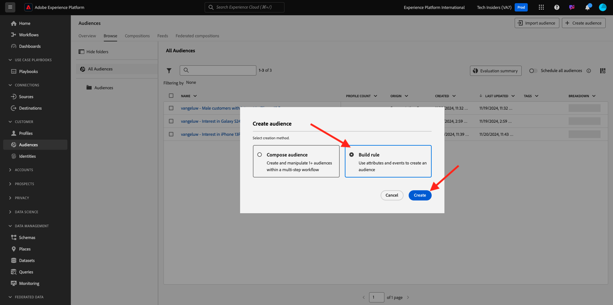

# 2.4.4 Skapa en målgrupp

## Introduktion

Du kommer att skapa en enkel publik:

- **Intresse för planer** som kunder är kvalificerade för när de besöker sidan **Planer** på demowebbplatsen CitiSignal.

### Bra att veta

CDP-aktivering i realtid utlöser en aktivering till ett mål när ni kvalificerar er för en målgrupp som ingår i målets aktiveringslista. I så fall kommer målgruppsklassificeringsnyttolasten som skickas till det målet att innehålla **alla målgrupper som din kundprofil kvalificerar** för.

Målet med den här modulen är att visa att kundprofilens målgruppskvalifikation skickas till din Event Hub-destination i nära realtid.

### Målgruppsstatus

En målgruppsklassificering i Adobe Experience Platform har alltid en **status**-egenskap och kan vara något av följande:

- **realiserat**: Detta indikerar en ny publikkvalificering
- **avslutad**: Detta anger att profilen inte längre är kvalificerad för målgruppen

## Bygg publiken

Logga in på Adobe Experience Platform via följande URL: [https://experience.adobe.com/platform](https://experience.adobe.com/platform).

När du har loggat in loggar du in på Adobe Experience Platform hemsida.

Innan du fortsätter måste du välja en **sandlåda**. Sandlådan som ska markeras har namnet ``--aepSandboxName--``. När du har valt rätt sandlåda ser du skärmändringen och nu befinner du dig i din dedikerade sandlåda.

Gå till **Publiker**. Klicka på knappen **+ Skapa målgrupp**.

Välj **Skapa regel** och klicka på **Skapa**.

Namnge målgruppen `--aepUserLdap-- - Interest in Plans`, ange utvärderingsmetoden till **Edge** och lägg till sidnamnet från upplevelsehändelsen.

Klicka på **Händelser** och dra och släpp **XDM ExperienceEvent > Webb > Information om webbsidor > Namn**. Ange **planer** som värde:

Dra och släpp **XDM ExperienceEvent > `--aepTenantId--` > DemoEnvironment > brandName**. Ange `--aepUserLdap--` som värde, ställ in jämförelseparametern på **contains** och klicka på **Publish**:

Din publik är nu publicerad.

Nästa steg: [2.4.5 Aktivera din målgrupp](./ex5.md)

[Gå tillbaka till modul 2.4](./segment-activation-microsoft-azure-eventhub.md)

[Gå tillbaka till Alla moduler](./../../../overview.md)
