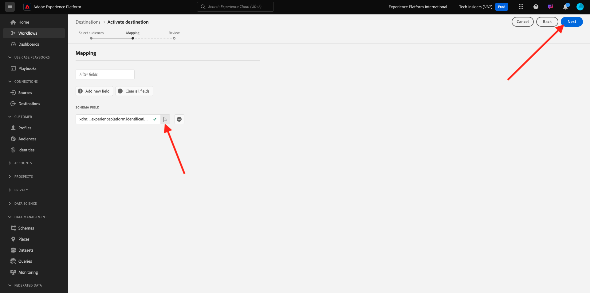

# 2.4.5 Aktivera er målgrupp

## Lägg till målgrupp i Azure Event Hub-målet

I den här övningen lägger du till din målgrupp `--aepUserLdap-- - Interest in Equipment` i ditt `--aepUserLdap---aep-enablement` Azure Event Hub-mål.

Logga in på Adobe Experience Platform via följande URL: [https://experience.adobe.com/platform](https://experience.adobe.com/platform).

När du har loggat in loggar du in på Adobe Experience Platform hemsida.

Innan du fortsätter måste du välja en **sandlåda**. Sandlådan som ska markeras har namnet ``--aepSandboxName--``. När du har valt rätt sandlåda ser du skärmändringen och nu befinner du dig i din dedikerade sandlåda.

Gå till **Destinationer** och klicka sedan på **Bläddra**. Då ser du alla tillgängliga destinationer. Leta upp målplatsen och klicka på de 3 punkterna**..** som anges nedan och klicka sedan på **Aktivera målgrupper**.

Då ser du det här. Sök efter din målgrupp med hjälp av din ldap och välj `--aepUserLdap-- - Interest in Plans` i listan över målgrupper.

Klicka på **Nästa**.

Klicka på **Lägg till nytt fält**, klicka på Bläddra schema och markera fältet `--aepTenantId--identification.core.ecid` (ta bort alla andra fält som skulle visas automatiskt).

Klicka på **Nästa**.

Klicka på **Slutför**.

Din målgrupp är nu aktiverad mot din Microsoft Event Hub-destination.

Nästa steg: [2.4.6 Skapa ditt Microsoft Azure-projekt](./ex6.md)

[Gå tillbaka till modul 2.4](./segment-activation-microsoft-azure-eventhub.md)

[Gå tillbaka till Alla moduler](./../../../overview.md)
