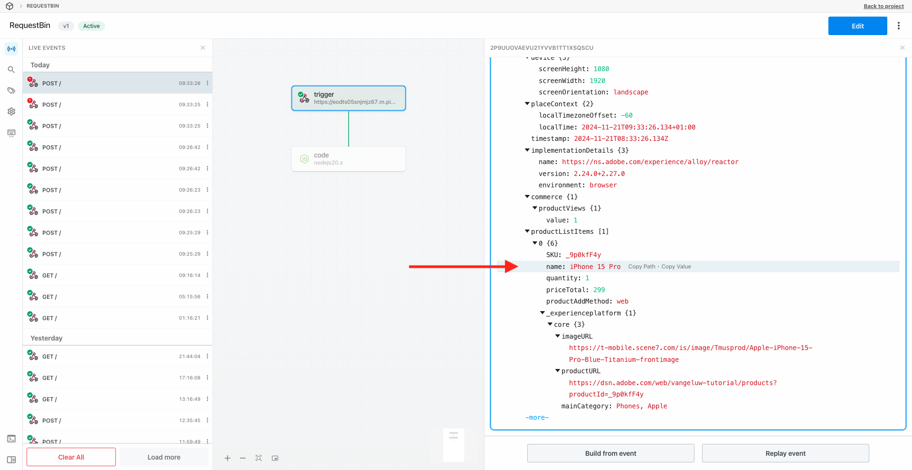

# 2.5.3 Skapa och konfigurera en anpassad webkrok

## Skapa en egen webkrok

Gå till [https://pipedream.com/requestbin](https://pipedream.com/requestbin). Du har redan använt det här programmet i [Utgång 2.3.6-mål SDK](./../../../modules/rtcdp-b2c/module2.3/ex6.md)

Om du inte har använt tjänsten än skapar du ett konto och skapar sedan en arbetsyta. När arbetsytan har skapats ser du något liknande.

Klicka på **kopiera** för att kopiera URL:en. Du måste ange den här URL:en i nästa övning. URL:en i det här exemplet är `https://eodts05snjmjz67.m.pipedream.net`.

Den här webbplatsen har nu skapat den här webbokroken åt dig och du kan konfigurera den i **[!DNL Event Forwarding property]** för att testa vidarebefordran av händelser.

## Uppdatera egenskapen för händelsevidarebefordran: Skapa ett dataelement

Gå till [https://experience.adobe.com/#/data-collection/](https://experience.adobe.com/#/data-collection/) och gå till **Händelsevidarebefordran**. Sök i egenskapen för vidarebefordran av händelser och klicka på den för att öppna den.

Gå till **Dataelement** på den vänstra menyn. Klicka på **Skapa nytt dataelement**.

Sedan visas ett nytt dataelement att konfigurera.

Gör följande val:

- Ange **XDM-händelse** som **namn**.
- Som **tillägg** väljer du **kärna**.
- Som **dataelementtyp** väljer du **Sökväg**.
- Som **sökväg** väljer du **Läs data från XDM (arc.event.xdm)**. Genom att välja den här sökvägen filtrerar du ut avsnittet **XDM** från den händelsenyttolast som skickas av webbplatsen eller mobilappen till Adobe Edge.

Du kommer nu att ha den här. Klicka på **Spara**.

>[!NOTE]
>
>I ovanstående sökväg görs en referens till **arc**. **arc** står för Adobe Resource Context och **arc** står alltid för det högsta tillgängliga objektet som är tillgängligt i Server Side-kontexten. Anrikningar och omvandlingar kan läggas till i det **arc**-objektet med Adobe Experience Platform Data Collection Server-funktioner.
>
>I ovanstående sökväg görs en referens till **event**. **event** står för en unik händelse och Adobe Experience Platform Data Collection Server utvärderar alltid varje enskild händelse. Ibland kan du se en referens till **events** i nyttolasten som skickas av Web SDK Client Side, men i Adobe Experience Platform Data Collection Server utvärderas varje händelse individuellt.

## Uppdatera din Adobe Experience Platform Data Collection Server-egenskap: Skapa en regel

Gå till **Regler** på den vänstra menyn. Klicka på **Skapa ny regel**.

Därefter visas en ny regel att konfigurera. Ange **Namn**: **Alla sidor**. För den här övningen behöver du inte konfigurera något villkor. I stället ska du konfigurera en åtgärd. Klicka på knappen **+ Lägg till** under **Åtgärder**.

Då ser du det här. Gör följande val:

- Välj **tillägget**: **Adobe Cloud Connector**.
- Välj **åtgärdstyp**: **Ring upp hämtning**.

Det bör ge dig det här **namnet**: **Adobe Cloud Connector - ring hämtningssamtal**. Nu bör du se det här:

Konfigurera sedan följande:

- Ändra förfrågningsmetoden från GET till **POST**
- Ange URL:en för den anpassade webkrok du skapade i något av de föregående stegen, som ser ut så här: `https://eodts05snjmjz67.m.pipedream.net`

Du borde ha den här nu. Gå sedan till **Brödtext**.

Då ser du det här. Klicka på dataelementsikonen enligt nedan.

På popup-menyn markerar du dataelementet **XDM Event** som du skapade i föregående steg. Klicka på **Markera**.

Då ser du det här. Klicka på **Behåll ändringar**.

Då ser du det här. Klicka på **Spara**.

Du har nu konfigurerat din första regel i en händelsevidarebefordringsegenskap. Gå till **Publiceringsflöde** om du vill publicera ändringarna.
Öppna utvecklingsbiblioteket **Main** genom att klicka på **Edit** enligt indikationen.

Klicka på knappen **Lägg till alla ändrade resurser**, varefter du ser regeln och dataelementet visas i det här biblioteket. Klicka sedan på **Spara och bygg för utveckling**. Ändringarna distribueras nu.

Efter några minuter ser du att distributionen är klar och klar att testas.

## Testa konfigurationen

Gå till [https://dsn.adobe.com](https://dsn.adobe.com). När du har loggat in med din Adobe ID ser du det här. Klicka på de tre punkterna **..** i webbplatsprojektet och klicka sedan på **Kör** för att öppna det.

Du kommer då att se din demowebbplats öppnas. Markera URL-adressen och kopiera den till Urklipp.

Öppna ett nytt inkognito-webbläsarfönster.

Klistra in webbadressen till demowebbplatsen, som du kopierade i föregående steg. Du ombeds sedan logga in med din Adobe ID.

Välj kontotyp och slutför inloggningsprocessen.

Därefter visas webbplatsen i ett inkognitivt webbläsarfönster. För varje övning måste du använda ett nytt, inkognitivt webbläsarfönster för att läsa in webbadressen till demowebbplatsen.

När du öppnar din webbläsarutvecklarvy kan du inspektera nätverksbegäranden enligt nedan. När du använder filtret **interact** visas nätverksbegäranden som skickas av Adobe Experience Platform Data Collection Client till Adobe Edge.

Om du väljer oformaterad nyttolast går du till [https://jsonformatter.org/json-pretty-print](https://jsonformatter.org/json-pretty-print) och klistrar in nyttolasten. Klicka på **Minify/Beautify**. Sedan ser du JSON-nyttolasten, **events** -objektet och **xdm** -objektet. I ett av de föregående stegen, när du definierade dataelementet, använde du referensen **arc.event.xdm**, vilket resulterar i att du tolkar **xdm** -objektet för den här nyttolasten.

Byt vy till din anpassade webkrok [https://pipedream.com/requestbin](https://pipedream.com/requestbin) som du använde i något av föregående steg. Nu bör du ha en vy som liknar den här, där nätverksbegäranden visas på den vänstra menyn. Du ser nyttolasten **xdm** som filtrerades bort från nätverksbegäran som visades ovan.

Bläddra nedåt en bit i nyttolasten för att hitta sidnamnet, som i det här fallet är **home**.

Om du nu navigerar på webbplatsen kommer du att se ytterligare nätverksförfrågningar bli tillgängliga på den här anpassade webbkroken i realtid.

Du har nu konfigurerat händelsevidarebefordran på serversidan av SDK/XDM-nyttolaster för webben till en extern anpassad webkrok. I nästa övning kommer du att konfigurera ett liknande tillvägagångssätt, och du kommer att skicka samma data till Google Cloud Platform och AWS.

Nästa steg: [2.5.4 Vidarebefordra händelser till GCP Pub/Sub](./ex4.md)

[Gå tillbaka till modul 2.5](./aep-data-collection-ssf.md)

[Gå tillbaka till Alla moduler](./../../../overview.md)
