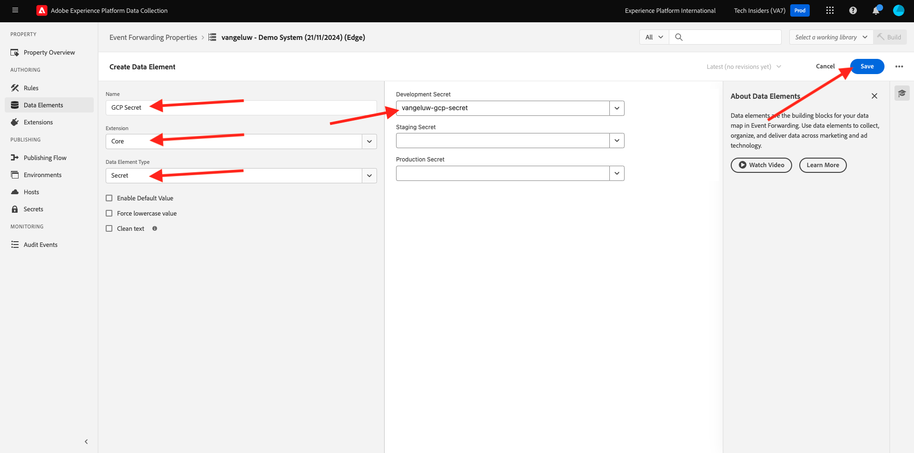
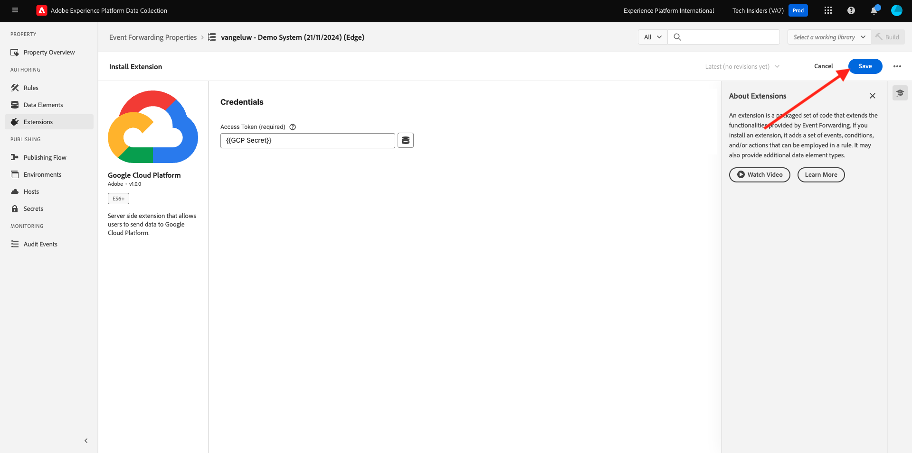
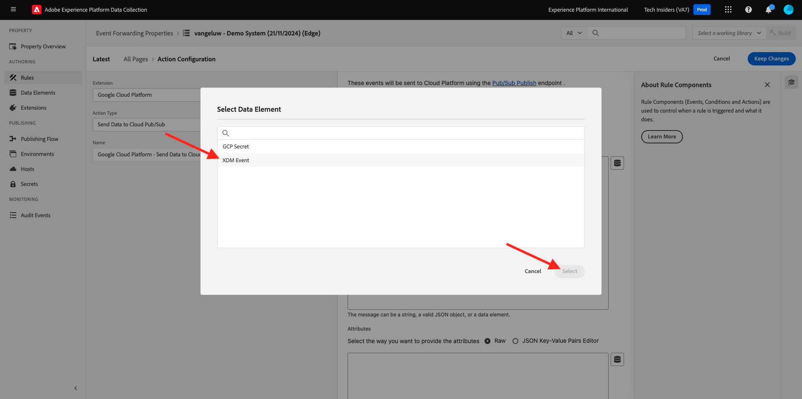
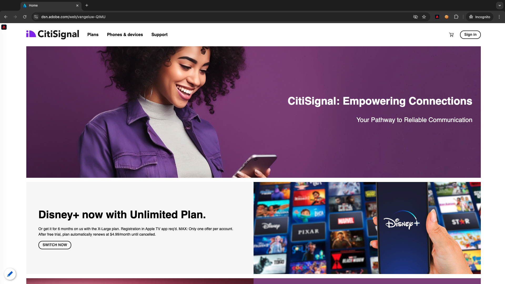

# 2.5.4 Vidarebefordra händelser till GCP Pub/Sub

>[!NOTE]
>
>För den här övningen behöver du tillgång till en Google Cloud Platform-miljö. Om du inte har tillgång till GCP än skapar du ett nytt konto med din personliga e-postadress.

## Skapa ditt Google Cloud-ämne

Gå till [https://console.cloud.google.com/](https://console.cloud.google.com/). Ange `pub/sub` i sökfältet. Klicka på sökresultatet **Pubb/Sub - Global real-time messaging**.

Då ser du det här. Klicka på **SKAPA ÄMNE**.

Då ser du det här. Använd `--aepUserLdap---event-forwarding` för ditt ämne-ID. Klicka på **Skapa**.

Ämnet har skapats. Klicka på ämnets **prenumerations-ID**.

Då ser du det här. Kopiera **ämnesnamnet** till Urklipp och lagra det, precis som du behöver det i nästa övning.

Nu går vi till Adobe Experience Platform Data Collection Event Forwarding och uppdaterar egenskapen Event Forwarding så att du kan börja vidarebefordra händelser till Pub/Sub.

## Uppdatera egenskapen för händelsevidarebefordran: Secrets

**Hemligheter** i egenskaper för händelsevidarebefordran används för att lagra autentiseringsuppgifter som ska användas för autentisering mot externa API:er. I det här exemplet måste du konfigurera en hemlighet för att lagra din OAuth-token för Google Cloud-plattformen, som ska användas för att autentisera när du använder Pub/Sub för att strömma data till GCP.

Gå till [https://experience.adobe.com/#/data-collection/](https://experience.adobe.com/#/data-collection/) och gå till **Hemligheter**. Klicka på **Skapa ny hemlighet**.

Då ser du det här. Följ dessa anvisningar:

- Namn: använd `--aepUserLdap---gcp-secret`
- Målmiljö: välj **Utveckling**
- Typ: **Google OAuth 2**
- Markera kryssrutan för **Pub/Sub**

Klicka på **Skapa hemlighet**.

När du har klickat på **Skapa hemlighet** visas en popup-meny som anger autentiseringen mellan din händelsevidarebefordringsegenskap och Google. Klicka på **Skapa och auktorisera hemlighet `--aepUserLdap---gcp-secret` med Google**.

Klicka för att välja ditt Google-konto.

Klicka på **Fortsätt**.

>[!NOTE]
>
>Popup-meddelandet kan variera. Godkänn/tillåt den begärda åtkomsten för att fortsätta med övningen.

När autentiseringen är klar visas detta.

Din hemlighet har nu konfigurerats och kan användas i ett dataelement.

## Uppdatera egenskapen för händelsevidarebefordran: Dataelement

Om du vill använda din hemlighet i egenskapen för händelsevidarebefordring måste du skapa ett dataelement som lagrar värdet för hemligheten.

Gå till [https://experience.adobe.com/#/data-collection/](https://experience.adobe.com/#/data-collection/) och gå till **Händelsevidarebefordran**. Sök i egenskapen för vidarebefordran av händelser och klicka på den för att öppna den.

Gå till **Dataelement** på den vänstra menyn. Klicka på **Lägg till dataelement**.

Konfigurera dataelementet så här:

- Namn: **GCP-hemlighet**
- Tillägg: **Core**
- Dataelementtyp: **Hemlighet**
- Utvecklingshemlighet: välj den hemlighet som du skapade och som har namnet `--aepUserLdap---gcp-secret`

Klicka på **Spara**

## Uppdatera egenskapen för händelsevidarebefordran: Tillägg

När du har konfigurerat sekretess och dataelement kan du nu konfigurera tillägget för Google Cloud-plattformen i din händelsevidarebefordringsegenskap.

Gå till [https://experience.adobe.com/#/data-collection/](https://experience.adobe.com/#/data-collection/), gå till **Händelsevidarebefordran** och öppna egenskapen för händelsevidarebefordran.

Gå sedan till **Tillägg** och till **Katalog**. Klicka på tillägget **Google Cloud Platform** och klicka på **Installera**.

Då ser du det här. Klicka på ikonen Dataelement.

Markera dataelementet som du skapade i föregående övning, som heter **GCP-hemlighet**. Klicka på **Markera**.

Då ser du det här. Klicka på **Spara**.

## Uppdatera egenskapen för händelsevidarebefordran: Uppdatera en regel

Nu när tillägget för Google Cloud-plattformen har konfigurerats kan du definiera en regel för att börja vidarebefordra händelsedata till ditt Pub/Sub-ämne. För att göra det måste du uppdatera regeln **Alla sidor** som du skapade i en av de föregående övningarna.

Gå till **Regler** på den vänstra menyn. I föregående övning skapade du regeln **Alla sidor**. Klicka på den regeln för att öppna den.

Du kommer då att göra det här. Klicka på ikonen **+** under **Åtgärder** för att lägga till en ny åtgärd.

Då ser du det här. Gör följande val:

- Välj **tillägget**: **Google Cloud-plattformen**.
- Välj **åtgärdstyp**: **Skicka data till molnpub/sub**.

Det bör ge dig detta **namn**: **Google Cloud-plattform - skicka data till molnpub/sub**. Nu bör du se det här:

Du måste nu konfigurera det Pub/Sub-ämne som du skapade tidigare.

Du kan hitta **ämnesnamnet** här och kopiera det.

Klistra in **ämnesnamnet** i regelkonfigurationen. Klicka sedan på ikonen för dataelement bredvid fältet **Data (krävs)**.

Välj **XDM-händelse** och klicka på **Markera**.

Då ser du det här. Klicka på **Behåll ändringar**.

Klicka på **Spara**.

Då ser du det här.

## Publish dina ändringar

Konfigurationen är nu klar. Gå till **Publiceringsflöde** om du vill publicera ändringarna. Öppna utvecklingsbiblioteket **Main** genom att klicka på **Edit** enligt indikationen.

Klicka på knappen **Lägg till alla ändrade resurser**, varefter du ser regeln och dataelementet visas i det här biblioteket. Klicka sedan på **Spara och bygg för utveckling**. Ändringarna distribueras nu.

Efter några minuter ser du att distributionen är klar och klar att testas.

## Testa konfigurationen

Gå till [https://dsn.adobe.com](https://dsn.adobe.com). När du har loggat in med din Adobe ID ser du det här. Klicka på de tre punkterna **..** i webbplatsprojektet och klicka sedan på **Kör** för att öppna det.

Du kommer då att se din demowebbplats öppnas. Markera URL-adressen och kopiera den till Urklipp.

Öppna ett nytt inkognito-webbläsarfönster.

Klistra in webbadressen till demowebbplatsen, som du kopierade i föregående steg. Du ombeds sedan logga in med din Adobe ID.

Välj kontotyp och slutför inloggningsprocessen.

Därefter visas webbplatsen i ett inkognitivt webbläsarfönster. För varje övning måste du använda ett nytt, inkognitivt webbläsarfönster för att läsa in webbadressen till demowebbplatsen.

Växla vy till Google Cloud Pub/Sub och gå till **MESSAGES**. Klicka på **PULL** så ser du några meddelanden i listan efter några sekunder. Klicka på ett meddelande för att visualisera dess innehåll.

Nu kan du se XDM-nyttolasten för din händelse i Google Pub/Sub. Du har nu skickat data som samlats in av Adobe Experience Platform Data Collection i realtid till en Google Cloud Pub/Sub-slutpunkt. Därifrån kan dessa data användas av alla Google Cloud Platform-program, som BigQuery för lagring och rapportering eller för Machine Learning-användningsfall.

Nästa steg: [2.5.5 Vidarebefordra händelser till AWS Kinesis &amp; AWS S3](./ex5.md)

[Gå tillbaka till modul 2.5](./aep-data-collection-ssf.md)

[Gå tillbaka till Alla moduler](./../../../overview.md)

