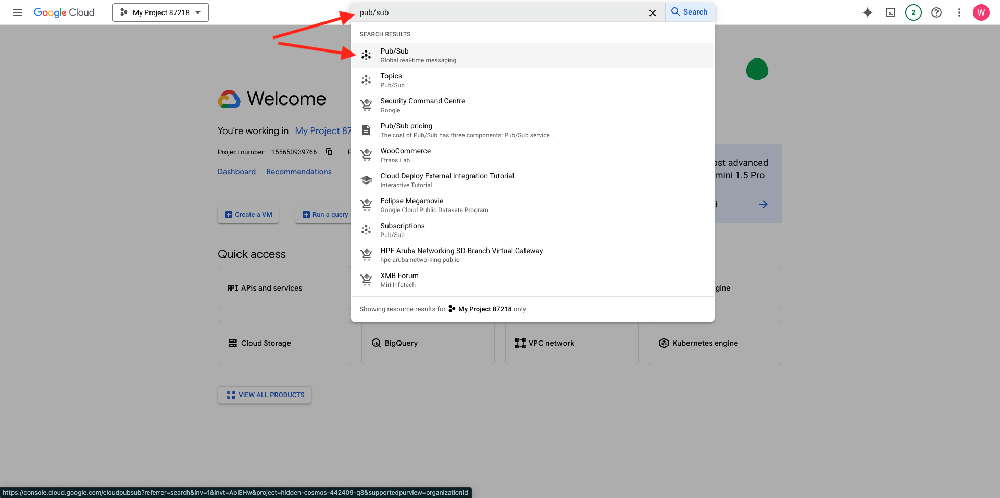

# 2.5.4 Skapa och konfigurera en Google Cloud-funktion

## 2.5.4.1 Skapa en Google Cloud-funktion

Gå till [https://console.cloud.google.com/](https://console.cloud.google.com/). Gå till **molnfunktioner**.



Då ser du det här. Klicka på **SKAPA FUNKTION**.


Då ser du det här.


Gör följande val:

- **Funktionsnamn**: `--aepUserLdap---event-forwarding`
- **Region**: välj en region
- **Utlösartyp**: välj **HTTP**
- **Autentisering**: välj **Tillåt oautentiserade anrop**

Du borde ha den här nu. Klicka på **SPARA**.


Klicka på **NÄSTA**.


Då ser du det här:


Gör följande val:

- **Runtime**: välj **Node.js 16** (eller senare)
- **Startpunkt**: ange **helloAEP**

Klicka på **AKTIVERA API** om du vill aktivera **API:t för molnbygge**. Då visas ett nytt fönster. Klicka på **AKTIVERA** igen i det nya fönstret.


Då ser du det här. Klicka på **Aktivera**.


När **API:t för molnbygge** har aktiverats visas det här.


Gå tillbaka till din **molnfunktion**.
Kontrollera att du har följande kod i den inbyggda redigeraren för molnfunktioner:

```javascript
/**
 * Responds to any HTTP request.
 *
 * @param {!express:Request} req HTTP request context.
 * @param {!express:Response} res HTTP response context.
 */
exports.helloAEP = (req, res) => {
  let message = req.query.message || req.body.message || 'Hello World!';
  res.status(200).send(message);
};
```

Klicka sedan på **DISTRIBUERA**.


Då ser du det här. Din molnfunktion skapas nu. Det här kan ta några minuter.


När funktionen har skapats och körts ser du det här. Klicka på funktionens namn för att öppna den.


Då ser du det här. Gå till **TRIGGER**. Du kommer då att se **Utlösar-URL** som är den du använder för att definiera slutpunkten på startserversidan.


Kopiera utlösarens URL, som ser ut så här: **https://europe-west1-dazzling-pillar-273812.cloudfunctions.net/vangeluw-event-forwarding**.

I nästa steg ska du konfigurera Adobe Experience Platform Data Collection Server så att specifik information om **sidvyer** direktuppspelas i din Google Cloud-funktion. I stället för att bara vidarebefordra hela nyttolasten som den är, skickar du bara saker som **ECID**, **timestamp** och **Page Name** till din Google Cloud-funktion.

Här är ett exempel på en nyttolast som du måste analysera för att filtrera bort de ovannämnda variablerna:

```json
{
  "events": [
    {
      "xdm": {
        "eventType": "web.webpagedetails.pageViews",
        "web": {
          "webPageDetails": {
            "URL": "https://builder.adobedemo.com/run/vangeluw-OCUC",
            "name": "vangeluw-OCUC",
            "viewName": "vangeluw-OCUC",
            "pageViews": {
              "value": 1
            }
          },
          "webReferrer": {
            "URL": "https://builder.adobedemo.com/run/vangeluw-OCUC/equipment"
          }
        },
        "device": {
          "screenHeight": 1080,
          "screenWidth": 1920,
          "screenOrientation": "landscape"
        },
        "environment": {
          "type": "browser",
          "browserDetails": {
            "viewportWidth": 1920,
            "viewportHeight": 451
          }
        },
        "placeContext": {
          "localTime": "2022-02-23T06:51:07.140+01:00",
          "localTimezoneOffset": -60
        },
        "timestamp": "2022-02-23T05:51:07.140Z",
        "implementationDetails": {
          "name": "https://ns.adobe.com/experience/alloy/reactor",
          "version": "2.8.0+2.9.0",
          "environment": "browser"
        },
        "_experienceplatform": {
          "identification": {
            "core": {
              "ecid": "08346969856929444850590365495949561249"
            }
          },
          "demoEnvironment": {
            "brandName": "vangeluw-OCUC"
          },
          "interactionDetails": {
            "core": {
              "channel": "web"
            }
          }
        }
      },
      "query": {
        "personalization": {
          "schemas": [
            "https://ns.adobe.com/personalization/html-content-item",
            "https://ns.adobe.com/personalization/json-content-item",
            "https://ns.adobe.com/personalization/redirect-item",
            "https://ns.adobe.com/personalization/dom-action"
          ],
          "decisionScopes": [
            "eyJ4ZG06YWN0aXZpdHlJZCI6Inhjb3JlOm9mZmVyLWFjdGl2aXR5OjE0YzA1MjM4MmUxYjY1MDUiLCJ4ZG06cGxhY2VtZW50SWQiOiJ4Y29yZTpvZmZlci1wbGFjZW1lbnQ6MTRiZjA5ZGM0MTkwZWJiYSJ9",
            "__view__"
          ]
        }
      }
    }
  ],
  "query": {
    "identity": {
      "fetch": [
        "ECID"
      ]
    }
  },
  "meta": {
    "state": {
      "domain": "adobedemo.com",
      "cookiesEnabled": true,
      "entries": [
        {
          "key": "kndctr_907075E95BF479EC0A495C73_AdobeOrg_identity",
          "value": "CiYwODM0Njk2OTg1NjkyOTQ0NDg1MDU5MDM2NTQ5NTk0OTU2MTI0OVIPCPn66KfyLxgBKgRJUkwx8AH5-uin8i8="
        },
        {
          "key": "kndctr_907075E95BF479EC0A495C73_AdobeOrg_consent_check",
          "value": "1"
        },
        {
          "key": "kndctr_907075E95BF479EC0A495C73_AdobeOrg_consent",
          "value": "general=in"
        }
      ]
    }
  }
}
```

Det här är de fält som innehåller den information som behöver tolkas:

- ECID: **events.xdm._experiencePlatform.Identification.core.ecid**
- tidsstämpel: **tidsstämpel**
- Sidnamn: **events.xdm.web.webPageDetails.name**

Vi går till Adobe Experience Platform Data Collection Server nu och konfigurerar dataelementen så att det blir möjligt.

## 2.5.4.2 Uppdatera egenskapen för händelsevidarebefordran: Dataelement

Gå till [https://experience.adobe.com/#/data-collection/](https://experience.adobe.com/#/data-collection/) och gå till **Händelsevidarebefordran**. Sök i egenskapen för vidarebefordran av händelser och klicka på den för att öppna den.


Gå till **Dataelement** på den vänstra menyn. Klicka på **Lägg till dataelement**.


Sedan visas ett nytt dataelement att konfigurera.


Gör följande val:

- Ange **customerECID** som **Name**.
- Som **tillägg** väljer du **kärna**.
- Som **dataelementtyp** väljer du **Sökväg**.
- Ange `arc.event.xdm.--aepTenantId--.identification.core.ecid` som **sökväg**. Genom att ange den här sökvägen filtrerar du ut fältet **ecid** från den händelsenyttolast som skickas av webbplatsen eller mobilappen till Adobe Edge.

>[!NOTE]
>
>I ovanstående och under sökvägar görs en referens till **arc**. **arc** står för Adobe Resource Context och **arc** står alltid för det högsta tillgängliga objektet som är tillgängligt i Server Side-kontexten. Anrikningar och omvandlingar kan läggas till i det **arc**-objektet med Adobe Experience Platform Data Collection Server-funktioner.
>
>I sökvägarna ovan och nedanför görs en referens till **event**. **event** står för en unik händelse och Adobe Experience Platform Data Collection Server utvärderar alltid varje enskild händelse. Ibland kan du se en referens till **händelser** i nyttolasten som skickas av Web SDK-klientsidan, men i Adobe Experience Platform Data Collection Server utvärderas varje händelse individuellt.

Du kommer nu att ha den här. Klicka på **Spara**.


Klicka på **Lägg till dataelement**.


Sedan visas ett nytt dataelement att konfigurera.


Gör följande val:

- Ange **eventTimestamp** som **Name**.
- Som **tillägg** väljer du **kärna**.
- Som **dataelementtyp** väljer du **Sökväg**.
- Ange **arc.event.xdm.timestamp** som **sökväg**. Genom att ange den här sökvägen filtrerar du ut fältet **timestamp** från den händelsenyttolast som skickas av webbplatsen eller mobilappen till Adobe Edge.

Du kommer nu att ha den här. Klicka på **Spara**.


Klicka på **Lägg till dataelement**.


Sedan visas ett nytt dataelement att konfigurera.


Gör följande val:

- Ange **pageName** som **Name**.
- Som **tillägg** väljer du **kärna**.
- Som **dataelementtyp** väljer du **Sökväg**.
- Som **sökväg** anger du **.arc.event.xdm.web.webPageDetails.name**. Genom att ange den här sökvägen filtrerar du ut fältet **name** från den händelsenyttolast som skickas av webbplatsen eller mobilappen till Adobe Edge.

Du kommer nu att ha den här. Klicka på **Spara**.


Nu har du skapat dessa dataelement:


## 2.5.4.3 Uppdatera egenskapen för händelsevidarebefordran: Uppdatera en regel

Gå till **Regler** på den vänstra menyn. I föregående övning skapade du regeln **Alla sidor**. Klicka på den regeln för att öppna den.


Du kommer då att göra det här. Klicka på ikonen **+** under **Åtgärder** för att lägga till en ny åtgärd.


Då ser du det här.


Gör följande val:

- Välj **tillägget**: **Adobe Cloud Connector**.
- Välj **åtgärdstyp**: **Ring upp hämtning**.

Det bör ge dig det här **namnet**: **Adobe Cloud Connector - ring hämtningssamtal**. Nu bör du se det här:


Konfigurera sedan följande:

- Ändra begärandeprotokollet från GET till **POST**
- Ange URL-adressen till den Google Cloud-funktion du skapade i ett av de föregående stegen som ser ut så här: **https://europe-west1-dazzling-pillar-273812.cloudfunctions.net/vangeluw-event-forwarding**

Du borde ha den här nu. Gå sedan till **Brödtext**.


Då ser du det här. Klicka på alternativknappen för **JSON**.


Konfigurera **brödtexten** enligt följande:

| NYCKEL | VÄRDE |
|--- |--- |
| customerECID | {{customerECID}} |
| pageName | {{pageName}} |
| eventTimestamp | {{eventTimestamp}} |

Då ser du det här. Klicka på **Behåll ändringar**.


Då ser du det här. Klicka på **Spara**.


Du har nu uppdaterat din befintliga regel i en Adobe Experience Platform Data Collection Server-egenskap. Gå till **Publiceringsflöde** om du vill publicera ändringarna. Öppna utvecklingsbiblioteket **Main** genom att klicka på **Edit** enligt indikationen.


Klicka på knappen **Lägg till alla ändrade resurser**, varefter du ser regeln och dataelementet visas i det här biblioteket. Klicka sedan på **Spara och bygg för utveckling**. Ändringarna distribueras nu.


Efter några minuter ser du att distributionen är klar och klar att testas.


## 2.5.3.4 Testa konfigurationen

Gå till [https://builder.adobedemo.com/projects](https://builder.adobedemo.com/projects). När du har loggat in med din Adobe ID ser du det här. Klicka på webbplatsprojektet för att öppna det.


Nu kan du följa nedanstående flöde för att komma åt webbplatsen. Klicka på **Integrationer**.


På sidan **Integrationer** måste du välja den datainsamlingsegenskap som skapades i övning 0.1.


Du kommer då att se din demowebbplats öppnas. Markera URL-adressen och kopiera den till Urklipp.


Öppna ett nytt inkognito-webbläsarfönster.


Klistra in webbadressen till demowebbplatsen, som du kopierade i föregående steg. Du ombeds sedan logga in med din Adobe ID.


Välj kontotyp och slutför inloggningsprocessen.


Därefter visas webbplatsen i ett inkognitivt webbläsarfönster. För varje demonstration måste du använda ett nytt, inkognitivt webbläsarfönster för att läsa in webbadressen till demowebbplatsen.


När du öppnar din webbläsarutvecklarvy kan du inspektera nätverksbegäranden enligt nedan. När du använder filtret **interact** visas nätverksbegäranden som skickas av Adobe Experience Platform Data Collection Client till Adobe Edge.


Byt vy till din Google Cloud-funktion och gå till **LOGS**. Nu bör du ha en vy som liknar den här, där ett antal loggposter visas. Varje gång du ser **Funktionskörningen startade** betyder det att inkommande trafik togs emot i din Google Cloud-funktion.


Låt oss uppdatera funktionen lite för att arbeta med inkommande data och visa den information som togs emot från Adobe Experience Platform Data Collection Server. Gå till **SOURCE** och klicka på **REDIGERA**.


Klicka på **NÄSTA** på nästa skärm.


Uppdatera koden så här:

```javascript
/**
 * Responds to any HTTP request.
 *
 * @param {!express:Request} req HTTP request context.
 * @param {!express:Response} res HTTP response context.
 */
exports.helloAEP = (req, res) => {
  console.log('>>>>> Function has started. The following information was received from Event Forwarding:');
  console.log(req.body);

  let message = req.query.message || req.body.message || 'Hello World!';
  res.status(200).send(message);
};
```

Du får den här då. Klicka på **DISTRIBUERA**.


Efter några minuter distribueras funktionen igen. Klicka på funktionsnamnet för att öppna det.


Navigera till en produkt på demowebbplatsen, till exempel **DEIRDRE RELAXED-FIT CAPRI**.


Byt vy till din Google Cloud-funktion och gå till **LOGS**. Nu bör du ha en vy som liknar den här, där ett antal loggposter visas.

För varje sidvy på demowebbplatsen bör du nu se en ny logginmatning i loggarna för Google Cloud Function som visar den mottagna informationen.


Du har nu skickat data som samlats in av Adobe Experience Platform Data Collection i realtid till en Google Cloud Function-slutpunkt. Därifrån kan dessa data användas av alla Google Cloud Platform-program, som BigQuery för lagring och rapportering eller för Machine Learning-användningsfall.

Nästa steg: [2.5.5 Vidarebefordra händelser mot AWS ekosystem](./ex5.md)

[Gå tillbaka till modul 2.5](./aep-data-collection-ssf.md)

[Gå tillbaka till Alla moduler](./../../../overview.md)
